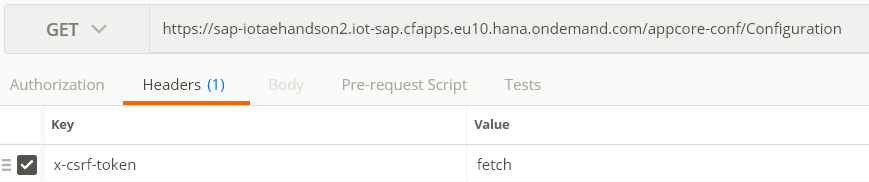
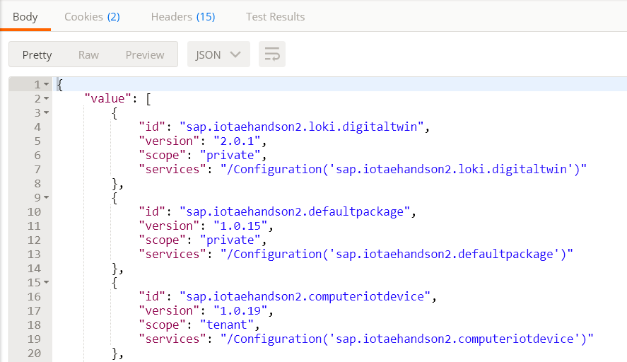
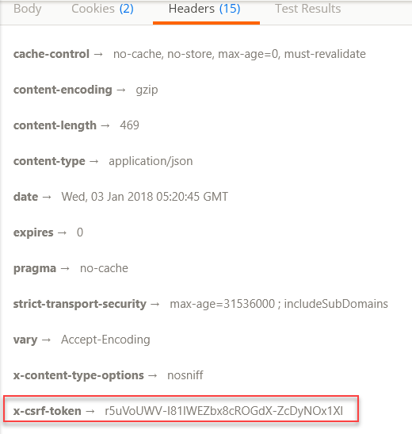
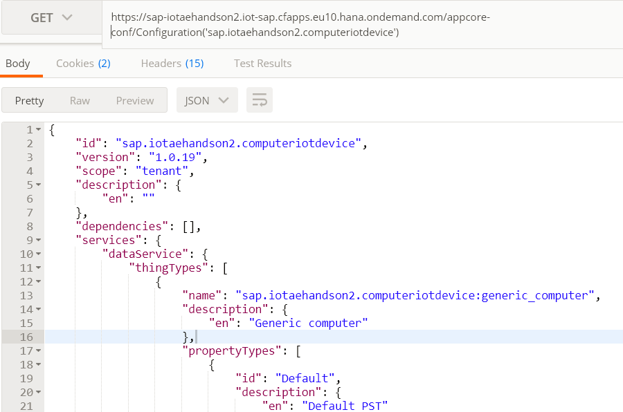
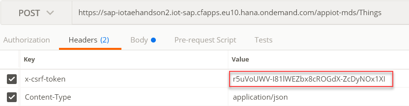
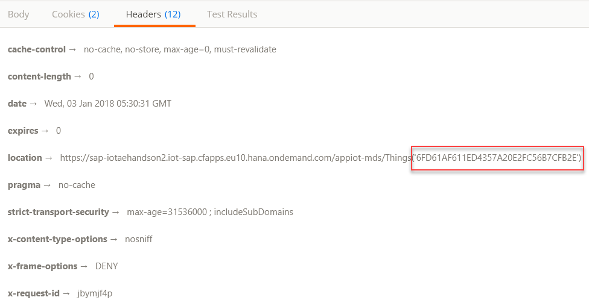

## Prerequisites  
 - **Proficiency:** Beginner
 - **Tutorials:** [Install Postman Rest Client](https://developers.sap.com/tutorials/api-tools-postman-install.html)
 - Access to a tenant specific to SAP IoT Application Enablement. In this tutorial, tenant `sap-iotaehandson2` is used.

## Details
### You will learn  
In [previous tutorials](https://developers.sap.com/group.iotae-computer-as-thing.html), you learned about using Thing Modeler to onboard a computer as the IoT thing, send data to the thing, and retrieve data from the thing. Now, you'll learn to use Postman to access SAP IoT Application Enablement service APIs.

### Application Router
Access to SAP IoT Application Enablement is usually routed through an application router as the single entry point for consumers. The application router handles the user authentication against **SAP User Account and Authentication Service (UAA)**. In addition, the service retains the generated JWT token for the duration of the client logon session. You can define multiple application routers per tenant and you can use one of the router to access IoT Application Enablement services.

### Tenant-specific Application Router
SAP IoT Application Enablement offers tenant-specific application router to access the different backend services such as configuration, business partner, and thing services. For example, you can access the configuration services for the tenant `sap-iotaehandson2` using the application router URL <https://sap-iotaehandson2.iot-sap.cfapps.eu10.hana.ondemand.com/appcore-conf/Configuration>.

The following illustrates the different parts of tenant-specific application router:

| Field | Description |
|:------|:--------------|
|`sap-iotaehandson2`|Tenant name|
|`iot-sap`|Name of the application router used to access IoT Application Enablement services|
|`cfapps.eu10`|Technology and the region|
|`appcore-conf`|Name of the application you are accessing using the application router|
|`Configuration`|API endpoint you are accessing within the application|

For more information about the authorization concept of the SAP IoT Application Enablement platform, see <https://help.sap.com/viewer/p/SAP_IOT_APPLICATION_SERVICES> | **SAP IoT Application Enablement Services** | **Authorization**.

### Time to Complete
**15 Min**

---

[ACCORDION-BEGIN [Step 1: ](Log in via browser)]
Open the URL <https://sap-iotaehandson2.iot-sap.cfapps.eu10.hana.ondemand.com/appcore-conf/Configuration> in the Chrome browser. After validating the user, the browser displays the configuration details.
>**Note**: Please do not open the URL using the Incognito Mode on the browser.

```json
{"value":[{"id":"sap.iotaehandson2.automobiles","version":"1.0.0","scope":"public","services":"/Configuration('sap.iotaehandson2.automobiles')"},
{"id":"sap.iotaehandson2.vending","version":"1.0.0","scope":"public","services":"/Configuration('sap.iotaehandson2.vending')"},
{"id":"sap.iotaehandson2.compressor","version":"1.0.0","scope":"public","services":"/Configuration('sap.iotaehandson2.compressor')"},
{"id":"sap.iotaehandson2.loki.digitaltwin","version":"2.0.1","scope":"private","services":"/Configuration('sap.iotaehandson2.loki.digitaltwin')"},
{"id":"sap.iotaehandson2.defaultpackage","version":"1.0.6","scope":"private","services":"/Configuration('sap.iotaehandson2.defaultpackage')"},
{"id":"sap.iotaehandson2.computeriotdevice","version":"1.0.19","scope":"tenant","services":"/Configuration('sap.iotaehandson2.computeriotdevice')"},
{"id":"sap.iotaehandson.cafedemo.eversys","version":"1.0.7","scope":"public","services":"/Configuration('sap.iotaehandson.cafedemo.eversys')"},
{"id":"sap.iotaehandson.pdmst","version":"1.0.0","scope":"public","services":"/Configuration('sap.iotaehandson.pdmst')"},
{"id":"sap.iotaehandson.pdms.wa","version":"2.1.0","scope":"public","services":"/Configuration('sap.iotaehandson.pdms.wa')"},
{"id":"sap.iotaehandson.tesnew","version":"1.0.0","scope":"public","services":"/Configuration('sap.iotaehandson.tesnew')"},
{"id":"sap.iotaehandson.pdms.events.wei","version":"1.0.5","scope":"public","services":"/Configuration('sap.iotaehandson.pdms.events.wei')"},
{"id":"sap.iotaehandson.jp.cars","version":"0.0.4","scope":"public","services":"/Configuration('sap.iotaehandson.jp.cars')"},
{"id":"com.iotaedemo.raspberry.pi","version":"1.0.40","scope":"public","services":"/Configuration('com.iotaedemo.raspberry.pi')"},
{"id":"com.iotaedemo.drillingmachine","version":"1.9.16","scope":"public","services":"/Configuration('com.iotaedemo.drillingmachine')"},
{"id":"com.iotaedemo.drillingmachines","version":"1.1.28","scope":"public","services":"/Configuration('com.iotaedemo.drillingmachines')"},
{"id":"iotae.solex.drillingmachines","version":"1.0.1","scope":"public","services":"/Configuration('iotae.solex.drillingmachines')"},
{"id":"com.iotaedemo.core.shadow1","version":"1.0.1","scope":"public","services":"/Configuration('com.iotaedemo.core.shadow1')"},
{"id":"com.iotaedemo.test.weatherstation","version":"1.0.0","scope":"public","services":"/Configuration('com.iotaedemo.test.weatherstation')"},
{"id":"pdms.eu10.com.sap.pdms.datascience.scoring","version":"1.0.1","scope":"public","services":"/Configuration('pdms.eu10.com.sap.pdms.datascience.scoring')"},
{"id":"pdms.eu10.com.sap.asset.core","version":"1.0.1","scope":"public","services":"/Configuration('pdms.eu10.com.sap.asset.core')"}]}
```

[ACCORDION-END]

[ACCORDION-BEGIN [Step 2: ](Display package details)]

  1. In Postman, choose the **GET** method.
  2. Enter the following request URL: `https://sap-iotaehandson2.iot-sap.cfapps.eu10.hana.ondemand.com/appcore-conf/Configuration`
  3. In the **Headers** tab, enter `x-csrf-token` in the **Key** column and enter `fetch` in the **Value** column.
  
  4. Click the **Send** button.
  The result set returns the latest version of all packages that belong to the same tenant and all packages with scope=`public` from other tenants.
  
  The response payload contains the following details for every package:

    | Field | Description |
    |------|--------------|
    |id|Unique identifier of the package|
    |version|Latest version of the package|
    |scope|Scope of the package (public, private, and tenant)|
    |services|Indicates configuration service or thing service|

    The value generated for `x-csrf-token` is displayed in the **Headers** tab of the **Response** section.
    

    >**Note**: This token is only valid for the current login session. When the session expires, the token is not valid. You must use this token to create a thing instance using the **POST** method. See Step 4.

  5. Enter the request URL `https://sap-iotaehandson2.iot-sap.cfapps.eu10.hana.ondemand.com/appcore-conf/Configuration('sap.iotaehandson2.computeriotdevice')` to retrieve  details of the package `sap.iotaehandson2.computeriotdevice`.
  6. Click the **Send** button.
  
  The response payload contains the following details for every package:

    | Field | Description |
    |------|--------------|
    |id|Unique identifier of the package|
    |dependencies|List of dependent packages relevant to this configuration package|
    |description|Description of the configuration package for each language with the corresponding ISO language code|
    |version|Latest version of the package|
    |scope|Scope of the package (public, private, and tenant)|
    |services|Indicates thing service or event service|

  7. You can create a thing instance for the thing type `generic_computer_3` in the next step.

    >**Note**: At rare instances, the method displays `200-OK` but without a response payload. In such scenario, ensure to redo Step 1.


[ACCORDION-END]


[ACCORDION-BEGIN [Step 3: ](Read thing type details)]
To create data for a thing, you must identify the property set type that is used to define property sets for a thing type.	Firstly, read details of a thing type and then read details of a property set type.

1. In Postman, choose the **GET** method.
2. Enter the following request URL: `https://sap-iotaehandson2.iot-sap.cfapps.eu10.hana.ondemand.com/appiot-mds/Configuration/ThingTypes('sap.iotaehandson2.computeriotdevice:generic_computer_3')`
3. Click the **Send** button. Thing type details are retrieved.

    ```json
    {
        "name": "sap.iotaehandson2.computeriotdevice:generic_computer_3",
        "description": {
            "en": "Generic computer"
        },
        "propertyTypes": [
            {
                "id": "Default",
                "description": {
                    "en": "Default PST"
                },
                "propertySetType": "sap.iotaehandson2.computeriotdevice:Default"
            },
            {
                "id": "resource_sensors_2",
                "description": {
                    "en": "Measured Values"
                },
                "propertySetType": "sap.iotaehandson2.computeriotdevice:resource_sensors_2"
            },
            {
                "id": "Image",
                "description": {
                    "en": "Image properties"
                },
                "propertySetType": "sap.iotaehandson2.computeriotdevice:Image"
            }
        ]
    }
    ```

4. To read details of a property set type `sap.iotaehandson2.computeriotdevice:resource_sensors` defined for the thing type `sap.iotaehandson2.computeriotdevice:generic_computer_3`, enter the following request URL: `https://sap-iotaehandson2.iot-sap.cfapps.eu10.hana.ondemand.com/appiot-mds/Configuration/PropertySetTypes('sap.iotaehandson2.computeriotdevice:resource_sensors_2')`
5. Click the **Send** button.
Property set type details retrieved. You can use the property `cpu_usage` to create data for a thing.

    ```json
    {
        "name": "sap.iotaehandson2.computeriotdevice:resource_sensors_2",
        "description": {
            "en": "Measured Values"
        },
        "dataCategory": "TimeSeriesData",
        "propertyTypes": [
            {
                "value": {
                    "id": "cpu_type",
                    "description": {
                        "en": ""
                    },
                    "type": "String",
                    "length": "127",
                    "qualityCode": 0,
                    "annotations": [
                        "com.sap.appiot.analytics:dimension"
                    ]
                }
            },
            {
                "value": {
                    "id": "cpu_usage",
                    "description": {
                        "en": "CPU usage"
                    },
                    "type": "NumericFlexible",
                    "qualityCode": 0,
                    "unitOfMeasure": "%"
                }
            }
        ]
    }
    ```

[ACCORDION-END]


[ACCORDION-BEGIN [Step 4: ](Onboard computer device as a thing)]
Object group is a technical object used for assigning object-based authorizations to user groups. When you assign an object group to a thing, you are allowed to carry out the functions based on the capabilities defined for the user group. You must identify what object group to use while creating a thing.

1. In Postman, choose the **GET** method.
2. Enter the following request URL: `https://sap-iotaehandson2.iot-sap.cfapps.eu10.hana.ondemand.com/appiot-mds/Things`
3. You can choose an object group ID from one of the things listed in the response payload. You must specify this ID in the request payload for creating a thing.
4. In Postman, choose the **POST** method.
5. Enter the following request URL: `https://sap-iotaehandson2.iot-sap.cfapps.eu10.hana.ondemand.com/appiot-mds/Things`
6. Go to the **Body** tab.
7. Choose the **raw** option.
8. Choose **JSON (application/json)** from the dropdown list.
9. Enter the following request payload.
```json
{
"_externalId": "pdevice00",
"_name": "pdevice00",
"_description": {
    "en": "pDevice00"
},
"_thingType": [
    "sap.iotaehandson2.computeriotdevice:generic_computer_3"
],
"_objectGroup": "C6484A9DC2274E4A87BCED73AAEA8650"
}
```

10. In the **Headers** tab, enter `x-csrf-token` generated in _Step 2: Display package details_.


    >**Note**: While working on tutorials in a shared environment, for easy identification of your own objects, use your own user IDs (S-user or P-user depending on the system used) for the object names. To know your ID, see <https://iotae-handson.accounts400.ondemand.com/ui/protected/profilemanagement> or <https://accounts.sap.com/ui/protected/profilemanagement>.

11. Click the **Send** button.
Digital twin of your computer device as a thing is created. The URL of the thing created is returned in the **Location** field of the **Header** in the response payload.

For example, the digital twin `device00` of your computer device is created with a unique thing ID **6FD61AF611ED4357A20E2FC56B7CFB2E**. You can use this unique ID to retrieve details of the thing.
12. In Postman, choose the **GET** method.
13. Enter the following request URL: `https://sap-iotaehandson2.iot-sap.cfapps.eu10.hana.ondemand.com/appiot-mds/Things('6FD61AF611ED4357A20E2FC56B7CFB2E')`
Thing details are retrieved and displayed in the response payload.
```json
{
    "_id": "6FD61AF611ED4357A20E2FC56B7CFB2E",
    "_externalId": "pdevice00",
    "_name": "pdevice00",
    "_description": {
        "en": "pDevice00"
    },
    "_thingType": [
        "sap.iotaehandson2.computeriotdevice:generic_computer_3"
    ],
    "_objectGroup": "C6484A9DC2274E4A87BCED73AAEA8650"
}
```

[ACCORDION-END]


[ACCORDION-BEGIN [Step 5: ](Create time series data)]
Using API endpoints is one of the ways to directly ingest data for a thing. Alternatively, using device management too you can ingest data for a thing.

1. In Postman, choose the **PUT** method.
2. Enter the following request URL: `https://sap-iotaehandson2.iot-sap.cfapps.eu10.hana.ondemand.com/appiot-mds/Things('6FD61AF611ED4357A20E2FC56B7CFB2E')/sap.iotaehandson2.computeriotdevice:generic_computer_3/resource_sensors_2`

    | Field | Description |
    |------|--------------|
    |Thing ID|`6FD61AF611ED4357A20E2FC56B7CFB2E`|
    |Thing Type|`sap.iotaehandson2.computeriotdevice:generic_computer_3`|
    |Property Set|`resource_sensors_2`|
    |Property|`cpu_usage`|

3. Go to the **Body** tab.
4. Choose the **raw** option.
5. Choose **JSON (application/json)** from the dropdown list.
6. Enter the request payload as illustrated below:
```json
{
	"value": [{
			"_time": "2017-10-13T09:00:000Z",
			"cpu_usage": "100"
		},
		{
			"_time": "2017-10-14T06:00:030Z",
			"cpu_usage": "95"
		}
	]
}
```

7. In the **Headers** tab, enter the `x-csrf-token` generated in Step 2 _Display package details_.
8. Click the **Send** button.
A numeric value is created for the property `cpu_usage` with time stamp for the thing `6FD61AF611ED4357A20E2FC56B7CFB2E`.

[ACCORDION-END]

[ACCORDION-BEGIN [Step 6: ](Read time series data)]
1. In Postman, choose the **GET** method.
2. Enter the following request URL:
    `https://sap-iotaehandson2.iot-sap.cfapps.eu10.hana.ondemand.com/appiot-mds/Things('6FD61AF611ED4357A20E2FC56B7CFB2E')/sap.iotaehandson2.computeriotdevice:generic_computer_3/resource_sensors_2?timerange=1D`
    Data is requested for a time range=1 day. The other possible values are:

      - #M - For the specified number months
      - #H - For the specified number of hours
      - From time - To time

    Data retrieved successfully.
    ```json
    {
        "value": [
            {
                "_time": "2017-10-14T06:00:30.000Z",
                "cpu_type": null,
                "cpu_usage": 95
            },
            {
                "_time": "2017-10-13T09:00:00.000Z",
                "cpu_type": null,
                "cpu_usage": 100
            }
        ],
        "additionalInfo": {
            "message": "Please use Time Series Cold Store API to fetch remaining data beyond retention period for time range = 2017-02-19T09:18:09.662Z-2017-09-20T00:00:00Z",
            "coldStoreStartTime": "2017-02-19T09:18:09.662Z",
            "coldStoreEndTime": "2017-09-20T00:00:00Z"
        }
    }
    ```
    >**Note**: Similarly, you can retrieve thing data in various other ways such as Snapshot data, using M4 algorithm, and aggregates using OData services. For more information, see https://help.sap.com/viewer/p/SAP_IOT_APPLICATION_SERVICES > SAP IoT Application Enablement Services.

[ACCORDION-END]


---

### Optional


[ACCORDION-BEGIN [Step 7: ](Explore IoT APIs in SAP API Hub)]
To better understand IoT Application Enablement APIs, you can go to SAP API Hub at <https://api.sap.com/#/shell/discover/contentpackage/IOTAE> and review and execute different APIs in its sandbox.


[ACCORDION-END]
