## Prerequisites  
 - **Proficiency:** Beginner

## Details
### You will learn  
- How to use the SAP API Business Hub
- How to use Analytical OData Services from SAP IoT Application Enablement

### Time to Complete
**30 Min**

---

[ACCORDION-BEGIN [Step 1: ](Get Access to the Demo System)]

- User

Go to [https://www.sap.com/cmp/ft/crm-xm17-gtm-1sc-iotae/index.html](https://www.sap.com/cmp/ft/crm-xm17-gtm-1sc-iotae/index.html) and follow the instructions on the page to get a user and a password on the landscape used for this tutorial.

- Tools

Please check step 4 in [https://www.sap.com/developer/groups/iotae-computer-as-thing.html](https://www.sap.com/developer/groups/iotae-computer-as-thing.html) to have the Postman tooling ready.

- SAP API Business Hub

In order to access the following example, you could use the SAP API Business Hub at  [http://api.sap.com](http://api.sap.com). This is a web page to provide access to SAP demo systems based on API calls. If you click on the link above or type the URL into your browser, you will navigate to the following web page:

For further questions regarding the API, please refer to the latest documentation:
```
https://help.sap.com/viewer/350cb3262cb8496b9f5e9e8b039b52db/latest/en-US/66d4abe77cb44fd3b8299ce049b54dba.html
```

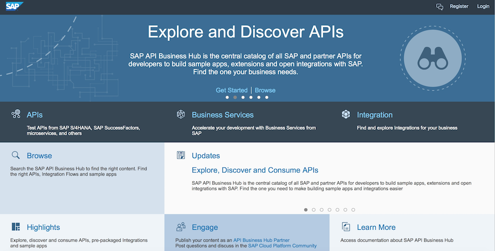

If you have already a user, please login and if not, please register by clicking on the link in the upper right corner.


- Login:

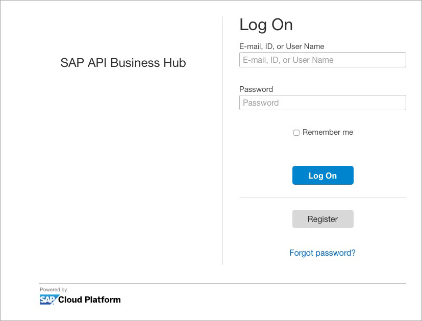

- Registration:

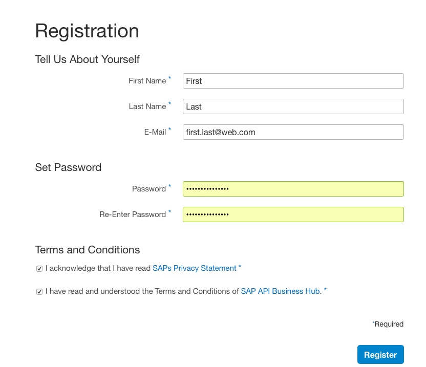

Please fill in all mandatory fields and provide a decent email address as you will get an email with a confirmation link.

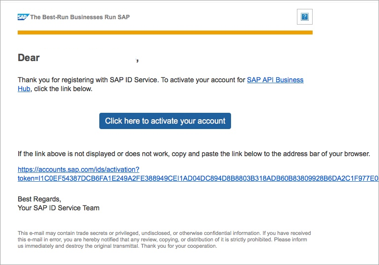

Please press "Click here to activate your account". Now you are ready to access the demo system via SAP API Business Hub.

[ACCORDION-END]

[ACCORDION-BEGIN [Step 2: ](Access the AE IoT Services API)]

In this example, we are using data from the enviroCar database [https://envirocar.org](https://envirocar.org).

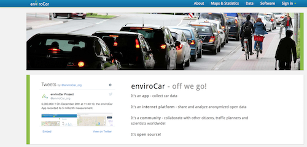

The database contains real-life car data in order to investigate the impact driving has on environmental factors, such as fuel consumption, CO2, or noise emissions. The data is anonymised, i.e. it is not possible to connect it to a specific driver. Data available via the enviroCar API can be used by third parties in accordance with the Open Database License (`ODbL`). We have further anonymised car types in order to not advertise certain brands.

We will use a part of this data for three cars and a subset of measurements. The three cars will be represented in the package "enviroCar" of our demo system.

We would like to know, which car had the highest fuel consumption for a given set of tracks. We will obtain the data by using the aggregates function.

In order to verify the thing model, please go to the SAP API Business Hub and search for the API by clicking on "Browse":

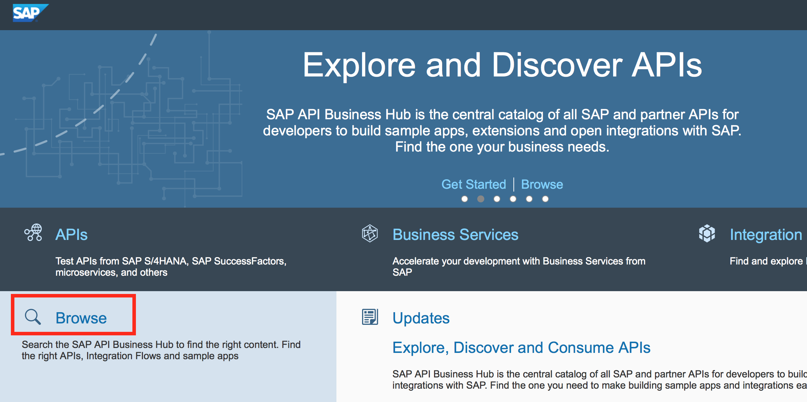

Enter IOTAE in the search field and press enter.

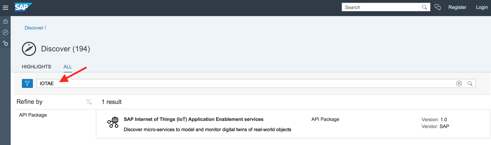

The results list will provide the API Package "SAP Internet of Things (IoT) Application Enablement services".

Click on the package to navigate to the following page:

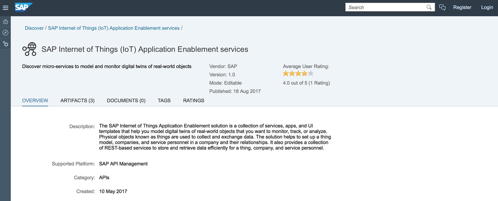

Choose the tab "artifacts"  in order to see the three endpoints to access Configuration, Thing and Thing Analytics. We will have a look at all of them one at a time.

[ACCORDION-END]


[ACCORDION-BEGIN [Step 3: ](Verify configuration)]

click on "Configuration"  in order to check the package  `enviroCar` . In the following screen click on "Get" for Configuration {id}.

 

Scroll down towards the editable field for "id" and enter
`sap.iotaehandson2.envirocar`

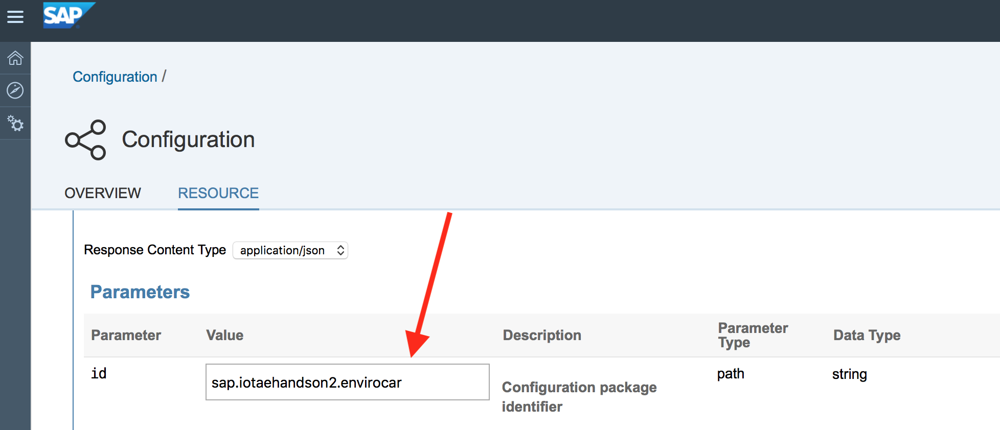

Click on  to try the Request. The response should look like this, showing the package configuration for `envirocar` with a thing type called `cartype` and a property set type `Measurements`.

 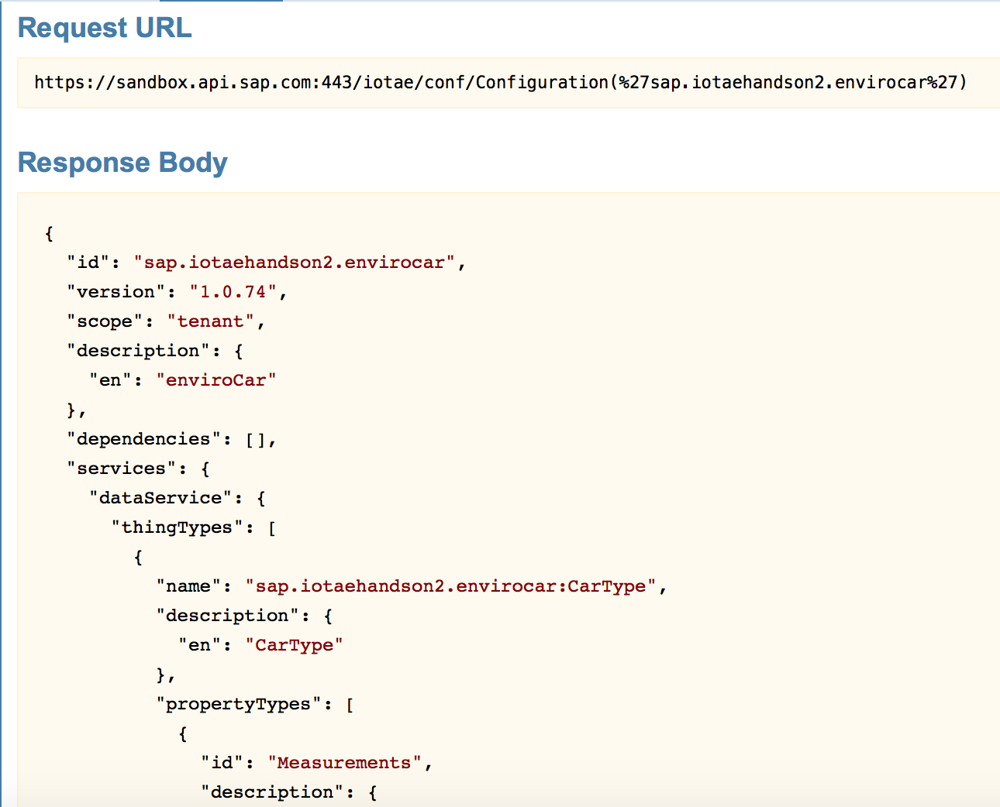

This is one way to obtain the configuration. You can use a REST client or a similar method to get the same result.

Copy the URL
```
https://sandbox.api.sap.com:443/iotae/conf/Configuration(%27sap.iotaehandson2.envirocar%27)
```
and paste it into a REST client like Postman.

 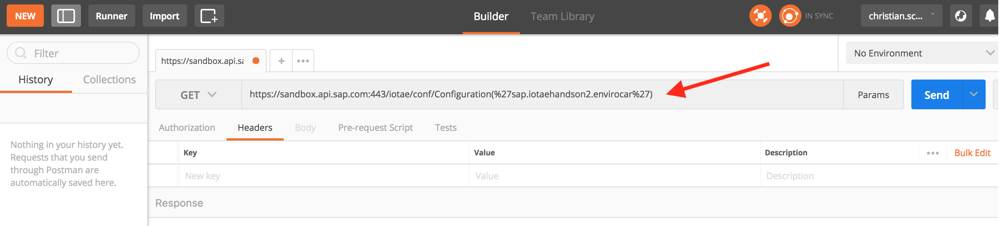

Obtain the API key from the upper right corner.

 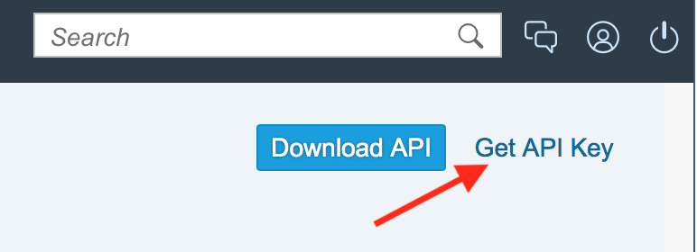

Your API key will show up instead of the grey box. Copy the key to your clipboard.


Add the header `apikey` with your key:

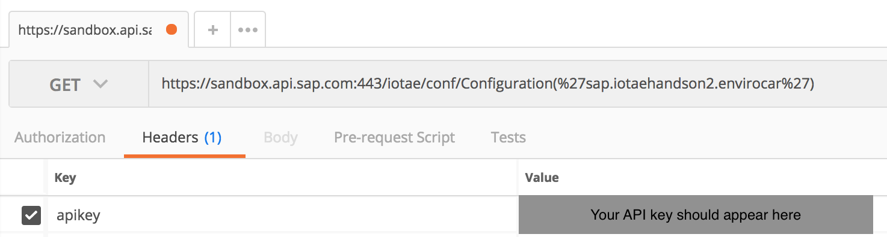

Click on send

to retrieve the following response:

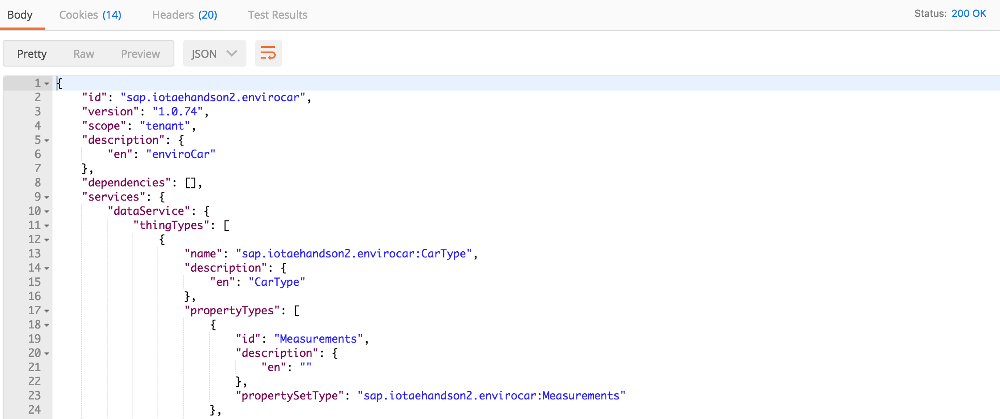

For the following steps, you can use the SAP API Business Hub page to send the request or use a REST client like Postman.

You can request a user for the `handson2` tenant in this tutorial … and then you can directly call the API like this from a browser or from postman (with postman interceptor).

```
https://sap-iotaehandson2.iot-sap.cfapps.eu10.hana.ondemand.com/appcore-conf/Configuration(%27sap.iotaehandson2.envirocar%27)
```


[ACCORDION-END]

[ACCORDION-BEGIN [Step 4: ](Verify things)]

Go back to SAP API Business Hub page to select `things` instead of `configuration`. Click on `get` for `/things`.


Remark: in case that you try this service without a filter, different things from other packages might show up that you do not expect. Please use the following filter to obtain the things as used in this example.

In the edit field for `$filter` add the following filter for the thing type:
```
_thingType eq 'sap.iotaehandson2.envirocar:CarType'
```

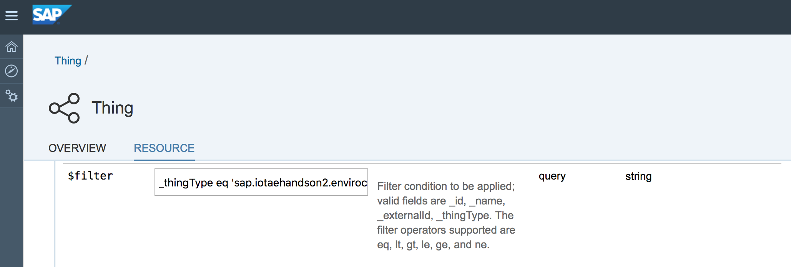

Click on "try it out". This will result in the following response

You could have chosen the following URL directly:
```
https://sandbox.api.sap.com:443/iotae/mds/Things?%24filter=_thingType%20eq%20%27sap.iotaehandson2.envirocar%3ACarType%27
```

The result shows 4 cars that were taken out as examples from the `enviroCar` database.

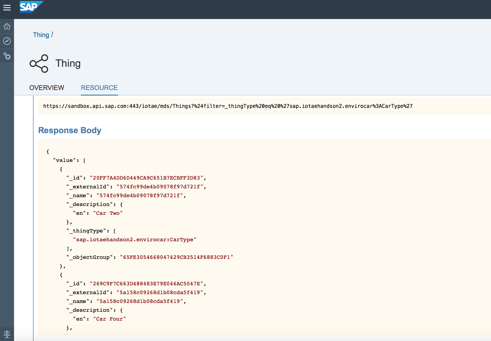

[ACCORDION-END]

[ACCORDION-BEGIN [Step 5: ](Access Thing Analytics)]

Now access the SAP API Business Hub and chose 'Thing Analytics'.
We will verify time series data first.


Click on GET for measurements and then enter the following `property set type` in the editable field.

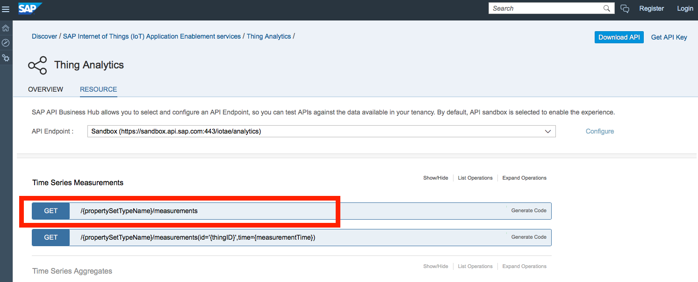

Property set Type should be:

```
sap.iotaehandson2.envirocar:Measurements
```

$filter should ne:

```
time ge datetime'2018-01-01T00:00:00' and time lt datetime'2018-03-01T00:00:00'
```

These are a mandatory parameters for the request.

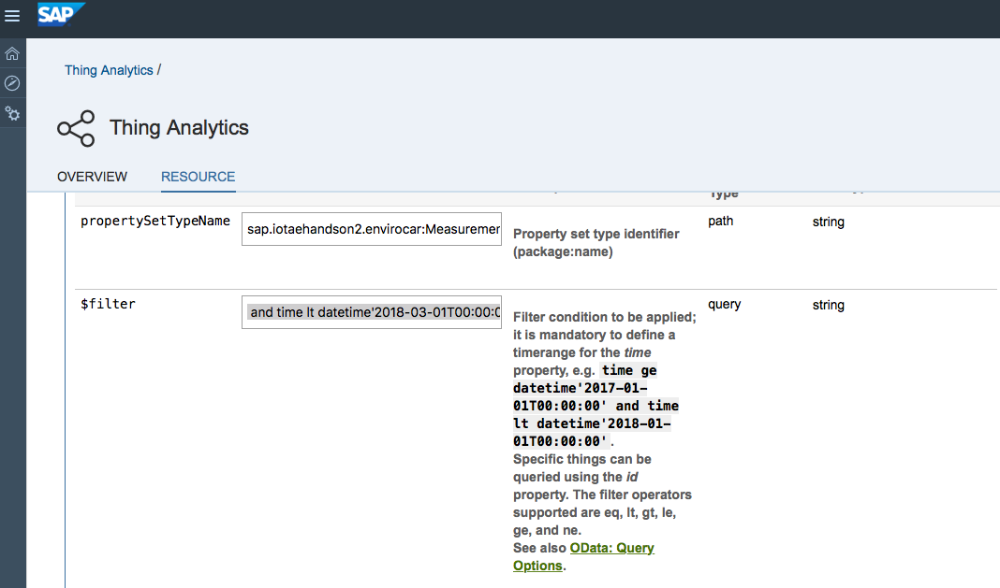

The response will look like this:

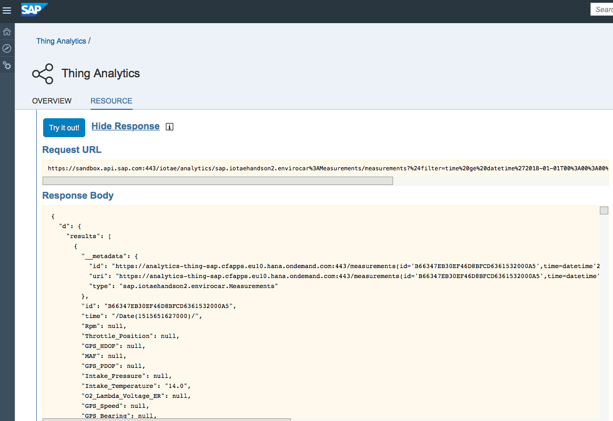

The response contains single measurements that were obtained from a car and send to the enviroCar database. Each single measurement contains the car id (corresponds to the thing name), a timestamp and a list of different measurements for speed, temperature, fuel consumption, CO2 etc.

One measurement looks like this:

```
"__metadata": {
          "id": "https://analytics-thing-sap.cfapps.eu10.hana.ondemand.com:443/measurements(id='B66347EB30EF46D8BFCD6361532000A5',time=datetime'2018-01-11T06%3A20%3A27')",
          "uri": "https://analytics-thing-sap.cfapps.eu10.hana.ondemand.com:443/measurements(id='B66347EB30EF46D8BFCD6361532000A5',time=datetime'2018-01-11T06%3A20%3A27')",
          "type": "sap.iotaehandson2.envirocar.Measurements"
        },
        "id": "B66347EB30EF46D8BFCD6361532000A5",
        "time": "/Date(1515651627000)/",
        "Rpm": null,
        "Throttle_Position": null,
        "GPS_HDOP": null,
        "MAF": null,
        "GPS_PDOP": null,
        "Intake_Pressure": null,
        "Intake_Temperature": "14.0",
        "O2_Lambda_Voltage_ER": null,
        "GPS_Speed": null,
        "GPS_Bearing": null,
        "GPS_VDOP": null,
        "Speed": "5.467811",
        "Consumption": "0.7384494",
        "CO2": "1.735356",
        "GPS_Altitude": null,
        "Engine_Load": "36.03984",
        "GPS_Accuracy": null,
        "O2_Lambda_Voltage": null,
        "Track": "5a5709d844ea85087e6841de",
        "thingType": "sap.iotaehandson2.envirocar:CarType",
        "path": "Measurements"
      },
      {
        "__metadata": {
          "id": "https://analytics-thing-sap.cfapps.eu10.hana.ondemand.com:443/measurements(id='B66347EB30EF46D8BFCD6361532000A5',time=datetime'2018-01-11T06%3A20%3A21')",
          "uri": "https://analytics-thing-sap.cfapps.eu10.hana.ondemand.com:443/measurements(id='B66347EB30EF46D8BFCD6361532000A5',time=datetime'2018-01-11T06%3A20%3A21')",
          "type": "sap.iotaehandson2.envirocar.Measurements"
        },
        "id": "B66347EB30EF46D8BFCD6361532000A5",
        "time": "/Date(1515651621000)/",
        "Rpm": null,
        "Throttle_Position": null,
        "GPS_HDOP": null,
        "MAF": null,
        "GPS_PDOP": null,
        "Intake_Pressure": null,
        "Intake_Temperature": "13.0",
        "O2_Lambda_Voltage_ER": null,
        "GPS_Speed": null,
        "GPS_Bearing": null,
        "GPS_VDOP": null,
        "Speed": "4.0",
        "Consumption": "0.7563482",
        "CO2": "1.7774183",
        "GPS_Altitude": null,
        "Engine_Load": "37.110767",
        "GPS_Accuracy": null,
        "O2_Lambda_Voltage": null,
        "Track": "5a5709d844ea85087e6841de",
        "thingType": "sap.iotaehandson2.envirocar:CarType",
        "path": "Measurements"
      }
```

In order to combine single measurements to a trip, a dedicated `Track` is added to the measurement (not during driving but later in the database).

Now open the chapter `time series aggregates` and  click on GET for `/sap.iotaehandson2.envirocar:Measurement`.

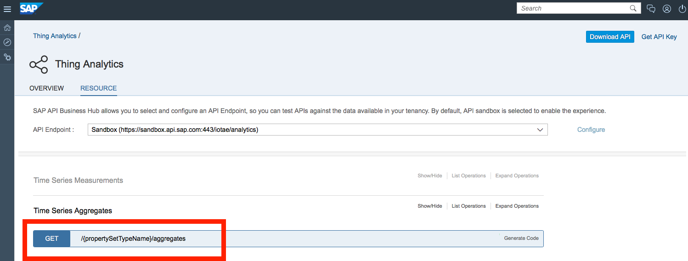

Property set Type should be:

```
sap.iotaehandson2.envirocar:Measurements
```

$filter should ne:

```
time ge datetime'2018-01-01T00:00:00' and time lt datetime'2018-03-01T00:00:00'
```

These are a mandatory parameters for the request.

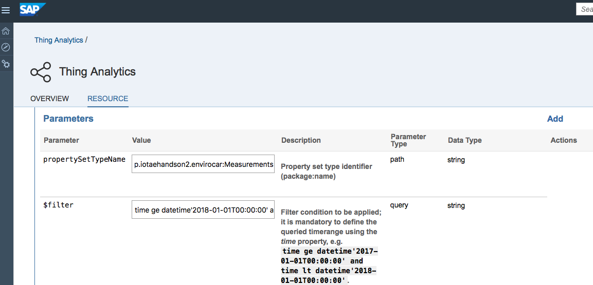

Click on "try it out" to obtain the following response:

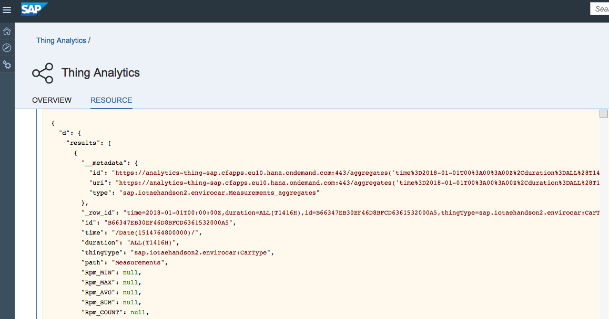

For each single Property, a list of characteristics is calculated and displayed (like for 'CO2'):

```
"CO2_MIN": "1.163272",
"CO2_MAX": "46.601913",
"CO2_AVG": "11.82093400057939",
"CO2_SUM": "69542.55472540855",
"CO2_COUNT": "5883",
"CO2_STDDEV": "8.721946886525672",
"CO2_FIRST": "14.333569",
"CO2_LAST": "1.735356",
"CO2_TFIRST": "/Date(1514541690000)/",
"CO2_TLAST": "/Date(1515651627000)/",
"CO2_TMIN": "/Date(1515159505000)/",
"CO2_TMAX": "/Date(1515563111000)/",
```

It is possible to filter for a specific car (or thing). Set the property set type and $filter as follows:

Property set Type should be:

```
sap.iotaehandson2.envirocar:Measurements
```

$filter should be:

```
id eq 'B66347EB30EF46D8BFCD6361532000A5' and time ge datetime'2018-01-01T00:00:00' and time lt datetime'2018-03-01T00:00:00'
```

This will provide the results for a single car only.

The result will look like this:

```
{
  "d": {
    "results": [
      {
        "__metadata": {
          "id": "https://analytics-thing-sap.cfapps.eu10.hana.ondemand.com:443/aggregates('time%3D2018-01-01T00%3A00%3A00Z%2Cduration%3DALL%28T1416H%29%2Cid%3DB66347EB30EF46D8BFCD6361532000A5%2CthingType%3Dsap.iotaehandson2.envirocar%3ACarType%2Cpath%3DMeasurements')",
          "uri": "https://analytics-thing-sap.cfapps.eu10.hana.ondemand.com:443/aggregates('time%3D2018-01-01T00%3A00%3A00Z%2Cduration%3DALL%28T1416H%29%2Cid%3DB66347EB30EF46D8BFCD6361532000A5%2CthingType%3Dsap.iotaehandson2.envirocar%3ACarType%2Cpath%3DMeasurements')",
          "type": "sap.iotaehandson2.envirocar.Measurements_aggregates"
        },
        "_row_id": "time=2018-01-01T00:00:00Z,duration=ALL(T1416H),id=B66347EB30EF46D8BFCD6361532000A5,thingType=sap.iotaehandson2.envirocar:CarType,path=Measurements",
        "id": "B66347EB30EF46D8BFCD6361532000A5",
        "time": "/Date(1514764800000)/",
        "duration": "ALL(T1416H)",
        "thingType": "sap.iotaehandson2.envirocar:CarType",
        "path": "Measurements",
        "GPS_Altitude_MIN": null,
        "GPS_Altitude_MAX": null,
        "GPS_Altitude_AVG": null,
        "GPS_Altitude_SUM": null,
        "GPS_Altitude_COUNT": null,
        "GPS_Altitude_STDDEV": null,
        "GPS_Altitude_FIRST": null,
        "GPS_Altitude_LAST": null,
        "GPS_Altitude_TFIRST": null,
        "GPS_Altitude_TLAST": null,
        "GPS_Altitude_TMIN": null,
        "GPS_Altitude_TMAX": null,
        "GPS_Altitude_PERCENT_GOOD": null,
        "Track_MIN": "5a57086244ea85087e67fec2",
        "Track_MAX": "5a5709d844ea85087e6841de",
        "Track_COUNT": "5883",
        "Track_FIRST": "5a57086244ea85087e67fec2",
        "Track_LAST": "5a5709d844ea85087e6841de",
        "Track_TFIRST": "/Date(1514541690000)/",
        "Track_TLAST": "/Date(1515651627000)/",
        "Track_TMIN": "/Date(1514541690000)/",
        "Track_TMAX": "/Date(1515650476000)/",
        "Track_PERCENT_GOOD": "100.0",
        "O2_Lambda_Voltage_MIN": null,
        "O2_Lambda_Voltage_MAX": null,
        "O2_Lambda_Voltage_AVG": null,
        "O2_Lambda_Voltage_SUM": null,
        "O2_Lambda_Voltage_COUNT": null,
        "O2_Lambda_Voltage_STDDEV": null,
        "O2_Lambda_Voltage_FIRST": null,
        "O2_Lambda_Voltage_LAST": null,
        "O2_Lambda_Voltage_TFIRST": null,
        "O2_Lambda_Voltage_TLAST": null,
        "O2_Lambda_Voltage_TMIN": null,
        "O2_Lambda_Voltage_TMAX": null,
        "O2_Lambda_Voltage_PERCENT_GOOD": null,
        "Consumption_MIN": "0.4950094",
        "Consumption_MAX": "19.8306",
        "Consumption_AVG": "5.030184682318695",
        "Consumption_SUM": "29592.576486080885",
        "Consumption_COUNT": "5883",
        "Consumption_STDDEV": "3.7114667588897077",
        "Consumption_FIRST": "6.099391",
        "Consumption_LAST": "0.7384494",
        "Consumption_TFIRST": "/Date(1514541690000)/",
        "Consumption_TLAST": "/Date(1515651627000)/",
        "Consumption_TMIN": "/Date(1515159505000)/",
        "Consumption_TMAX": "/Date(1515563111000)/",
        "Consumption_PERCENT_GOOD": "100.0",

        ...

        "Speed_MIN": "0.0",
        "Speed_MAX": "139.0",
        "Speed_AVG": "72.54980761738969",
        "Speed_SUM": "426810.5182131035",
        "Speed_COUNT": "5883",
        "Speed_STDDEV": "43.86616899863244",
        "Speed_FIRST": "27.934315",
        "Speed_LAST": "5.467811",
        "Speed_TFIRST": "/Date(1514541690000)/",
        "Speed_TLAST": "/Date(1515651627000)/",
        "Speed_TMIN": "/Date(1514547393000)/",
        "Speed_TMAX": "/Date(1515131392000)/",
        "Speed_PERCENT_GOOD": "100.0",
        "GPS_Speed_MIN": null,
        "GPS_Speed_MAX": null,
        "GPS_Speed_AVG": null,
        "GPS_Speed_SUM": null,
        "GPS_Speed_COUNT": null,
        "GPS_Speed_STDDEV": null,
        "GPS_Speed_FIRST": null,
        "GPS_Speed_LAST": null,
        "GPS_Speed_TFIRST": null,
        "GPS_Speed_TLAST": null,
        "GPS_Speed_TMIN": null,
        "GPS_Speed_TMAX": null,
        "GPS_Speed_PERCENT_GOOD": null,
        "GPS_Accuracy_MIN": null,
        "GPS_Accuracy_MAX": null,
        "GPS_Accuracy_AVG": null,
        "GPS_Accuracy_SUM": null,
        "GPS_Accuracy_COUNT": null,
        "GPS_Accuracy_STDDEV": null,
        "GPS_Accuracy_FIRST": null,
        "GPS_Accuracy_LAST": null,
        "GPS_Accuracy_TFIRST": null,
        "GPS_Accuracy_TLAST": null,
        "GPS_Accuracy_TMIN": null,
        "GPS_Accuracy_TMAX": null,
        "GPS_Accuracy_PERCENT_GOOD": null
      }
    ]
  }
}
```

[ACCORDION-END]

[ACCORDION-BEGIN [Step 6: ](Access Thing Analytics with further options)]

If you have processed Step 5, we can now consider additional options or verify details by enhancing the request with further parameters. Remain in the open the chapter `time series aggregates` and  click on GET for `/sap.iotaehandson2.envirocar:Measurements2`.


Property set Type should be:

```
sap.iotaehandson2.envirocar:Measurements2
```

$filter should ne:

```
time ge datetime'2018-03-01T00:00:00' and time lt datetime'2018-05-01T00:00:00'
```

These are a mandatory parameters for the request.

$select should ne:

```
Track,Speed_AVG,Consumption_AVG
```

Click on "try it out" to obtain the following response, the result will look like this:

```
{
  "d": {
    "results": [
      {
        "__metadata": {
          "id": "https://analytics-thing-sap.cfapps.eu10.hana.ondemand.com:443/aggregates('time%3D2018-03-01T00%3A00%3A00Z%2Cduration%3DALL%28T1464H%29%2CTrack%3D5a4f5d0144ea85087e3b5d9e')",
          "uri": "https://analytics-thing-sap.cfapps.eu10.hana.ondemand.com:443/aggregates('time%3D2018-03-01T00%3A00%3A00Z%2Cduration%3DALL%28T1464H%29%2CTrack%3D5a4f5d0144ea85087e3b5d9e')",
          "type": "sap.iotaehandson2.envirocar.Measurements2_aggregates"
        },
        "Track": "5a4f5d0144ea85087e3b5d9e",
        "Consumption_AVG": "7.097110271453857",
        "Speed_AVG": "32.0"
      },
      {
        "__metadata": {
          "id": "https://analytics-thing-sap.cfapps.eu10.hana.ondemand.com:443/aggregates('time%3D2018-03-01T00%3A00%3A00Z%2Cduration%3DALL%28T1464H%29%2CTrack%3D5a53ba3044ea85087e433cba')",
          "uri": "https://analytics-thing-sap.cfapps.eu10.hana.ondemand.com:443/aggregates('time%3D2018-03-01T00%3A00%3A00Z%2Cduration%3DALL%28T1464H%29%2CTrack%3D5a53ba3044ea85087e433cba')",
          "type": "sap.iotaehandson2.envirocar.Measurements2_aggregates"
        },
        "Track": "5a53ba3044ea85087e433cba",
        "Consumption_AVG": "0.9329440295696259",
        "Speed_AVG": "1.5499999523162842"
      },
```

Compared to the example in Step 5, the aggregates are calculated based on a further dimension: the Track Number. This was possible as the property set `Measurements2` contained a different setting for property 'Track'. In `Measurements2` in was marked as a "dimension".

So you see that you can slice and dice the data by using Analytical OData services. If you compare the data for all obtained results, you will find that the highest consumption average occurred in the last track `5a5709d844ea85087e6841de` as the average speed was the highest too.

In case that you want to know which car or thing was used in the track, please add `id` at the beginning of the select list.

For further questions regarding the API, please refer to the latest documentation:
```
https://help.sap.com/viewer/350cb3262cb8496b9f5e9e8b039b52db/latest/en-US/66d4abe77cb44fd3b8299ce049b54dba.html
```

[VALIDATE_1]

[ACCORDION-END]


---
