## Prerequisites  
 - **Proficiency:** Beginner
 - **Tutorials:** [Send the CPU usage data to SAP IoT Application Enablement](https://www.sap.com/developer/tutorials/iotae-comp-sendpy0.html) (you can also use other people's data coming from this tutorial)

## Next Steps
 - Select a tutorial group from the [Tutorial Navigator](https://www.sap.com/developer/tutorial-navigator.html) or the [Tutorial Catalog](https://www.sap.com/developer/tutorial-navigator.tutorials.html)

## Details
### You will learn  
You will learn the workflow of building the freestyle IoT application using SAP Web IDE Full-Stack

### Time to Complete
**20 Min**

---

[ACCORDION-BEGIN [Step 1: ](Start SAP Web IDE Full-Stack)]
SAP Web IDE Full-Stack is a powerful, extensible, web-based integrated development tool that simplifies end-to-end application development for SAP Cloud Platform.

Start SAP Web IDE in IoT Explore tenant using <https://webidecp-a8a3863fc.dispatcher.hana.ondemand.com/>

[ACCORDION-END]

[ACCORDION-BEGIN [Step 2: ](Enable IoT Application Enable feature)]
In SAP Web IDE go to **Preferences**, then **Features**. Find **IoT Application Enablement** feature and turn it on.

Make sure following features are turned on as well: **Layout Editor** and **Storyboard**.

[ACCORDION-END]

[ACCORDION-BEGIN [Step 3: ](Start the new project from the template)]
Now go to **Development**. Right click on **Workspace** and choose the creation of a new project from a template.

[ACCORDION-END]

[ACCORDION-BEGIN [Step 4: ](Create the app using wizard)]
Choose **Freestyle IoT Application** from the **Internet of Things** category. Click **Next**
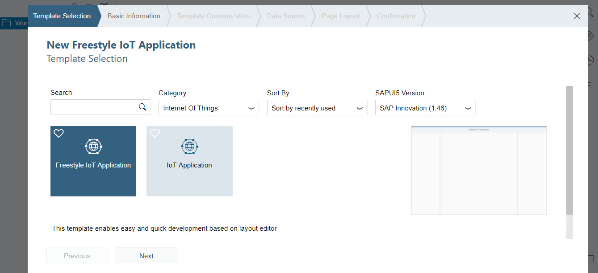

Type `computeriot` as a project name and your user id as the namespace. Click **Next**
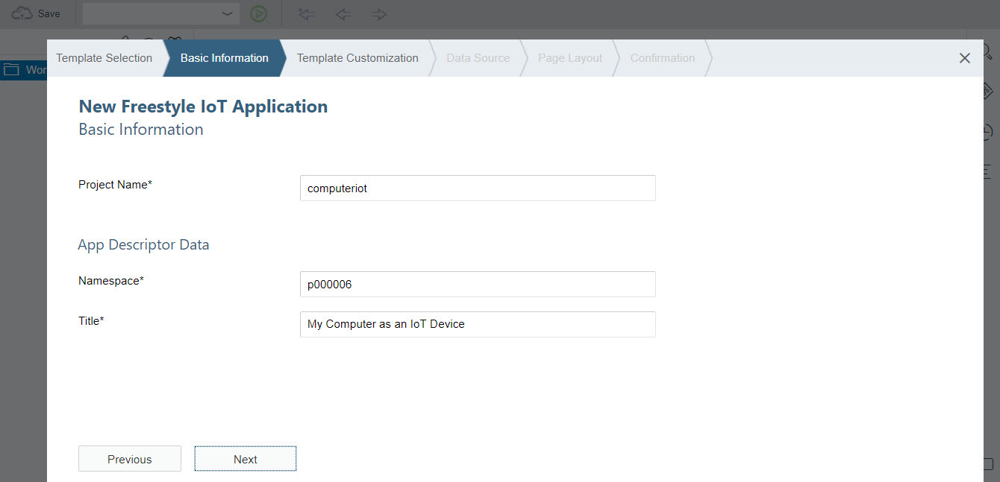

Leave everything as it is on the ___Template Customization___ step. Click **Next**

On ___Data Source___ step select:
 - **`Freestyle-IOTAS-ADVANCEDLIST-THING-ODATA`** as a service
 - all property sets for `sap.iotaehandson2.computeriotdevice:generic_computer_3` thing type
Click **Next**

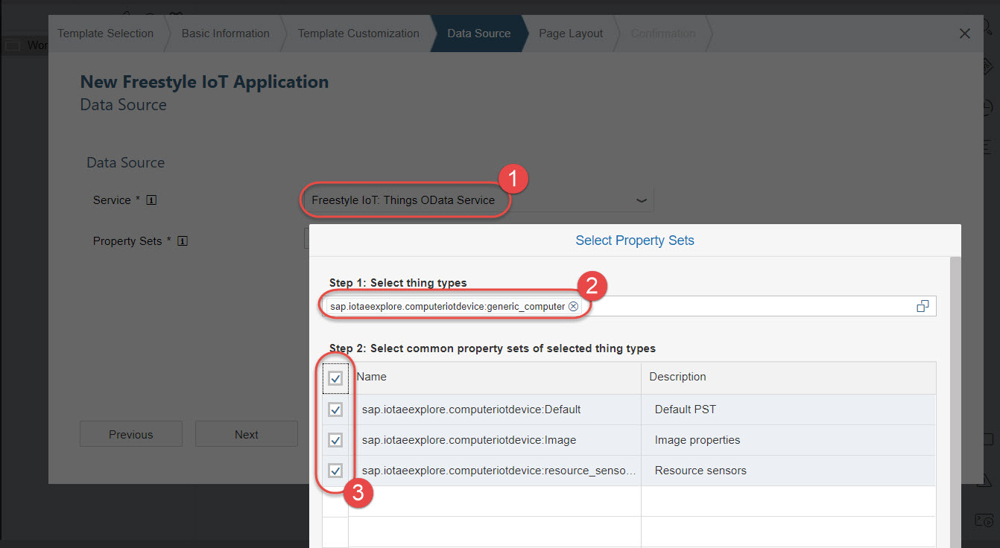

Choose **2 Column Layout** and click **Finish**

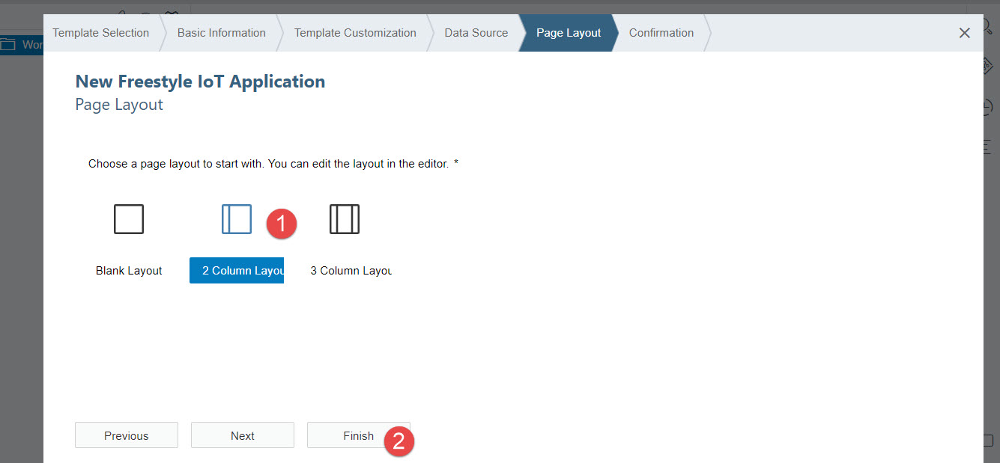

SAP Web IDE will generate the code and will open the new application in the Layout Editor.
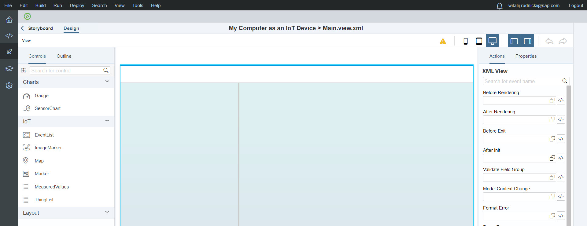

[ACCORDION-END]

[ACCORDION-BEGIN [Step 5: ](Place components on the layout)]
Drag the `ThingList` control to the left pane of the application's view. Drag `SensorChart` control to the right pane.

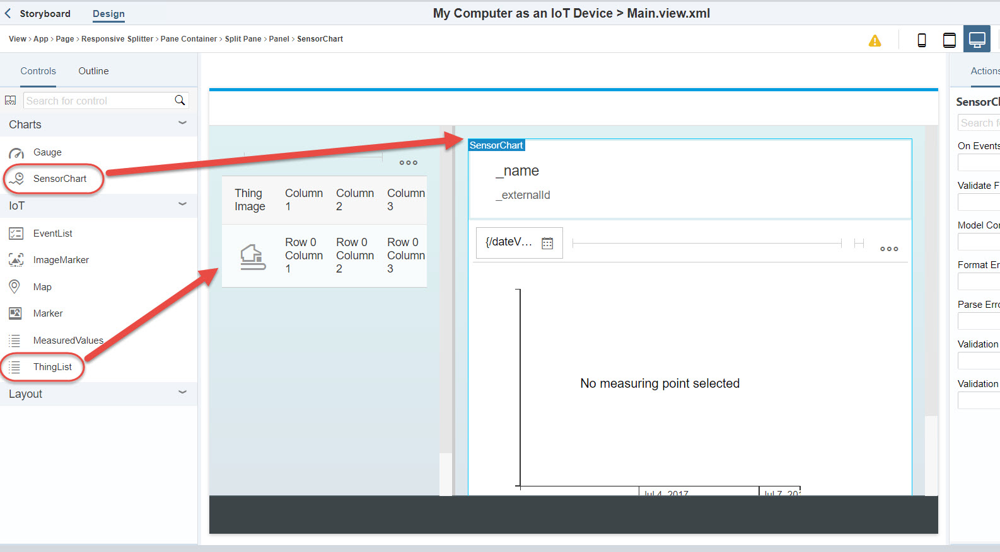

Now you can hide the controls to increase the real estate of the workspace.
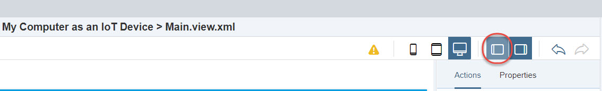

[ACCORDION-END]

[ACCORDION-BEGIN [Step 6: ](Customize the list of things)]
First bind the data. Click anywhere on the **`ThingList Element`** to select it. Then go to **Properties** and open a Query Designer by clicking on cogs.
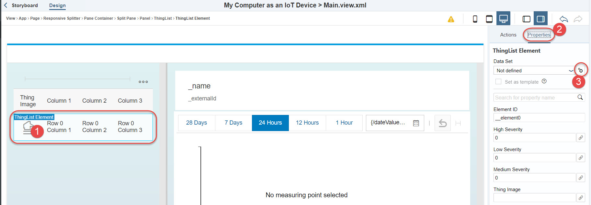

In the Query Designer select **/Things** entity set. Then expand associations to all displayed sets. Then click **OK**.

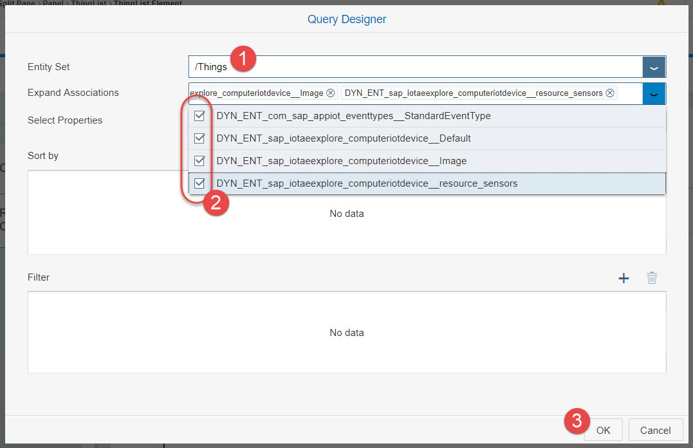

A dialog "A template will be created from selected control..." will be displayed. Click **OK**

Now bind columns to data values. Select the first thing list column element (with element id `__column0`) and change its ___Text___ value from `Row 0 Column 1` to `{ThingId}`. You can do it using a data binding dialog.

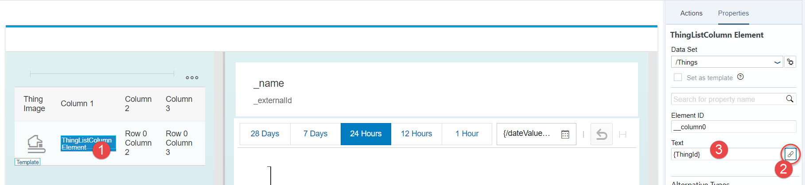

Repeat the same for the thing list column element from the second column (with element id `__column1`). Change its ___Text___ value to `{ThingName}`.

Repeat the same for the third column changing its ___Text___ to `{DYN_ENT_sap_iotaehandson2_computeriotdevice__Default/Default.common_name}`. That's the common name property from the associated `Default` properties set. The easiest is to do this using the dialog for the text's data binding.
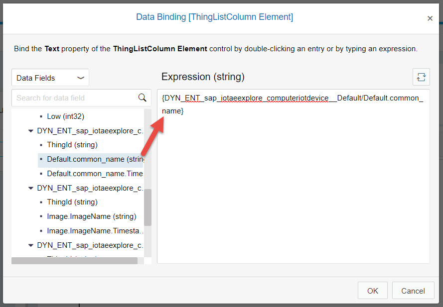

Next change column names to `ID`, `Name` and `Common name`.
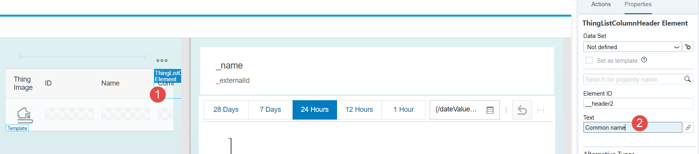

Next define the action of the chart refresh when another thing is selected from the list. Click on the higher element `ThingList`, then **Events** and open Action Configuration dialog by selecting **Wire to Action** for the **Row Select** event.

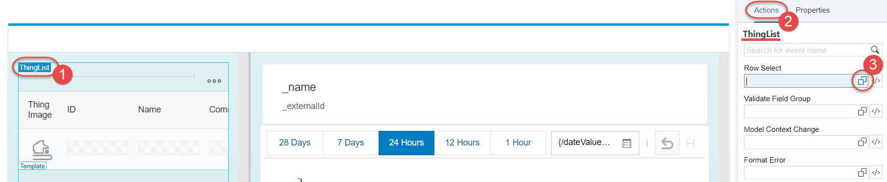

Select **`doReload`** action with the **`thing`** context. Click **OK**
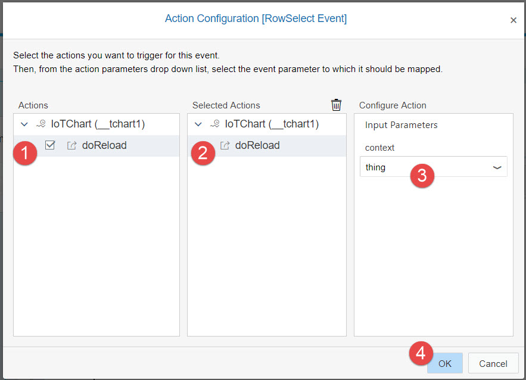

[ACCORDION-END]

[ACCORDION-BEGIN [Step 7: ](Customize sensors chart)]
Now select `SensorChart` element and change its properties:
 - **`No of Hours`** to `1`
 - **`Header Title`** to `Resources usage`
 - **`Subheader Title`** to `in %`
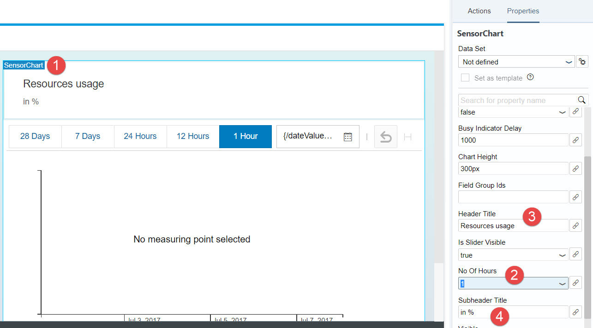

[ACCORDION-END]

[ACCORDION-BEGIN [Step 8: ](Run the application)]
Run your developed application by clicking on the green **Run** button in the upper left corner of the SAP Web IDE.
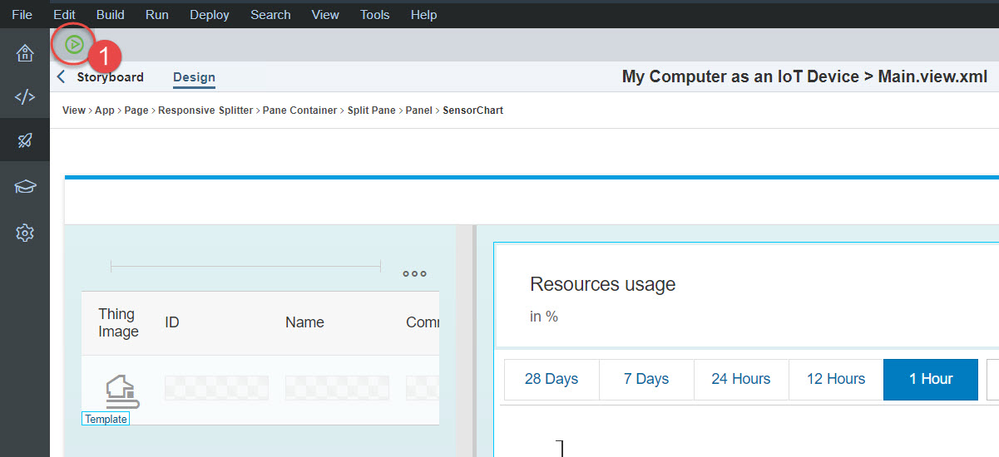

Once the application starts, find and click on your computer in the list of things on the left (you can also look at other people's computers). The chart on the right will be refreshed with the collected measurements sent by the Python program from the physical computer.

Alert thresholds of `45%` and `90%`, which you defined in the Thing Modeler earlier, are displayed on the chart.
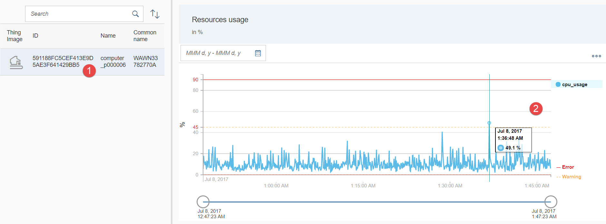

Congratulations! You built your IoT application using your computer as an IoT device and its CPU as a sensor.

[ACCORDION-END]

---

### Optional

[ACCORDION-BEGIN [Step 9: ](Play with other parameters)]
You can play now with different parameters in the Layout Editor and see how it changes your application.

[ACCORDION-END]

## Next Steps
- Select a tutorial from the [Tutorial Navigator](https://www.sap.com/developer/tutorial-navigator.html) or the [Tutorial Catalog](https://www.sap.com/developer/tutorial-navigator.tutorials.html)
