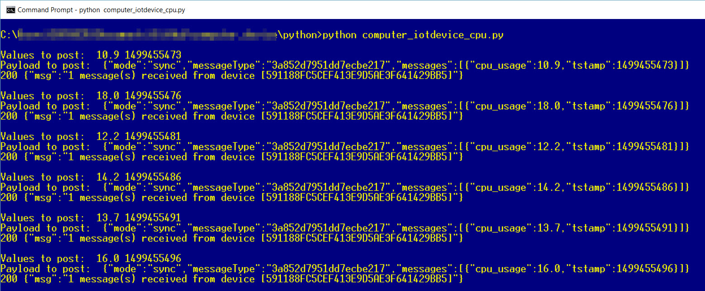
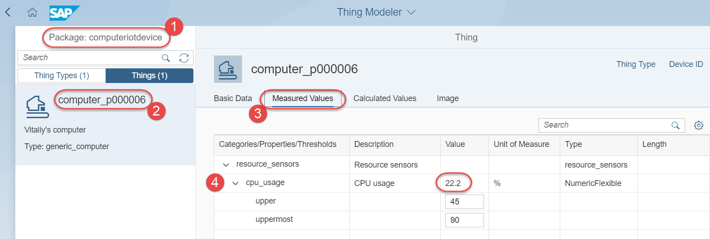
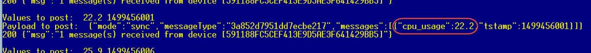
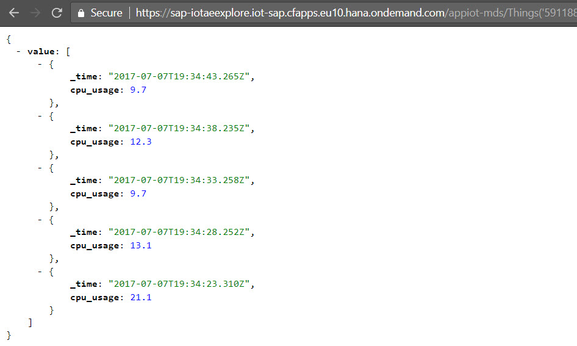

## Prerequisites  
 - **Proficiency:** Beginner
 - **Tutorials:** [Onboarding a computer as the IoT thing](https://developers.sap.com/tutorials/iotae-comp-thingmodeler0.html)


## Next Steps
- [Build freestyle IoT application](https://developers.sap.com/tutorials/iotae-comp-buildappmc0.html)

## Details
### You will learn  
You will learn how to use Python script to send sensor data to SAP Cloud Platform. If you get stuck with this you can skip to the next chapter and use someone else's device to show its sensor data in your app.

### Time to Complete
**10 Min**

---

[ACCORDION-BEGIN [Step 1: ](Check prerequisites)]
Your computer, which is going to play a role of the IoT device, should have:
 - Python - a programming language: <https://www.python.org/downloads/>
 - `requests` - HTTP library for Python: <https://github.com/requests/requests/#installation>
 - `psutil` - the (process and system utilities) is a cross-platform Python's library: <https://github.com/giampaolo/psutil#quick-links>
 - connection to Internet, ideally without proxy

If you need to install above fresh these steps describe what you need to do:

On a Mac python 2 is already installed by default. Only the library manager pip and the additional libraries have to be installed with these steps:
 - Request privileges with the Privileges app
 - Connect to the internet without a proxy (e.g. mobile phone hot spot)
 - In the terminal app do the following:
 - Enter `unset https_proxy`
 - Enter `sudo easy_install pip`
 - Enter `pip install requests`
 - Enter `pip install psutil`

On the PC follow these steps:

 - Download `Python 2.x` installer (you need version `2.x`, not `3.y`)
 - Start the installation
 - Open the command prompt `cmd` from the Start Menu
 - Change (cd) to the directory where you installed python and then into the `python27` directory (might be called different in your version)
 - Change (cd) to the `Scripts` subdirectory
 - Enter **`pip install requests`**
 - Enter **`pip install psutil`**
 - Change (`cd ..`) to the directory where you installed python
 - Enter **`python -v`** to check that python is running and which version you have installed

[ACCORDION-END]

[ACCORDION-BEGIN [Step 2: ](Prepare a file with a script to collect and send data)]
On your computer, create a file `computer_iotdevice_cpu.py` and paste the following Python code into it.

```python
import requests # http://docs.python-requests.org/en/master/
import psutil   # https://pypi.python.org/pypi/psutil
import time, sys, platform

hostiotmms = 'iotmmsa2667617c.hana.ondemand.com'
apiiotmmsdata = '/com.sap.iotservices.mms/v1/api/http/data/'
msgtypeid = 'd2b2db6980f940fae7d3'

deviceid = '591188FC5CEF41_fake_3E9D5AE3F641429BB5'
authtoken = '7461f8d7385_fake_179d36fcfd8'

url = "https://"+hostiotmms+apiiotmmsdata+deviceid

def readsensors():
	global d_pctCPU
	d_pctCPU = psutil.cpu_percent(percpu=False, interval = 1)
	return

def postiotneo ():
	global d_pctCPU

	s_pctCPU = str(d_pctCPU)
	d_tstamp = int(round(time.time()))

	s_tstamp = str(d_tstamp)

	print("\nValues to post: ", d_pctCPU, d_tstamp)

	payload = "{\"mode\":\"sync\",\"messageType\":\""+msgtypeid+"\",\"messages\":[{\"cpu_usage\":"+s_pctCPU+",\"cpu_type\":\"generic\",\"_time\":"+s_tstamp+"}]}"
	headers = {
			'content-type': "application/json",
			'authorization': "Bearer "+authtoken,
			'cache-control': "no-cache"
			}

	print("Payload to post: ", payload)

	response = requests.request("POST", url, data=payload, headers=headers)

	print(response.status_code, response.text)

	return

try:
	while(True):
		readsensors()
		postiotneo()
		time.sleep(2)
except KeyboardInterrupt:
	print("Stopped by the user!")
```

Save the file. On a PC save the file to the folder where you installed python.

[ACCORDION-END]


[ACCORDION-BEGIN [Step 3: ](Update the code and run the program)]

Update `deviceid` and `authtoken` variables in the code with IDs you copied in the previous tutorial when creating the thing for your computer.

Run the script with the command.
```sh
python computer_iotdevice_cpu.py
```

If all mentioned prerequisites have been satisfied, then you should see outcome like:


The return code `200` means that the message was received and processed by the IoT service in SAP Cloud Platform.

The return code `202` means that the message was received and queued for processing by the IoT service in SAP Cloud Platform or that the message does not fit the message type requirements.

Codes `4xx` and `5xx` mean errors.

If you are in a corporate network you might have to put your laptop into another network (e.g. your mobile phone hot spot) to not be hindered by a corporate proxy.

You can press control-c to stop sending data.


[ACCORDION-END]

[ACCORDION-BEGIN [Step 4: ](Check posted values in the Thing Modeler)]
Go back to the **Thing Modeler** application from the previous tutorial. Make sure you have the proper package `computeriotdevice` selected and find your computer on the list of **Things**.

Go to **Measured Values** and expand `resource_sensors` to the `cpu_usage`. You should see the value (like `22.2` on the screen shot). It is updated only once a minute, so you may need to wait a bit for it to appear and then to change.



You can find corresponding value in the output of the Python's script as well.



[ACCORDION-END]

[ACCORDION-BEGIN [Step 5: ](Check posted values in the API)]
The power of SAP IoT Application Enablement is in its rich set of APIs available to build powerful customer applications on top of data from devices.

E.g. to check last 5 values posted open following URL in the browser, like Chrome: <https://sap-iotaehandson2.iot-sap.cfapps.eu10.hana.ondemand.com/appiot-mds/Things('591188FC5CEF413E9D5AE3F641429BB5')/sap.iotaehandson2.computeriotdevice:generic_computer_3/resource_sensors_2?timerange=1H&$top=5>

You need to modify the thing id from `591188FC5CEF413E9D5AE3F641429BB5` to your own. Properly formatted URL will return results like this to authorized user.



[ACCORDION-END]

---

### Optional


[ACCORDION-BEGIN [Step 6: ](Explore IoT APIs in SAP API Hub)]
To better understand IoT Application Enablement APIs you can go to SAP API Hub at <https://api.sap.com/#/shell/discover/contentpackage/IOTAE> and review and execute different APIs in its sandbox. As this sandbox has the same backend you will find your things again here.


[ACCORDION-END]

