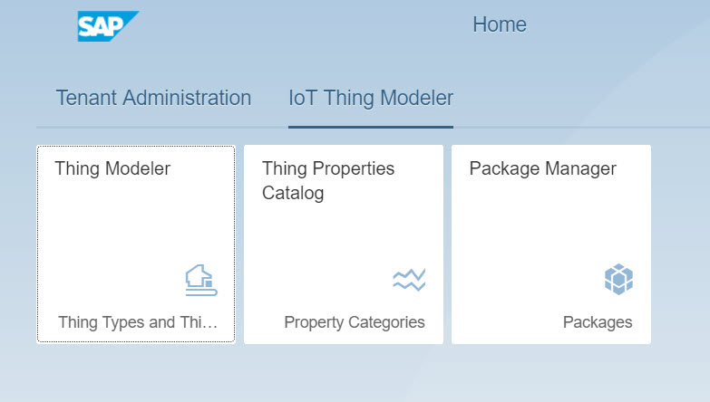
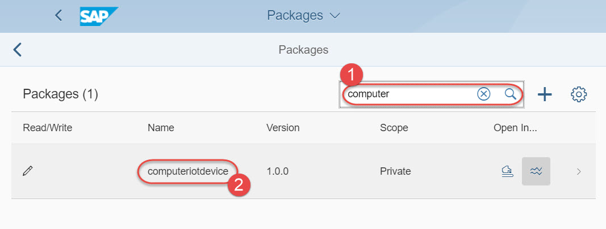
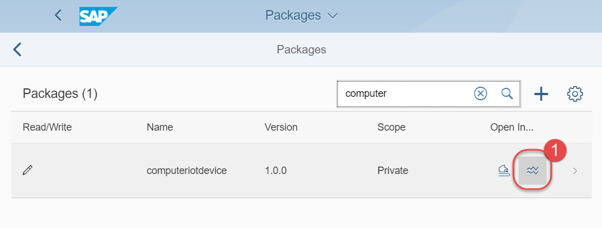
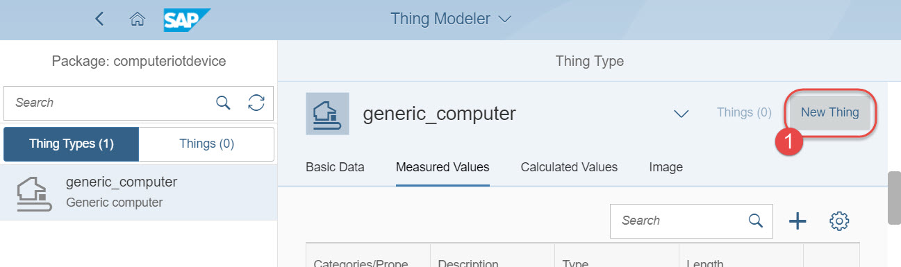
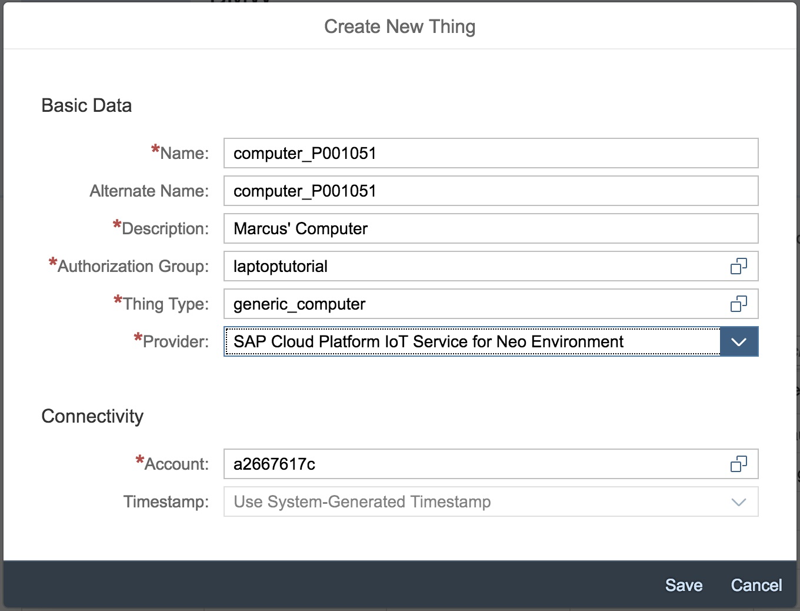
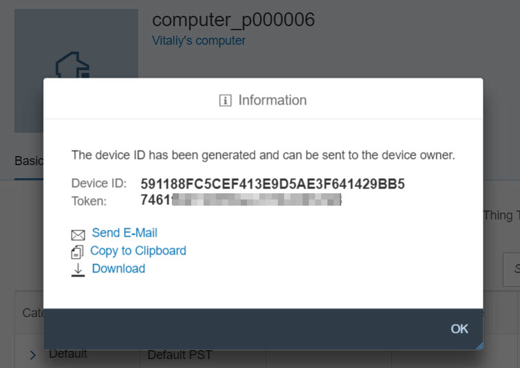
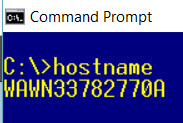
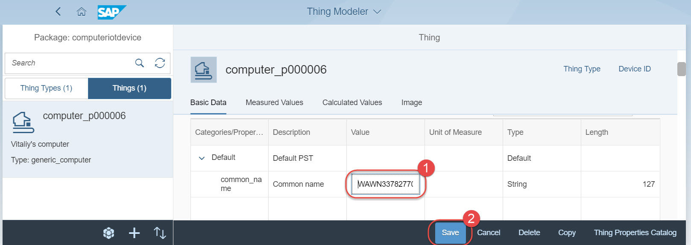
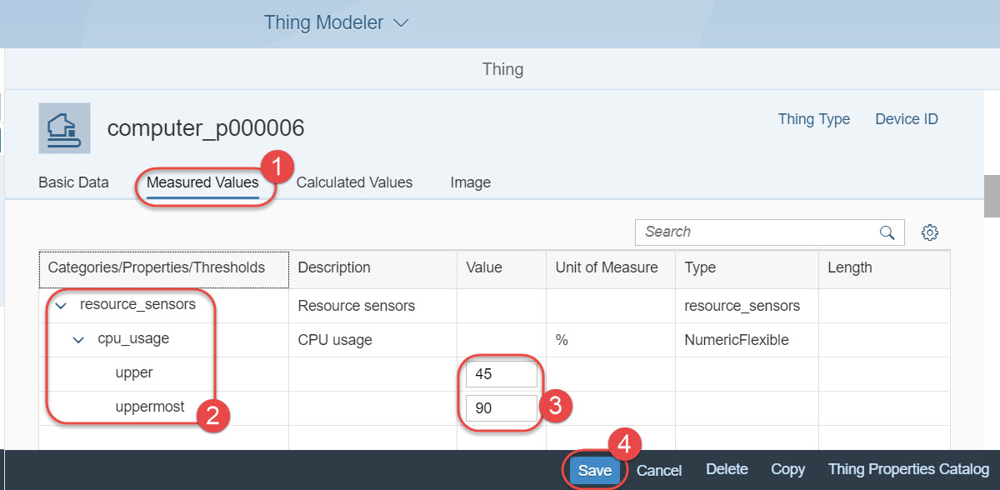

## Prerequisites  
 - **Proficiency:** Beginner

## Next Steps
 - [Send the CPU usage data to SAP IoT Application Enablement](https://www.sap.com/developer/tutorials/iotae-comp-sendpy0.html)

## Details
### You will learn  
You will learn how to onboard your computer as the IoT thing for collecting sensors data from it.

### Time to Complete
**15 Min**

---

[ACCORDION-BEGIN [Step 1: ](Open SAP IoT Application Enablement Launch Page)]
Go to <https://www.sap.com/cmp/ft/crm-xm17-gtm-1sc-iotae/index.html> and follow the instructions on the page to get a user and a password on the landscape used for this tutorial.

Open <https://sap-iotaehandson2.iot-sap.cfapps.eu10.hana.ondemand.com/launchpage/> in the web browser. Use the user id provided to you and _not_ your email address to login.

[ACCORDION-END]

[ACCORDION-BEGIN [Step 2: ](The `computeriotdevice` package)]
Open the **Package Manager** application.

A package serves as a container for thing-related objects, such as thing types, things, property sets, properties, or event types.

The shared package `computeriotdevice` has been already created for you. You can search for it.

[ACCORDION-END]

[ACCORDION-BEGIN [Step 3: ](Thing property sets in `computeriotdevice`)]
While in the Package Manager click on the **Open in Thing Properties Catalog** icon of the `computeriotdevice` package.

The property sets have been already preconfigured for you. The package contains three property sets among them:
 1. `Default` of the type Basic Data - with one property `common_name`
 2. `resource_sensors_2` of the type Measured Data - with one property `cpu_usage` and another one called `cpu_type`

The property `cpu_usage` is what we want to measure and has
 - ___float___ data type,
 - ___percentage___ unit of measure.

[ACCORDION-END]

[ACCORDION-BEGIN [Step 4: ](Thing type `generic_computer_3`)]
In the Thing Properties Catalog click on the **Thing Modeler** (the button is in the lower right corner).

In the **Thing Types** pane you will see `generic_computer_3` (please do not use `generic_computer` anymore, for `generic_computer` ingestion is not working anymore due to a misconfiguration issue) thing type defined with:
 - Basic Data properties from the `Default` set,
 - Measured Values properties from the `resource_sensors_2` set.

[ACCORDION-END]

[ACCORDION-BEGIN [Step 5: ](Add your computer as a new thing)]
From **Thing Type** overview for `generic_computer_3` click on the **New Thing**.

Populate the name `computer_[userid]` and the description `[Name]'s computer` of the newly created thing.

Choose:
 - Authorization Group: `laptoptutorial`
 - Select Provider: `IoT Service 2.0`
 - Account: `a2667617c`

These values will create the device in SAP Cloud Platform account `a2667617c` using IoT Service for Neo Environment.

Click **Save**. After a few seconds the new thing will be created and its technical device id and authorization token for the API calls will be displayed. Copy these values using your mouse and control-c/command-c.

This authorization token is displayed only once!

[ACCORDION-END]

[ACCORDION-BEGIN [Step 6: ](Configure your new thing)]
You have created your first thing, which is a digital twin of the real device, like your computer in this case. Congratulations!

Now it's time for a few configuration activities.

Firstly, update the master data of the thing. Go to **Basic Data** of your thing. Expand `Default` category. Provide the common name, like computer's name, in the **Value** column of the property `common_name`.

>To find the computer name you can type command `hostname` in its terminal.
>

Click **Save**

Secondly, set the alert thresholds for CPU usage. Go to **Measured Values**. Expand `resource_sensors_2` category, then `cpu_usage` property.

Set `upper` value to `45`, and `uppermost` to `90`.

Optionally, you can scroll to **Image** and add a picture of your thing.

[ACCORDION-END]

---

### Optional

[ACCORDION-BEGIN [Step 7: ](Review Thing Modeler user guide)]
You can find the official user guide at https://help.sap.com/viewer/p/SAP_IOT_APPLICATION_SERVICES > End-User Information > Thing Modeler Apps

[ACCORDION-END]

## Next Steps
 - [Send the CPU usage data to SAP IoT Application Enablement](https://www.sap.com/developer/tutorials/iotae-comp-sendpy0.html)
