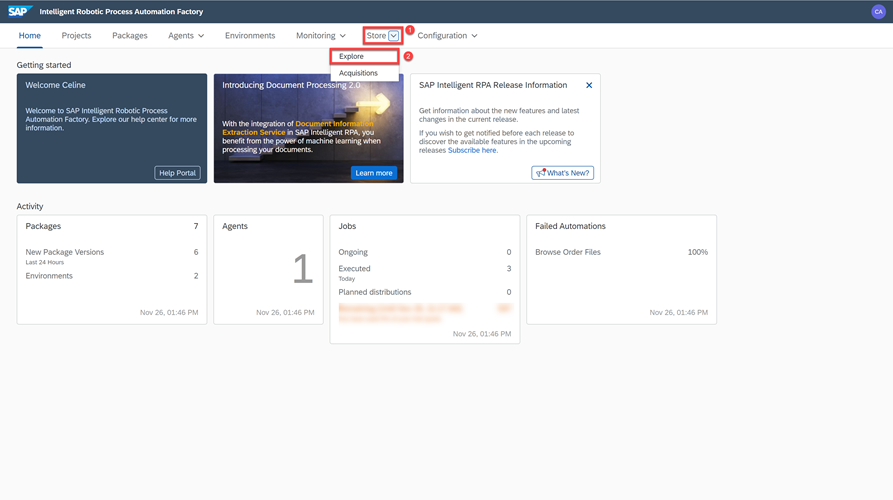
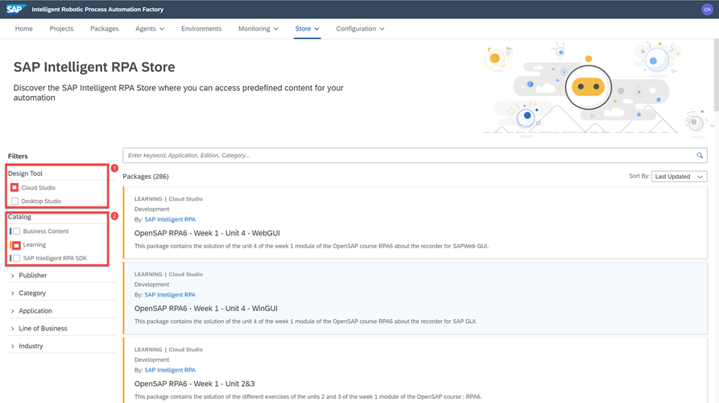
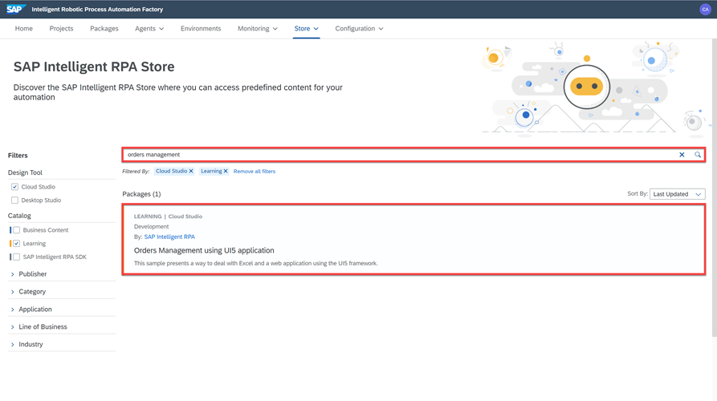
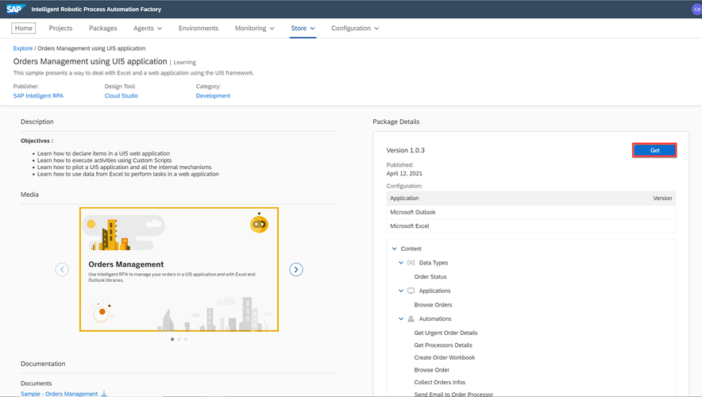
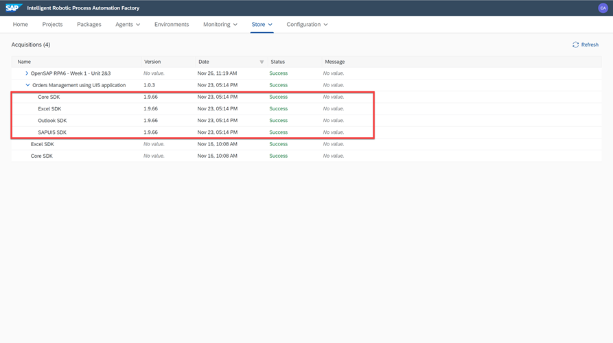
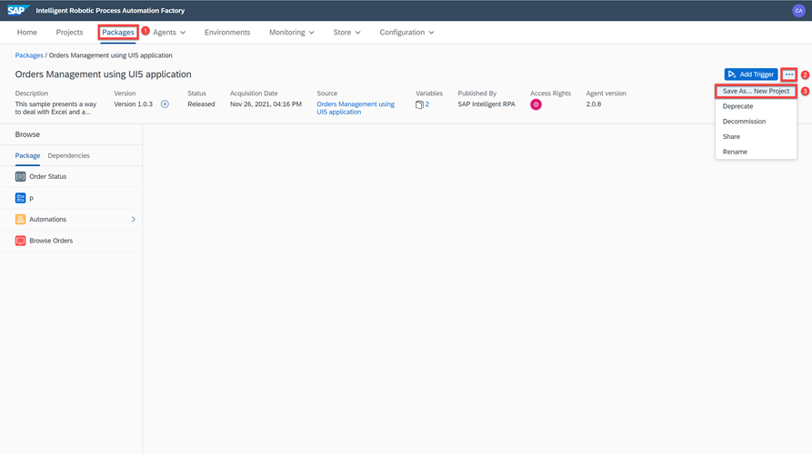
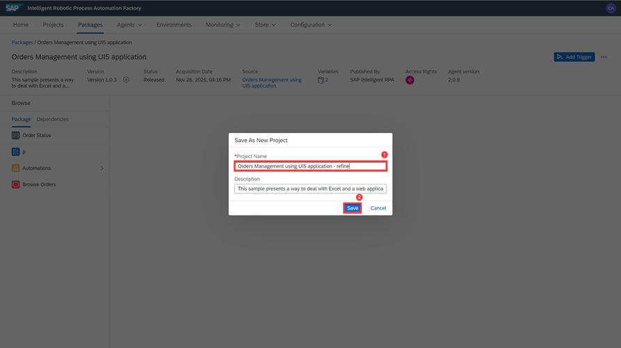
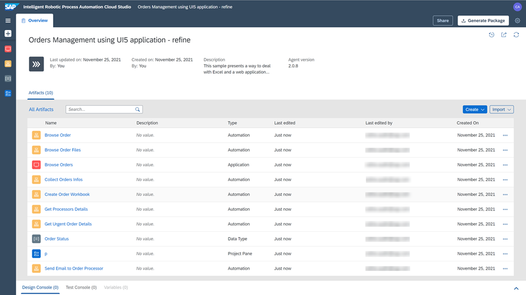

# Get a store package from SAP Intelligent RPA Store
<!-- description --> Get Orders Management package from the SAP Intelligent Robotic Process Automation store and reuse the package in the Cloud Studio.

## Prerequisites
  - [Subscribe to SAP Intelligent RPA Service in SAP BTP](irpa-setup-1-booster-subscription)
  - [Install SAP Intelligent RPA On-Premise Components](irpa-setup-2-onpremise-installation)

## You will learn
  - How to explore content in the SAP Intelligent RPA Bot Store
  - How to acquire a store package in your landscape
  - How to reuse a package from the Store in the Cloud Studio

---

### Explore SAP Intelligent Robotic Process Automation Store

>The SAP Intelligent Robotic Process Automation (RPA) store offers predefine content for your automation. Packages are categorized by catalog which lets you choose between Business Content, Learning Catalog and SAP Intelligent RPA SDK.

> **Learning Catalog** offers learning packages to get started with the SAP Intelligent RPA tool. These packages allow you to learn **best practices** by reusing the most common flows to design your first projects.

> **Business Content Catalog** provides **pre-built automations** for concrete business problems.

> **SAP Intelligent RPA SDK** provides  all the **Software Development Kits** that can be acquired from the store.

1. In the **SAP Intelligent RPA Cloud Factory**, select the tab **Store**.

2. From the dropdown menu, select **Explore**.

    <!-- border -->

### Acquire the Orders Management using SAPUI5 application package

1. You will acquire the package titled **Orders Management using UI5 application**. by setting the following parameters.
Under **Design Tool**, check **Cloud Studio** and under **Catalog**, check **Learning**.

      <!-- border -->

2. In the search bar, type **Orders Management** and choose the **Orders Management using UI5 application** package.

      <!-- border -->

      This sample package presents a way to deal with Excel and a web application using the SAPUI5 framework. Each sample package comes with a **description**, **documentation** about the sample, and details related to the package with its content and **related dependencies**.

3. Choose **Get** to acquire the package.

      The content acquisition is then processed in the background and you can track the status of the imported package from the Cloud Factory (Store **&rarr;** Acquisitions).

      <!-- border -->

4. Once the status is set to **Success** the package has been added to your acquisitions and is ready to use either in production as is or refined and enhanced in the Cloud Studio according to your business requirements.

    <!-- border -->

### Reuse package from Store to Cloud Studio

To customize your package, follow these steps:

1. Choose **Packages** view.

2. Choose the three dots icon for **More options**.

3. From the dropdown menu, select **Save as...New Project**.

    <!-- border -->

4. Rename the project to **Orders Management using UI5 application - refine** and choose **Save** to save the new version of this project.

    <!-- border -->

The project can now be edited in the Cloud Studio.

  <!-- border -->

---
