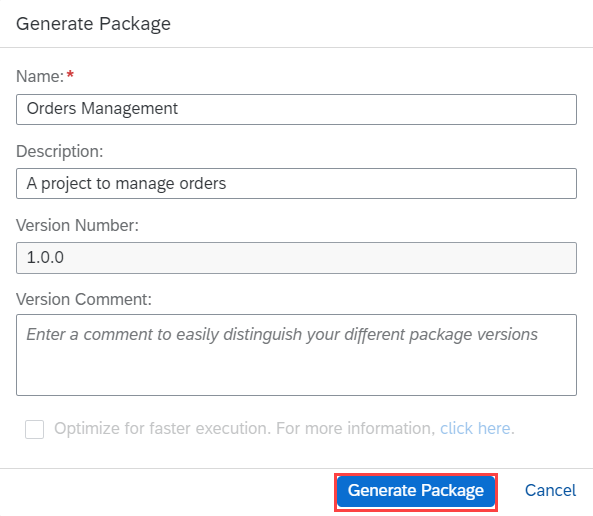
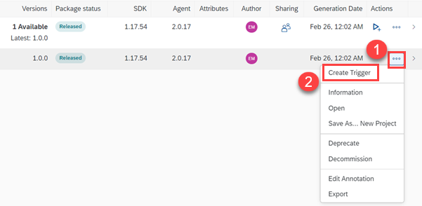
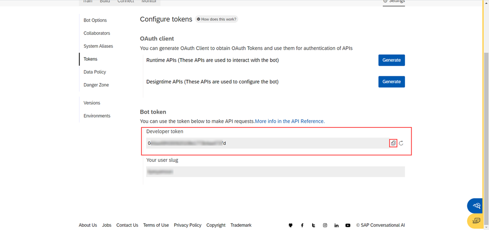

# Integrate the chatbot with the SAP Intelligent RPA
<!-- description --> Setup end-to-end integration between the SAP Conversational AI and the SAP Intelligent RPA. Information provided in a chatbot is used to run an automation in the background and update the user within the chatbot with different statuses.

## Prerequisites
  - Complete the Group [Automate a Procurement Business Process Using SAP Intelligent RPA](group.intelligent-rpa-order-management)
  - Understand the basics of creating a Chatbot using the SAP Conversational AI
  - You must be the Subaccount Administrator to be able to create the Service Key

## You will learn
  - Step-by-step integration to send data from a chatbot and trigger an automation in the background
  - Receive the information back within the chatbot from the automation
  - Basic troubleshooting scenarios
  - How to use an API Trigger

---

## Intro
The following diagram shows the step-by-step information required to perform the integration between the SAP Conversational AI and the SAP Intelligent RPA.

<!-- border -->


### Release the Package


1.  Open the project created in group Automate a Procurement Business Process Using SAP Intelligent RPA.

2.  Go to the **Overview** tab and click **Generate Package**.

    <!-- border -->

3.  From the pop up, check the **Name** and **Version Number** and click **Generate Package**.

    <!-- border -->

4.  Navigate to the **Packages** tab in the Cloud Factory to view the generated package. Search for the **Orders Management** package.

5.  Click the drop-down. From the line-item generated, click **...** and then click **Release** to release the package.

    <!-- border -->

6.  In the **Release Package** pop-up, click **Release**. The package will be in **Released** status.

    <!-- border -->


### Create the Trigger and the API Key

This step involves creating a trigger of type API and an API Key in your environment. A trigger of type API opens a dedicated endpoint that allows an external application to start the execution of an automation or scenario in a specified deployed package via an HTTP POST call. As such, an API trigger is always attached to one automation or scenario in one deployed package. A deployed package is bound to an environment, which means that using an API trigger will guarantee job execution on one of the agents in the environment of the deployed package.

1.  Click **...** against the released version and then click **Create Trigger**.

    <!-- border -->

2.  In the **Create Trigger** pop-up, select an environment and click **Next**.

    <!-- border -->

3.  In **Step 2 Deploy**, package will be deployed automatically and in **Step 3 Set Environment Variables**, the variables will be set, if any. In **Step 4 Select a trigger type**, select the radio button **API** and click **Next**.

    <!-- border -->

    The **Create API trigger** pop-up is displayed.

4.  In the **Create API trigger** pop-up, provide the following information:

    |  Field          | Value
    |  :------------- | :-------------
    |  Name           | `API_CAI_Call`
    |  Description    | An API triggered from CAI chatbot
    |  Execute          | Collect Order Details
    |  Priority   | Medium
    |  Job Expiration | 60 Minutes

    <!-- border -->

    Click **Create**. The **API trigger information** pop-up is generated.

5.  In the **API trigger information** pop-up, click **Copy** and paste it in a notepad. Click **Close**. The newly generated trigger is visible in your Environment.

    <!-- border -->

6.  Click **API Keys** in your Environment and then click **Add API Key**. The **Generate New API Key** pop-up is displayed. In the **Generate New API Key** pop-up, input the **Name** as `myAPIKey` and click **Next**.

    <!-- border -->

7.  Activate `environment_read`, `trigger_read` and `trigger_execute` and click **Next**.

    <!-- border -->

8.  Review your API Key and click **Add**.

9.  Click **Copy** and make sure to note down the key since you will not be able to view it again.

    <!-- border -->

The API trigger and the API Key are created successfully.


### Create a Service Key in the SAP BTP

This step involves creating a Service Key to access the SAP Intelligent RPA APIs. You will need the administrator rights of your global account in the SAP BTP Cockpit.

1.  Log in to your **SAP BTP Cockpit** and navigate to your Subaccount.

2.  Create a new **Service Key** by navigating to **Services** > **Instances and Subscriptions** > **Instances** > select your IRPA instance > **Service Keys** > **Create**.

    <!-- border -->

3.  Put the name as `myServiceKey` and click **Create**.

    <!-- border -->

4.  Click **...** and then click **View** to view the Service Key.

    <!-- border -->

5.  Click **Form** and copy the **clientid**, **clientsecret** and **URL**. You will need it in the next steps.

    <!-- border -->


### Fork and Configure the SAP Conversational AI

In this step, you will create a chatbot in the SAP Conversational AI and fork intents to use it's expressions in your chatbot.
Further, you will configure the chatbot to integrate with the SAP Intelligent RPA.

1.  Log in to your Conversational AI account.

2.  Create a new chatbot by providing the following information and click **Create**.

    |  Option     | Value
    |  :------------- | :-------------
    |  What do you want your chatbot to do? | **Perform Actions**
    |  Select predefined skills for your bot | **Greetings**
    |  Bot name    | `cai-with-irpa`
    |  Description          | **A chatbot to get the order statuses**
    |  Topics | **customer-support**, **Administration**
    |  Data Policy   | **Non-personal**
    |  Store conversation data | **Store**
    |   Bot visibility | **Public**

3.  Fork the intent `getorders`.

    <!-- border -->

4.  The forked intent is now displayed in your list of intents. Click the newly created intent `getorders` to check the list of expressions.

5.  Click **Train** and then navigate to **Build** tab.

6.  Click **Add Skill** and input the following information in the **Add Skill** pop-up and click **Add**.

    |  Field Name     | Value
    |  :------------- | :-------------
    |  Name           | `api_call`
    |  Type           | **Business**

    <!-- border -->

7.  Go to the skill `api_call` and open the **Triggers** tab.

8.  Add **If** statement. **If** `@getorders` and click **Save**.

    <!-- border -->

    <!-- border -->

9.  Open the **Actions** tab and click **New Action Group**.


### Configure API Service in CAI


1.  Click **Connect External Service** and then click **CONSUME API SERVICE**.

    <!-- border -->

2.  In the API Service Configuration, paste the **URL** you copied in **`Step 2.5`**.

3.  Choose **OAuth2 Authentication** as authentication type. The **Service Key** created in Step 3 will be used in this step. Use the **clientid**, **clientsecret** and **URL** copied earlier. For **Authorization URL**, make sure to add the suffix: `/oauth/token`. For example: `https://<yourtenant>.authentication.us10.hana.ondemand.com/oauth/token`

    Input the following information:

    |  Field Name     | Value
    |  :------------- | :-------------
    |  Client ID           | **clientid** copied in **`Step 3.5`**
    |  Client secret          | **clientsecret** copied in **`Step 3.5`**
    |  Authorization URL    | **URL** copied in **`Step 3.5`** appended with suffix `/oauth/token`

    <!-- border -->

4.  Next, go to the **Headers** tab and click **New Fields**.

    <!-- border -->

5.  Input the following header information:

    |  Field Name     | Value
    |  :------------- | :-------------
    |  Key           | **irpa-api-key**
    |  Value           | API Key copied from **`Step 2.9`**

    <!-- border -->

6.  Now, go to the **Body** tab and write the following JSON body.

    ```JSON
    {
        "invocationContext": {
        "conversationId": "{{conversation_id}}"
        },  
        "input": {}
    }
    ```
> Make a note of the `conversationId` variable used to pass the chatbot's `conversation_id`. You will be referring to this variable later during the tutorial.

7.  Click **Save** to save changes.

    <!-- border -->

Now, the chatbot is ready to connect via API Service Call.


### Generate Token


You must generate **Designtime APIs** token in **SAP CAI** to be able to authenticate the APIs successfully.

1.  Within the chatbot, click **Settings** <!-- border --> and then click **Tokens**.

    <!-- border -->

2.  Copy the **Developer token** under **Bot token** and paste it in a notepad.

    <!-- border -->

3.  Click **Generate** to generate a **Designtime API** token.

    <!-- border -->

4.  Select **Client Credentials** radio button and click **Next**.

    <!-- border -->

5.  Note down **Auth URL**, **Client ID** and **Client Secret** from the generated token. These credentials are valid for 12 hours only.

    <!-- border -->

The **Developer token** and **Designtime APIs** token information will be used in the next step to create **Notifiers**.


### Add Trigger Notifiers

In this step, you will create Notifiers.

>You will create three **Notifiers** for notifying **Start**, **Success** and **Failure** status while sending message to chatbot in CAI. The **Start** notifier will notify that the automation started. The **Success** notifier will notify that the automation ended successfully and results are downloaded in Excel with **Orders** and their **Status**. In case the automation fails, then the **Failure** notifier will send the message to chatbot with error details.

1.  Open your **SAP Intelligent RPA Factory** and navigate to **Environments**. Go to your environment.

    <!-- border -->

2.  From the trigger `API_CAI_Call` which you created in `Step 2.5`, click **More options** <!-- border --> and click **Add Notifier**.

    <!-- border -->

3.  Select **CAI** radio button and click **Next**.

    <!-- border -->

4.  In the **Create CAI Notifier** pop-up, fill in the following details and click **Create**:

    |  Field Name     | Value
    |  :------------- | :-------------
    |  Notify on      | **Start**
    |  Name           | **Starting notifier**
    |  Description    | Indicates that the automation has started
    |  Conversation ID| ```${invocation_context.conversationId}```
    |  Token          | **Developer token** from `Step 6.2`.
    |  Auth URL       | **Designtime APIs** token **Auth URL** from `Step 6.5`
    |  Client ID      | **Designtime APIs** token **Client ID** from `Step 6.5`
    |  Client Secret  | **Designtime APIs** token **Client Secret** from `Step 6.5`
    |  What do you want to do?   | **Send a message**
    |  Delay in second           | 0
    |  Message content           | Hello from IRPA bot! Automation started.

    <!-- border -->

    > Make sure the Conversation ID variable `conversationId` is the same as defined in Step 5.6. In case, the chatbot's `conversation_id` is passed in a different variable in Step 5.6 then, use the same  variable in the Notifier. If the variables do not match, then the integration will fail because the Notifier will not be able to send the message to incorrect chatbot's conversation ID.

5.  Repeat the steps 2 to 4 to add **Notifiers** with the following details:

    |  Field Name     | Value
    |  :------------- | :-------------
    |  Notify on      | **Success**
    |  Name           | **Success notifier**
    |  Description    | Indicates that the automation has finished successfully
    |  Conversation ID| ```${invocation_context.conversationId}```
    |  Token          | **Developer token**
    |  Auth URL       | **Designtime APIs** token **Auth URL**
    |  Client ID      | **Designtime APIs** token **Client ID**
    |  Client Secret  | **Designtime APIs** token **Client Secret**
    |  What do you want to do?   | **Send a message**
    |  Delay in second           | 0
    |  Message content           | Automation completed! Your order details are downloaded in Excel.


    |  Field Name     | Value
    |  :------------- | :-------------
    |  Notify on      | **Failure**
    |  Name           | **Failure notifier**
    |  Description    | Indicates that the automation has failed
    |  Conversation ID| ```${invocation_context.conversationId}```
    |  Token          | **Developer token**
    |  Auth URL       | **Designtime APIs** token **Auth URL**
    |  Client ID      | **Designtime APIs** token **Client ID**
    |  Client Secret  | **Designtime APIs** token **Client Secret**
    |  What do you want to do?   | **Send a message**
    |  Delay in second           | 0
    |  Message content           | Automation failed with error: `${error.details}`

    <!-- border -->

    <!-- border -->

You have successfully created the Notifiers.


### Connect and Test Your Chatbot

This step involves the creation of an **SAP Conversational AI Web Client** in your CAI chatbot.

1.  Open your SAP Conversational AI chatbot.

2.  Click **Connect** tab.

3.  Click on **SAP Conversational AI Web Client**.

    <!-- border -->

4.  Put **CAI with IRPA** in **Channel Name** and click **Create**.

    <!-- border -->

5.  Click on the **Web Client standalone link** to open the chatbot in browser.

6.  The chatbot opens in a new window. You can now start your automation by typing **Start my automation**. You can choose any expression maintained in `getorders` Intent.

    > Make sure your **Desktop Agent** is in **Background (Unattended)** mode.

    If the execution is successful, the chatbot displays the following output:

    <!-- border -->

    Otherwise, if the execution fails, the chatbot displays the following error details:

    <!-- border -->

7.  Check the automation job status in **Cloud Factory** > **Monitoring** > **Jobs**. Look out for your job and click on it to view details. This step is helpful to know about the error details of a failed integration.


---
