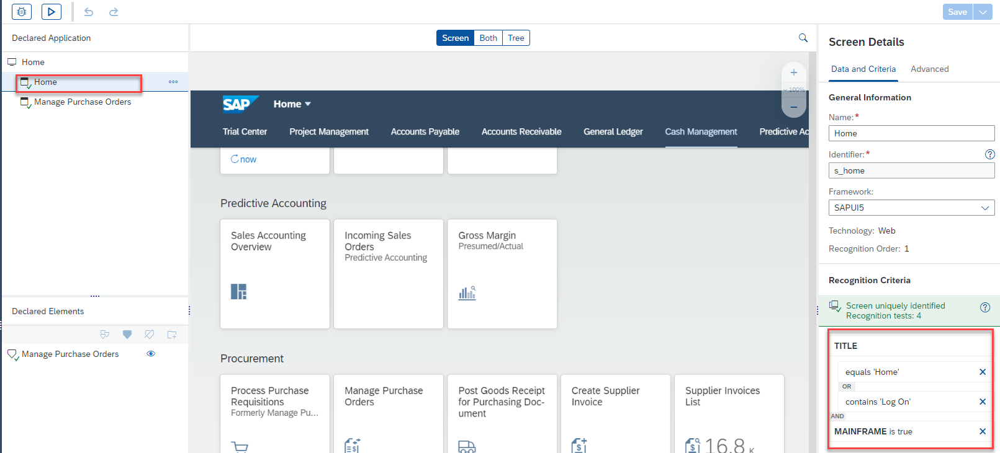
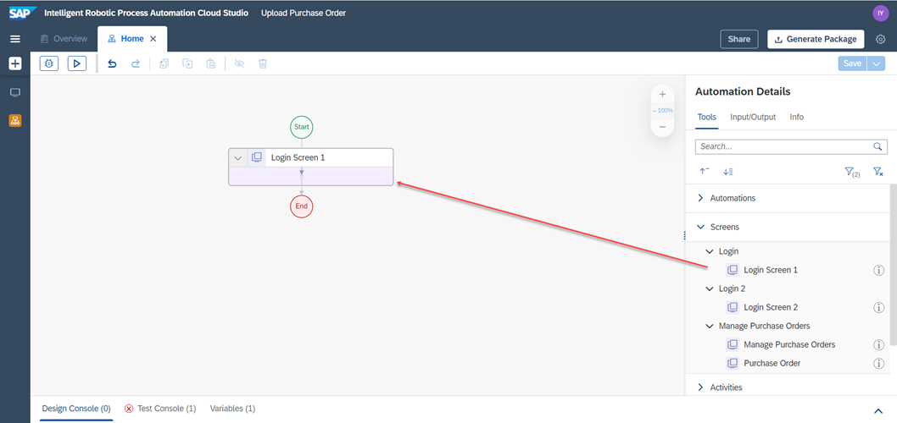
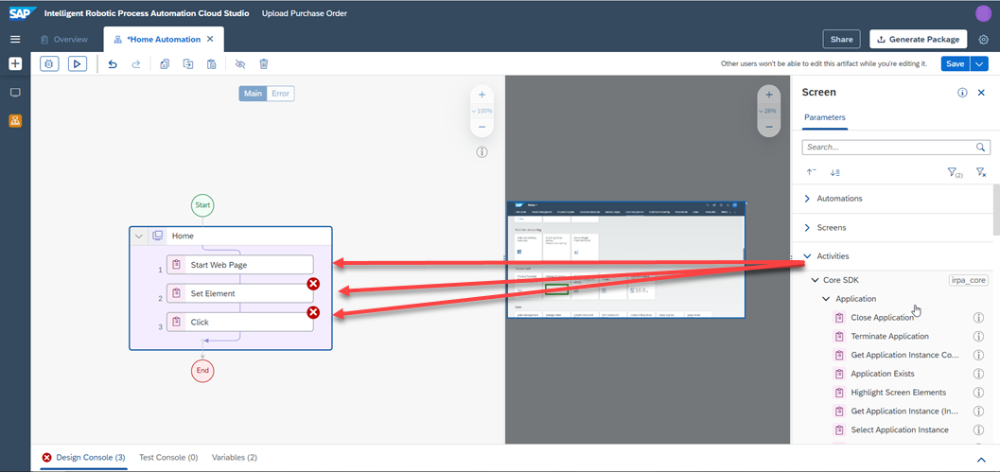
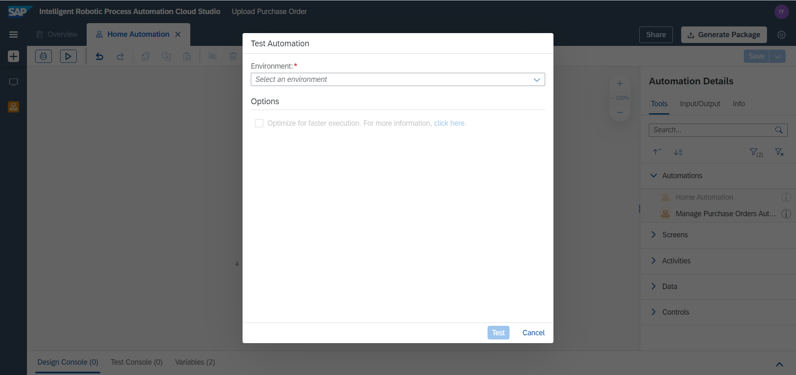

# Customize an automation generated through SAP UI5 Recorder
<!-- description --> Customize Purchase Order automation generated through SAP UI5 Recorder using Manage Purchase Orders Application (S/4 HANA Cloud)

## Prerequisites
 - [Automate  SAP S/4 HANA Cloud Applications using SAP UI5 Recorder](irpa-recorder-s4hana-cloudapplications-create)

## You will learn
  - How to customize a **Recorder** generated automation
  - How to use **sub-automations**
  - How to use the **UI5 Login** Activity
  -

---
In this tutorial, you will record the Home page of S/4 HANA Cloud Trial and Production accounts.
If you are using

## Intro
- **S/4 HANA Cloud production** account, follow the steps from **Step 1 -Step4**

- **S/4 HANA Cloud Trial** accounts ,follow the steps from **Step 4 - Step 6**

### Create Login Application (Production Account)

Open the Cloud Studio project which was created in [previous tutorial](irpa-recorder-s4hana-cloudapplications-create).

<!-- border -->

1.  Log into your **SAP S/4 HANA Cloud** account and go to the **Home** page.
2.  Create a new application in the **Cloud Studio** project.
3.  Click the **Home** Screen.
4.  Click **Record**.

<!-- border -->

The recorder window appears.

### Record Login Application (Production Account)

Refer to the following steps to record the home screen of **SAP S/4 HANA Cloud**

1.   Click the **Record** button to start the recording.

2.   Click Manage Purchase Orders in the dashboard under the Procurement category.

    <!-- border -->

    The activity is added.

3.  The Recorder will detect a change of  screen. Click the Capture button to record it.

    <!-- border -->

4. Click the Stopbutton to stop the recording.

    <!-- border -->

5.  Click **Export**.

    <!-- border -->

The new Login application and its automation are successfully exported to the **Cloud Studio** project.

<!-- border -->

### Customize Application (Production Account)

Refer to the following steps to set up the Login application to use the **UI5 Login** activity.

1.  Click the **Home** Application that corresponds to the recorded application.

    <!-- border -->

2.  Make sure the **Domain** is set to equal your **SAP S/4 HANA Cloud** login domain.    

    > To get the domain:
    >
    > 1. Go back to your browser

    > 2. Press **CTRL + SHIFT + C**

    > 3. Select console

    > 4. Type **document.domain**

    > <!-- border -->

    <!-- border -->

3.  Select the first screen of **Home** and add the **Title** of login screen with the **OR** condition to the screen's criteria.

    <!-- border -->

4.  Click **Save** to save the changes.

The set up of the application is now complete.

### Customize Automation (Production Account)

Refer to the following steps to customize the automation using the **UI5 Login** activity

1.  Go to the **Home Automation** tab.

    <!-- border -->

2.  Click on the screen in the automation.

3.  Click **Define Screen Activities**.

    <!-- border -->

4.  Search for the **UI5 Login** activity.

    <!-- border -->

5.  Drag-and-drop **UI5 Login** activity after the **Start Screen** activity.

    <!-- border -->

6.  Click on **UI5 Login** Activity in the automation to configure it.

    For S/4 HANA Cloud Applications, select the parameter `loginPageType` as **SAP Cloud Platform**

    <!-- border -->

    > Note: UI5 login activity can be used if S/4 HANA Cloud Account has a **single login page** as below.

    > <!-- border -->

    >  If your S/4 HANA Cloud Account  login page  has **multiple login screens, capture the login page manually  as mentioned in Steps 5 - Step 7.

7.  Delete **Close Application** Activity.

    <!-- border -->

8.  Repeat the step 7 for the **Start Application** Activity in the **Manage Purchase Orders Automation** created in the pervious tutorial.

9.  Press **Save** to save changes.

Setting up the automation is now complete.

### Create Login application (Trial Account)

Refer to the following steps to create the Login application to use an **SAP S/4 HANA Cloud trial account**.
 
In this scenario, you have to capture the login screens manually since the Trial account involves navigation of two login screens.

1.  Open the Cloud Studio project which was created in the  [previous tutorial](irpa-recorder-s4hana-cloudapplications-create).

2.  Create a new Application in **SAP Cloud Studio** and select the Login page open in your browser. Enter these information in the application details:

    |  Field Name       | Value
    |  :------------- | :-------------
    |  Application Name | **Login**
    |  Screen Name      | **Login Screen 1**

    > Make sure that you're logged off.

    <!-- border -->

3.  Click **Capture**.

    <!-- border -->

The Login process for trial accounts goes through two screens. Capture the second screen:

1.  Enter your username and click **Continue** on the first login page.

2.  Create a new Application in **SAP Cloud Studio** and click the new Page. Enter these information in the application details:

    |  Field Name       | Value
    |  :------------- | :-------------
    |  Application Name | **Login 2**
    |  Screen Name      | **Login Screen 2**

    <!-- border -->

3. Two new screens are created and ready to be customized.

<!-- border -->

### Customize Application (Trial Account)

These steps involve customizing the two **Login** applications to be usable in the automation.

1.  Click on **Username** field in the application to declare it.

    <!-- border -->

2.  Repeat the same process to declare **Continue** button.

    |  Object     | Name
    |  :------------- | :-------------
    |  Username Field  | **username**
    |  Continue Button  | **submit**

    <!-- border -->

3. Click **Save** to save changes.

The Log In process for trial accounts goes through two screens.

1.  Enter your **Username** and click **Continue**.

2.  Repeat the same process to declare both: **password** field and **Continue** button.

    |  Object     | Name
    |  :------------- | :-------------
    |  Password Field  | **password**
    |  Log On Button  | **submit**

    <!-- border -->

3. Click **Save** to save the changes.

Both pages of the  Login process are customized.

### Creating Automation (Trial Account)

Refer to the following steps to create an automation to use the captured login screens

1.  Create a new automation and name it **Home**.

    <!-- border -->

2.  Drag-and-drop **Login Screen 1** in the automation.

    <!-- border -->

3.  Click the screen **Login Screen 1** in the automation and click **Define Screen Activities**.

    <!-- border -->

4.  Drag-and-drop **Start Screen**, **Set Element** and **Click** screen activities in the **Login Screen 1** screen in the automation.

    <!-- border -->

5.  Click  **Start Screen** activity and enter your **Dashboard Home URL** in the `url` field then erase **Edge** from **navigator** field and select your navigator.

    > the **Dashboard Home URL** is of this type: `https://my123456.s4hana.ondemand.com/ui`

    <!-- border -->

6.  Click **Set Element** activity, then  click on **Open Target Editor** and select **Login > Login Screen 1 > username**.

    <!-- border -->

7.  Enter  your username in **value** field.

    <!-- border -->

8.  Click the **Click** activity, then click on **Open Target Editor** and select **Login > Login Screen 1 > submit**.

    <!-- border -->

9.  Drag-and-drop **Login Screen 2** in the automation after **Login Screen 1**.

10.  Click the screen **Login Screen 2** in the automation and click **Define Screen Activities**.

11.  Drag-and-drop **Set Element** and **Click** screen activities in the **Login Screen 2** screen in the automation.

12.  Repeat the Step 6- Step 8 to configure the **Set Element** and **Click** screen activities

    > For **Set Element** **Target** select **login 2 > Login Screen 2 > password**, and set **value** field to your password.

    > For **Click** Target select **login 2 > Login Screen 2 > submit**.

13.  Click the **Save** to save changes.

The set of automation is now complete.

<!-- border -->

### Combine Automations using Sub-Automations

Refer to the following steps to combine the automation generated in[Automate  SAP S/4 HANA Cloud Applications using SAP UI5 Recorder](irpa-recorder-s4hana-cloudapplications-create) tutorial and the automation generated during this tutorial.

1.  In the **Home** automation, drag-and-drop `Manage Purchase Orders Autom` automation after the **Home** application activity.

    For **SAP S/4 HANA Cloud Productive** Accounts .

    <!-- border -->

    For **SAP S/4 HANA Cloud Trial** Accounts.

    <!-- border -->

2.  Click **Save** to save the changes.

Now the two automations are combined and executed sequentially when launched.

### Test the automation

1.  Click  **Test**.

2.  Select your **Environment**.

3.  Click **Test**.

    

The login page is opened in a browser and automatically logs in to the **SAP S/4 HANA Cloud** account. Then **Manages Purchase Orders** Application is opened from the dashboard and creates the purchase order with values provided in the steps of the automation.

---
