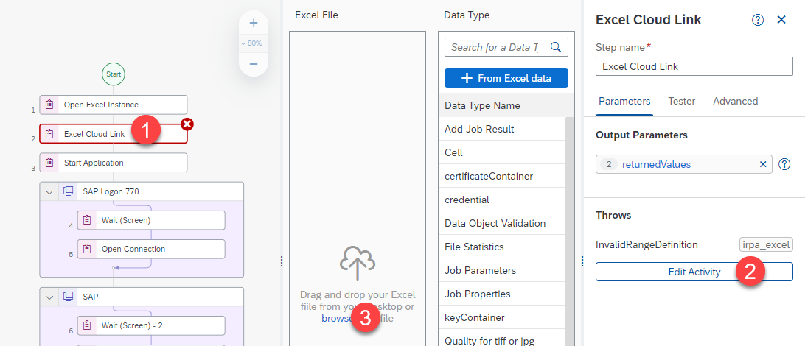

## Prerequisites
  - [Create an automation using Recorder](irpa-win-gui-recorder) completed.

## Details
### You will learn
  - How to customize a **Recorder** generated Automation.

---
[ACCORDION-BEGIN [Step 1: ](Customize Application)]
Open the project where you recorded the application automation process.

!

Select **Sales order Recorder** application.

1.  Select the screen containing the order details.
2.  Select the field containing *Material*.
3.  Rename the material field.
4.  Click **Remove** the **Id** **Criteria**.
5.  Click **Name** to add it as a **Criteria**.
6.  Click **Is a collection** !.

    > **Is a collection** is used to declare a field as a column containing multiple fields rather than just one field.

7. Repeat the steps 2-6 for the remaining two fields ( *Order Quantity Field* and *Storage location Field* ).

!

The application now recognizes *Material*, *Order Quantity* and *Storage Location* as columns and not as fields.

!

[VALIDATE_1]
[ACCORDION-END]

[ACCORDION-BEGIN [Step 2: ](Customize Automation)]

Create an excel file with the order details. This data is used to create the **SAP Sales order transaction** (Change this data according to your **SAP ERP** system).

!

Select **Sales Order Recorder Automation**.

1.  **Adding the required activities to the automation**.

    - Add **Open Excel Instance** Activity before the **Start Application** activity.

    - Add **Close Excel Instance** Activity before the **Terminate Application** activity.

    - Add **Excel Cloud Link** activity after the **Open Excel Instance** activity.

2.  **Configure Excel Cloud Link activity**.

    1.  Select the activity.
    2.  Click **Edit Activity**
    3.  Browse and select the Excel file.

    !

    The file is loaded to the activity.

    1.  Put the path of the file in the field.

    2.  Click **+ From Excel Data** to create the Order details **Data Type**.

    !

    A pop-up window opens. Set a name and a description for the **Data Type**.

    !

    To add all the rows from the Excel file, you require adding a **For each** activity.

    > The **For each** activity is used for *looping* through Data.

3.  **Looping through data**.

    In the automation, go to the **Create Standard Order: Overview** *screen* and add a **For each** activity just above the fields that need to be included in the repetitive process ( *Material*, *Order Quantity* and *Storage Location* ).

    !

    Drag and drop the three **Set Element - X** activities inside the **For each** activity.

    1. Select **For each** activity.

    2. Select **returned Values** option on **Set looping list**.

    > **returned Values** references the data returned from the **Excel Cloud link** activity.

    !

    Map the excel data of the current row to the corresponding field.

    1.  Select the first field (Corresponding to *Material*).

    2.  Set the value as **current Member** and click **currentMember.material** on the drop down menu that shows up.

        > **current Member** references the excel row used in the iteration of the **For each** loop.

        !

    3.  Click **Open the target Editor**.

    4.  Select **Material Field**.

    5.  Set **Index of the Element** to **index**.

    6.  Click confirm.

        !

    Some fields are stored as numbers in excel (such as **Order Quantity** and **Storage Location**). Convert them to strings (succession of characters).

    1.  Select the second field (Corresponding to *Order Quantity*).

    2.  Click **Open expression editor**.

        !

    3.  Type **Step27.currentMember.orderQuantity.toString()**.
    > *Step27* references the **For each** **activity**.

        !

    4.  Click **Open the target Editor**.

    5.  Select **Order Quantity Field**.

    6.  Set **Index of the Element** to index.

    7.  Click confirm.

        > Repeat the same steps (1-7) for **Storage Location** field.

        !

[VALIDATE_2]
[ACCORDION-END]

[ACCORDION-BEGIN [Step 3: ](Create Environment Variables)]

**Environment variables** allow you to reuse certain information for a given environment.

You use **environment variables** to pass parameters to automations. You can create environment variables in the **Cloud Studio** for which you can later set values across specified environments.

Create two **environment variables** (Password and Excel file path).

1.  Click **Manage this project properties**.

2.  Click **Environment Variables**.

3.  Click **Create**.

    !

4.  Fill in the *password* **environment variable**'s **Identifier**, **Description** (optional) and **Type** then click **Create**.

5.  Repeat step 4 for *excel_ file_ path* **environment variable**.

    > Type of environment variables depends on the use case. It can be a **String**, **Password**, **Number**, **Date**, etc.. .
    >
    > **environment variables**' Identifier can't contain spaces. Replace spaces with *underscores*.

|  Identifier      | Description (Optional)               | Type
|  :-------------- | :----------------------------------- | :-----------
|  password        | SAP Logon password                   | **Password**
|  excel_ file_ path | Excel file Path for Excel Cloud Link | **String**

The two **environment variables** are created.

!

[VALIDATE_3]
[ACCORDION-END]

[ACCORDION-BEGIN [Step 4: ](Use Environment Variables in Automation)]
To use the created **environment variables** in the automation go to the activities corresponding them.

1.  Select **Set Element** of password activity in the automation.

2.  Search and select the *password* **environment variable**.

    > **Environment Variables** have the letter **E** on the left side to distinguish them. !

!

1.  Select the **Excel Cloud Link** **activity** in the **automation**.

2.  Click **Edit Activity**.

3.  Search and select the *excel_ file_ path* **environment variable**.

!

Both of the **environment variables** were assigned to their correct value fields.

[DONE]
[ACCORDION-END]

[ACCORDION-BEGIN [Step 5: ](Test your Automation)]

Click **Test** and you will be prompted to put in values for the **environment variables**.

!

The process operates as follows:

1.  The application starts at the first screen captured automatically.

2.  The Excel file containing order details is opened.

3.  The **Desktop Agent** fills all the details in the screen.

4.  Information is validated to move to the next detected screen.

5.  These steps are repeated for all the screens that were captured.

6.  The order is created successfully after the use of data from the Excel file on the last screen.

[DONE]
[ACCORDION-END]
---
