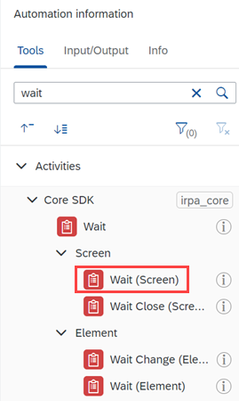
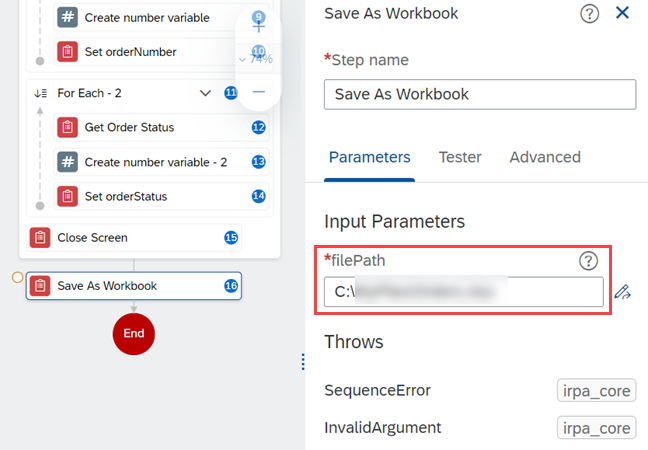

# Build an Automation for Orders Management
<!-- description --> Build an automation to collect order details for all the orders and print them in an Excel file.

## Prerequisites
- [Capture Orders Management Web Application](irpa-orders-management-1-capture)

## You will learn
  - How to create an automation in Cloud Studio
  - How to use Excel activities in an automation
  - How to set the columns for Order Number and Status in the Excel workbook
  - How to get the order number and order status from the [Browse Orders application](https://openui5.hana.ondemand.com/test-resources/sap/m/demokit/orderbrowser/webapp/test/mockServer.html)
  - How to close all open applications

---

### Check dependencies

1. Check the dependencies by choosing the **Menu** &nbsp; <!-- border --> in the Project Explorer.

    >Alternatively, you can choose the **manage the project properties** icon .

2. Select **Dependencies** from the dropdown list.

    <!-- border -->

3. Choose **Manage Dependencies** icon.

    <!-- border -->.

4. From the **Project Properties** popup screen, choose **Dependencies** to manage your project dependencies.

    <!-- border -->

By default, SDK **`irpa_core`** and SDK **`irpa_excel`** are automatically added to the project on creation of automation.

Now that you checked the dependencies, you can create your automation.


### Create the automation artifact

1. Choose <!-- border -->, then hover over **Create** and select **Automation** from the artifact dropdown.

    <!-- border -->

2. From the **Configure agent version** popup, select the **Desktop Agent version** installed on your machine and choose **Confirm**.

    <!-- border -->

3. In the **Create Automation** popup, enter the following information:

    |  Field Name     | Value
    |  :------------- | :-------------
    |  Name           | **`Collect Order Details`**
    |  Description    | **`An automation to collect order number and status`**

    The **Identifier** field value is populated automatically.

4. Choose **Create**.

    <!-- border -->

    The automation workflow opens in a new tab in Cloud Studio.

    The **automation designer** opens and you can drag and drop activities, data types, controls, applications and other automations from the side panel into the workflow.

    <!-- border -->


### Add Excel activities

1. Search for the **Open Excel Instance** activity from the list of tools available in the **Automation Information** panel.

    <!-- border -->

2. Drag-and-drop the activity in the workflow, where they become a step in the automation.

    Each step has its associated properties.

    <!-- border -->

3. Search for the **Add Workbook** activity and drag-and-drop it below the Open Excel Instance activity.

4. Drag-and-drop a **Set Values (Cells)** and select the activity to open its properties to make the following changes:

    - Step name : **Set Order Number**

    - Range Definition: **`A1`**

    - Values: **`Order Number`**

    <!-- border -->

5. Similarly, drag-and-drop a **Set Values (Cells)** activity and make the following changes to its properties:

    - Step name : **Set Order Status**

    - Range Definition: **`B1`**

    - Values: **`Order Status`**

6. Save your work.

    After completing the above steps, your automation should look like this.

    <!-- border -->


### Add application to automation

1. From the **Tools** panel, expand the **Screens** node and drag-and-drop the previously captured screen **Browse Orders** into the workflow.

      <!-- border -->

2. Choose **Browse Orders** and choose **Define Screen Activities** to view the activities related to **screen**.

    <!-- border -->

    Drag-and-drop the **Set Navigator** activity into the **Browse Orders** screen and click the step to set the following properties:

    -	Target : **Browse Orders**

    -	Navigator : **`Chrome`**

    <!-- border -->

    >Setting the navigator to Chrome will ensure that it opens using the Chrome browser if the application does not open with another navigator.

3. To allow the web page to fully load, drag-and-drop the **Wait (Screen)** activity inside the application. Set the **Target** as `Browse Orders`.

    <!-- border -->

    The automations looks like:

    <!-- border -->


### Define screen activities

1.  Choose **Browse Orders** in the workflow and from the **Parameters** panel, choose **Define Screen Activities**.

    <!-- border -->

2. A screen preview is shown. The elements declared appear in a green box.

    <!-- border -->

3. From the list of activities, search for **Get Element** activity. Drag-and-drop the activity in the screen preview on **Order 7991**. The box will turn from green to blue.  

    > ### What's going on?
    Here, you are defining activities on the screen elements. The **Order 7991** has been declared earlier as Order Number. The element is a Collection, thus, any activity applied to this element will be automatically applied to other instances of the same element. So, a **For** loop will be generated automatically in the workflow.

    <!-- border -->

4. Select **Get Element** activity to edit the following properties.

    -	Step Name : **Get Order Number**

    - Target : `currentMember`

    -	Output Parameters : `orderNumber`

5. From the **Tools** panel, search **number**. Select the `Number` data type within the **Data** node.

6. Drag-and-drop the **Number** data type within the **For Each** loop below the Get Order Number activity.

    <!-- border -->

7. Select and edit the activity **Create Number Variable**.

8. Choose **Open the Expression editor** to open the **Expression Editor**.  

      <!-- border -->

9. In the **Expression Editor**, enter this text below and click **Save Expression**:

    ```Expression
    Step7.index + 3
    ```

      <!-- border -->

10. Rename the **Output Parameters** as `myExcelRow`. The step will now look like this:

      <!-- border -->

11. Drag-and-drop **Set Values (Cells)** activity in the **For** loop below Create Number Variable activity.

    Edit the properties as shown below. Use the **Expression Editor** to edit **`rangeDefinition`**.

    <!-- border -->

12. Repeat Steps 4-11 for the element **Order Status** using the following information:

    |  Step           | Step Name           | Input Parameters        | Output Parameters
    |  :------------- | :------------------- |
    |  Get Element    | **`Get Order Status`** | target : **`currentMember`** | **`orderStatus`**
    |  Create Number Variable           | **`Create Number Variable - 2`**  | value: **`Step11.index + 3`**  | **`myExcelRow`**
    |  Set Values (Cells)    | **`Set orderStatus`**  | range Definition : **`"B" + Step13.myExcelRow`**  values: **`orderStatus`** |   |

    <!-- border -->


### Close and release application

You will now close the Browse Orders application, saving the worksheet and releasing the Excel instance.

1. Search for **Close Screen** activity and drag and drop it in the **Browse Orders** application outside the **For** loop.

    <!-- border -->

2. Search for **Save as Workbook**, drag-and-drop into the workflow outside the Browse Orders application.

3. In the activity's properties, provide an appropriate **`filePath`** (for example, `C:\some Path\myOrdersExcel.xlsx`) to store the Excel file.

    The resulting Excel is stored in this path:

    <!-- border -->

4. At last, drag-and-drop the **Release Excel Instance** activity into the workflow.

5. Choose **Save**.

You have completed building the automation and it should look like this.

  <!-- border -->


### Test the automation

You will now test the automation. Result of this automation should be the saved Excel file with all the order numbers and their order status.

To test the automation, choose <!-- border -->.

  <!-- border -->

Here's the Excel:

  <!-- border -->

Congratulations! You have successfully completed the tutorial for automating Order Management.

---
