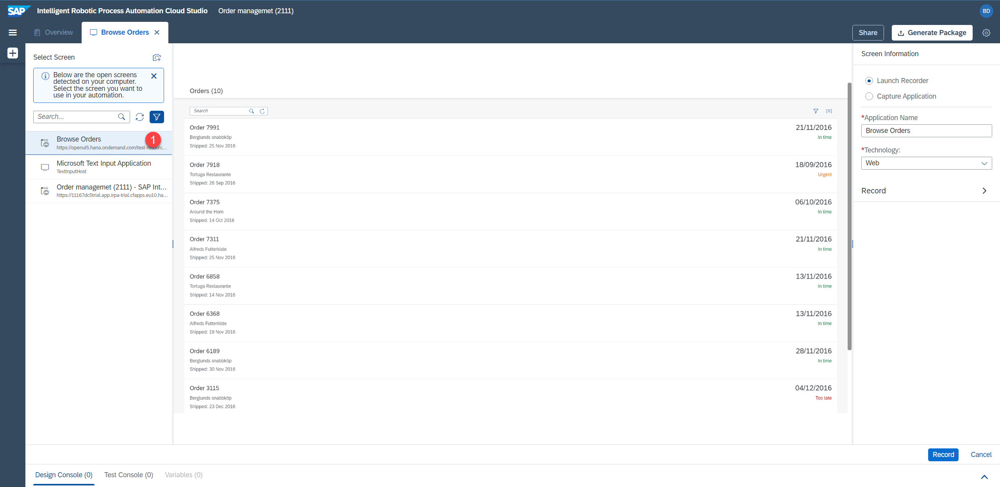
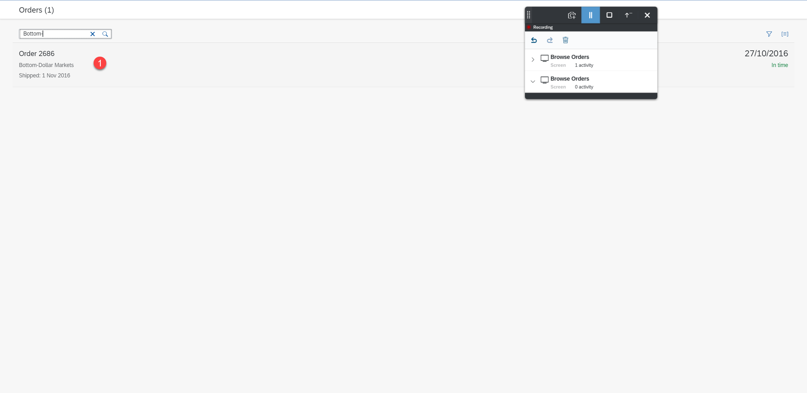

# Capture Orders Management SAP UI5 application using Recorder
<!-- description --> Use the recorder for SAPUI5 to capture  Order Management application(Orders and Product details)

## Prerequisites
- You have subscribed to the RPA service: [Subscribe to SAP Intelligent RPA Service in SAP BTP](irpa-setup-1-booster-subscription)
- You have installed the on-premise components: [SAP Intelligent RPA On-premise Installation](irpa-setup-2-onpremise-installation)

## You will learn
  - How to use the recorder for SAPUI5 to prepare screens for automation
  - How to use **Multi Dimensional Collection**

---

### Create Project

Create a new project for this specific automation.

1.  In the Cloud Factory, select **Projects**.

2.  Select **New Project**.

    <!-- border -->

3.  Type **Order Management** in the **Project name** field and click **Create**.

    <!-- border -->

4.  The project will automatically open in the Cloud Studio.

    <!-- border -->

### Screen Recording

Next, you define the application which will be used in your automation.

In this case you use a screen recorder because the application is a SAPUI5 application. You can use a screen recorder for all types of SAP GUIs (SAP GUI for Windows, SAP GUI for HTML, SAP UI5/Fiori). You will capture various screens and the elements on the web page.

You will use these screens and elements in the automation later.

### Create Application

1.  Make sure the [SAPUI5 application](https://openui5.hana.ondemand.com/test-resources/sap/m/demokit/orderbrowser/webapp/test/mockServer.html) is opened in a separate window, not just in a new tab. The Desktop Agent must be running and connected to the right tenant.

2.  In the Cloud Studio, click the **Create** button and then select the **Application** artifact from the artifact menu.

    <!-- border -->

3.  Select the screen named **Browse Orders**. This is your SAPUI5 application.

    <!-- border -->

    > **NOTE**: If the SAPUI5 application (step 1 - Create application) is not opened in a separate window, open it and click on the refresh icon to get the currently opened windows.

    <!-- border -->

4.  Click the **Record** button.

    <!-- border -->

5. The **Browse Orders** application opens and the recording controls appear.

    <!-- border -->

    > **NOTE**: If the window with recording controls is not fully visible, click and hold on the drag section (refer to the following screenshot) and move the window. Release the left mouse button to finish.

    <!-- border -->

### Record Application

Now, you record your first step.

1.  Click the **Record** button. Recording starts and your first screen is captured as shown in the following screenshot.

    <!-- border -->

2.  Click on the search box in the SAPUI5 application window, type **Bottom-** and click the **Search** button. **Order 2686** appears and the new step is displayed in the recorder window as shown in the following screenshot.

    <!-- border -->

3.  Now, click the **New screen capture** button.

    <!-- border -->

    You will see a second line is added to the recording steps.

    <!-- border -->

4.  Choose **Order 2686**.

    <!-- border -->

    After the click, your screen must look like the following screenshot:

    <!-- border -->

5. Click again the **New screen capture** button.

    <!-- border -->

    Your screen must look like the following screenshot:

    <!-- border -->

6.  Click the **Stop** button.

    <!-- border -->

7.  Click the **Export** button in the screen recorder window to finish the capturing activity.

    <!-- border -->

    Wait until the recording is saved. The Cloud Studio opens with the new automation.

    <!-- border -->

### Test Application

Now, you can test the automation. This step is optional however it is highly recommended to check whether the automation runs smoothly.

1.  Close the SAPUI5 application (in a separate window) and click the **Test** button.

    <!-- border -->

2.  Choose your environment and click the **Test** button.

    <!-- border -->

3.  Wait until the package is generated and all **SDK**s are downloaded. You will see that the SAPUI5 application opens in a separate window, all steps are executed and the window gets closed. Test results are shown on the screen.

    <!-- border -->

4.  Click the **Timeline** button to hide the test timeline panel.

    <!-- border -->

### Adjust First Screen

By using the recorder, you already captured three screens that you will use in your automation. Now, you define various elements on those screens. You will use these screens and elements in the automation later.

You do not have anything to declare for your first screen because the screen recording has already captured and defined everything. You only need to rename the screen to make it more meaningful.

1.  Open the **Browse Orders** application tab.

2.  Select **Capture 1** element and change the name to **Order List Screen** then press enter.

    <!-- border -->

### Adjust Second Screen

You rename the second screen from **Capture 2** to **Search Result Screen**.

<!-- border -->

Next, you rename elements on the second screen.

2.  Make sure the second screen you just renamed to **Search Result Screen** is selected.

3.  Choose **Order 2686**.

4.  Rename the element to **Order Found**.

    <!-- border -->

### Adjust Third Screen

Rename the last screen from **Capture 3** to **Order Details Screen**.

<!-- border -->

Now, you need to define some new element of the third screen that you will use in your automation to get the data from the screen.

### Order Number

1.  Select the third screen you just renamed to **Order Details Screen**.

2.  Choose the order number in the preview.

3.  Rename the element to **Order Number**.

4.  Don't choose **Declare Element** yet.

    <!-- border -->

    As you previously did, you are going to adjust the criteria.

5.  Choose the **Text** criteria.

6.  A popup opens. Change the **Operator** to **contains**.

7.  Change **Value** to **Order** with a space at the end.

8.  Click **Apply**.

    <!-- border -->

9.  Click **Declare Element**.

    <!-- border -->

### Price

1.  Make sure that the third screen, **Order Details Screen** is selected.

2.  Choose **Price** in the preview.

3.  Remove the **Text** criteria.

    <!-- border -->

4.  Add the **ID** of the element as criteria instead. This will uniquely identify the price.

    <!-- border -->

5.  Rename the element to **Price**.

6.  Make sure the correct **id** criterion is selected and click **Declare Element**.

    <!-- border -->

### Define Shipping Address on Third Screen

Now, you define the Shipping Address in a different way, as a collection of multiple elements.

1.  Choose the **Name** under shipping address in the preview.

    <!-- border -->

2.  Remove the **Text** criteria.

    <!-- border -->

3.  Select **class** as element.

    <!-- border -->

    With the SAP Intelligent RPA you can also see the underlying technical document structure of the page. You use this to select more precisely the element you would like to define.

4.  Click the **Both** tab on the top to show both the preview, as well as the technical DOM structure. Adjust the zoom (for example, to 50%) to be able to see the HTML elements and the screen.

5.  Choose the **Name** element of the Shipping Address. Select the **DIV** (the container), instead of the **SPAN**. This way, you will be able to connect it to the other elements of the address.

    <!-- border -->

6.  **DIV** is selected. Now, remove the **Text** criteria as it is too specific.

    <!-- border -->

7.  Add the **class** criteria instead.

    <!-- border -->

8.  Class is selected. Set the name to **Shipping Address**.

9.  Click **Declare Element**.

    <!-- border -->

    The element cannot be uniquely identified because multiple elements fulfil the same criteria. The SAP Intelligent RPA shows this in the warning status message in the **Declared Elements** section.

10. Create a collection of these multiple elements, by clicking the **Is a collection** button under **Declared Elements**, while **Shipping Address** is selected.

    <!-- border -->

    As a result, a collection is defined and the element is uniquely identified. The technical page structure shows that multiple elements are part of this collection (0, 1, 2, 3, 4).

    <!-- border -->

11. Don't forget to save the progress by choosing the **Save** button on the top right.

### Define Product Details(Line items) on Third Screen

>The automation displays product details, that is product name, unit price, quantity, and total amount of purchase order. You use **multiple collection** feature and retrieve the data.

1. Navigate to the **Order Details** screen.

2. Declare **TR** as an element and make sure you only have class as a recognition criterion.

3. Rename the declared element to **Table Row**.

    <!-- border -->

4.  Since **TR** is a collection, make it as a collection by clicking on the three dots.

5.  Select the **Set as collection** button.

6.  Click **Declare Element**.

    <!-- border -->

7.  Now, you see the **Table Row** element is added to the list of declared elements.

    <!-- border -->

    <!-- border -->    

    You need to retrieve that table data now, which is a cell.

9.  Select **TD**.

10. Remove **Text** and add class as a recognition criterion.

    <!-- border -->

    Since **TD** is also a collection, it must be set as a collection.

10. Rename the **TD** to **Table Data**.

11. Select **Set as collection**.

12. Click **Declare Element**.

    <!-- border -->

    You can see the one-dimension array added as of now. Since it is a collection, the **Table Data** is also a collection.

    <!-- border -->

13. Click on the three dots on **Table Row**, to recognize the Table Data as two-dimensional.

14. Click **Add to criteria**.

    <!-- border -->

    In the Element Information section, you can see that everything is added in the **Table Row**, and the **TD** is also marked as a two-dimensional array.

    <!-- border -->

15. Click **Save** to save your automation.

Nice! You have completed the capturing of the application and can now start creating the actual automation. You can also continue with the second part of this tutorial: [Support multi-level collection in an Order Management automation](irpa-order-management-int-2-automation)

---
