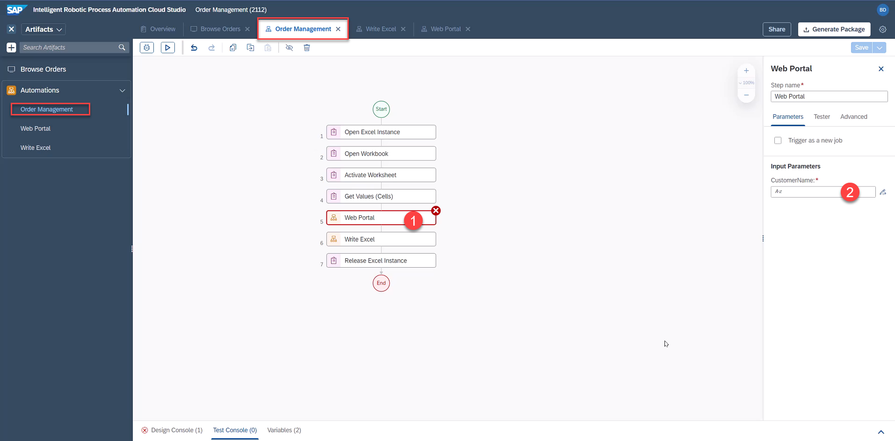
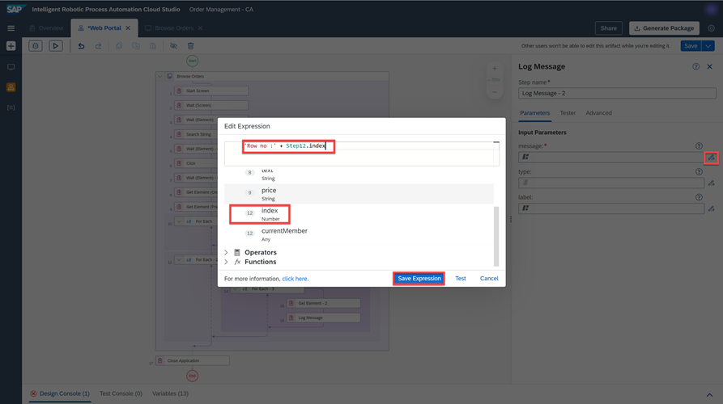

# Automate the extraction of Order Details in Order Management Application
<!-- description --> Automate the extraction of order details and product's details in Order Management application.

## Prerequisites
- You have completed the first exercise: [Capture Order Management Application Using the Recorder for SAPUI5](irpa-order-management-int-1-recorder)

## You will learn
  - How to build an SAP Intelligent RPA automation to extract data from an SAPUI5 screen.
  - How to get the header and line items data of a table.
  - How to use sub-automations.

## Intro
The screens and elements have been defined. You can now create the actual automation.

Think about what your bot should do. On a very high level it must:

- Open Excel and read out some data from there.
- Open a webpage and extract some other data from there, based on the data from Excel.
- Write the found data back into Excel.

---

### Define the Automations

> **NOTE**: You can reuse the automation **Browse Orders Automation** created by the screen recorder and modify it later.

For now, start by creating two additional automations: the main one (named **Order Management**) and the other one for Excel (named **Write Excel**).

1.  Make sure that the **Overview** tab is selected and then click the **Create** button and select the **Automation** artifact from the artifact menu.

    <!-- border -->

2.  Name the Automation: **Order Management** and click **Create**.

    <!-- border -->

    An empty automation is created.

3.  Go back to the **Overview** tab, create a new Automation and name it: **Write Excel**.

    Now you have three Automations:

    <!-- border -->

    You reuse your recorded automation **Browse Orders Automation** and rename it to **Web Portal**. You can also use it as a sub-automation to open the web portal and extract the needed data.

4.  Activate the **Browse Orders Automation** tab. If the tab is closed, go to **Overview** and open it.

5.  Go to the **Info** section of **Automation Details**.

6.  Change the **Name** of the automation to **Web Portal**.

7.  Click **Save**.

    <!-- border -->

### Generic Guide: Show and Hide Artifacts

To show artifacts click the following highlighted button:

To hide artifacts click the following highlighted button:

### Generic Guide: How to Add Automation Steps

You repeat this process multiple times to add new steps to the automation. Refer to the following steps.

1.  Make sure that the **Order Management** automation is selected (check tab).

2.  Click on the empty space within the preview to close all other opened options.

3.  Search for the activity in the search bar.

4.  If you can't find a step, click **clear filter** to show all available steps.

5.  Select the desired action and drag and drop it into the workflow.

   

   

### Main Automation: Order Management

Define the general structure of the automation. The following is the data that needs to be retrieved from excel:

1.  First, open Excel. Add the **Open Excel Instance** activity to the automation.

    <!-- border -->

2.  You want to open the correct workbook. Add the **Open Workbook** activity.

    <!-- border -->

    In the **Input Parameters** on the right, fill the `workbookPath` field with the path to the file and select the proposed string.

    <!-- border -->

    Or you can edit the expression and enter the full path to your file. Make sure the path is within quotation marks **"..."**. For example: `"C:\Users\Public\saprpa\Demo_Procurement.xlsx"**`

    <!-- border -->

3.  Now, you must open a specific worksheet. Add the **Activate Worksheet** activity.

    <!-- border -->

4.  Set `worksheetName` field to **Overview**.

    <!-- border -->

5.  Finally, you must get a value from a cell.

    - Add the **Get Values (Cells)** activity
    - Set `rangeDefinition` field to `B1`
    - Rename **Output Parameters** to `supplierName`

    <!-- border -->

    So far you read Excel Cell B1 and saved the result in a variable called `supplierName`.

    <!-- border -->

6.  Add **Web Portal** and **Write Excel** sub-automations. They just act as placeholders.

    <!-- border -->

7.  At the end you must make sure that Excel is not used by the SAP Intelligent RPA anymore. Therefore, you add the **Release Excel Instance** activity to release the instance.

    <!-- border -->

8. Click **Save**.

    Now, you check how the bot works and if the automation has any mistakes.

9.  Click the **Test** button.

<!-- border -->

10. Save all changes when prompted.

<!-- border -->

10. Select your environment and click **Test**.

<!-- border -->

It takes a while for the desktop agent to download, process and run the automation. The following messages are displayed:

<!-- border -->

<!-- border -->

<!-- border -->

Once the automation is completed, you can see the debug screen (Tester). Here, you can either check the output of the **Test Console** or click on single steps in the automation to see the details on the right side.

For instance, click on the **Get Values (Cells)** step and you can see the correct output value on the right **Bottom-Dollar Markets**. The automation ran correctly.

<!-- border -->

> **NOTE**: Please don't forget to close both excel, as well as the SAPUI5 application each time you test the automation.

### Web Portal Automaton: Search for Order Number

The Recorder created an automation that you renamed to **Web Portal**. On a high level, refer to the following steps:

  - Enter supplier name in the search box and search.
  - Click on the result.
  - This will open the details of the order.

Now, you must modify the recorded automation and enhance it. You must make sure that your bot saves all the relevant information which you will later write into Excel.

1.  Open the **Web Portal** automation, either on the left menu or on the tab on the top.

    <!-- border -->

2.  Click on the **Start Screen** step. There is no need to modify anything however if you want, here you can change the default web browser application. Select only chromium web browsers (Chrome or Microsoft Edge).

    <!-- border -->

3.  Click on the **Browse Orders** and Click **Define Screen Activities**.

    <!-- border -->

4. To make your automation more robust, you must be sure that the screen is fully loaded.
   Search for the **Wait (Screen)** activity, and drag and drop it after the **Start Screen** activity. The SAP Intelligent RPA will wait until the screen is fully loaded.

    <!-- border -->

    <!-- border -->

5.  Additionally, The SAP Intelligent RPA must wait to ensure that the search box loads as well. Search for the **Wait (Element)** activity.
   You have two options on how to add it to your automation. Check them and apply the one you prefer.

**OPTION 1**: Drag and drop the **Wait (Element)** activity on the search box. Make sure the cursor changes to **+** before releasing. The step is added as the last one. Move it just after the **Wait (Screen)** step.

<!-- border -->

<!-- border -->

<!-- border -->

**OPTION 2**: Drag and drop the **Wait (Element)** activity after the **Wait (Screen)** step.

<!-- border -->

Click on the **Target** editor.

<!-- border -->

Select the `SearchField` element and click **Confirm**.

<!-- border -->

### Input Parameter

In the **Set Element (SAPUI5 Recorder)** step, you search for the supplier name. You recorded a fixed value and now, you must modify the automation in such a way that you search for a value defined in Excel.

But how to get the name of the supplier from Excel? It's not available in the **Web Portal** sub-automation yet. That variable is only available in the main **Order Management** automation. But you can pass the variable to the sub-automation using **Parameters**.

1.  First, rename the automation label from **Set Element (SAPUI5 Recorder)** to **Search String**.

    <!-- border -->

2.  Click on an empty space to change the settings of the automation. Click the **Input/Output** tab and then click **Add new input parameter**.

    <!-- border -->

3.  Create an input parameter named `CustomerName`.

    Make sure that the type is **String**. Click on an empty space (or press **Enter**).

    <!-- border -->

4.   Go, back to the **Search String** step, delete the old value and select the `CustomerName` variable, which is the input parameter passed to the sub-automation.

    <!-- border -->

    Click **Save**.

    However, the value still hasn't been passed from the main automation. To do that:

5.   Go to the main automation either from the left side or from the tabs at the top. Select the **Web Portal** step and set the `CustomerName` field to `supplierName`.

    <!-- border -->

    <!-- border -->

    <!-- border -->

6.   Click **Save**.

### Web Portal Automation: Get Order Info

Next, make sure that your search results are loaded before you continue with your automation.

1.  Add the **Wait (Element)** activity just after the **Search String** step.

    <!-- border -->

2.  Click **Target** and select the `OrderFound` element.

    <!-- border -->

3.  The SAP Intelligent RPA should wait for the details screen to open and load. Add a **Wait (Element)** step.

    <!-- border -->

4.  Click **Target** and select the **Price** element.

    <!-- border -->

5.  Save the Order Number in a variable. Click on the **Get Element** step.

    <!-- border -->

6.  Set the target to **Order Number** element.

    <!-- border -->

7.  Rename the output parameter field to `orderNumber`.

    <!-- border -->

8.  You can test now. If you go to the main automation (tab **Order Management**) and start test, you must select an environment. Don't forget to close excel.

    If you remain in the Web Portal tab, you must enter `CustomerName` because you will only test this automation and value will not be fetched from Excel (enter search value: **Bottom-**).

    In both cases, you will see that the received get element value is **Order 2686**.

    <!-- border -->

9.  Next, get the **Price** element and save it in the **price** variable.

    <!-- border -->

10. If you run a test again you can check the value.

    <!-- border -->

    > **NOTE**: You can also rename these two **Get Element** activities to more meaningful names (for example, **Get Element (price)** and  **Get Element (order number)**).

### Web Portal Automation: Get Shipping Address and Line Items Information Using Multi-level Collection

1. Use the **Get Element** activity for the **Shipping Address** table. Drag and drop the activity on the table.

2. Select **ITEM: Shipping Address** and **INDEX: all**.

    <!-- border -->

    The shipping address is nested so a "For Each" loop has been automatically created.

    <!-- border -->

3. Click on the **Get Element** activity and define the **Output Parameters** field to **array**.

4. Click **Save**.

    <!-- border -->

5. Use the **Get Element** activity for the **Line Items** fable. Drag and drop the activity on the Table Data.

6. Select **ITEM: Table Data** and **INDEX: all**.

    <!-- border -->

    The Table Data is **Two-Dimensional**, hence **two** "For Each" loop has been automatically created.

    <!-- border -->

7. Click on the **Get Element** activity and define the **Output Parameters** field to `TableCellData`.

8. Click **Save**.

    <!-- border -->

    Use the **Log Message** activity to display the values of each element.

9. Search for the **Log Message** activity and drag and drop into the workflow after the **Get Element** step of the **For Each - 3** loop

    <!-- border -->

10. Click on the **Log Message** activity and select `TableCellData` in the **message** field.

11. Click **Save**.

    <!-- border -->

12. Add another **Log Message** activity to display the value of the row number. Drag and drop it after the **For Each - 2** loop.

    <!-- border -->

13. Click on the **Log Message** activity, and click the expression editor button for the **Input Parameters** message.

14. Edit the expression to **'Row no :' + Step12.index**.

    > **NOTE**: Step number 12 is the first for loop to display the row count.

    <!-- border -->

15. Click **Save** and test the automation. As you can see in the **Test Console**, all the product information, product name, unit price, quantity, and total amount are displayed cell by cell.

    <!-- border -->

### Create Data Types for Shipping Address and Line Item

The name, address, zip and so on from the shipping address are currently stored in an array. You can add better structure to that by using **Data Types** from the SAP Intelligent RPA. These data types can store multiple variables and named fields to represent more complex data structures. Create two data types: one for a shipping address and another for a line item.

**Save** the automation you have so far. Go to **Overview** tab.

1.  Click **Create** > **Data Type**.

    <!-- border -->

2.  Name the data type **Line Item** and click **Create**.

    <!-- border -->

3.  Repeat the same steps to create another data type named **Shipping Address**.

    <!-- border -->

4.  Now, go back to the **Line Item** data type, create a new field by clicking on the **New Field**

    <!-- border -->

5.  Adjust the field properties to name **Product** and type **String**.

    <!-- border -->

6.  Repeat the steps to create the other fields: `UnitPrice`, `Quantity`, `Total`. All of these are type **String**.

    <!-- border -->

7.  Repeat same steps to create fields inside the **Shipping Address** datatype: **Name**, **Street**, **ZIP**, **Region**, **Country**. All of these are type **String**.

    <!-- border -->

8.  Click **Save** to save both data types.

### Add Shipping Address Data Type in Web Portal Automation

1.  Go back to the **Web Portal** automation and drag and drop the **Shipping Address** data type just after the **Get Element (Price)** step.

    <!-- border -->

2.  Define the **Output Parameters** field to `shippingAddress`.

    <!-- border -->

3.  Select the **Input Parameters** value to **Create Custom Data**.

    <!-- border -->

    <!-- border -->

4.  Drag a **Condition** step and drop it under **Get Element** step.

    <!-- border -->

5.  Select the **Condition** step and click **Edit Formula**.

    <!-- border -->

6.  In the Expression Editor, type **Step11.index === 0** and click **Save Expression**.

    <!-- border -->

7.  Click **Add Condition** and type the following formula in the **Expression Editor**:
**Step11.index === 1**

8.  Similarly, add three other Conditions and enter the following formulas in the **Expression Editor**:
    - **Step11.index === 2**
    - **Step11.index === 3**
    - **Step11.index === 4**

    The automation will look like this:

    <!-- border -->

9.  Now, drag a **Set Variable Value** activity and drop it below the first condition.

    <!-- border -->

10. Click on the **Set Variable Value** activity and change the step name to **Set Variable Name**.

11. Select the **variable** field value to `shippingAddress`.

12. Select the **value** field value to **Custom Data**.

13. Select the **Name** field value to **array**.

    <!-- border -->

14. Drag a **Set Variable Value** activity and drop it under each Condition.

15. Repeat steps 10-13 with the below information :

|  Field Name     | Value
|  :------------- | :-------------
|  Step Name           | **Set Variable Street**
|  variable          | `shippingAddress`
|  value    | **Street: array**

|  Field Name     | Value
|  :------------- | :-------------
|  Step Name           | **Set Variable Zip**
|  variable          | `shippingAddress`
|  value    | **Zip: array**

|  Field Name     | Value
|  :------------- | :-------------
|  Step Name           | **Set Variable Region**
|  variable          | `shippingAddress`
|  value    | **Region: array**

|  Field Name     | Value
|  :------------- | :-------------
|  Step Name           | **Set Variable Country**
|  variable          | `shippingAddress`
|  value    | **Country: array**

  <!-- border -->

### Add Line Item Data Type in Web Portal Automation

Start by creating a variable which will contain multiple line items.

1.  Add the **Line Item** data type after the **For Each** loop.

2.  Make sure to check the **list** option and define the **Output Parameters** field to `lineItems`.

    <!-- border -->

3. Now add a **Line Item** data type inside the **For Each - 2** loop.

4. Select the **Input Parameters** value to **Create Custom Data**.

5. Set the **Output Parameters** field to `lineItem`.

    <!-- border -->

6. Drag an **Add Item (List)** activity and drop it as well in the **For Each - 2** loop, after **Log Message** activity.

    <!-- border -->

7. Select the **Add Item (List)** activity and select the `list` field value to `lineItems` and `itemToAdd` field value to `lineItem`.

    <!-- border -->

8. Drag and drop a **Condition** step in the **For Each - 3** loop after **Get Element** activity.

    <!-- border -->

9. Add four Conditions with the following **Condition Expression**:

    - **Step24.index === 0**
    - **Step24.index === 1**
    - **Step24.index === 2**
    - **Step24.index === 3**

    <!-- border -->

10. Now, drag and drop a **Set Variable Value** activity for each Condition.

    <!-- border -->

11. Click on the **Set Variable Value** activity and change the step name to **Set Variable Product**.

12. Select the **variable** field value to `lineItem`.

13. Select the **value** field value to **Custom Data** value.

14. Select the **Product** field value to `TableCellData`.

    <!-- border -->

Repeat steps 10-13 with the following information :

|  Field Name     | Value
|  :------------- | :-------------
|  Step Name           | **Set Variable Unit Price**
|  variable          | `lineItem`
|  value    | Unit Price: `TableCellData`

|  Field Name     | Value
|  :------------- | :-------------
|  Step Name           | **Set Variable Quantity**
|  variable          | `lineItem`
|  value    | Quantity: `TableCellData`

|  Field Name     | Value
|  :------------- | :-------------
|  Step Name           | **Set Variable Total**
|  variable          | `lineItem`
|  value    | Total: `TableCellData`

<!-- border -->

### Input/Output Parameters

Now, you have to pass data between sub-automation. You can do this by using input and output parameters.

The web automation will get the partner name from the main automation and return the order number, price, shipping info and line item details. This data will in turn be passed to the excel automation.

1.  Select the **Web Portal** automation. Click anywhere on the grey area to open the automation parameters.

2.  Make sure that an input parameter called `CustomerName` of type **string** is defined.

    <!-- border -->

3. Create output parameters and make sure that the **List** box is checked for Line Item parameter.

    | Name        | Type           | List  |
    | ------------- |-------------| -----|
    | `orderNumber`     | String | no |
    | `price`     | String      |   no |
    | `shippingAddress` | Shipping Address      |    no |
    | `lineItems` | Line Item      |    yes |

    <!-- border -->

4.  Now, you define which variables will be returned. Click on **End** step, select **Parameters** and select the respective variables for outputs.

    <!-- border -->

5.  Click **Save** to save the automation.

### Write Excel Automation - First Worksheet

Now, you must automate the Excel part. You have collected the data from the SAPUI5 application. You must insert the data back into Excel. You will do this in the **Write Excel** sub-automation.

The following is the expected result:

   <!-- border -->

   <!-- border -->

1. Switch to the **Write Excel** automation. Start by adding input parameters, which you received from the **Web Portal** sub-automation.

    <!-- border -->

2.  Add the same input parameters as the output parameters you added in the web automation.

    | Name        | Type           | List  |
    | ------------- |-------------| -----|
    | `orderNumber`      | String | no |
    | `price`     | String      |   no |
    | `shippingAddress` | Shipping Address      |    no |
    | `lineItems` | Line Item      |    yes |

    <!-- border -->

    <!-- border -->

    <!-- border -->

    You can further enhance the bot by setting all the product details in the Excel. Use the **Set Values** activity of Excel to set the values in the Excel.

3.  Use the **Set Values (Cells)** activity to write data into a specific cell. Drag and drop the activity into the workflow of the automation.

    <!-- border -->

4.  Click on the **Set Values (Cells)** activity, change the name to **Set Cell (Order Number)** and set the `rangeDefintion` field value to `B2` and `values` field value to `orderNumber`.

    <!-- border -->

5.  Duplicate this step (right click on **Set Values (Cells)**).

    <!-- border -->

6.  Change the name to **Set Cell (Price)** and set `rangeDefinition` field value to `B3` and `values` field value to `price`.

    <!-- border -->

7.  Duplicate this step (right click on **Set Cell (Price)**).

8.  Change name to **Set Cell (Name)** and set `rangeDefinition` field value to `B4`.

9.  Change the **values** using the expression editor, to get the value inside the data type.

    <!-- border -->

10. Write **Step0.shippingAddress.Name** in the **Expression Editor**.

    >**NOTE**: **Step0** contains the input parameters.

    <!-- border -->

7.  Duplicate the steps to save time and adjust the parameters according to the following table:

    | `rangeDefinition`        | **values**          |
    | ------------- |-------------|
    | `B2` | `orderNumber` |
    | `B3` | price     |
    | `B4` | Step0.shippingAddress.Name      |
    | `B5` | Step0.shippingAddress.Street      |
    | `B6` | Step0.shippingAddress.ZIP      |
    | `B7` | Step0.shippingAddress.Region      |
    | `B8` | Step0.shippingAddress.Country      |

    <!-- border -->

### Write Excel Automation - Second Worksheet

Now, you add a second worksheet for the line item details.

Desired result:

<!-- border -->

1.  Drag and drop an **Activate Worksheet** activity and configure `worksheetName` field value to **Details**.

2. Click **Save**.

    This action will switch to the second worksheet with the order details.

    <!-- border -->

3.  Add a **For Each** control to loop through the order line items. The **looping list** is `lineItems`.

    <!-- border -->

4.  Drag and drop a **Set Values (Cells)** activity inside the loop.

    <!-- border -->

5.  The data cells start at row **2**, the index starts at **0**, so use the following formula in the `rangeDefintion` field to determine the correct cell:

    **"A" + (Step9.index + 2)**

    For the Values parameter, set the `values` field value to:

    **Step9.currentMember.Product**

    > **NOTE**: Make sure that you use the **Edit Expression** to enter formulas in `rangeDefinitio`. The text should be in blue color, not black!

    <!-- border -->

6.  Duplicate and repeat for **Unit Price**, with column `B` instead.

    <!-- border -->

7.  Duplicate and repeat for **Quantity**, with column `C` instead.

    <!-- border -->

8.  Duplicate and repeat for **Total**, with column `D` instead.

    <!-- border -->

9.  Save all automations.

### Adding the headers

1. To add the headers : drag four **Set Values (Cells)** activities and drop them into the workflow after **Activate Worksheet**.

2. Adjust the parameters according to the following table:

    | `rangeDefinition`       | **values**          |
    | ------------- |-------------|
    | `A1` | Product |
    | `B1` | Price     |
    | `C1` | Quantity     |
    | `D1` | Total      |

    <!-- border -->

### End

1. Within the main automation **Order Management**, you pass the outputs from **Web Portal** into the inputs of **Write Excel**

    <!-- border -->

2. Make sure that output parameters are defined for both sub-automation as displayed in the following screenshots:

    <!-- border -->

    <!-- border -->

3.  Now, you can test the automation. You must see the following results:

   <!-- border -->

   <!-- border -->

Congratulations! You have now completed this tutorial that read complex data from a website and stored it into an Excel file with two Worksheets.

