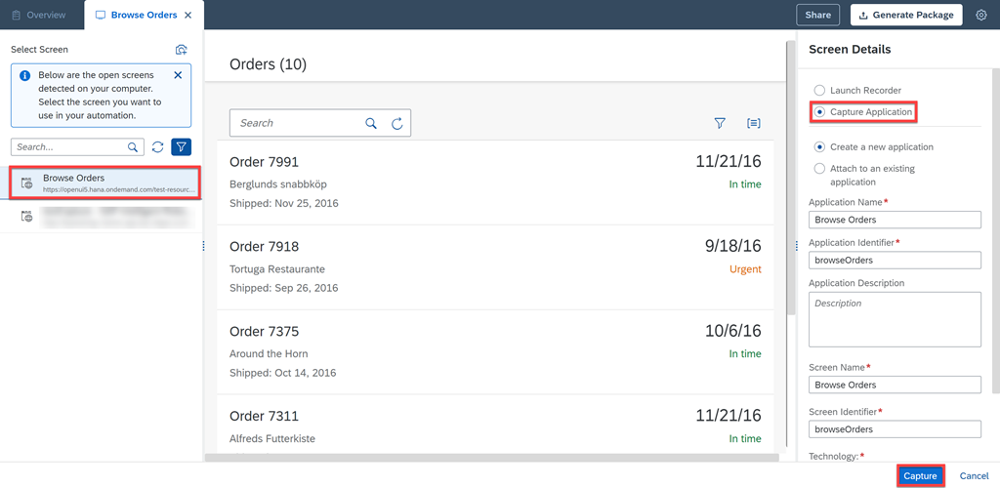
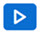

# Capture Orders Management Web Application
<!-- description --> You will capture Orders Management application using SAP Intelligent Robotic Process Automation (RPA).

## Prerequisites
- [Subscribe to SAP Intelligent RPA Service in SAP BTP](irpa-setup-1-booster-subscription)
- [Install SAP Intelligent RPA On-Premise Components](irpa-setup-2-onpremise-installation)
- You have the Desktop Agent installed and connected to SAP Intelligent RPA Cloud Factory
- You have enabled SAP Intelligent RPA Browser extension

## You will learn
  - How to capture a web application
  - How to test an application using Application Tester

---

### Open application to automate

In a separate browser window, open the application you will automate by choosing the link [Browse Orders](https://openui5.hana.ondemand.com/test-resources/sap/m/demokit/orderbrowser/webapp/test/mockServer.html).

> Make sure to open the application in its own window.

<!-- border -->

### Create new project

1. In a new browser window, go to SAP Intelligent RPA Cloud Factory.

2. Choose the **Projects** tab.

    <!-- border -->

3. Choose **New Project**.

4. In the **New Project** popup, enter the following information:

    |  Field Name     | Value
    |  :------------- | :-------------
    |  Name           | **`Orders Management`**
    |  Description    | **`A project to manage orders`**

5. Choose **Create**.

    <!-- border -->

The project opens in a new tab in Cloud Studio.

### Create application artifact

Choose **Create** and select **Application**.

> Alternatively, you can choose to click <!-- border -->. Hover on **Create** and then, select **Application**.

<!-- border -->

A new tab will open. The system starts detecting the applications and their screens currently running on your local machine. You'll see a list of screens in the **Picker panel** on the left.

In the next step, you will select the orders application you already opened.

<!-- border -->

> ### What's going on?
To automate a web application, you need to: capture, declare and test the application, screens, and UI elements.

> You will capture the application and its screens. Then, declare the screens and the elements within the screens that will be part of the automation. Finally, test the application to make sure all the applications, screens and elements are getting recognized.

> This is an important step to make sure that the system knows which application to work on, which screen to open and which element to select.

### Capture application to automate

> The artifact of type Application lets you capture an application and its screens for use in automations. Capturing means identifying the applications you want to control in an automation.

1. In the **Untitled** new application tab, select the **Filter** icon. A **Filter running screens** pop-up opens, select **Web** as Technology. Choose Filter.

    <!-- border -->

2. Choose the `Browse Orders` application.

3. Select **Capture Application** and then **Capture** to start capturing the application. It will take a few seconds.

    <!-- border -->

4. The captured application is visible under the **Declared Application** section.

    <!-- border -->

### Declare screens

> To declare an application, you need to set recognition criteria -- which identifies the application, screens and UI elements correctly when your automation runs.

1. Choose the **URL** (below) in the **Captured Data** to add them to **Recognition Criteria** section .

     Modify the criterion of URL as below and choose **Apply**.

     - **Property** `URL`
     - **Operator** `contains`
     - **URL** `https://openui5.hana.ondemand.com/test-resources/sap/m/demokit/orderbrowser/webapp/test/mockServer.html`

       

2. Save your changes.

    The Recognition Criteria should look like this:

    <!-- border -->

### Declare screen elements

1. Choose the first order number (here, **Order 7991**) to select. A green or red border will appear around the selected element.

    You can take help from the **Both** view to drill-down to the specific element.

    <!-- border -->

2. In the **Element Information** panel, enter `Order Number` for the name of the element. The **Identifier** and **Element** are automatically detected.

    <!-- border -->

3. Remove any already existing criterion by choosing the **X**.

4. In **Captured Data**, choose the data below to add them to the criteria. The selected data is then automatically added as a criterion in **Recognition Criteria**.

    -	**class equals `sapMTextMaxLine sapMTextLineClamp`**

5. Choose **Declare Element**.

    <!-- border -->

6. From the **Declared Elements** area, choose the **Is a collection** button &nbsp; <!-- border --> &nbsp; to convert the **Order Number** element into a collection of elements. Your screen should look like this:

    <!-- border -->

7. Repeat steps 2-6 to further declare the element **Status**. Use the below criteria to declare:

     - class equals `sapMObjStatusText`

     Make sure to declare the status as **Collection**.

    <!-- border -->

8. Save your work.

### Test the application

> The purpose of testing an application before using it in an automation is to ensure that you have declared all of the elements correctly so that at runtime, they are correctly identified and can be controlled as intended. The application can be tested using **Application Tester**.

1. To test your application, choose **Test** 

2. Select an environment in the **Test Application** dialog box.

3. Choose **Test**.

    <!-- border -->

    The system launches the **Application Tester**.

    <!-- border -->

    The applications declared in your project are displayed in **Declared Applications**.

4. Choose the arrow next to the declared application to unfold the screen(s) to test.

5. Select the screen to test.

    The elements getting successfully recognized will appear in **green**. If the declared application or screen or element is not recognized, you will see them in **red**.

    The declared elements found on the selected screen are listed in the **Declared Elements** section. Choose the arrow next to a declared element to display its collection.

    <!-- border -->

6. To test the elements select the element `Order Number(0)` from the list.

7. Select **Get Element** activity.

8. Choose **Execute**.

    The result can be seen in **Output parameters** as **Order 7991**. This way you can test that the elements are getting recognized correctly.

    <!-- border -->

Congratulations! You have successfully captured and declared the application for orders management.

In next tutorial, you will learn how to build an automation with this captured application to automate the orders management process.

---
