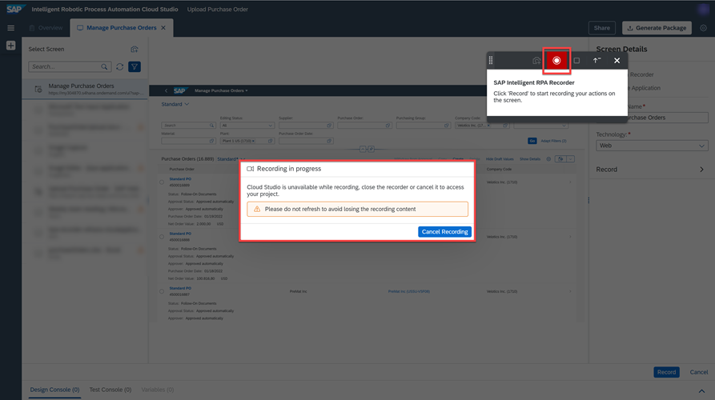
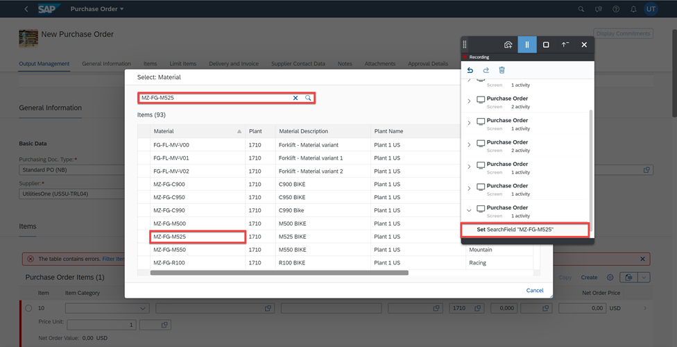
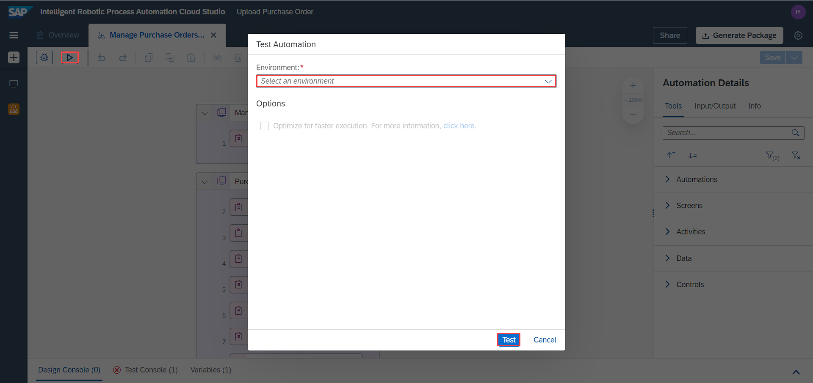

# Automate  SAP S/4 HANA Cloud Applications using SAP UI5 Recorder
<!-- description --> Automate the process of creating a purchase order in Manage Purchase Orders Application in SAP S/4 HANA Cloud.

## Prerequisites
 - [Subscribe to SAP Intelligent RPA Service in SAP BTP](irpa-setup-1-booster-subscription)
 - [Install SAP Intelligent RPA On-Premise Components](irpa-setup-2-onpremise-installation)
 - Register  to [SAP S/4 HANA Cloud Trial](https://www.sap.com/germany/products/s4hana-erp/trial.html) Account
 - Manage Purchase Orders application must run in the background

## You will learn
  - How to use the SAP UI5 Recorder
  - How to automate applications in SAP S/4 HANA Cloud

### Open Manage Purchase Orders Application

1.  Navigate to **SAP S/4 HANA Cloud Trial account.**

2.  Search for **Manage Purchase Orders**.

3.  Select the tile **Manage Purchase Orders**. This will open the **Manage Purchase Orders** application.

    <!-- border -->

### Create your project

1.  In the **Cloud Factory**,  click the **Projects** .

2.  Choose **New Project**.

3.  A window appears, type **Upload Purchase Order** in the **Project name** field.

4.  Click **Create**.

    <!-- border -->

### Create your application

> Before recording the steps of a workflow, ensure that the Manage Purchase Orders application and the Cloud Studio are running in a Chrome browser in two separate windows.

Open the **Manage Purchase Orders** application in your SAP S/4 HANA Cloud Trial Account.

1.  In the **Cloud Studio**, click the **Create** button.

2.  From the artifact menu, select the **Application** artifact.

    <!-- border -->

    > ### What is going on?
    >The Cloud Studio starts detecting the applications and their screens currently running on your local machine. When it's done, you'll see a list of screens in the picker panel on the left.

3.  Select the **Manage Purchase Orders** screen.

4.  Select **Launch Recorder**.

5.  Click the **Record** button.

    <!-- border -->

### Record your application

This step involves recording the setting of the values for  **Supplier**, **Purchasing Organization** and **Purchasing Group**.

|  Field Name     | Value
|  :------------- | :-------------
|  Supplier           | **`USSU-TRL04`**
|  Purchasing Organization           | **`1710`**
|  Purchasing Group    | **`Z10`**

>When you click the **Record** button the **Cloud Studio** is locked and you will be directed to the application you want to record. **Recording in progress** pop-up message is displayed.

<!-- border -->

1.  To start the recording, click the recorder  button. The recorder will capture the screen. You can see it in the **Activities** list.

2.  Click the **Create** button on the page.

    <!-- border -->

3.  The activity is added.

4.  The recorder will detect a change of screen. Click the capture  button to record it.

    > ### What is going on?
    >The Recorder captures the first screen of an application automatically and  the following screens must be captured manually by clicking the capture  button. Then the actions you perform on that screen will be recorded automatically.

    <!-- border -->

    >**CAUTION:** While recording, if a new screen appears or if there is a change in the UI, you must first click the button manually. You can then perform the actions in the application screens. This is applicable across the workflow recording.

    The recorder will add the new screen with the new purchase order that needs to be created. Now you need to set the values for **Supplier**, **Purchasing Organization** and **Purchasing Group**.

5.  In the **Supplier** input field, click the **Show Value Help** icon.

    <!-- border -->

6.  A change of screen is detected, click the capture  button.
    > ### What is going on?
    >Whenever a new screen appears or if there is a change in the UI, the Recorder detects the screen change in most of the cases and displays a hint message. This gives you a hint to capture a screen manually by clicking the Capture button .
    The hint message disappears when you click the capture button or perform any action on the screen.

    <!-- border -->

7.  Search for the **Supplier ID**: `USSU-TRL04` in the search field and hit enter.

8.  Select the **Supplier**: `USSU-TRL04`.

    <!-- border -->

9.  A change of screen is detected, click the capture  button.

10.  Upon selecting the **Supplier ID**, the **Purchasing Organization** input fills itself with the correct value automatically.

    <!-- border -->

11.  Now you can repeat the above steps for **Purchasing Group**: `Z10`.

### Record your application - Material Details

This step involves recording the setting of the values for  **Material Details** in a table.

|  Field Name     | Value
|  :------------- | :-------------
|  Material          | **`MZ-FG-M525`**
|  Order Quantity          | **`200`**
|  Order Price    | **`9000`**

1.  Click **Create**.

    <!-- border -->

    A new empty table row is created. The screen must be captured manually.

2.  Click the capture  button manually.

    >**CAUTION:** In this case, a new table row is created on the screen so you need to capture the screen before entering values into the input boxes of the table row. The recorder will not detect this kind of screen change. As a [Best Practice](https://help.sap.com/viewer/8e71b41b9ea043c8bccee01a10d6ba72/Cloud/en-US/72dbaf3a07c54e579a925e03f4e9711f.html) you must click the capture  button whenever there is a change in the screen or UI.

3.  In the **Material** input field, click the **Show Value Help** icon.

    <!-- border -->

4.  A change of screen is detected, choose the capture  button.

    <!-- border -->

5.  Search for the **Material**: `MZ-FG-M525` in the search field and hit enter.

6.  Select the **Material**: `MZ-FG-M525`.

    <!-- border -->

7.  A change of screen is detected, click the capture  button.

    <!-- border -->

8.  Set **Order Quantity** to `200`.

9.  Set **Net Order Price** to `9000`.

    <!-- border -->

10.  Click **Create**.

    <!-- border -->

### Export the recording

    >Once you have completed entering the data in the application screens, you can stop recording. Click the button to stop the recording. After you stop the recording, by default, the **Export** button is displayed.

1.  Click the stop  button to stop the recording.

2.  To export the recorded steps to the **Cloud Studio**, choose the **Export** button.

    >**CAUTION:** Before you start exporting the recording to the Cloud Studio, check if the Cloud Studio has not timed out. If it is timed out, you must re-login (do not refresh) to the Cloud Studio and then export the recording.

      <!-- border -->

### Review the Application and Automation

>After successful processing, the recorder widget will be closed. You will be redirected to the Cloud Studio and the confirmation message, **Recording successfully exported** is displayed.

The application `Manage Purchase Orders` and the automation `Manage Purchase Order Autom` are successfully exported.

<!-- border -->

You will find the Declared Application in the **Cloud Studio**. You can view the recorded screens under **Declared Application** and the recorded elements under **Declared Elements**. If required, you can manually edit the screens to add or remove objects.

<!-- border -->

All the recorded steps will be displayed in the automation designer of the **Cloud Studio**.
You can then edit the automation to update the Step Details.

<!-- border -->

> As per your requirement, you can even record  the Step 1 : Open Manage Purchase Orders Application

### Test your automation

1.  Click on **Test**.

2.  Select your **Environment**.

3.  Choose **Test**.

    

  **Manages Purchase Order Application** is opened in a browser window and creates the purchase order with values provided in the steps of the Automation.

---
