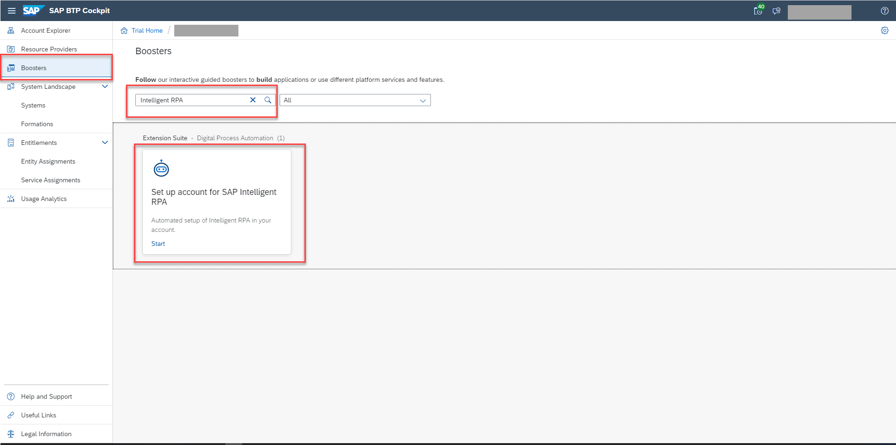
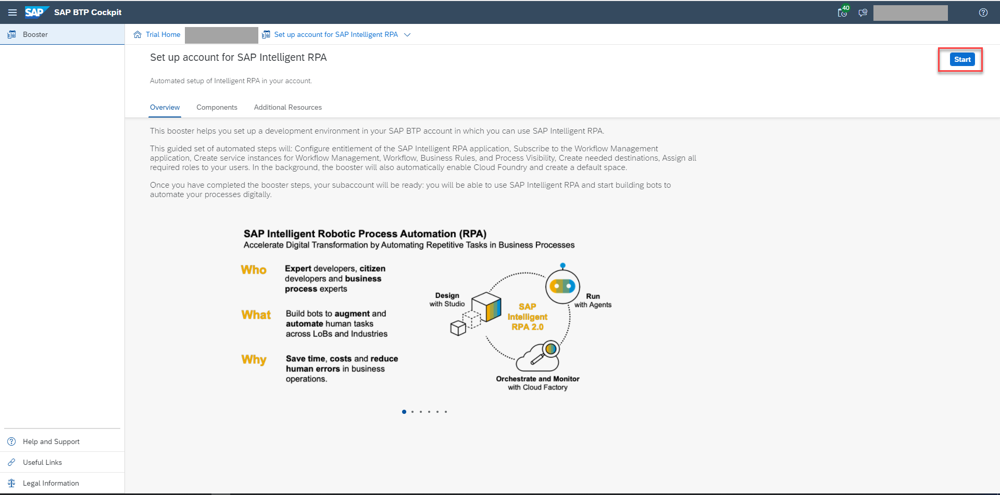
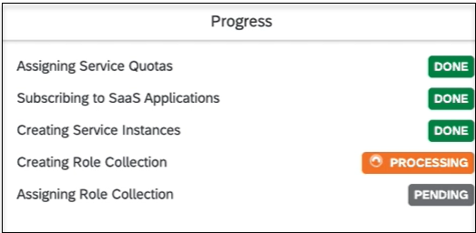
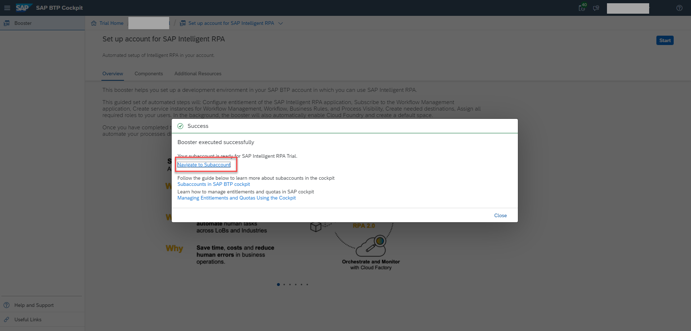
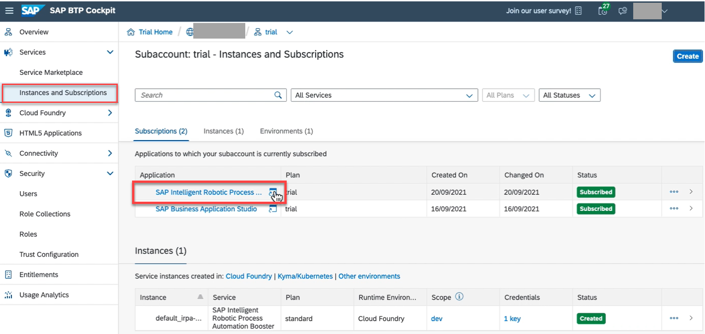
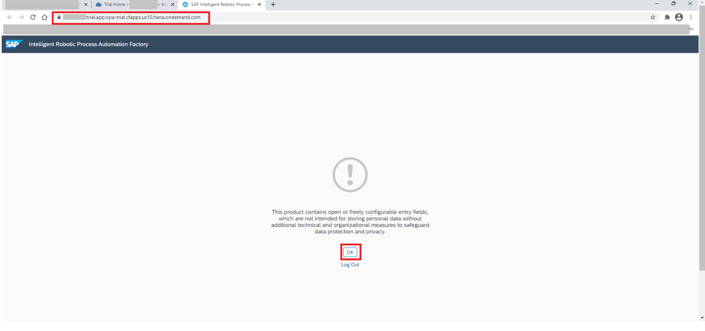

# Subscribe to SAP Intelligent RPA Service in SAP BTP
<!-- description --> Subscribe to SAP Intelligent RPA on SAP Business Technology Platform so that you can build an automation to automate repeated tasks.

> **IMPORTANT:** [The SAP BTP trial offering will no longer be available as of January 31st, 2023](https://blogs.sap.com/2023/01/09/trial-accounts-retirement-of-sap-intelligent-rpa-end-of-january-2023-and-the-move-forward/). Please move to an SAP Free Tier account and subscribe to SAP Process Automation.
Refer to the tutorial on [How to create a BTP Free tier account and subscribe to SAP Build Process Automation](https://developers.sap.com/tutorials/spa-subscribe-booster.html).
Most of the content remains relevant after moving to SAP Build Process Automation, with broad feature parity and only a few changes.
SAP Intelligent RPA production account users can continue with the other SAP Intelligent RPA developer tutorials without any further changes.

## Prerequisites
- You have [Set Up an SAP BTP Account for Tutorials](group.btp-setup) on trial.

## You will learn
- How to subscribe to the SAP Intelligent RPA Service

---

### Run the SAP Intelligent RPA booster

1. In the navigation area of the SAP BTP Cockpit, choose **Boosters** and search for **SAP Intelligent RPA**.

    <!-- border -->

2. Select the SAP Intelligent RPA Booster to open the **Overview** page.

3. Choose **Start**.

    <!-- border -->

    > SAP Intelligent RPA has 3 components:

    >- **Cloud Studio** for designing your Automation

    >- **Cloud Factory** for orchestration and monitoring

    >- **Desktop Agent** to run your automation

    The service setup runs, showing **Processing** and then **Done** for each item.

    Wait until the Booster has finished setting up your trial subaccount.

    

    Once subscribed, a success message is displayed.

4. Once all items are marked as **Done**, choose **Navigate to Subaccount**.

    

    You're now in your SAP BTP subaccount.

### Open SAP Intelligent RPA service

1. Choose **Instances and Subscriptions**.

2. Locate your **SAP Intelligent RPA** subscription and choose it to open SAP Intelligent RPA Cloud Factory.

    <!-- border -->

    A new tab will open with access to the SAP Intelligent RPA Cloud Factory.

3. Choose **OK** to proceed.

You can now use this new trial account to discover all functionalities provided by SAP Intelligent RPA.

<!-- border -->

> **IMPORTANT:** This URL will be used as a tenant when you set up your SAP Intelligent RPA On-Premise Component **Desktop Agent**, and the URL will be used in subsequent tutorials. Please save it.

---
