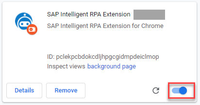
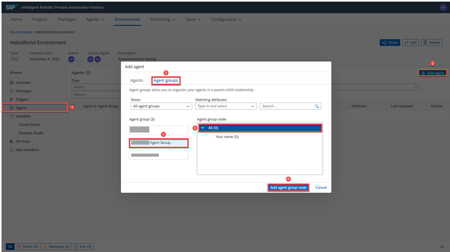

### Prerequisites
- [Subscribe to SAP Intelligent RPA Service in SAP BTP](irpa-setup-1-booster-subscription)
- [Technical prerequisites and system requirements](https://help.sap.com/viewer/6b9c8e86a0be43539b670de962834562/Cloud/en-US/0061438816a34fa78b77c99852318c70.html)

## Details
### You will learn
- About tools required for execution of your automation
- How to enable the SAP Intelligent RPA Browser Extension
- How to configure SAP Intelligent RPA Cloud Factory
---

[ACCORDION-BEGIN [Step 1: ](Download the SAP Intelligent RPA MSI)]
The Desktop Agent is a component of SAP Intelligent Robotic Process Automation that is installed locally on user desktops. It executes automation projects that launch and run applications of various kinds.

Get the latest version of the SAP Intelligent RPA MSI from [SAP Development tools.](https://tools.hana.ondemand.com/#cloud)

!

[DONE]
[ACCORDION-END]

[ACCORDION-BEGIN [Step 2: ](Install components)]

1. Double-click on the MSI, and click **Next**.

2. Choose the components to install and click **Next** for the following steps.

3. Wait for the installation to complete.

4. Click **Finish**.

  

[More Details](https://help.sap.com/viewer/6b9c8e86a0be43539b670de962834562/Cloud/en-US/c76545a9a5d1496db5d28039908cb28a.html )

[DONE]
[ACCORDION-END]

[ACCORDION-BEGIN [Step 3: ](Register Desktop Agent Tenant)]
In Windows search bar, search for **Desktop Agent** and click it.

!

Register the tenant in the Desktop Agent .

1. Give a name for your tenant.

2. Copy the domain of the Cloud Factory URL.

    >This is the URL you saved in the previous tutorial, obtained after subscribing to SAP Intelligent RPA.

3. Paste it in the domain area.

4. Click **Finish**.

   !

Log in with your email account and password which you have subscribed for SAP BTP.

[DONE]
[ACCORDION-END]

[ACCORDION-BEGIN [Step 4: ](Activate Desktop Agent Tenant)]
Click **Tenants**. A list of tenants is displayed.

!

Click **Activate** to activate the trial account.

!

Open **SAP Intelligent RPA Cloud Factory** URL in a browser window.

Click on **Agents** tab and check that your agent is listed with status **Idle**.

!

[DONE]
[ACCORDION-END]

[ACCORDION-BEGIN [Step 5: ](Enable SAP Intelligent RPA Browser Extension)]

>Installing SAP Intelligent RPA on-premise components automatically installs the web browser extension for Google Chrome/Edge.

Navigate to the extensions of the Google Chrome Browser and enable the **SAP Intelligent RPA Extension**.

!

[DONE]
[ACCORDION-END]

[ACCORDION-BEGIN [Step 6: ](Configure Cloud Factory: Create an agent group)]

Once connected to the Cloud Factory, you need to declare your Desktop Agent in an agent group.

>Agent groups allow you to organize your agents in a parent-child relationship, using either:

>- The **computer name** on which the agent is installed.

>- The **login name** of the person who will connect to the agent

1. Create an agent group, as follows:

    -  Click the dropdown menu of the **Agents** tab and select the **Agent groups** tab.

    - Click **New Agent Group**.

    - In the **Name** field, type a name for your agent group.

    - Under **Type**, select **Login**.

    - Click **Create**.

    !

2. Add a node to the agent group, as follows:

    - In the agent group details view, click the `+` button to add a new node to the group.

    - Set **All** as the name.

    - Click **Create**.

    !

3. Prepare to add an agent to the agent group, as follows:

    - Click the new created node to select it.

    - Click the **+** button to add a new agent.

    - Enter your login in the **Name** field.

    - Enter a name for the new agent in the **Label** field.

    - Click **Create**.

    - Click **Save**.

    !

[DONE]
[ACCORDION-END]

[ACCORDION-BEGIN [Step 7: ](Configure Cloud Factory: Create an environment)]
>An environment represents the functional landscape in which SAP Intelligent RPA is deployed.

1. Click the **Environments** tab.

2. Click **New Environment**.

3. In the **New Environment** popup, enter the following:

    |  Field Name     | Value
    |  :------------- | :-------------
    |  Name           | A name for the environment
    |  Description    | A description for the environment
    |  Type          | **Test**

6. Click **Create**

!

[DONE]
[ACCORDION-END]

[ACCORDION-BEGIN [Step 8: ](Configure Cloud Factory: Add agent to environment)]
>An agent is a local component consisting of a computer system (PC, desktop or server) and a user session that executes an automation scenario.

1. In your new environment PAGE, click the **Agents** section.

2. Click **+ Add Agent**.

3. Click **Agent groups**.

4. Select your agent group.

5. Under **Agent group node**, select the **All** node.

6. Click **Add agent group node** to add the new environment.

!

You have successfully installed and configured the Desktop Agent, completed the settings in SAP Intelligent RPA Cloud factory and ready to design your automation.

[VALIDATE_8]
[ACCORDION-END]

---
