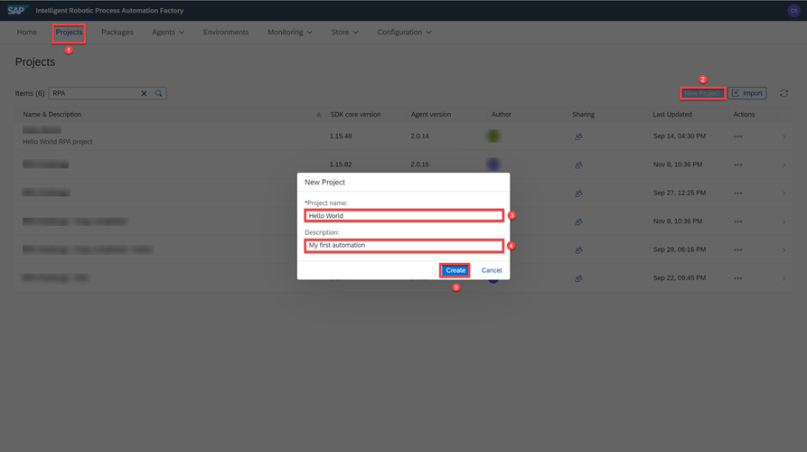
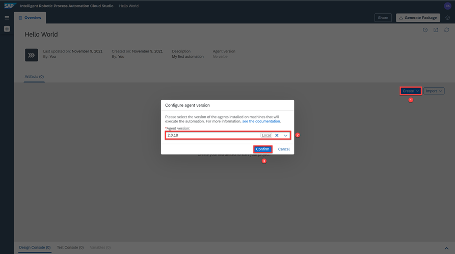
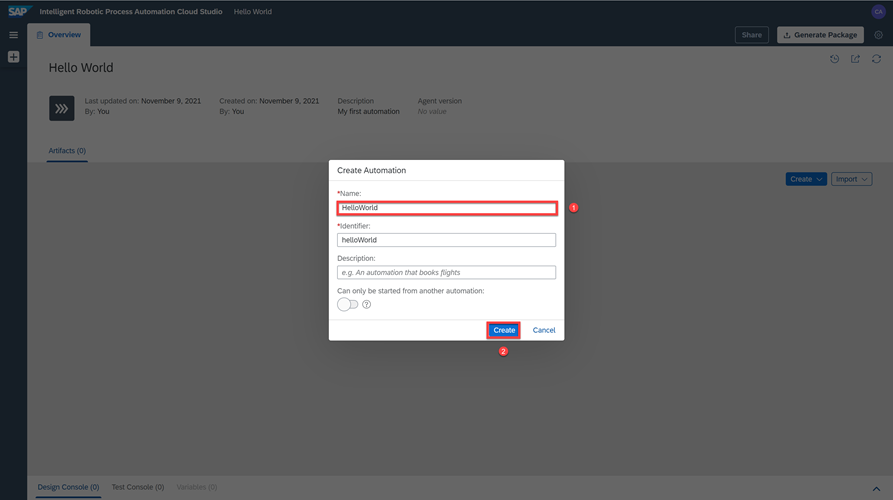
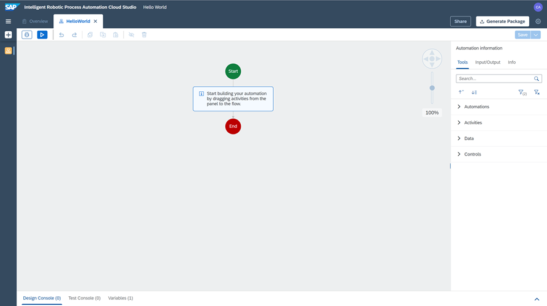
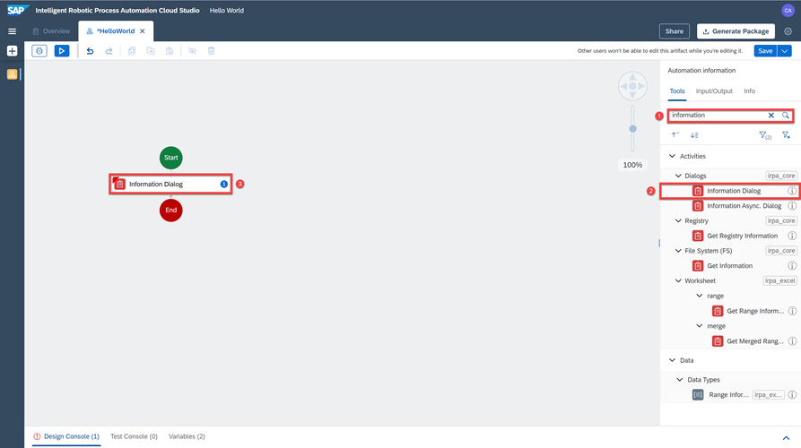
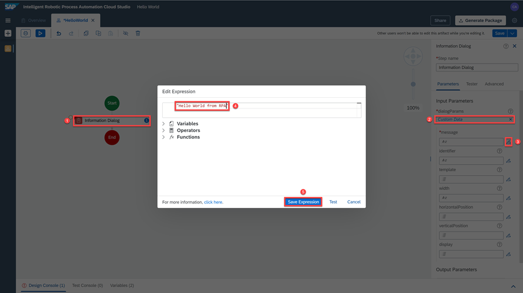
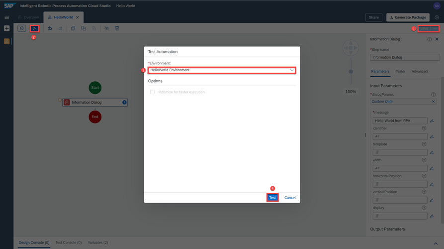
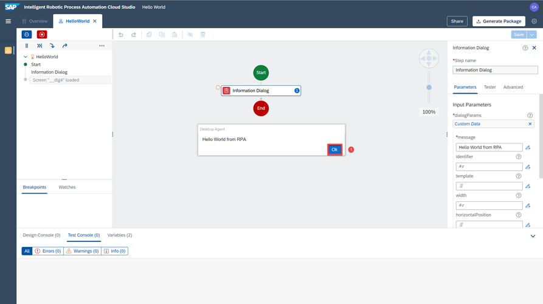

## Prerequisites
- [Subscribe to SAP Intelligent RPA Service in SAP BTP](irpa-setup-1-booster-subscription)
- [Install SAP Intelligent RPA On-Premise Components](irpa-setup-2-onpremise-installation)

## Details
### You will learn
- How to create a simple automation
- How to test the automation

---

[ACCORDION-BEGIN [Step 1: ](Create new project)]
Open the **SAP Intelligent RPA Cloud Factory URL** which you would have saved in previous tutorial.

1. Choose the **Projects** tab.

2. Choose **New Project**.

3. In the **New Project** popup, enter the following:

    |  Field Name     | Value
    |  :------------- | :-------------
    |  Name           | `HelloWorld`
    |  Description    | `My first automation`

4. Choose **Create**.

    !

The **Cloud Studio** opens with your new project.

> **Cloud Studio** is a component of SAP Intelligent RPA to build your automation.

[DONE]
[ACCORDION-END]

[ACCORDION-BEGIN [Step 2: ](Create an automation)]
1. Choose **Create**, and then select **Automation**.

2. Select your latest **Agent version**.

3. Choose **Confirm**.

    !

4. In the **Name** field, type **Hello World**.

5. Choose **Create**.

    !

[DONE]
[ACCORDION-END]

[ACCORDION-BEGIN [Step 3: ](Build an automation)]
You will now start building your automation by dragging activities from the panel to the flow.

  !

1. Enter **information** in the search bar.

2. Drag the activity **Information Dialog** into the workflow.

3. Drop it into the workflow.

  !

4. Choose the **Information Dialog** activity to edit the activity's properties.

5. Under **Input Parameters**, select **Create Custom Data**.

6. Choose the **Open Expression Editor** icon next to **message**.

7. Type `Hello World from RPA` in the text field.

8. Choose **Save Expression**.

  !

9. Choose `Save` (upper right) to save the project.

[VALIDATE_1]
[ACCORDION-END]

[ACCORDION-BEGIN [Step 4: ](Test the automation)]
1. Choose the `Test` icon to start the automation.

2. Select the environment which you have created.

3. Choose **Test**.

  !

The message appears on a pop-up window. You can choose `OK` to close the dialog box.

  !

You have successfully completed building your first automation.

[VALIDATE_2]
[ACCORDION-END]
---
