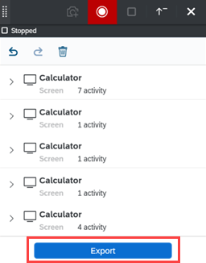

# UI Automation Recorder
<!-- description --> Automate the Calculator desktop application using the UI Automation Recorder.

## Prerequisites
 - Basic understanding of how to record applications in Cloud Studio

## You will learn
  - Record and capture the Calculator application using the UI Automation Recorder

## Intro
The UI Automation Recorder allows you to record desktop applications. It enables users to speed up the bot design process. Using the recorder, actions on the provider application can be recorded, metadata of the screen can be captured and the artifacts can be exported to the Cloud Studio.

---

### Open the Application

Open the calculator application on your desktop.

<!-- border -->

### Create New Project

1.  Log on to SAP Intelligent RPA Factory.

2.  Click **Projects** to create a new project.

### Create and Capture Application

1.  In the Cloud Studio, choose the **Create** button.

2.  From the artifact menu, select the **Application** artifact.

    <!-- border -->

3.  From the list of open applications, select **Calculator** application.

4.  Make sure that the **Launch Recorder** radio button is selected and click **Record**.

    <!-- border -->

5.  You will notice 2 pop-ups for Recording in progress and SAP Intelligent RPA Recorder.

    <!-- border -->  !

### Record the Application - Part 1

> The UI Automation Recorder records the steps you perform across the screens of an application.
 Whenever the screen (DOM) is changed in the provider application, you must capture it by choosing the **Record** button in the recording widget.

1.  Click the **Record** <!-- border --> button to start recording in recorder widget.

2.  Perform a simple calculation by adding `10` and `5` to get result `15`. Click `10`, `+`, `5` and `=`. You will notice that the steps are getting recorded in the recorder.

3.  Click the result `15` in Calculator so that it gets recorded too. You will later use this result in the automation.

    <!-- border -->

### Record the Application - Part 2

1.  Click **Open Navigation** icon <!-- border -->.

2.  There is a change in DOM so, you must record this screen. Click the **New Capture** <!-- border --> button to record the new screen.
    A new screen appears in the recorder.

    <!-- border -->

3.  From the left navigation bar in Calculator, click **Time**.

    <!-- border -->

4.  Click the **New Capture** <!-- border --> button to record the new screen.

    <!-- border -->

5.  You need to convert **Minutes** to **Seconds**. Click the first dropdown and capture the new screen with the dropdown elements.
    Click **Seconds**.

    <!-- border -->

6.  The Calculator shows **Seconds** and **Minutes**. Record this screen in recorder widget.

7.  Select `0` value for **Minutes** and then, type `10`.

    <!-- border -->

8.  Select the resultant value `600` in **Seconds**. You will use this value later in automation. You will see the following steps added to the recorder widget.

    <!-- border -->

### Export the Recording

1. After completing all the steps, click the **Stop** <!-- border --> button to stop the recording.

    <!-- border -->

2.  Click **Export** to move the recording to the Cloud Studio.

    <!-- border -->

3.  Close the Calculator application.

### Review the Automation

> Once all the artifacts are moved to the Cloud Studio, the automation can be executed to replay the recorded steps. It can also be modified and then executed from the Cloud Studio.

  You will see all the screens and steps are recorded in the automation in the Cloud Studio.

1.  Open the application **Calculator** in the Cloud Studio. Make the following changes in **Capture 1** screen.

    <!-- border -->

2.  Similarly, make the following changes in **Capture 5** screen.

    <!-- border -->

3.  Open the automation **Calculator Automation**. Drag and drop **Get Element** activity below step 9 in the automation and make the following changes to activity properties:

    -	Step Name : **Get Add Result**
    -	Target : **`Calculator > Calculator > Result1`**
    -	Output Parameters : **addition**

4.  Drag and drop the **Log message** activity right after the **Get Element** activity to display the result. Set the input parameter **message** as **addition**.

    <!-- border -->

5.  Next, drag and drop the **Get Element** activity to fetch the converted minutes to seconds.

    -	Step Name : **Get Conversion Result**
    -	Target : **`Calculator > Calculator > Result2`**
    -	Output Parameters : **seconds**

6.  Drag and drop the **Log message** activity below the **Get Element** activity to display the result. Set the input parameter **message** as **seconds**.

    <!-- border -->

7.  Your automation looks like the following one. Save your work.

    <!-- border -->

### Test the automation

1.  Click **Test** to test the automation.

2.  Results will be displayed in the log area.

    <!-- border -->

> The UI Automation Recorder has certain limitations. Please check this link to learn more about the [limitations](https://help.sap.com/viewer/8e71b41b9ea043c8bccee01a10d6ba72/Cloud/en-US/b50e325c54934afa991821e073867917.html).

---
