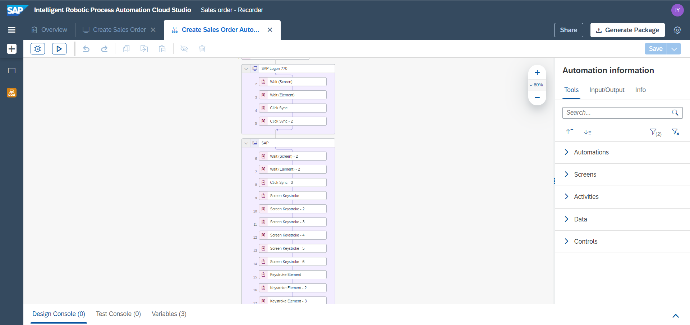

# Create an automation using SAP WinGUI Recorder
<!-- description --> Automate Sales order Creation in SAP GUI for Windows

## Prerequisites
  - [Subscribe to SAP Intelligent RPA Service in SAP BTP](irpa-setup-1-booster-subscription)
  - [Install SAP Intelligent RPA On-Premise Components](irpa-setup-2-onpremise-installation)
  - [Scripting enabled for SAP GUI for Windows](https://help.sap.com/viewer/8e71b41b9ea043c8bccee01a10d6ba72/Cloud/en-US/f0fe92f292c946bca1269f826cd682b3.html) on the Client and the Server.

## You will learn
  - How to use Recorder in **SAP GUI for Windows**

---
### Prepare the Recording

What is the Recorder?

You can automate complex workflows easily using the **Recorder** in **Cloud Studio**. It automatically captures applications and designs automations accurately at the same time. The **Recorder** records the steps you perform across the screens of an application. Then you can export the recording in the automation designer of the **Cloud Studio** where a workflow is built.

Make sure your screen display settings (Scale and layout) are set to 100%.

1.  Switch to your desktop, right-click and select **Display Settings**.

    <!-- border -->

2.  Select **100%** in **Scale and layout**.

    <!-- border -->

Create a project and use **Recorder** to record a **SAP GUI for Windows** Application.

### Create a project in the Cloud Studio

Create a project in the **SAP Intelligent RPA Cloud Factory** by choosing **Projects** &rarr; **New Project**.

<!-- border -->

A new project is created in **SAP Intelligent RPA Cloud Studio**.

### Create application artifact

1. Create a new **Application** artifact in your project.

    <!-- border -->

2. Select the **SAP GUI for Windows** application to record.
3. Select **Launch Recorder**.
4. Set up an **Application Name** for your application.
5. Select **Record**.

  <!-- border -->

### Record an application

1. Choose **Record** <!-- border --> to initiate the recording. You will be directed to the **SAP GUI for Windows** application you want to record.
2. Select **Client** and enter your credentials.
3. Hit <kbd>Enter</kbd> button.

  <!-- border -->

**Capture: SAP Easy Access**

The screen has changed and warning at the bottom of the **Recorder** appeared.

1. Choose **New Screen Capture** to capture the new screen and wait for the **Recorder** to load the new screen's elements. Once the new screen is captured, it will appear in the **Recorder**.

2. Enter the Sales Order transaction ID **VA01**.

3. Hit <kbd>Enter</kbd> button.

  <!-- border -->

**Capture: Create Sales Order: Initial Screen**

1. Choose **New Screen Capture**.

2. Fill in the details.

    |  Field Name           | Value
    |  :------------------- | :-------------
    |  Order Type           | AVC
    |  Sales Organization   | 0001
    |  Distribution Channel | 01
    |  Division             | 01

3. Hit <kbd>Enter</kbd> button.

  <!-- border -->

**Capture: Create Standard Order: Overview**

1. Choose **New Screen Capture**.

2. Fill in the order details.

3. Hit <kbd>Enter</kbd> button.

    > You can notice that the **Recorder** has generated the corresponding activities from the previous screen.

    <!-- border -->

4. Choose **Save** to complete the process of recording the sales order application.

5. Choose **Stop** to stop the recording.

  <!-- border -->

### Export recording

Select **Export** to export the recording to your project.

  <!-- border -->

As a result of your recording:
 - A **screen** is captured in the **Cloud Studio**
 - An **automation** is generated in the **Cloud Studio**

 Your Project now consists of an application named *Create Sales Order* and automation named **Create Sales Order Automation**.

  <!-- border -->

In the automation you will have the choice to customize your automation as per your requirements.

The password is recorded as **asterisks**. You need to change its value to the real password.

1.  Find and Select the activity **Set Element** of password that sets the password value.

2.  Change the value to the real password.

    <!-- border -->

The automation is ready to be tested.

### Test your Automation

To test your automation, choose **Test**.

  <!-- border -->

**SAP Intelligent RPA Cloud Studio** starts the automation by calling the **Desktop Agent** using the **SAP Intelligent RPA Browser Extension**.

The process operates as follows:

1.  SAP ERP system is opened, enters the credentials and navigates to Sales order Transaction to create a Sales Order.

2.  The **Desktop Agent** fills all the details in the screen.

3.  Information is validated to move to the next detected screen.

4.  These steps are repeated for all the screens that were captured.

5.  The Sales order is created successfully.

---
