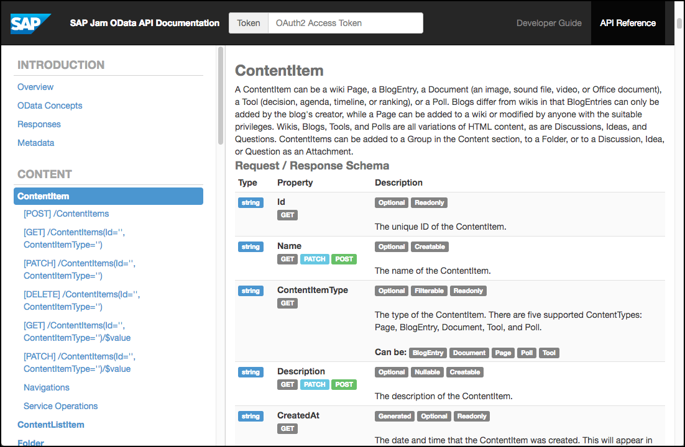

## Prerequisites  
 - **Proficiency:** Beginner
 - **Tutorials:** [Register for SAP Cloud Platform and SAP Jam Collaboration developer access](https://www.sap.com/developer/tutorials/jam-cloud-setup.html)

## Next Steps

## Details
### You will learn
In this tutorial, you will learn how to use the [SAP Jam Collaboration OData API Reference](https://developer.sapjam.com/ODataDocs/ui), which provides full documentation for each endpoint, or API call. It also provides an excellent **Try** feature that allows users to try out each endpoint and view the results.

### Time to Complete
**15 Min**

---

[ACCORDION-BEGIN [Step 1: ](SAP Jam OData API Reference sections)]

The [SAP Jam Collaboration OData API Reference](https://developer.sapjam.com/ODataDocs/ui) is organized into the three sections shown in the following diagram.

  - The **banner section** contains the title of the API reference and the OAuth2 token entry field, which allows you to enter the  [OAuth 2.0 Token generated in SAP Jam Collaboration](https://help.sap.com/viewer/b3245d183f0b4387a0592c4a6e269bc1/LATEST/en-US/5eec65a0e0264ef693e8af8732926b60.html).

  - The **navigation sidebar** shows a menu of the Introduction section, and all of the entity sections and their endpoints. Click an entity section title to expand that section and show its information in the content section. Click an endpoint signature to show its documentation.

  - The **content section** displays the documentation on each entity grouping (request / response schema, entities, endpoints, navigations and service operations).

[ACCORDION-END]

[ACCORDION-BEGIN [Step 2: ](Content column)]

The content section provides the following information:

  - Overview: An introduction to the API Reference.

  - OData Concepts: Explains concepts that are necessary to effectively use our OData API. These include authorization, paging, expanding and selecting.

  - Responses: A table of response codes (200, 201, etc.) with their related methods (GET, POST, PATCH, PUT, DELETE) and descriptions.

  - Metadata: A file that is primarily used to provide information to client applications on the API entities, their properties, their navigations, and on the available service operations. This is provided primarily to aid in the import of data to the client applications. As an XML file, it is human-readable, so you can refer to the `$metadata` file for much of the information about the API. For information on reading the `$metadata` file, please see [Understanding OData metadata](https://help.sap.com/viewer/u_collaboration_dev_help/dacad2174f654e62a75754d71fee9da2.html).

  - Entity groupings: These match the top-level titles shown in the navigation sidebar. These are entity groupings in that they frequently cover the API endpoints for more than one entity. For example, the `Group` entity set covers endpoints that relate to the `Group`, `GroupTemplates`, `SystemGroupTemplates`, `GroupMemberships`, `GroupExternalObjects`, `GroupGadgets`, and `GroupGadgetObjects` entities. Each of these sections contains:

    - a quick description of the entity grouping
    - the request / response schema for the entity grouping
    - descriptions of each of the entities within the entity grouping
    - navigations for the entity grouping (when applicable)
    - service operations for the entity grouping (when applicable)

  - Following the documentation on each entity grouping section is documentation on each endpoint of the entity grouping. That information varies depending on whether it is a POST, GET, PATCH, or DELETE operation. All endpoint documentation includes:
    - The signature of the endpoint, which is the HTTP verb plus the endpoint's resource path; for example: \[GET\] /Groups.
    - A short description of the purpose or function of the API call.
    - A Show Options drop-down menu that contains the Request Headers and Query Parameters required to make the API call:
        - Request Headers (required):
            - **`Authorizaton`** - Authentication credentials for HTTP authentication.
            - **`Accept`** - Desired MIME type of the response (XML, JSON).
        - Query Parameters (when applicable) - Descriptions and text boxes for inputting the various Query Parameters (paging, expanding, selecting) that are either required or are available for optional use with the API call.
    - A **Try** button that will show the results of the API call when clicked, as long as the OAuth2 Token and the required Query Parameters are all set.

[ACCORDION-END]

[ACCORDION-BEGIN [Step 3: ](Use the Try feature)]

Probably the greatest feature of our [SAP Jam Collaboration OData API Reference](https://developer.sapjam.com/ODataDocs/ui) is the **Try** feature, which allows you to try out an API call and see the result immediately. To use this feature, do the following:

1. [Add an OAuth Client](https://help.sap.com/viewer/b3245d183f0b4387a0592c4a6e269bc1/LATEST/en-US/5eec65a0e0264ef693e8af8732926b60.html) in your SAP Cloud Platform instance of SAP Jam Collaboration, and copy the OAuth2 access token.

2. In the [SAP Jam Collaboration OData API Reference](https://developer.sapjam.com/ODataDocs/ui), paste the OAuth2 access token that you copied in the previous step into the OAuth2 token field in the top-middle banner of the page.

3. In the content section, click **Show Options** to reveal the **Query Parameters** section for the API endpoint that you want to try out and fill in the available fields.

    > Note:

    >  - You **must** fill any ID fields with valid IDs.
    >  - You **must** fill any text box labeled with the API endpoint's entity type (Group, Event, etc.) with the required request payload for that endpoint.
    >  - You **may** use any allowed service query options by correctly filling in their text boxes. (See [OData Query Parameters](https://help.sap.com/viewer/u_collaboration_dev_help/34e1dd3043c448cfa587f4a94b72eb34.html) for details.) If you do not set these options, they will not be used.
    >  - You **may** select the response format that you want returned (JSON or XML). If you do not select this option, the API Reference default of the JSON format will be set.

4. Click **Try**. The API call will run immediately, and a pop-up window will display the response.

[VALIDATE_1]

[ACCORDION-END]

---
