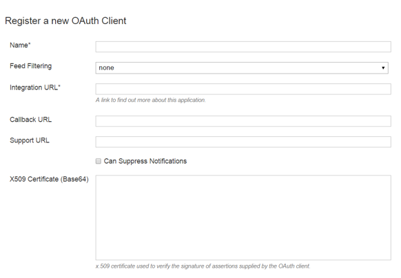
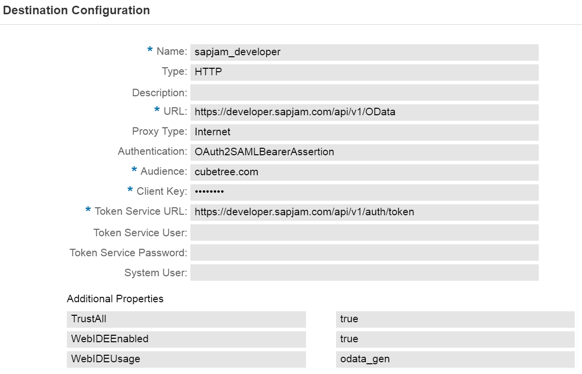

## Prerequisites  
 - **Proficiency:** Intermediate
 - **Tutorials:** [Setup Trust between SAP Cloud Platform and SAP Jam Collaboration](https://www.sap.com/developer/tutorials/jam-cloud-setup-trust.html)

## Next Steps
- [Configure the SAP Web IDE Destination for SAP Jam Collaboration on SAP Cloud Platform](https://www.sap.com/developer/tutorials/jam-cloud-webide-destination-configure.html)

## Details
### You will learn  
In this tutorial, you will learn how to configure the SAP Cloud Platform Destination for SAP Jam Collaboration API SSO.

Connectivity destinations are a part of the SAP Cloud Platform connectivity service and are used for the outbound communication of a cloud application to a remote system like SAP Jam Collaboration. They contain the connection details for the remote communication of an application. Connectivity destinations are represented by symbolic names that are used by on-demand applications to refer to remote connections. The connectivity service resolves the destination at runtime based on the symbolic name provided. The result is an object that contains customer-specific configuration details, such as the URL of the remote system or service, the authentication type, and the relative credentials.

### Time to Complete
**15 Min**

---

[ACCORDION-BEGIN [Step 1: ](Create your destination configuration file)]

1.  Create a text file named `sapjam\_developer`
2.  Copy and paste the following into this file:
    ```
    Type=HTTP
    TrustAll=true
    audience=cubetree.com
    Authentication=OAuth2SAMLBearerAssertion
    WebIDEUsage=odata_gen
    Name=sapjam_developer
    WebIDEEnabled=true
    CloudConnectorVersion=1
    tokenServiceURL=https\://developer.sapjam.com/api/v1/auth/token
    ProxyType=Internet
    URL=https\://developer.sapjam.com/api/v1/OData
    ```
3.  Save this file.
4.  If you configure the destination manually, all values must be the same including the name of the destination.


[ACCORDION-END]

[ACCORDION-BEGIN [Step 2: ](Import your destination configuration file into SAP Cloud Platform)]

1.  Login to the _Hana Cloud Server Cockpit_
2.  Select your account
3.  Click **Connectivity**
4.  Click **Destinations**
5.  Click **Import Destination**
6.  Select your destination configuration file `sapjam\_developer` and click **Open**.

    

    Figure 5: Import your destination configuration file into SAP Cloud Platform


[ACCORDION-END]


[ACCORDION-BEGIN [Step 3: ](Create and configure OAuth Clients)]

1.  Switch back to SAP Jam Collaboration. At the top right of the page select the **cog icon** \> **Admin**.
2.  Click **Integrations** in the left menu.
3.  Click **OAuth Clients**
4.  Click **Add OAuth Client**
5.  Enter `SAP Cloud Platform` in the **Name** field.
6.  Enter `https://hanatrial.ondemand.com` in the **Integration URL** field.
7.  Click **Save**

    

    Figure 6: Create and configure OAuth Clients


[ACCORDION-END]

[ACCORDION-BEGIN [Step 4: ](Update the destination with the OAuth Client key from SAP Jam Collaboration)]

1.  In Jam click **OAuth Clients**
2.  Click **View**
3.  Copy the **Key** value
4.  Go back to the SAP Cloud Platform destination configuration screen and paste the **Key** value into the **Client Key** field.
5.  If you see a red warning _Client Key cannot be empty_:
    1.  Select **Authentication** \> **Oauth2SAMLBearerAssertion**
    2.  Change it to **No Authentication**
    3.  Change it back to **Oauth2SAMLBearerAssertion**
6.  Click **Save**

    

    Figure 7: Update the destination with the OAuth Client key from SAP Jam Collaboration


[ACCORDION-END]

---

## Next Steps
- [Configure the SAP Web IDE Destination for SAP Jam Collaboration on SAP Cloud Platform](https://www.sap.com/developer/tutorials/jam-cloud-webide-destination-configure.html)
