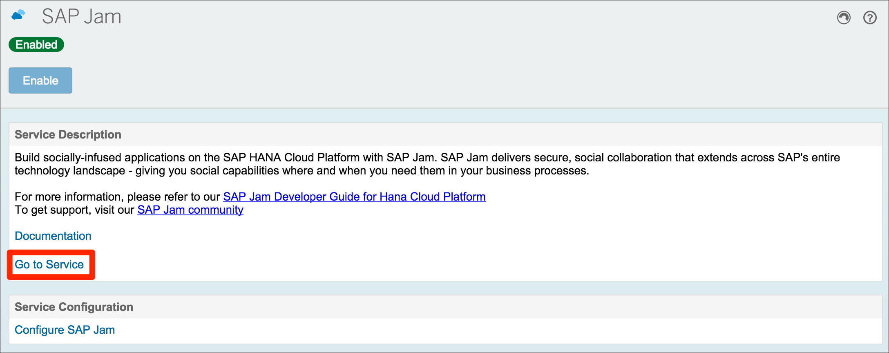
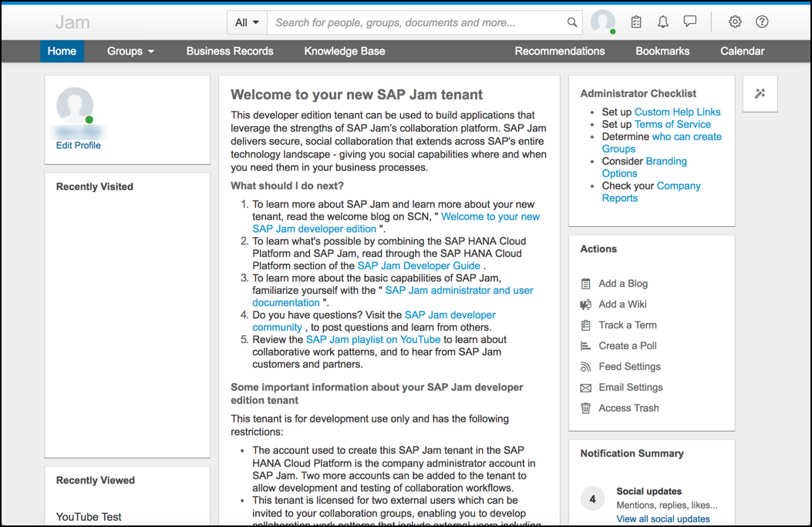
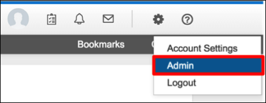
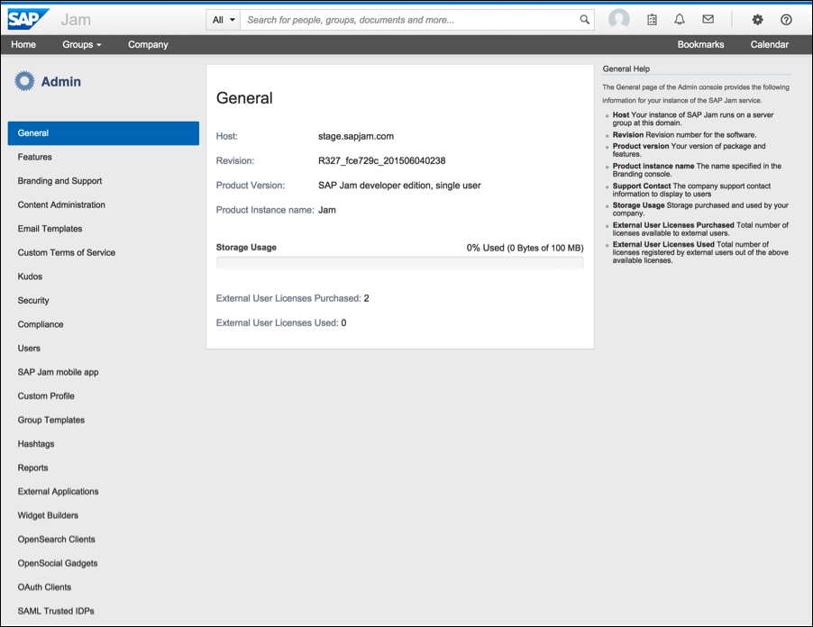
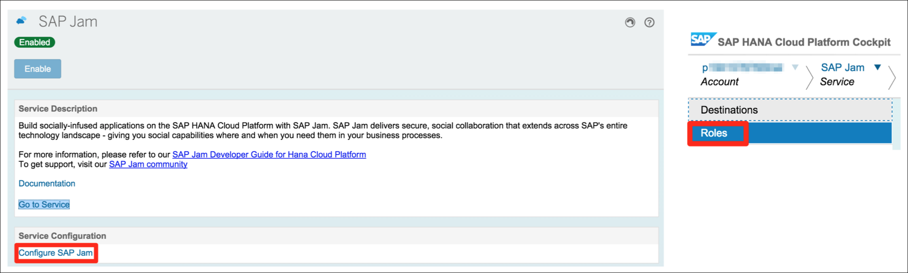
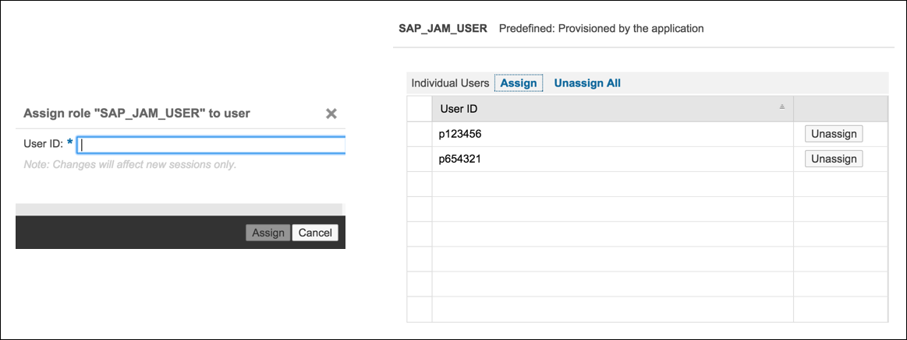
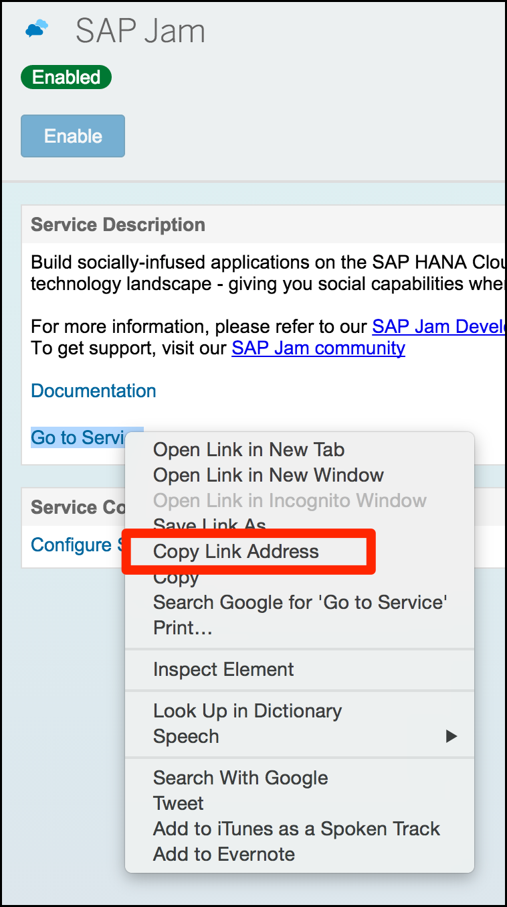
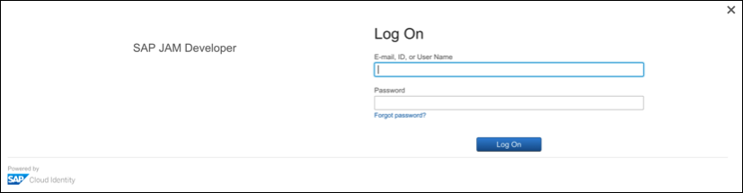
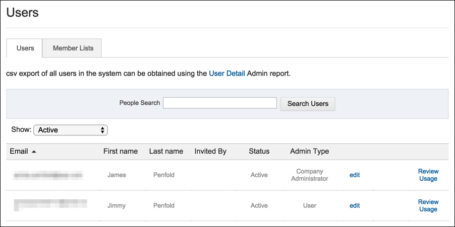

## Prerequisites  
 - **Proficiency:** Beginner
 - **Tutorials:** [SAP Cloud Platform and SAP Jam Collaboration developer access](https://www-qa.sap.com/developer/tutorials/jam-cloud-setup.html)

## Next Steps
- [Create a Group, invite users, add content, create a poll, add ideas](https://www-qa.sap.com/developer/tutorials/jam-cloud-group-users-poll-ideas.html)

## Details
### You will learn  
In this tutorial you will learn how to login, access the Administration console, and set up new users.

### Time to Complete
**15 Min**

---

[ACCORDION-BEGIN [Step 1: ](Login)]

Clicking on the Go To Service link within the SAP Jam Collaboration Services section of the SAP Cloud Platform Account Cockpit will log you in to your SAP Jam Developer Edition environment. You will be logged in as the SAP Jam administrator.

Figure 1: The SAP Jam Collaboration Services section of the SAP Cloud Platform Account Cockpit

When you log into SAP Jam, you will be presented with the Company Wiki page. This page provides you with useful information about your environment as well as links to resources and documentation.

Figure 2: The SAP Jam Company Wiki page

Once you have reviewed this information, click on the Home menu option and you will be taken to your Home feed. This is your own personal feed, showing you activities that you should be interested in from people you follow, groups you're a member of and notifications sent directly to you. This is not to be mistaken with a group feed, which is visible when you're viewing a specific group. When you log in for the first time your feed will be empty.

Figure 3: Your SAP Jam personal feed page

From this page you can post feed update updates, documents, videos and access other common actions such as your profile, your Account Settings and the Admin Console.

[ACCORDION-END]

[ACCORDION-BEGIN [Step 2: ](Access the Administration console)]

To access the SAP Jam Collaboration Admin Console, click in the Cog icon at the top of the page and select the Admin menu option.

Figure 1: SAP Jam top-right cog menu options

This will bring you to the Admin Console where all of the Administrator options that are available are accessible down the left hand side of the page.

Figure 2: The SAP Jam Admin console

[ACCORDION-END]

[ACCORDION-BEGIN [Step 3: ](Set up new users)]

Collaboration is not possible, or much fun, with only one user so lets add another user.

The SAP Jam Collaboration Developer Edition provides 3 user licenses. The first user to login is automatically assigned as the Company Administrator and consumes one of these licenses. The administrator will always login from the **Go To Service** link within the SAP Jam Services section of the SAP Cloud Platform Account Cockpit.

For additional users, they will need to login separately. To do this you first need to assign **Roles** in the SAP Cloud Platform Cockpit. Click on the **Configure Roles** icon.

Figure 1: The SAP Jam area of the SAP Cloud Platform Cockpit

For the additional users that you require to login to the SAP Jam developer edition, it is necessary to assign each of them the **SAP\_JAM\_USER** role. To do this enter their **SAP ID Service ID** and click **Assign**. Once you have assigned the roles for additional users they will be displayed in the **Individual Users** list as shown below:

Figure 2: Assign roles to SAP Jam users

Unlike the Administrator, the additional users do not log into SAP Jam from don't pick up any existing sessions and paste the URL. You will be presented with an SAP Jam Developer Edition, right-click on the **Go To Service** link within the SAP Jam Services section of the SAP Cloud Platform Account Cockpit and select **Copy Link Address from within the SAP Cloud Platform Cockpit. To get the URL for the login page for your** .

Figure 3: Get the new user login URL

SAP Jam Developer Edition login page.

Figure 4: Login as the new user

As you will see from the Login page, the SAP JamStart a new browser window/Incognito window/private browsing session such that you Developer Edition relies on SAP Cloud Platform Identity Authentication as its Identity Provider (IDP) so any additional users you use must have an SAP Cloud Platform Identity Authentication account. For this article, I used my SAP details as well as a personal email address to create two users.

Once you have entered your credentials, a new user is created in your SAP Jam Developer Edition and you will consume another of the 3 available licenses. You can view the users in your environment by navigating to the Users area of the Admin Console.

Figure 5: View your users in the SAP Jam Admin Console's Users page

You can also remove a user by editing the user and setting their Member Status to Alumni. This will then free up another license for use.

Figure 6: Remove a user by setting their 'status' to 'Alumni'

[ACCORDION-END]

---

## Next Steps
- [Create a Group, invite users, add content, create a poll, add ideas](https://www-qa.sap.com/developer/tutorials/jam-cloud-group-users-poll-ideas.html)
