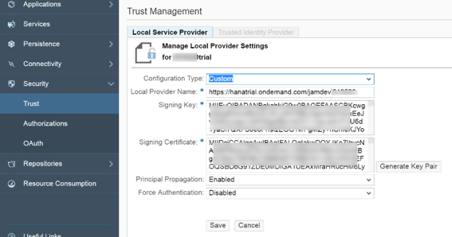
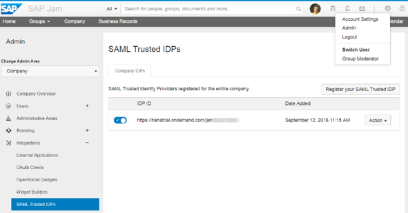

## Prerequisites  
 - **Proficiency:** Intermediate

## Next Steps
- [Configure the SAP Cloud Platform Destination for SAP Jam Collaboration API SSO](https://www.sap.com/developer/tutorials/jam-cloud-api-sso-configure.html)

## Details
### You will learn  
In this tutorial, you will learn how to set up trust between SAP Cloud Platform and SAP Jam Collaboration.

The purpose of the trust configuration is the support of principal propagation, forwarding the logged on identity in the cloud (SAP Cloud Platform) to the internal system (SAP Jam Collaboration), which means logging on with a user that matches this identity without the need of providing the password (SSO). By default, SAP Cloud Platform is configured to use the SAP ID Service as the default trusted IDP (identity provider).

### Time to Complete
**15 Min**

---

[ACCORDION-BEGIN [Step 1: ](Get Trust information from your SAP Cloud Platform Server)]

1.  Login to your [SAP Cloud Platform Cockpit](https://account.hanatrial.ondemand.com)
2.  Select your account
3.  Click **Security**
4.  Click **Trust**
5.  Click **Edit**
6.  Select **Custom** from the _Configuration Type_ drop-down list.
7.  Click **Generate Key Pair**
8.  Keep this screen open.

    

    Figure 1: Get Trust information from your SAP Cloud Platform Server

[ACCORDION-END]

[ACCORDION-BEGIN [Step 2: ](Create a SAML IDP in SAP Jam Collaboration)]

1.  Login to SAP Jam Collaboration
2.  At the top right of the page select the **cog icon** \> **Admin**
3.  Click **Integrations** in the left menu
4.  Click **SAML Trusted `IDPs`**
5.  Click **Register your SAML Trusted IDP**

    

    Figure 2: Create a SAML IDP in SAP Jam Collaboration
6.  Copy the **Local Provider Name** from the SAP Cloud Platform Server _Trust_ screen and paste it in the **IDP ID** field.
7.  Copy the **Signing Certificate** from the SAP Cloud Platform Server _Trust_ screen and paste it in the **X509 Certificate (`Base64`)** field.
8.  Ensure the **Enabled** check box is checked.
9.  Click **Register**

    

    Figure 3: Edit your SAML Trusted Identity Provider

[ACCORDION-END]

[ACCORDION-BEGIN [Step 3: ](Set up SAP Cloud Platform Trust)]

1.  Switch back to the _Trust Management_ screen in the SAP Cloud Platform Cockpit.
2.  Click **Save**
3.  Click **Edit**
4.  Select **Default** from the **Configuration Type** drop-down list.
5.  Click **Save**

    

    Figure 4: Set up SAP Cloud Platform Trust

[ACCORDION-END]

