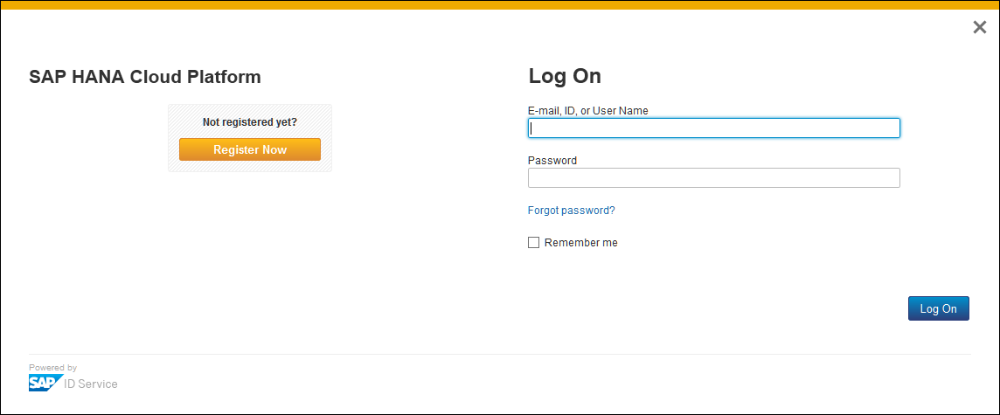
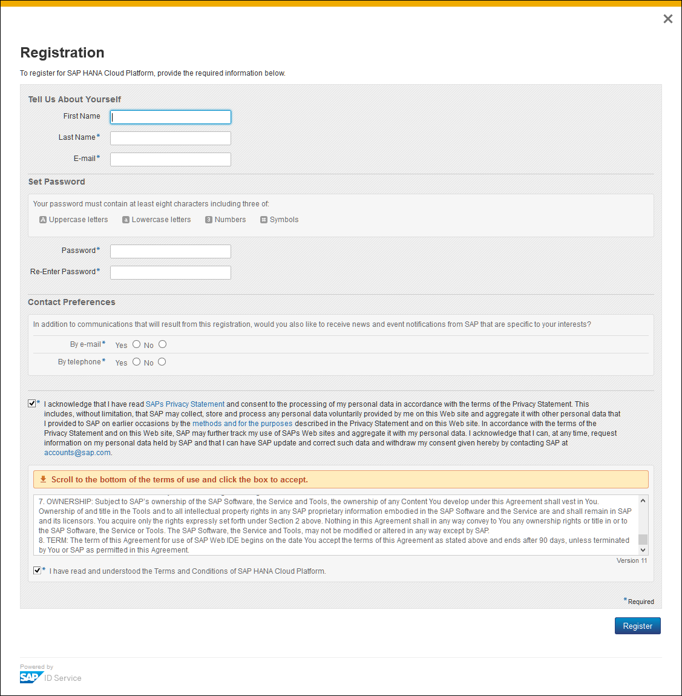
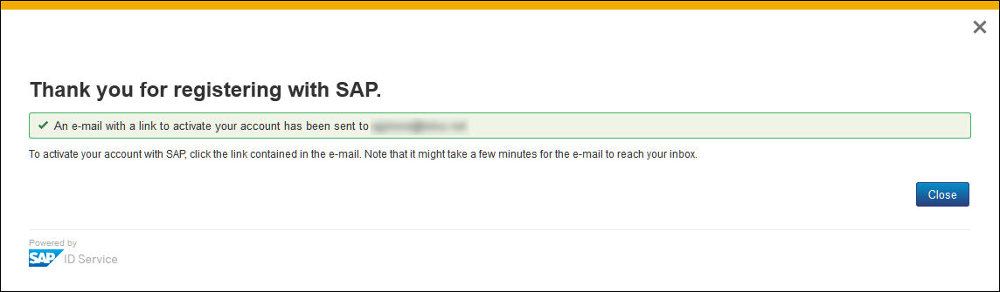
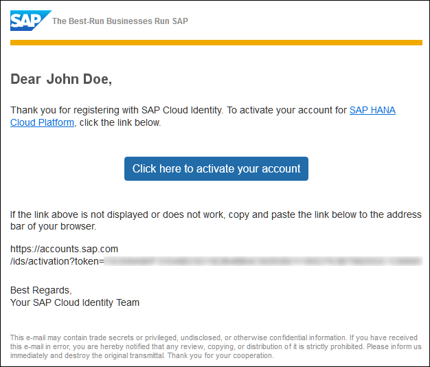
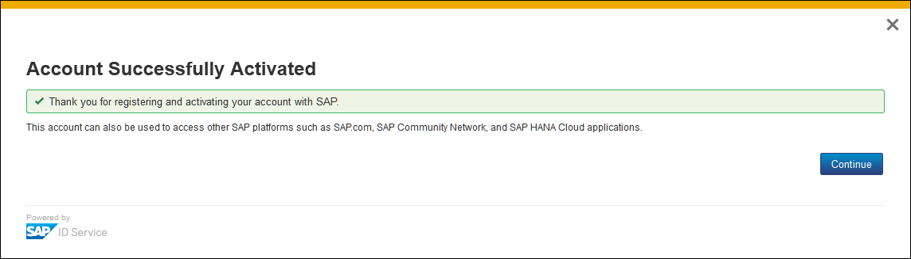
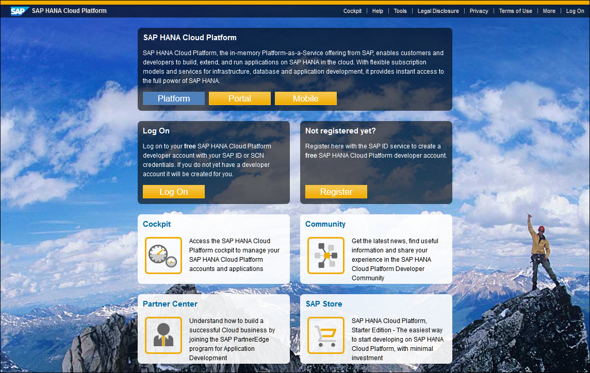
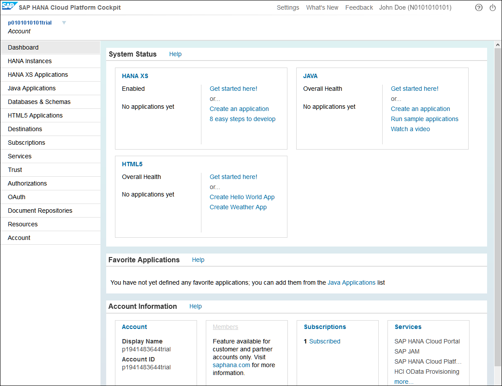
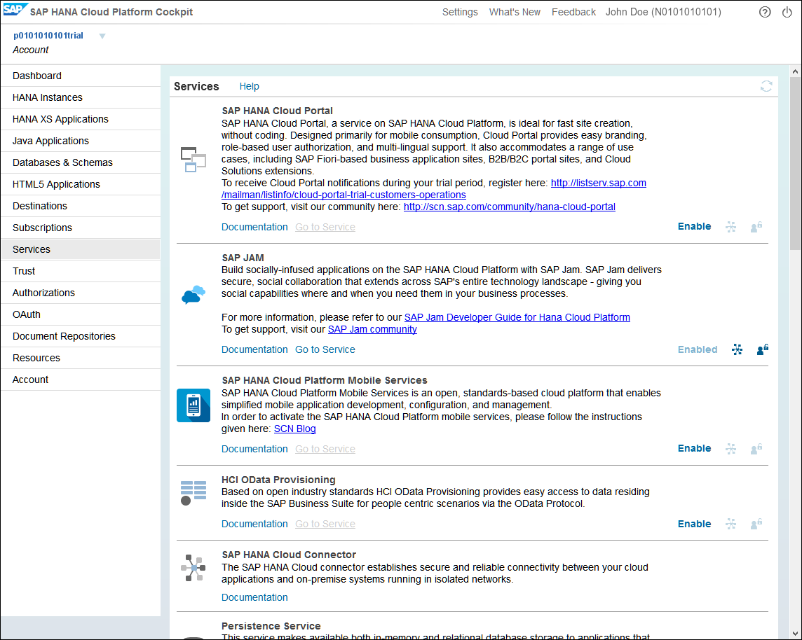

## Prerequisites  
 - **Proficiency:** Beginner

## Next Steps
- [Initial setup of SAP Jam Collaboration Developer Edition](https://developers.sap.com/tutorials/jam-cloud-login-admin-user-setup.html)

## Details
### You will learn  
- How to sign up for a free SAP Cloud Platform developer account
- How to sign up for a free trial instance of SAP Jam Collaboration

---

[ACCORDION-BEGIN [Step 1: ](Register)]

Click the link to the SAP Cloud Platform sign up page:
[https://account.hanatrial.ondemand.com/register](https://account.hanatrial.ondemand.com/register).

If you do not have an account, you are presented with a log-in page from which you can create an account.

Figure 1: The SAP Cloud Platform cockpit log-in page

[ACCORDION-END]

[ACCORDION-BEGIN [Step 2: ](Create your developer account)]

To create your new developer account, click **Register Now**.

The SAP Cloud Platform registration page is displayed.

Figure 2: The SAP Cloud Platform registration page

Do the following:
  - Enter your name and email address.
  - Set your password.
  - Set you contact preferences.
  - Accept SAP's privacy terms.
  - Scroll to the bottom of the end-user license agreement and accept it.
  - Click **Register**.

A thanks page is displayed, with a notification that an activation link has been sent to the email address that you provided.

Figure 3: Thank you and email activation notification page

Open the activation email message that you were sent.

Figure 4: Activation email

Click **Click here to activate your account** or copy the provided URL into your browser.

A page is displayed that notifies you that your account has been created and activated.

Figure 5: The account creation and activation notification page

[ACCORDION-END]

[ACCORDION-BEGIN [Step 3: ](Login to SAP Cloud Platform)]

Click **Continue**.

The initial SAP Cloud Platform page is displayed.

Figure 6: The SAP Cloud Platform initial log-in page

Click **Log On** in the Log On box.

The SAP Cloud Platform cockpit welcome page is displayed.

Figure 7: The SAP Cloud Platform cockpit welcome page

Click **Continue**.

This step actually creates your developer account, so please be patient.

The SAP Cloud Platform cockpit is displayed. This is the page from which you will access your accounts and do much of your work with the SAP Cloud Platform.

Figure 8: The SAP Cloud Platform cockpit

[ACCORDION-END]

[ACCORDION-BEGIN [Step 4: ](Access SAP Jam Collaboration)]

To access your trial instance of SAP Jam, click **Services** in the **Account Information** section.

The SAP Cloud Platform Cockpit Services page is displayed.

Figure 9: The SAP Cloud Platform Cockpit Services page

In the SAP Jam row, click **Enable**, and once the service is enabled, click **Go to Service** in that row.

The SAP Jam initial welcome page is displayed.

[ACCORDION-END]

---

### Optional

[ACCORDION-BEGIN [Step 5: ](Access Developer Support Communities)]

To access the developer support communities, where you can post your questions, comments, and solutions for SAP Cloud Platform and SAP Jam integrations and development, click the following links:

- [SAP Cloud Platform Developer Center](https://www.sap.com/community/tag.html?id=01200615320800003694)
- [SAP Jam Collaboration Developer Community](https://www.sap.com/community/topics/jam-collaboration.html)

[ACCORDION-END]
