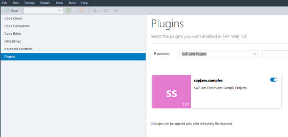
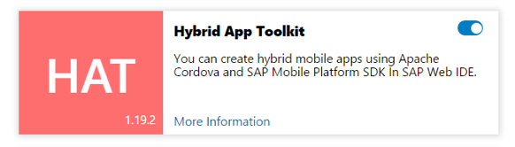

## Prerequisites  
 - **Proficiency:** Beginner

## Next Steps
- Select a tutorial from the [Tutorial Navigator](http://www.sap.com/developer/tutorial-navigator.html) or the [Tutorial Catalog](http://www.sap.com/developer/tutorials.html)

## Details
### You will learn  
In this tutorial you will learn how to activate WebIDE plugins on SAP Cloud Platform

### Time to Complete
**5 Min**

---

[ACCORDION-BEGIN [Step 1: ](Activate WebIDE plugins on SAP Cloud Platform)]

1.  In the WebIDE the _SAP Jam Collaboration Extension Sample Projects_ need to be enabled. In the WebIDE select the **Tools** menu and then select **Preferences**.
2.  In the _Preferences_ section, click on **Plugins**.
3.  In the **Repository** drop down select **SAP Jam Collaboration Plugins**. If they do not show up you may want to refresh your WebIDE.
4.  Activate the **sapjam.samples plugin**.

    

    Figure 2: Activate the sapjam.samples plugin
5.  Also activate the **Hybrid App Toolkit**.
6.  Click on the **enable** slider and click the **Save** button at the bottom of the page. The WebIDE refreshes.

    

    Figure 3: Activate the Hybrid App Toolkit

[ACCORDION-END]

---

## Next Steps
- Select a tutorial from the [Tutorial Navigator](http://www.sap.com/developer/tutorial-navigator.html) or the [Tutorial Catalog](http://www.sap.com/developer/tutorials.html)
