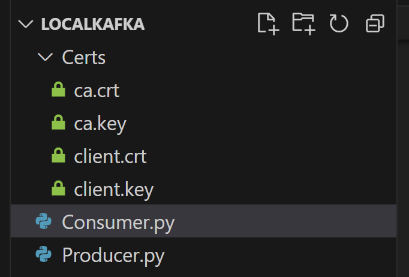
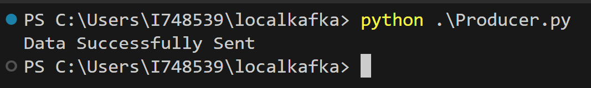
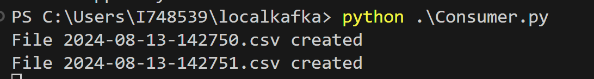
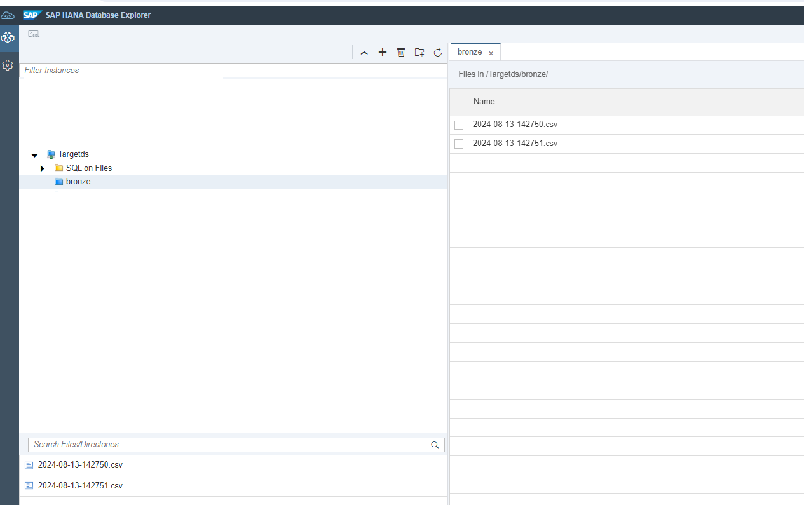
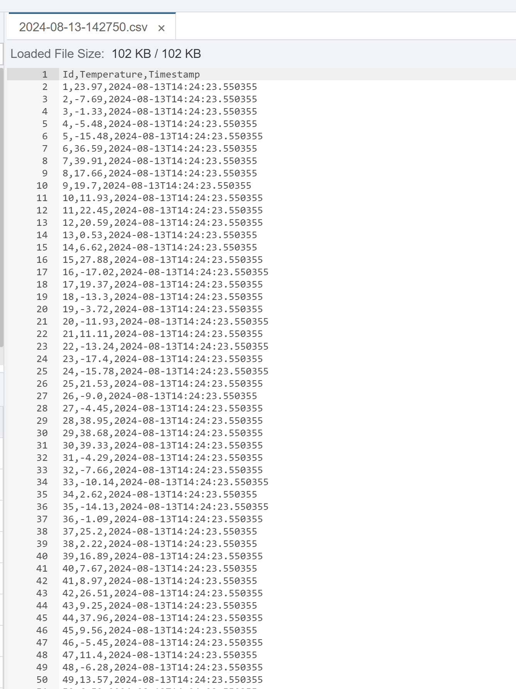

# Apache Kafka Python Sample: Consuming and Writing Data into SAP HANA Cloud, data lake Files
<!-- description --> This tutorial demonstrates how to set up an Apache Kafka instance locally and create Python scripts to produce and consume data into data lake Files based on user specifications.
## Prerequisites
 - Apache Kafka installed.
 - Python installed.
 - Basic knowledge of Python and Kafka.
 - Access to SAP Business Technology Platform (BTP) and a provisioned data lake instance (HDLF) with configured certificates. Refer to the [SAP HANA Cloud Data Lake Setup](https://developers.sap.com/mission.hana-cloud-data-lake-get-started.html) for data lake setup and this [tutorial](https://developers.sap.com/tutorials/data-lake-file-containers-hdlfscli.html) for configuring certificates.
 - A running local Kafka server with the address `localhost:9092`.

## You will learn
  - How to create a Kafka producer script in Python.
  - How to create a Kafka consumer script in Python.
  - How to integrate and write data into SAP HANA Cloud ,data lake files.

## Intro
Apache Kafka is a distributed event streaming platform capable of handling trillions of events a day. In this tutorial, you will use a  local Kafka instance and create Python scripts to consume and write data into SAP HANA Cloud, data lake files. Specifically, we will be sending random temperature and timestamp data, which will be processed and stored in the data lake in csv format.

---


### Set Up Local Apache Kafka Instance

Ensure that you have a local Apache Kafka instance up and running. If not, you can set up Kafka on your local machine by following the official [Kafka Quickstart Guide](https://kafka.apache.org/quickstart).


To follow this tutorial smoothly, you need to create a Kafka topic named `KafkaDemo`:

```Shell
kafka-topics.sh --create --topic KafkaDemo --bootstrap-server localhost:9092 --partitions 1 --replication-factor 1
```

### Setting Up Producer Code

We'll use a Python script to produce messages to the Kafka topic.

The producer script generates random temperature and timestamp data and sends it as JSON messages to the Kafka topic named KafkaDemo. In this example we will be sending in 512KB of data.

Create a folder called "localkafka" which will have the required certificates, producer and consumer code.

cd into the localkafka folder.


```Shell
mkdir localkafka
cd localkafka
```

Within the localkafka folder, create a subfolder for certificates: Certs.

Copy the client.cert and client.key that have been configured with your datalake instance in the Certs folder.

Here is what it looks like:-




Install Kafka Python Client:-

```Shell
pip install kafka-python
```


Write the following code into your producer scipt (Producer.py). Make sure to fill in your instance's information as and when required in the code.

```python
from kafka import KafkaProducer
import json
from datetime import datetime
import six
import sys
import random

# Compatibility fix for Kafka module with Python 3.12 and above
if sys.version_info >= (3, 12, 0):
    sys.modules['kafka.vendor.six.moves'] = six.moves


producer = KafkaProducer(
    bootstrap_servers=['localhost:9092'],
    api_version=(0, 10),
    value_serializer=lambda v: json.dumps(v).encode('utf-8')  
)

max_cap = 512 * 1024  # Maximum buffer size in bytes
buffer_size = 0
buffer = []
id = 1

while buffer_size < max_cap:
    temperature = round(random.uniform(-20.0, 40.0), 2)  
    timestamp = datetime.now().isoformat()  
    data = {
        'ID': str(id),
        'temperature': str(temperature),
        'timestamp': str(timestamp)
    }
    message = json.dumps(data)
    buffer.append(message)
    buffer_size += len(message.encode('utf-8'))
    id += 1

# Send buffered messages to the designated Kafka topic
for msg in buffer:
    producer.send('KafkaDemo', value=msg)  # 'KafkaDemo' is the Kafka topic name

producer.close()
print("Data Successfully Sent")
```

Run the code.

Example Output-




Data has successfully been sent to the server.


### Setting Up Consumer Code

The consumer script reads the messages from the KafkaDemo topic, converts them to CSV format, and uploads the data to data Lake Files. It creates a new file for every 256 KB of data read.

Create another python file called Consumer.py

Write the following code into your consumer script (Consumer.py). Make sure to fill in you instance's information as and when required in the code.


```python
from kafka import KafkaConsumer
import json
import six
import sys
import time
import os
import http.client
import ssl

FILES_REST_API =  '********-****-****-****-****************.files.hdl.prod-us30.hanacloud.ondemand.com'   # The REST API endpoint for your data lake instance
CONTAINER = '********-****-****-****-****************'  # The instance ID of your data lake container
CRT_PATH = 'Certs/client.crt'  # The file path to the client certificate for your data lake instance
KEY_PATH = 'Certs/client.key'  # The file path to the client key for your data lake instance

def upload_file(msg):
    file_name= time.strftime("%Y-%m-%d-%H%M%S")+".csv"
    context = ssl.SSLContext(ssl.PROTOCOL_TLS_CLIENT)
    context.check_hostname = False
    context.verify_mode = ssl.CERT_NONE
    context.load_cert_chain(certfile=CRT_PATH, keyfile=KEY_PATH)
    request_url = '/webhdfs/v1/bronze/'+ file_name + '?op=CREATE&data=true'
    request_headers = {
        'x-sap-filecontainer': CONTAINER,
        'Content-Type': 'application/octet-stream'
    }
    connection = http.client.HTTPSConnection(FILES_REST_API, port=443, context=context)
    connection.request(method="PUT", url=request_url, body=msg, headers=request_headers)
    response = connection.getresponse()
    print("File "+file_name+" created")
    response.close()    


if sys.version_info >= (3, 12, 0):
    sys.modules['kafka.vendor.six.moves'] = six.moves

consumer = KafkaConsumer(
    'KafkaDemo',                             # Tutorial can be replaced by the topic name that you gave in the producer code
    bootstrap_servers = [
    'localhost:9092'
    ],
    auto_offset_reset='earliest',  
    enable_auto_commit=True,      
)


heading=False
max_cap=256 * 1024
buffer=0
msg=''
try:
    for message in consumer:
        if not heading:
            msg+="Id,Temperature,Timestamp\n"
            heading=True
        msg_str = message.value.decode('utf-8')
        msg_without_backslash = msg_str.replace('\\"', '"')
        json_string = msg_without_backslash.strip('"')
        json_obj = json.loads(json_string)

        
        row = [str(json_obj['ID']), str(json_obj['temperature']), str(json_obj['timestamp'])]
        csv_row = ','.join(row) + '\n'
        msg += csv_row
        buffer += len(message.value)
        if (buffer>=max_cap):
            upload_file(msg)
            buffer=0
            msg=''
            heading=False
except KeyboardInterrupt:
    print("Code stopped by User")
        
consumer.close()

```

Run the code.

Example output:-

You should see csv files being created in the terminal.




Or

You can also see this change reflected in SAP HANA database explorer.



We can see the contents of the file by opening it.




### Explore and Experiment!

In this tutorial, you've learned how to set up an Apache Kafka instance locally and create Python scripts for producing and consuming data, which is then written to data lafe Files. This is just the beginning of what you can do with Kafka and data lake Files. Here are some additional ideas and endpoints you can explore:

1. **Import Data Files into HANA Cloud**: After writing data to data Lake files, learn how to import these files into your HANA Cloud instance for further analysis and reporting. This can help centralize your data for comprehensive insights and decision-making.
2. **Use Spark for Analysis and Transformation**: Utilize Apache Spark to perform complex data transformations and analyses on data stored in data lake Files. Leverage Spark’s powerful distributed processing capabilities to handle large datasets efficiently and gain deeper insights.
3. **Kafka Streams**: Explore Kafka Streams to perform stream processing with your data in real-time, allowing for filtering, transforming, aggregating, and joining data streams efficiently.
---
