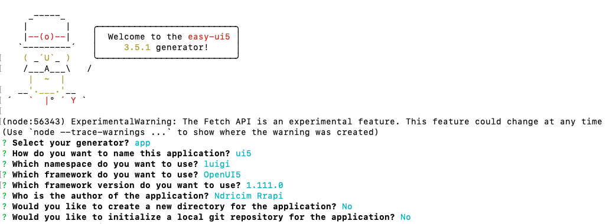

## Prerequisites
 - You need to install [Node.js](https://nodejs.org/en/download/current/). If you already have an old version installed on your machine, please run `npm install npm@latest -g`.
 - You need to install [SAP Fonts](https://experience.sap.com/fiori-design-web/downloads/#sap-icon-font).

## Details
### You will learn
  - How to create a skeleton React project
  - How to create a skeleton UI5 project
  - How to add Luigi and other dependencies to your project

---

[ACCORDION-BEGIN [Step 1:](Create React app)]

In this step, you will create a React skeleton project which will be used to create your Luigi app.

1. Open a Terminal or Command Prompt window and navigate to the space where you want to install the app. Then create a new folder:

    ```Shell
    mkdir luigi-react-ui5
    cd luigi-react-ui5
    ```

2. To create the React apps, use the commands:

    ```Shell
    npm i create-react-app
    ```

    and:

    ```Shell
    npx create-react-app react-core-mf
    ```


[DONE]
[ACCORDION-END]

[ACCORDION-BEGIN [Step 2: ](Install dependencies)]

> If you haven't already done so, make sure you install [SAP Fonts](https://experience.sap.com/fiori-design-web/downloads/#sap-icon-font).

In this step, you will install Luigi and its related dependencies, such as [Fundamental Styles](https://sap.github.io/fundamental-styles/) which the Luigi UI is based on.
You will also install [`webpack`](https://webpack.js.org) (a static module bundler) which will be useful for building your application.

1. Navigate to your core app:

    ```Shell
    cd react-core-mf
    ```

2. Install dependencies:

    ```Shell
    npm i -P @luigi-project/core @luigi-project/client fundamental-styles fundamental-react @sap-theming/theming-base-content react-router-dom
    ```

    and:

    ```Shell
    npm i copy-webpack-plugin webpack webpack-cli @babel/core @babel/preset-env babel-loader --save-dev
    ```

[DONE]
[ACCORDION-END]


[ACCORDION-BEGIN [Step 3: ](Create UI5 micro-frontend)]

In this step, you will create a skeleton UI5 project for your UI5 micro-frontend.

1. Navigate to the root folder of your project.

2. Create a new folder:

    ```Shell
    mkdir ui5-mf
    cd ui5-mf
    ```

3. Generate a new UI5 project:

    ```Shell
    npm install -g yo generator-easy-ui5
    ```

4. Type `yo` in the terminal and use the following settings:

    


[VALIDATE_1]
[ACCORDION-END]


---
