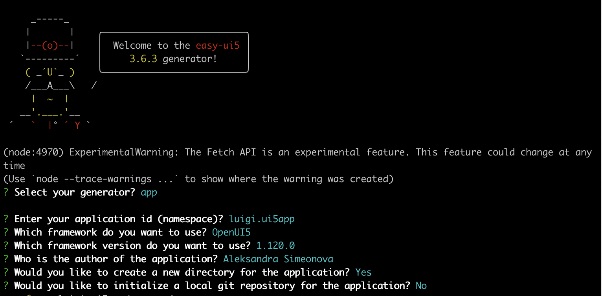
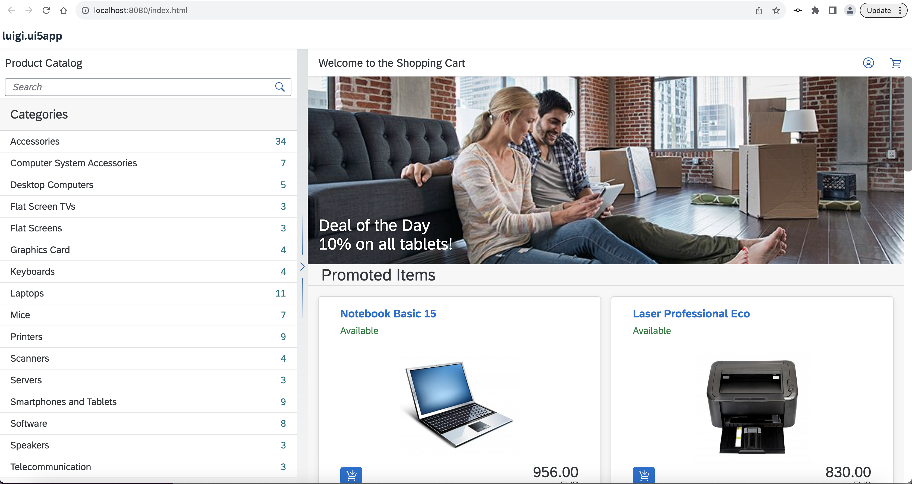
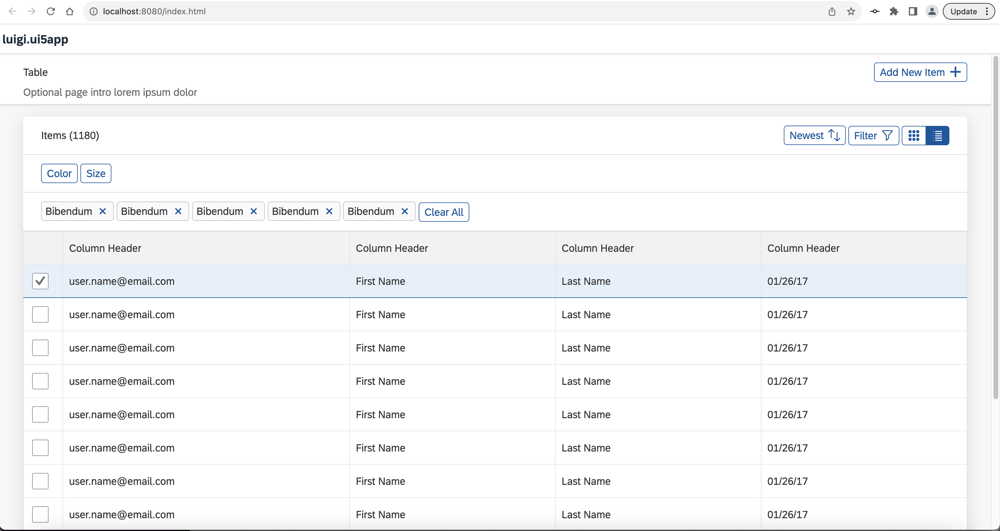

# Implement Micro Frontends in Your UI5 App with Luigi Container
<!-- description --> Learn how to build a UI5 application that utilizes the Luigi micro frontend framework. With the help of Luigi Container, you can create more modular and reusable applications in a simple way.

## Prerequisites
 - It is recommended to try the simpler Luigi examples on [GitHub](https://github.com/SAP/luigi/tree/main/core/examples) first to get acquainted with the framework.
 - You need to have [Node.js](https://nodejs.org/en/download/current/) installed.

## You will learn
  - The basics of the Luigi micro frontend framework and Luigi Container 
  - How to install Luigi Container
  - How to use Luigi Container inside a sample UI5 application

## Intro

[Project "Luigi"](https://luigi-project.io) is an open-source micro frontend framework suitable for SAP environments, providing Fiori-compliant navigation out-of-the-box. Luigi is technology-agnostic, allowing you to create your app using any given frontend toolkit. 

Normally, Luigi consists of two main parts: **Luigi Core** and **Luigi Client**. Core refers to the main app which houses the micro frontends, while Client refers to the micro frontends themselves. 

However, a third feature called [Luigi Container](https://docs.luigi-project.io/docs/luigi-container) allows you to easily insert Luigi micro frontends anywhere without the need for a Luigi Core application. This feature simplifies the use of Luigi for developers, eliminating the need for significant changes in their applications.

This tutorial will show you how to incorporate micro frontends inside a [UI5](https://sdk.openui5.org) application. Nevertheless, a similar process will also apply to other frontend frameworks such as [Angular](https://angular.io/) or [React](https://react.dev/).

> **Note:** In addition to this tutorial, you can also experiment with the Luigi Container test app on [GitHub](https://github.com/SAP/luigi/tree/main/container/test-app).

---

### Install UI5 generator 

1. Open a new Command Prompt/Terminal window and install the UI5 generator: 

    `npm install -g yo generator-easy-ui5`

2. Run this command to ensure that Yeoman has been installed correctly: 

    `yo`

Make sure the `easy-ui5` generator is listed.

### Create UI5 application 

1. Create your UI5 project:

    `yo easy-ui5`

2. Answer the prompts in this way to create your new project: 

    <!-- border -->

3. Run the app locally:

    ```shell
    cd luigi.ui5app
    npm start # or "yarn start"
    ```

### Install Luigi Container 

Luigi Container can be installed via a [npm](https://www.npmjs.com/) package.

To use npm packages in UI5, you need to first install the tooling extension `ui5-tooling-modules`.

1. In your project directory, run: 

    ```shell
    npm install ui5-tooling-modules -D
    ```


2. In this step, you will add the UI5 tooling task and middleware declaration. Open your application's `ui5.yaml` file. Replace the content with the one below. Keep in mind that the version numbers might be higher in your case.

    ```yaml
    specVersion: "3.0"
    metadata:
    name: luigi.ui5app
    type: application
    framework:
    name: OpenUI5
    version: "1.120.0"
    libraries:
        - name: sap.m
        - name: sap.ui.core
        - name: themelib_sap_fiori_3
        - name: themelib_sap_horizon
    builder:
    customTasks:
        - name: ui5-tooling-modules-task
        afterTask: generateVersionInfo
    server:
    customMiddleware:
        - name: ui5-tooling-modules-middleware
        afterMiddleware: compression
        - name: ui5-middleware-livereload
        afterMiddleware: compression
    ```

3. Create a new folder called `control` in `luigi.ui5app/webapp`. In it, create a file called `LuigiContainer.js` and paste the following content into it: 

    ```javascript
    sap.ui.define([
        "sap/ui/core/webc/WebComponent",
        "@luigi-project/container"
    ], function(WebComponent) {
        "use strict";

        /**
         * The luigi.ui5app.control.LuigiContainer is a component to render a Luigi micro frontend (iframe or web component based) without the need of it being a Luigi Core application.
         */
        var LuigiContainer = WebComponent.extend("luigi.ui5app.control.LuigiContainer", {
            metadata: {
                tag: "luigi-container",
                properties: {
                    /**
                     * Defines the view URL to load
                     */
                    viewURL: {
                        type: "string",
                        defaultValue: "",
                        mapping: {
                            to: "viewURL"
                        }
                    },

                    /**
                     * Defines whether to load the Luigi component as web component
                     */
                    webComponent: {
                        type: "any",
                        defaultValue: false,
                        mapping: {
                            to: "webcomponent",
                            formatter: "_mapIsWebComponent"
                        }
                    },

                    /**
                     * Defines the height of the control
                     */
                    height: {
                        type: "sap.ui.core.CSSSize",
                        mapping: "style"
                    },

                    /**
                     * Defines the width of the control
                     */
                    width: {
                        type: "sap.ui.core.CSSSize",
                        mapping: "style"
                    },

                    /**
                     * Defines label of the Luigi component
                     */
                    label: {
                        type: "string",
                        defaultValue: ""
                    },

                    /**
                     * Defines the context to use
                     */
                    context: {
                        type: "object",
                        defaultValue: {}
                    },

                    theme: {
                        type: "string",
                        defaultValue: ""
                    }
                },
                methods: [
                    "updateContext", /** Updates the context of the Luigi component */ 
                    "sendCustomMessage", /** Sends a custom message to the referenced iFrame or web component */
                    "closeAlert" /** Sends a message to the Luigi component notifying that the alert has been closed */
                ] 
            }
        });

        LuigiContainer.prototype._mapIsWebComponent = function(vIsWebComponent) {
            return vIsWebComponent !== "false" && vIsWebComponent ? "true" : undefined;
        };

        return LuigiContainer;
    });
    ```

4. In Command Prompt/Terminal, download the Luigi Container npm package: 

    ```shell
    npm install @luigi-project/container
    ```

5. Go to the `package.json` file and ensure that the ` @luigi-project/container` and `ui5-tooling-modules` dependencies are added. Keep in mind that the version numbers might be higher in your case.

    ```json
    [...]
    "devDependencies": {
    [...]
    //Around line 30
        "ui5-tooling-modules": "^3.2.4"
    },
    "dependencies": {
        "@luigi-project/container": "^1.0.0"
    }
    ```

### Use Luigi Container 

1. In this step, you will use Luigi Container in your app and configure the Luigi [viewURL](https://docs.luigi-project.io/docs/navigation-parameters-reference/?section=viewurl) property in order to render a micro frontend on the page. Go to the `webapp/view/Main.view.xml` file of your UI5 application. Replace the content with the following: 

    ```xml
    <mvc:View
        controllerName="luigi.ui5app.controller.Main"
        displayBlock="true"
        xmlns="sap.m"
        xmlns:mvc="sap.ui.core.mvc"
        xmlns:core="sap.ui.core"
        xmlns:luigi="luigi.ui5app.control"
        core:require="{
            core: 'sap/ui/core/Core'
        }">

        <Page
            title="{i18n>appTitle}"
            text="{i18n>appTitle}"
            icon="sap-icon://accept"
            id="page"
            description="{i18n>appDescription}">
            <content>
                <luigi:LuigiContainer viewURL="https://sdk.openui5.org/test-resources/sap/m/demokit/cart/webapp/index.html" theme="{= core.getConfiguration().getTheme() }"/>
            </content>
        </Page>

    </mvc:View>
    ```

2. Run your application:

    ```shell
    npm start
    ```

3. Open `http://localhost:8080/` in your browser. You should see a sample shopping app with the URL `https://sdk.openui5.org/test-resources/sap/m/demokit/cart/webapp/index.html` on your page: 

    <!-- border -->

4. Now that your application is using Luigi Container, you can easily exchange micro frontends in order to create a modular, scalable app. To insert a different micro frontend, simply go back to `webapp/view/Main.view.xml` and change the Luigi [viewURL](https://docs.luigi-project.io/docs/navigation-parameters-reference/?section=viewurl) property like so:  

    ```xml
    [...]
            <content>
                <luigi:LuigiContainer viewURL="https://fiddle.luigi-project.io/examples/microfrontends/fundamental/table-demo-page.html" theme="{= core.getConfiguration().getTheme() }"/>
            </content>
    [...]
    ```

5. Open `http://localhost:8080/` in your browser. You should see the new micro frontend on your page: 

    <!-- border -->