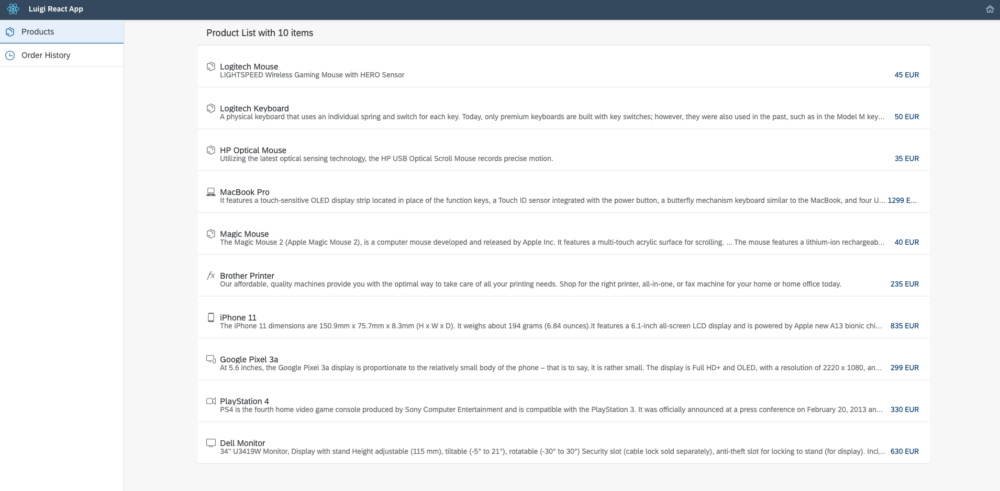

## Details
### You will learn
  - What micro-frontends are
  - What the Luigi project is
  - Luigi terminology

---

[ACCORDION-BEGIN [Step 1:](What are micro-frontends?)]

Micro-frontends are often called "microservices for the front-end". They allow you to break down large monolith front-ends into independent, scalable, individual parts which work together. Micro-frontend architecture is especially useful for complex products or companies with many teams and can help you create consistent web applications.

Watch this video which explains the basics of micro-frontend architecture and how it can be implemented with Luigi:

<iframe width="560" height="315" src="https://www.youtube.com/embed/Bjp1_yvtR4Y" frameborder="0" allowfullscreen></iframe>

[DONE]
[ACCORDION-END]

[ACCORDION-BEGIN [Step 2: ](What is Luigi?)]

[Luigi](https://luigi-project.io) is an open source micro-frontend framework written in Svelte. It allows you to create a consistent user interface and navigation, while also offering additional features to make development easier. Its appearance is based on Fundamentals Library Styles. Luigi is technology agnostic, allowing you to build your app and add micro-frontends to it using React, Angular, UI5, or any other technology.

[Luigi Fiddle](https://fiddle.luigi-project.io) is a test playground where you can get a feel for Luigi.

This diagram portrays the basic architecture of Luigi:

[DONE]
[ACCORDION-END]

[ACCORDION-BEGIN [Step 3: ](Luigi terminology)]

This is a small list of Luigi terms that will be helpful when doing the tutorial:

- **Luigi Core** - refers to the main application inside which a micro-frontend is displayed. It includes the top and side navigation and all other settings related to the main application.
- **Luigi Client** - a term covering all micro-frontend-related settings offered by Luigi. Micro-frontends are configurable via the Luigi Client API.
- **Parameters** - parameters are the elements used to configure your Luigi application. Read the Luigi documentation for a full list of [navigation](https://docs.luigi-project.io/docs/navigation-parameters-reference), [authorization](https://docs.luigi-project.io/docs/authorization-configuration), and [general settings](https://docs.luigi-project.io/docs/general-settings) parameters.
- **Navigation nodes** - the individual links of the side navigation in Luigi.
- **Contexts** - contexts are Luigi parameters which allow you to pass objects to the micro-frontend.
- **Views** - another name for micro-frontends.

[VALIDATE_1]
[ACCORDION-END]

[ACCORDION-BEGIN [Step 4: ](What you will build)]

In the subsequent tutorials, you will create an application with Luigi from scratch. It will be based around the idea of a **web shopping platform** and it will include additional features such as localization for displaying the website in English and German.

The app consists of three main parts:

1. Luigi Core app built using React: the "main app" which houses the micro-frontends and includes the top and side navigation that stays consistent no matter which sub-page of the app you navigate to.

2. Micro-frontends built using React: they include the homepage, a "Products" page, and a "Product Detail" list with information on each product.

3. Micro-frontend built using UI5: an "Order History" page showing the quantity and price of products that were purchased.

In the end, the homepage for your finished app should look like this:

!

If you need help with the tutorials:

- Refer to the source code for the completed app on our [SAP Samples repository](https://github.com/SAP-samples/luigi-micro-frontend-application).  
- Contact the Luigi team on [Slack](https://slack.luigi-project.io).

[DONE]
[ACCORDION-END]

---
