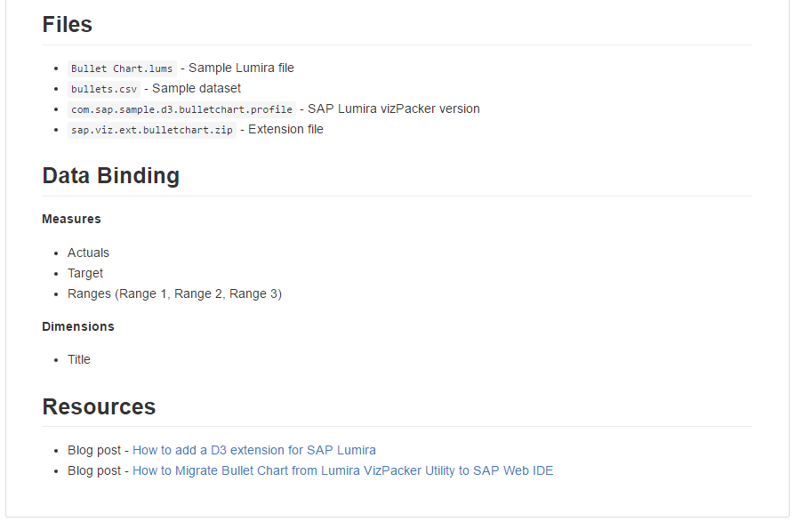
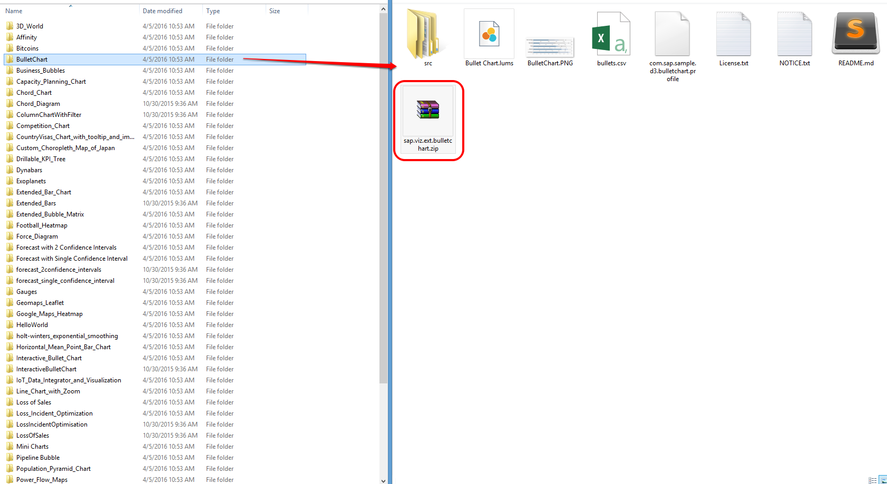
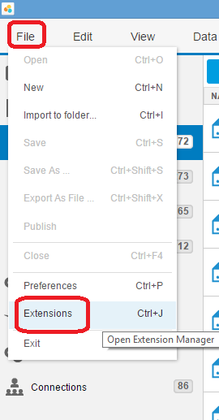

## Prerequisites  
 - **Proficiency:** Beginner
 - **Tutorials:** [Download and install SAP Lumira](https://www.sap.com/developer/tutorials/lumira-install.html)

## Next Steps
 - [Creating a new viz extension project](https://www.sap.com/developer/tutorials/lumira-web-ide-create-viz-extension.html)

## Details
### You will learn  
How to find and download SAP Lumira visualization extensions, install them in SAP Lumira and then use them.

### Introduction to SAP Lumira Visualization Extensions
SAP BusinessObjects Lumira, a self-service BI tool, uses in-built data visualization charts (as seen in the prerequisite tutorial). Sometimes, the data you want to represent may not be appropriately visualized with existing chart types. Or maybe you may have a creative way of visualizing data differently. SAP Lumira Visualization Extensions enable you to do just that. They are essentially plugins that enable customized and different types of charts which allow you to explore and visualize your data better.

There are approximately 50+ viz extensions open sourced and available for download from [GitHub](https://github.com/SAP/lumira-extension-viz) at present.

There are also commercially available extensions developed by SAP Partners, that come with support, service and maintenance, available on the [SAP Analytics Extensions Directory](https://analytics-extensions.enter.sap/)

In this tutorial, you will learn how to use an example viz extension (Bullet Chart), find how to download it, install it in SAP Lumira and use it like you would a native Lumira chart.

### Time to Complete
**5 Min**.

---

1. Go to the link: [https://github.com/SAP/lumira-extension-viz](https://github.com/SAP/lumira-extension-viz)

2. The link leads to the GitHub repository for SAP Lumira visualization extensions. You can see that the repository consists of various folders, one for each visualization extension.

    

    If you go to each folder, there will be details of each particular extension, how the data is structured, what the relevant files are, and links to resources and blogs about the extension.

    For example, click on the **Bullet Chart** and you can see the following structure. The highlighted .zip file is the installable extension which you will later use.

    

    `README.md` is a default file containing a description and details of the code.

    

3.  You may either clone the repository to your GitHub desktop client, or you can download the entire repository as a .zip file, which you can unzip after download.

    

4. Once you have cloned or downloaded and unzipped the repository, select any extension you want by going to the respective folders. The .zip file within each folder with the format `companyname.viz.ext.extensionname` is the installable extension file.

    For this example, choose the `BulletChart`. The name of the zip with the extension should be `sap.viz.ext.bulletchart.zip`

    

5. Now open SAP Lumira and go to **File -> Extensions**. This will open the **Extension Manager**. Alternatively, you can also press `Ctrl + J` on your keyboard.

    

6. In the **Extension Manager**, select **Manual Installation**. You will be prompted to select an installable .zip file, as mentioned in step 4.

    

7.  Once you've installed your extension, close the **Extension Manager** and also restart SAP Lumira Desktop.

    Open the file `Bullet Chart.lums` available from within the same individual extension folder where you find the installable extension .zip file

    

    > ### Note
    > You can as well choose the `csv` dataset that comes with the extension.

8.  Now go to the **Chart Picker** in the **Visualize Room** of the SAP Lumira document you created, and go to the **Chart Extensions** drop-down. From here you can select **Bullet Chart** or any other chart from visualization extensions you have installed.

    

9.  Now you will be able to use Bullet Chart to do your own visualizations in SAP Lumira as well.

    > ### Note
    > Some differences may exist between viz extension charts and native Lumira charts, for example the ability to have custom controls like adding a reference line, data filters, are present in native Lumira charts, but may or may not be available for charts based on visualization extensions depending on how they were developed.

## Optional Steps
 - Explore visual extensions available from SAP Partners at the [SAP Analytics Extensions Directory](https://analytics-extensions.enter.sap/)
 - You can explore as well open sourced visual extensions provided by community, like <https://github.com/michalkorzen/lumira-sankey-advanced>
 - Think about contributing your own viz extensions as open source as well

