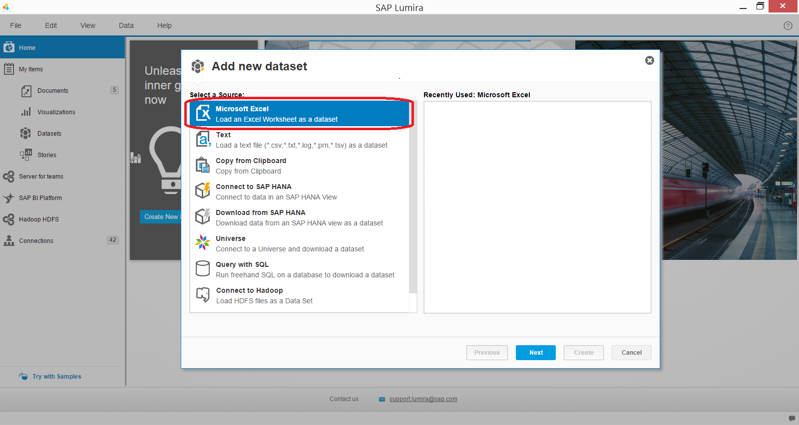
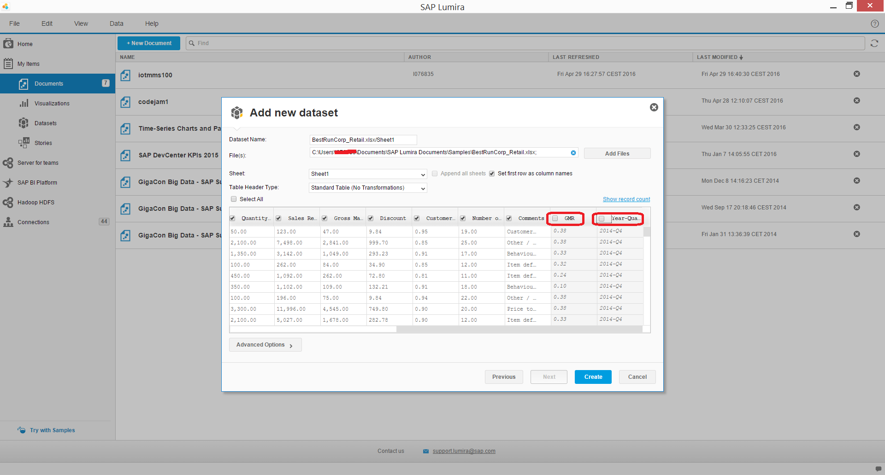
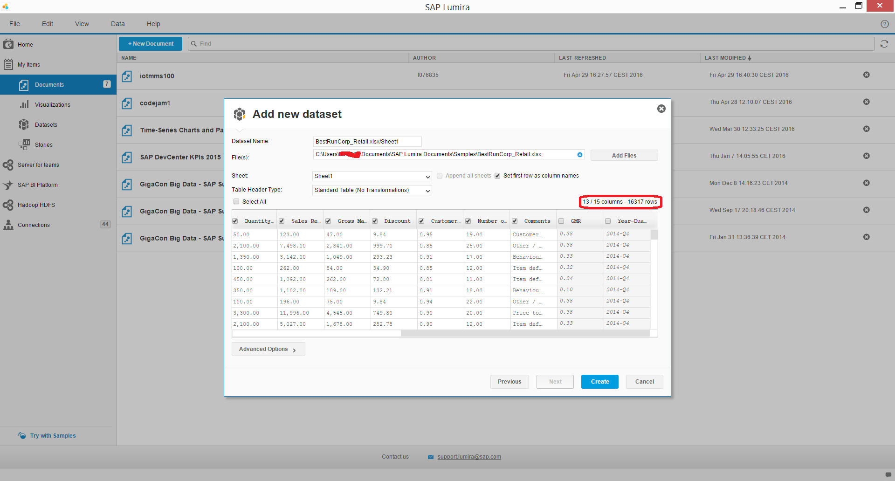
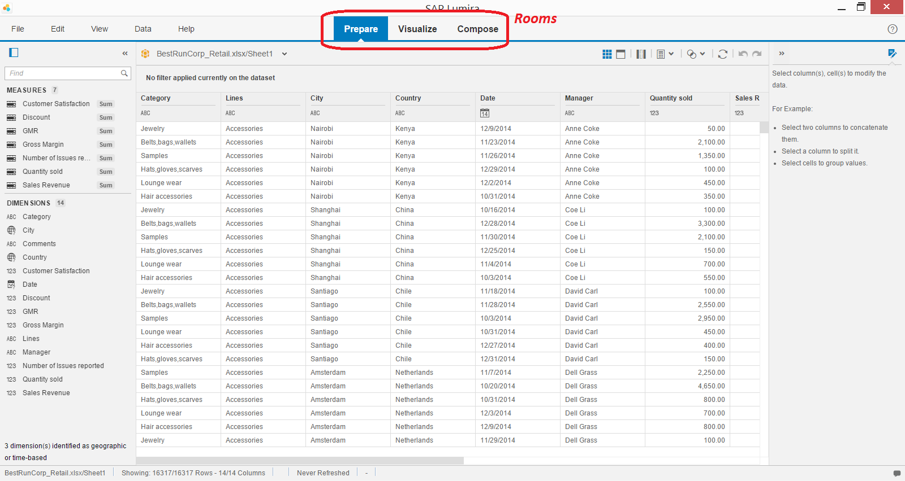
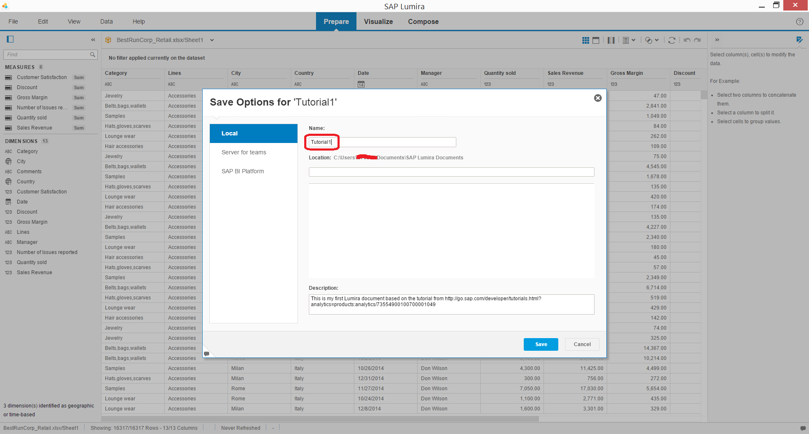

## Prerequisites  
 - **Proficiency:** Beginner
 - **Tutorials:** [Download and install SAP BusinessObjects Lumira](http://go.sap.com/developer/tutorials/lumira-install.html)

## Next Steps
 - Select a tutorial from the [Tutorial Navigator](http://go.sap.com/developer/tutorial-navigator.html) or the [Tutorial Catalog](http://go.sap.com/developer/tutorials.html)

## Details
### You will learn  
How to acquire data into SAP BusinessObjects Lumira using sample MS Excel file.

### Time to Complete
**5 Min**.

---

1. Open SAP BusinessObjects Lumira. Create new document by selecting **File** -> **New** from the menu.

    

    You can also press `Ctrl+N`.

    > In this example screenshots from SAP BusinessObjects Lumira version 1.30 in English are being used. They may be slightly different between versions and application languages.

2. Create a new Dataset by selecting **Microsoft Excel** as a source, pressing **Next**, and then `BestRunCorp_Retail.xlsx` from the your user’s directory `…\Documents\SAP Lumira Documents\Samples\`. SAP BusinessObjects Lumira installation add a few different sample files, and this MS Excel file with data is one of them.

> If for any reason you do not have that file or that directory in your local installation, then download [`BestRunCorp_Retail.xlsx`](./BestRunCorp_Retail.xlsx) file.

   

3. Dataset preview is displayed. At this stage you can decide what columns from the dataset are needed for further analysis. You will not need **Year-Quarter** and **GMR** (Gross Margin) columns, so uncheck them.

   

4. Click on **Show records count** to check numbers of rows and columns to be acquired from this dataset. You are about to create a document with a dataset that has 16317 rows with 13 columns.

   

   Click **Create**.

5. SAP BusinessObjects Lumira opens the dataset in the new document ready for data discovery and visualizations. One of so called 'rooms' is open for your further activities: **Prepare**, **Visualize**, or **Compose**. It depends on the preferences settings accessible from **File** -> **Preferences** -> **General** -> **Default Room**

   

6. Save the current document locally at your computer as `Tutorial1`.

   

   > Please note that all SAP BusinessObjects Lumira documents are saved in the same default directory under user's `…\Documents\SAP Lumira Documents\`.

   > Lumira documents have extension `.lums` and in fact are zipped archives containing multiple files, like configuration and data files, visualization thumbnails etc.

## Next Steps
 - Select a tutorial from the [Tutorial Navigator](http://go.sap.com/developer/tutorial-navigator.html) or the [Tutorial Catalog](http://go.sap.com/developer/tutorials.html)
