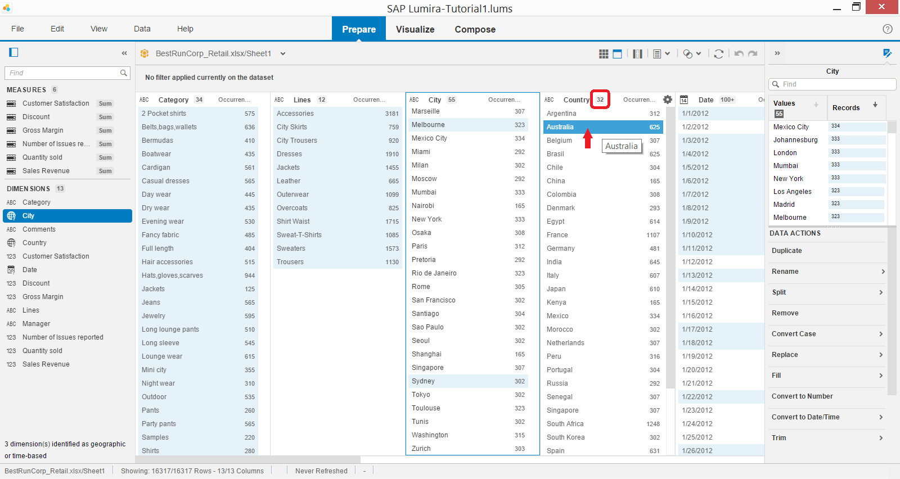
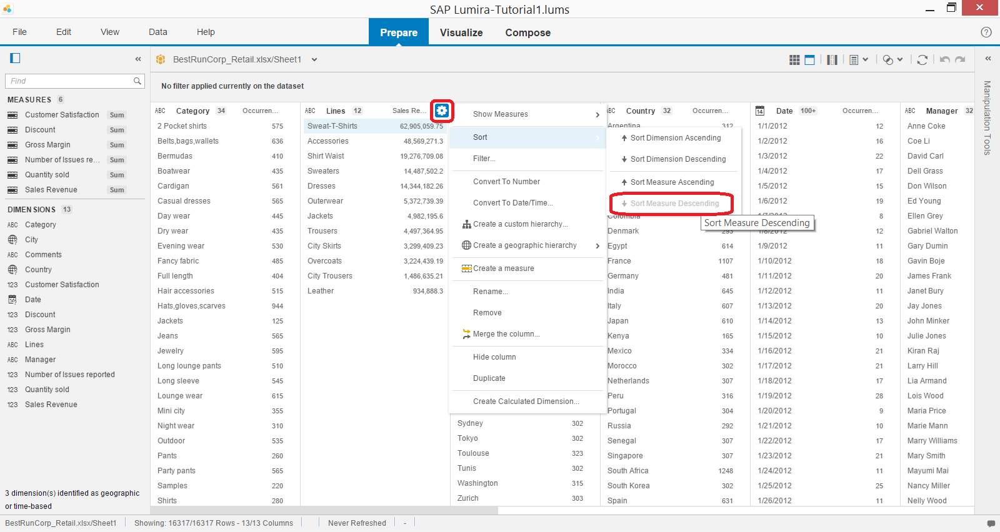

## Prerequisites  
 - **Proficiency:** Beginner
 - **Tutorials:** [Initial data acquisition in SAP BusinessObjects Lumira](http://go.sap.com/developer/lumira-initial-data-acquisition.html)

## Next Steps
 - Basics of data visualization (coming soon)

## Details
### You will learn  
How to understand the dataset that has been added to SAP BusinessObjects Lumira.

### Time to Complete
**10 Min**.

---

1. Make sure you opened the Prepare room of SAP BusinessObjects Lumira to explore the data acquired in the previous tutorial.

    In Status bar check how many rows and columns are in the dataset. In this example the dataset has 16317 rows with 13 columns and all are displayed.

    

    All of the columns became as well **Dimensions** to analyse data. Dimensions with numeric data has been recognized by SAP BusinessObjects Lumira as **Measures**, which can be used for numerical analysis using different types of aggregation. Aggregation of the type `Sum` is the default for measures.

    > You can check UI components terminology of SAP BusinessObjects Lumira by downloading the Terminology Quick Reference from User Guides at available at [SAP BusinessObjects Lumira help portal](http://help.sap.com/lumira#section2).

2. To better understand values of dimensions in your dataset switch display of the Data pane to **Facets**.

    

    Now each facet displays a list of unique values of corresponding dimension. And you can see the number of unique values in the given dimension right next the to facet's name. In this case there are 32 distinct values of Country in your example.

    If a dimension has more than 100 values, like in case of the **Date** dimension, then `100+` is displayed by default. Click on it to force the facet view to calculate the exact number of distinct values of corresponding dimension.

3. Right click on the Facet's value highlights all related values from other dimensions, i.e. all values which appear in same rows with the selected one. Right click on Australia, and you see Melbourne and Sydney highlighted in the **City** facet.

    

4. Facet's values are ordered alphabetically by default and display the number of occurrences next to each value.

    Click on **Options** button next to the **Lines** Facet's name, and change the measure from Occurrences to **Sales Revenue**.

    

5. To find top selling lines of products change the sort order by clicking on **Options** button next to **Lines** facet's name and selecting **Sort**->**Sort Measure Descending**.

    You can see that top selling line of products is `Sweat-T-Shirts`.

    

6. And to find what lines of products are best selling in Australia, add the filter by clicking on **Options** button and then selecting **Filter...** to open a dialog box. Select `Australia` and then click **Apply**.

    

    You should notice that Austria has been added as a filter in **Filters bar**. Remove it from there by clicking `x` after you analyse filtered data.

    

### Optional
 - You can learn more about data exploration using SAP BusinessObjects Lumira from the product's official [user guide](http://help.sap.com/lumira#section2)

## Next Steps
- Basics of data visualization (coming soon)
