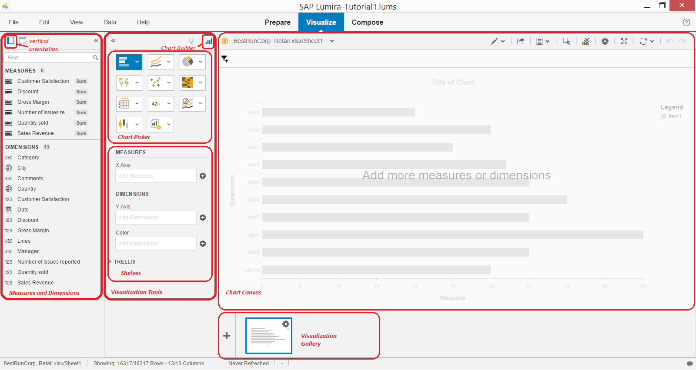
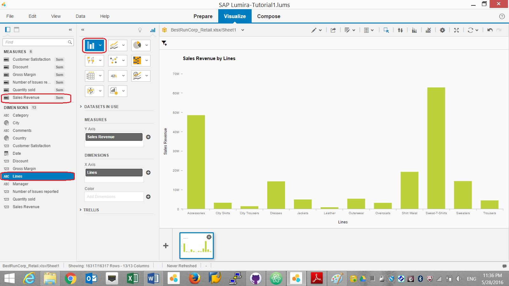
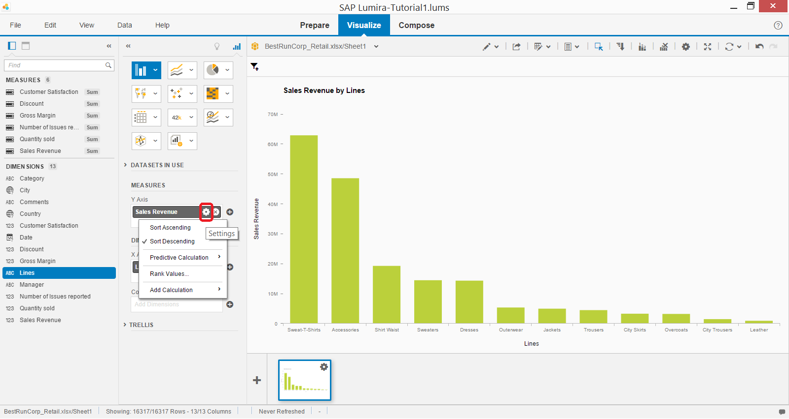
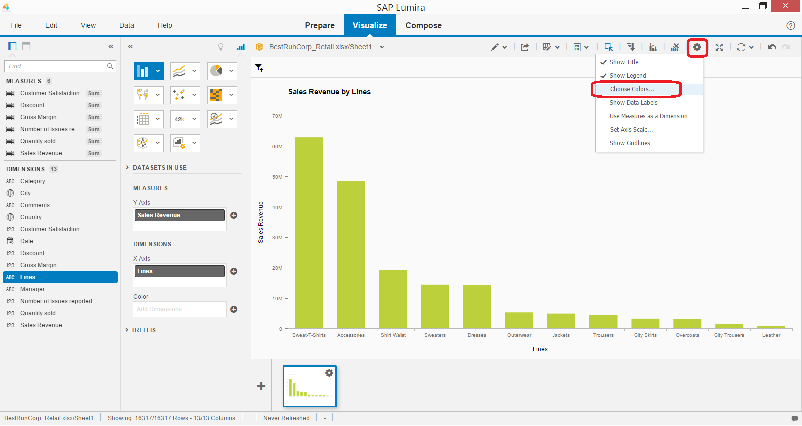
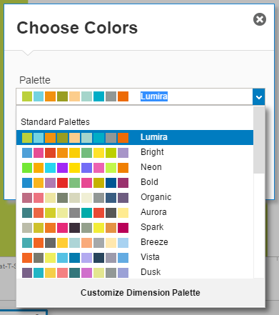
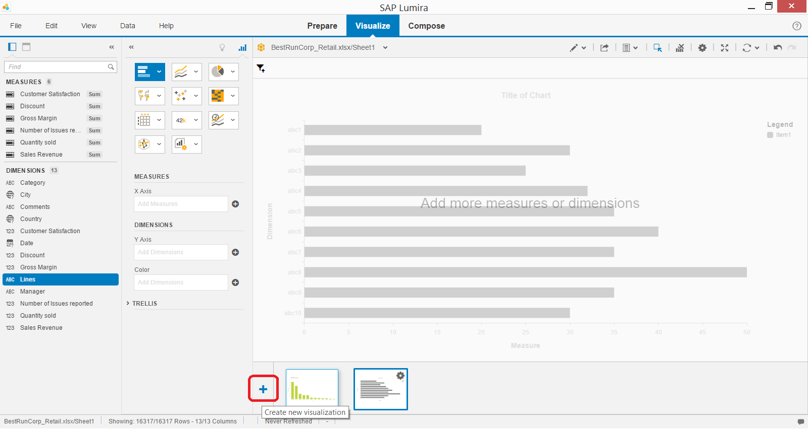
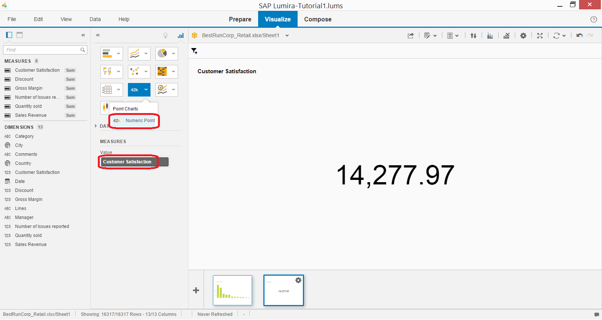
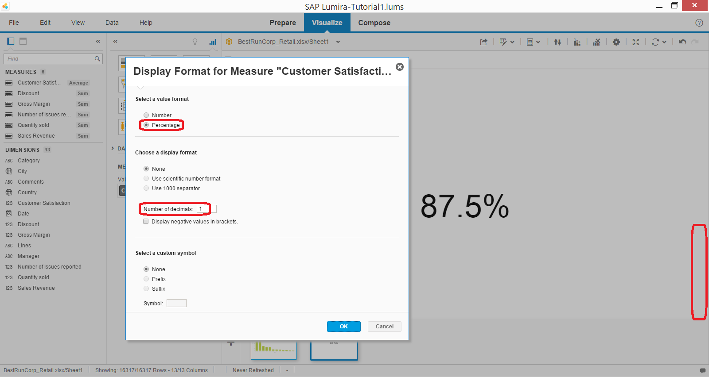

## Prerequisites  
 - **Proficiency:** Beginner
 - **Tutorials:** [Initial data exploration in SAP BusinessObjects Lumira](http://www.sap.com/developer/tutorials/lumira-initial-data-exploration.html)

## Next Steps
 - Time dimension and data drilling (coming soon)

## Details
### You will learn  
The basics of data visualization: creating charts suggested by the system or manually, doing time-series analysis and predictions

### Time to Complete
**10 Min**.

---

1. Switch to **Visualize** room.

    By default it displays **Chart Builder** in **visualization tools**, and **Vertical Orientation** of **Measures and Dimensions** pane.

    

2. For now you will focus on manual data discovery using visualizations.

    Start with simple **Column Chart**, which you should select from **Chart Picker**. Next, drag `Sales Revenue` from Measures and drop it on **Chart Canvas**. Then drag `Lines` from Dimensions to the Chart Canvas as well.

    > You could as well drop these attributes to **Shelves**.

    You should get a column chart like this.

    

     A human eye can immediately spot that the best selling line of products was `Sweat-T-Shirts`.

3. Let's sort lines of products by sales revenue on the chart.

    For that just move the mouse over `Sales Revenue` in the Shelves, then click on **Settings** icon that appears, and choose **Sort Descending**.

    

4. You can change predefined palette of colors used in a chart by clicking on **Settings** icon in the canvas, and selecting **Choose Colors...**.

    

    SAP BusinessObjects Lumira offers a long list of predefined palettes, which can be modified or new palettes can be defined by you.

    

5. Click on the **+** in the visualization gallery to create a new visualization. The previous one - the column chart - is remembered in the gallery.

    

6. For this newly created visualization choose **Numeric Point** chart and add `Customer Satisfaction` as a measure.

    

    > Numeric Point chart is often used at the later stage in data stories, as you will see in corresponding tutorials.

7. Summarized customer satisfaction scores do not make sense. You need to display an average score.

    To do that click on **Options** icon next to `Customer Satisfaction` measure and from **Change Aggregation** choose **Average**.

    You can see now that the average Customer Satisfaction score across all countries, products and years is 0.88.

    

8. Now you should change the way Customer Satisfaction displayed to the percentage format.

    To do that click on **Options** icon next to `Customer Satisfaction` measure and choose **Display Formatting...**

    Now change value format to **Percentage** and **Number of decimals** to `1`. Accept changes.

    

9. Save the document.

## Optional Steps

 - If you want to further explore SAP BusinessObjects Lumira user tutorials, please check https://wiki.scn.sap.com/wiki/pages/viewpage.action?pageId=449287573

## Next Steps
 - Time dimension and data drilling (coming soon)
