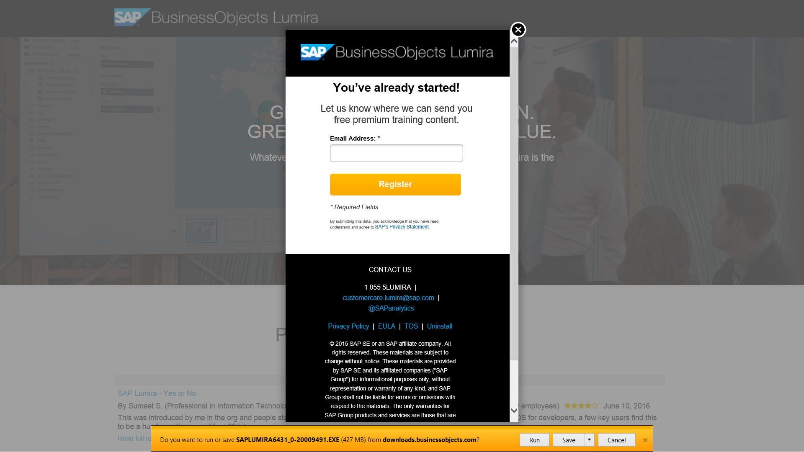

## Prerequisites  
 - **Proficiency:** Beginner

## Next Steps
- [Initial data acquisition in SAP BusinessObjects Lumira](http://go.sap.com/developer/tutorials/lumira-initial-data-acquisition.html) if you are just learning basics of SAP BusinessObjects Lumira
- [Install and Deploy SAP BusinessObjects Lumira extensions](http://go.sap.com/developer/tutorials/lumira-extensions-intro.html) if you want to continue with development of extensions

## Details
### You will learn  
How to download the SAP BusinessObjects Lumira Desktop, and install it on your personal computer with Microsoft Windows operating system.

### Time to Complete
**10 Min**.

---

1. Go to [http://saplumira.com/](http://saplumira.com/) and click on the **TRY IT FREE** button

    

2. You will be directed to the SAP Store, where you will be able to start immediate download of SAP BusinessObjects Lumira.

   Register your e-mail to receive additional free premium content.

    

3. Once the file is downloaded follow the step-by-step installation process with the help of the installer. Restart your computer after installation has been completed.

    > ### Note
    > For further reference information about the installation of SAP BusinessObjects Lumira Desktop, please refer to the documentation: [Installation and Upgrade Information](http://help.sap.com/lumira#section3)

## Next Steps
- [Initial data acquisition in SAP BusinessObjects Lumira](http://go.sap.com/developer/tutorials/lumira-initial-data-acquisition.html) if you are just learning basics of SAP BusinessObjects Lumira
- [Install and Deploy SAP BusinessObjects Lumira extensions](http://go.sap.com/developer/tutorials/lumira-extensions-intro.html) if you want to continue with development of extensions
