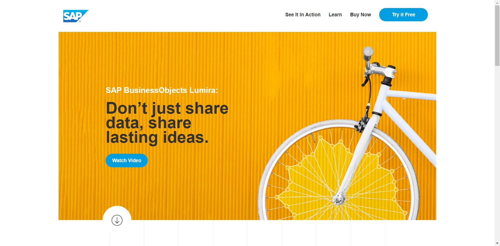
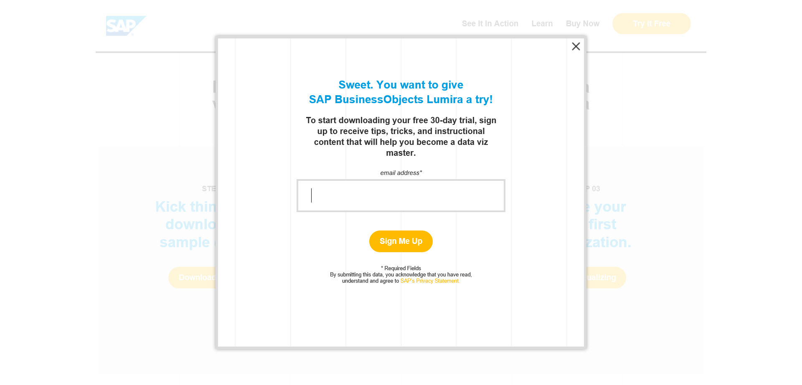
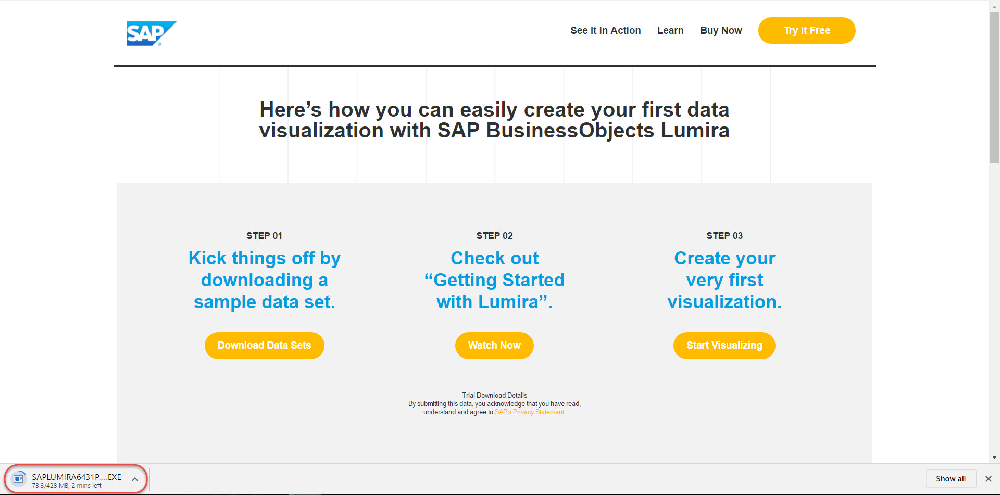

## Prerequisites  
 - **Proficiency:** Beginner

## Next Steps
- [Initial data acquisition in SAP BusinessObjects Lumira](https://www.sap.com/developer/tutorials/lumira-initial-data-acquisition.html) if you are just learning basics of SAP BusinessObjects Lumira
- [Install and Deploy SAP BusinessObjects Lumira extensions](https://www.sap.com/developer/tutorials/lumira-extensions-intro.html) if you want to continue with development of extensions

## Details
### You will learn  
How to download the SAP BusinessObjects Lumira Desktop, and install it on your personal computer with Microsoft Windows operating system. 

### Time to Complete
**10 Min**.

---

1. Go to [http://saplumira.com/](http://saplumira.com/) and click on the **TRY IT FREE** button

    

2. You will be requested to register your e-mail to download the trial and to receive additional free premium content.

    

    Once requested the download of the SAP BusinessObjects Lumira starts.

    

3. Once the file is downloaded follow the step-by-step installation process with the help of the installer.

    SAP BusinessObjects Lumira Desktop will start in 30-day trial mode after installation has been completed. Restart Lumira Desktop once to finish installation of sample files.

    > ### Note
    > For further reference information about the installation of SAP BusinessObjects Lumira Desktop, please refer to the documentation: [Installation and Upgrade Information](https://help.sap.com/lumira#section3)

## Next Steps
- [Initial data acquisition in SAP BusinessObjects Lumira](https://www.sap.com/developer/tutorials/lumira-initial-data-acquisition.html) if you are just learning basics of SAP BusinessObjects Lumira
- [Install and Deploy SAP BusinessObjects Lumira extensions](https://www.sap.com/developer/tutorials/lumira-extensions-intro.html) if you want to continue with development of extensions
