## Prerequisites  
  - You have access to an SAP Cloud Platform account. If you don't have an account, you can open a trial one. See the [tutorial](https://developers.sap.com/tutorials/hcp-create-trial-account.html) or [documentation](https://help.sap.com/viewer/65de2977205c403bbc107264b8eccf4b/Cloud/en-US/65d74d39cb3a4bf8910cd36ec54d2b99.html).
  - You are using a Windows desktop.

## Details  
### You will learn  
- How to set up your environment to use SAP Cloud Platform Rapid Application Development
- How to open SAP Cloud Platform Rapid Application Development

You can build business applications for the SAP Cloud Platform Cloud Foundry environment using SAP Cloud Platform Rapid Application Development by Mendix, without needing to write code.

In this tutorial, you will set up your SAP Cloud Platform account so you can use SAP Cloud Platform Rapid Application Development to build applications to be deployed on SAP Cloud Platform.

>This tutorial assumes that you are using a trial Cloud Foundry environment.

> The Mendix Studio Pro, for building your application, is available for Windows platforms only.

---

[ACCORDION-BEGIN [Step 1: ](Cloud Foundry trial)]
If you do not already have a Cloud Foundry environment, click **Trial Home** or go to [cockpit.hanatrial.ondemand.com](cockpit.hanatrial.ondemand.com).

Log into your SAP Cloud Platform account.

!

You will see two buttons on the welcome screen of the SAP Cloud Platform Cockpit. Click on **Enter Your Trial Account** to see your global account.

!
> Bookmark the link for fast and quick access to the cockpit.  

The global trial account contains **one** subaccount and space. Navigate to subaccount by clicking on the tile named **trial** (this name may vary if you created the subaccount manually).

!

To get to the space, in which your applications and services live, click on the **dev** space.

!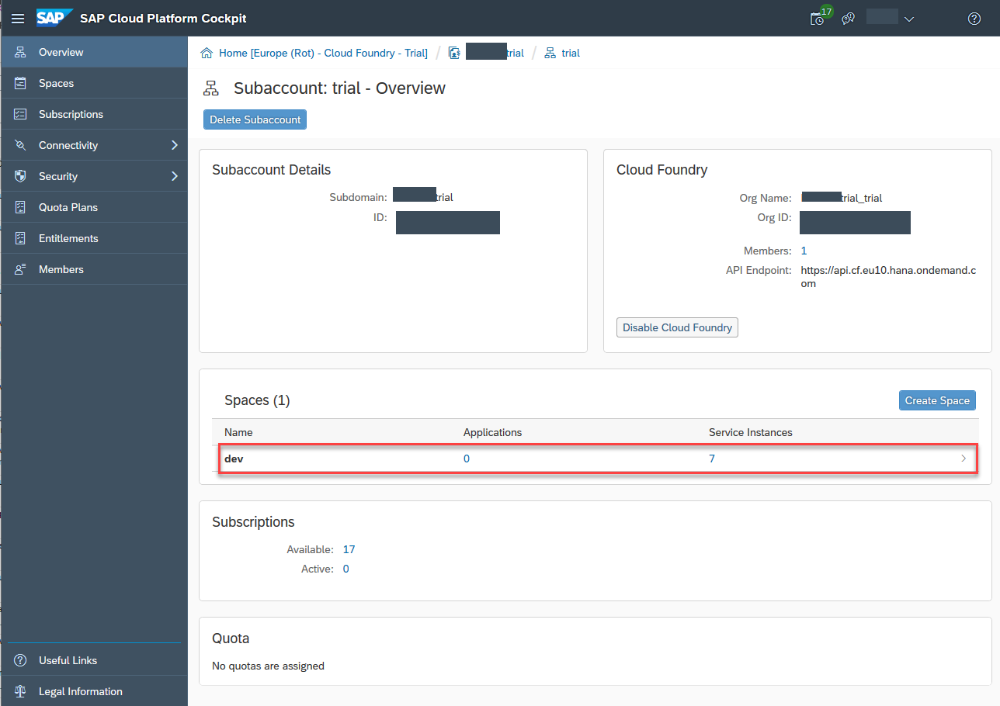

For more information about creating a Cloud Foundry environment, see [Get a Trial Space on the Cloud Foundry Instance](https://help.sap.com/viewer/65de2977205c403bbc107264b8eccf4b/Cloud/en-US/76e79d62fa0149d5aa7b0698c9a33687.html).

[DONE]
[ACCORDION-END]

[ACCORDION-BEGIN [Step 2: ](Open the Mendix portal)]
Go to [https://account.hana.ondemand.com/#/home/welcome](https://account.hana.ondemand.com/#/home/welcome) to open the Mendix portal.

Choose **Services** (left-side navigation tree), and then find the **Rapid Application Development by Mendix** tile. You can filter the services by entering `Mendix` in the search field at the top right.

!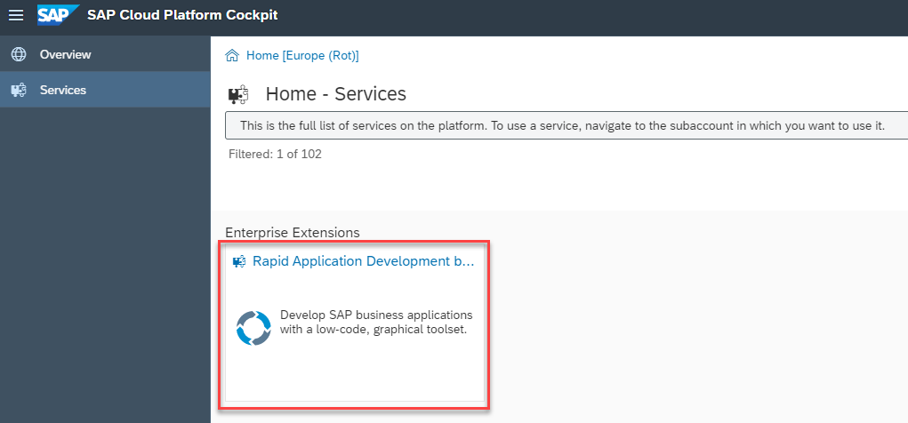

Choose the tile, and then from the **Rapid Application Development by Mendix** service screen, choose **Open Development Portal**.

!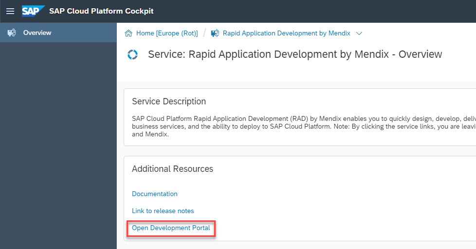

This opens the registration page.

[DONE]
[ACCORDION-END]

[ACCORDION-BEGIN [Step 3: ](Create a Mendix account)]
Choose to **Sign in**.

!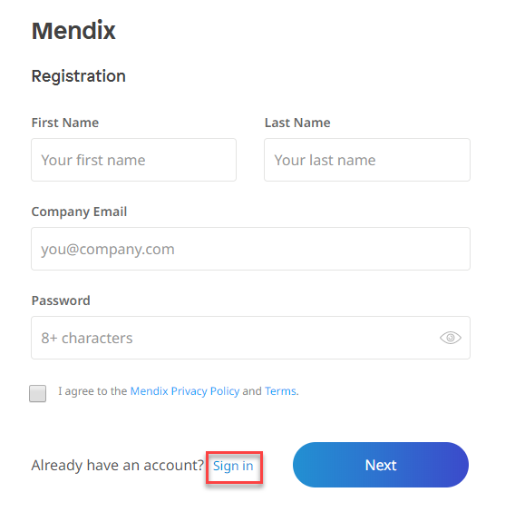

Choose to **sign in with SAP**.

!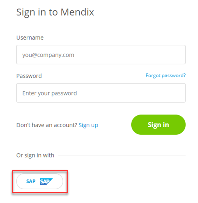

Choose your SAP Cloud Platform region from the drop-down and click **Select region**.

!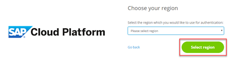

This will redirect you to SAP Cloud Platform's login page. Enter your SAP Cloud Platform credentials and sign in.

!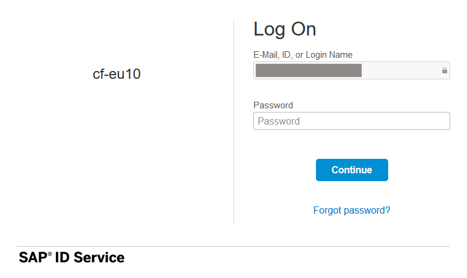

Choose **Authorize**.

!

Choose **Confirm**.

!

Enter your name and a password and choose **Create**.

!

Select the best option and choose **Next**.

!

Select the reason you signed up for Mendix and choose **Submit**.

!

Now you're in the Mendix development portal.

[DONE]
[ACCORDION-END]

[ACCORDION-BEGIN [Step 4: ](Create app and environment)]
You need to set up an environment for your SAP app. An environment points to the Cloud Foundry environment that you want to deploy to.

You can do this now, or you can do this when you are ready to deploy. When you deploy, you will be prompted to create an environment. Environments are created for each project.

In the development portal home page, choose **Create App**.

!

If not already selected, choose SAP Apps to see the SAP-related templates.

!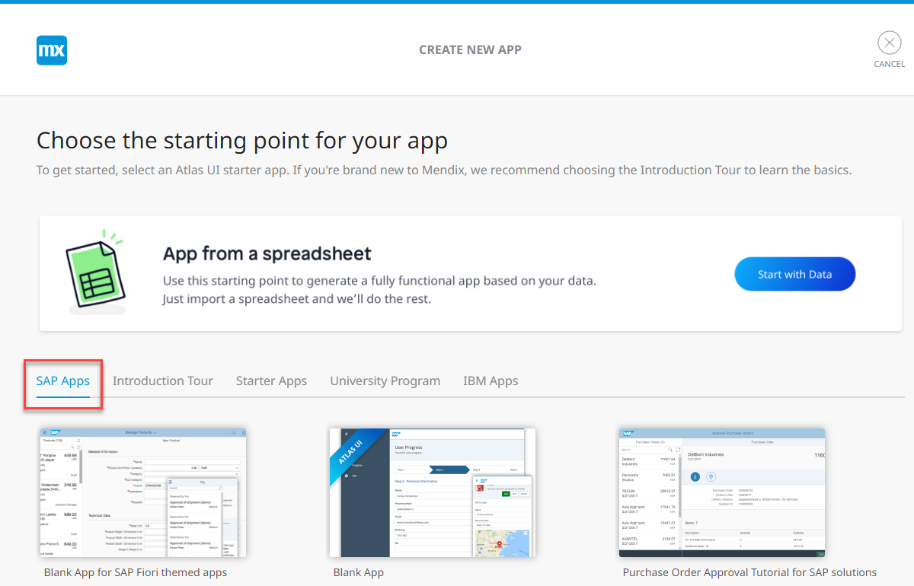

Choose the **Blank App for SAP Fiori themed apps** template and choose **View Details**.

!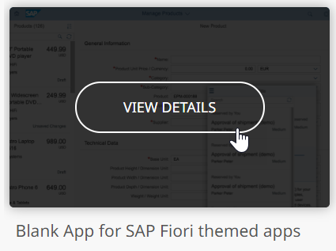

Choose **Use this app**.

!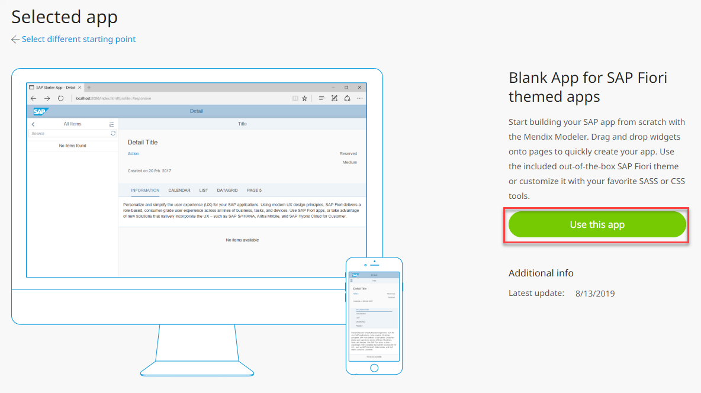

Enter a name, and choose **Create App**.

!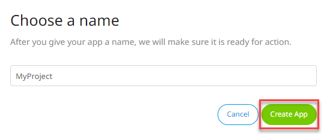

Select a region for SAP Cloud Platform and choose **Next**.

!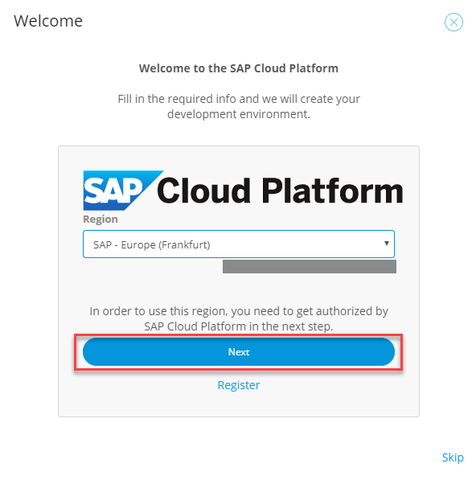

Choose the Cloud Foundry environment you want to deploy to.

- Select **cfapps.YourRegion.hana.ondemand.com** for the domain.

    -	 Select **cfapps.eu10.hana.ondemand.com** for a European region.

    -	 Select **cfapps.us20.hana.ondemand.com** for a specific US region.      
    
-	Select **hanatrial-schema** for the database.

Choose **Create**.

!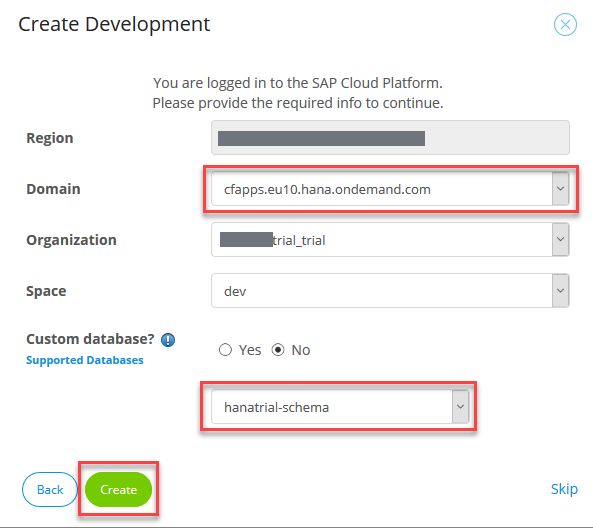

The environment is created. To see it, go to **Environments**.

!

[DONE]
[ACCORDION-END]

[ACCORDION-BEGIN [Step 5: ](Build your app)]
To start working on your app, choose **Edit App**.

Then choose **Edit in Mendix Studio Pro**.

!

You build apps using the Mendix Studio Pro, which is an application installed on your desktop. If you don't have the Mendix Studio Pro, install it by going to the [app store](https://appstore.home.mendix.com/link/modeler/).

!

[VALIDATE_5]

[DONE]
[ACCORDION-END]
