## Prerequisites  
- **Proficiency:** Beginner
- You have access to an SAP Cloud Platform account. If you don't have an account, you can open a trial one. See the [tutorial](https://www.sap.com/developer/tutorials/hcp-create-trial-account.html) or [documentation](https://help.sap.com/viewer/65de2977205c403bbc107264b8eccf4b/Cloud/en-US/65d74d39cb3a4bf8910cd36ec54d2b99.html).
- You are using a Windows desktop.

## Details  
You can build business applications for the SAP Cloud Platform Cloud Foundry environment using SAP Cloud Platform Rapid Application Development by Mendix, without needing to write code.

In this tutorial, you will set up your SAP Cloud Platform account so you can use SAP Cloud Platform Rapid Application Development to build applications to be deployed on SAP Cloud Platform.

>This tutorial is applicable whether you have a productive or trial Neo environment, but assumes that you are using a trial Cloud Foundry environment.

> The Mendix Desktop Modeler, for building your application, is available for Windows platforms only.

### You will learn  
- How to set up your environment to use SAP Cloud Platform Rapid Application Development.
- How to open SAP Cloud Platform Rapid Application Development.

### Time to Complete
**10 Min**

---

[ACCORDION-BEGIN [Step 1: ](Log onto SAP Cloud Platform)]

Go to [https://account.hana.ondemand.com/cockpit](https://account.hana.ondemand.com/cockpit) and log into your SAP Cloud Platform account.

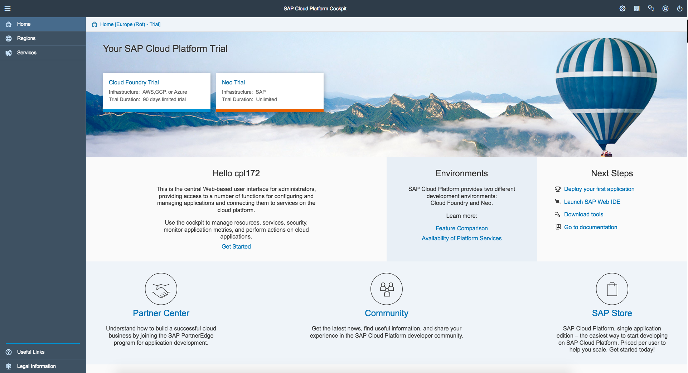

[ACCORDION-END]

[ACCORDION-BEGIN [Step 2: ](Cloud Foundry trial)]
If you do not already have a Cloud Foundry environment, go to **Home** | **Cloud Foundry Trial**.

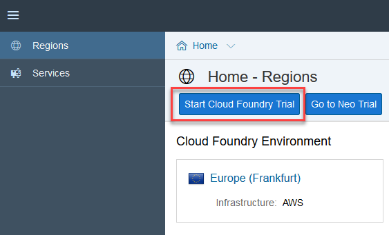

Choose a region for your Cloud Foundry environment, and then choose **OK**.

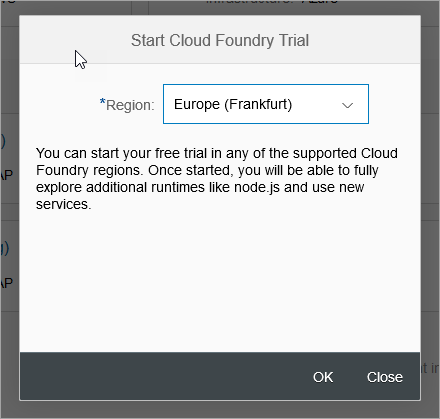

You will automatically be assigned a subaccount, an organization within your subaccount, and a space within your organization.

Then choose **Go to Space**.

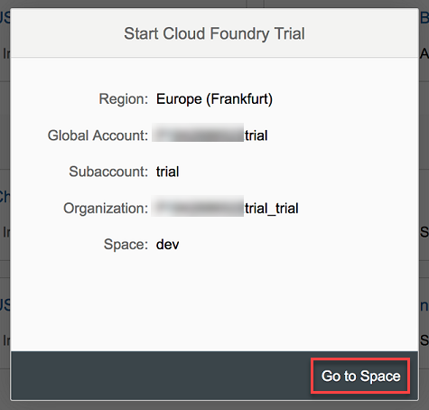

For more information about creating a Cloud Foundry environment, see [Get a Trial Space on the Cloud Foundry Instance](https://help.sap.com/viewer/65de2977205c403bbc107264b8eccf4b/Cloud/en-US/76e79d62fa0149d5aa7b0698c9a33687.html).

[ACCORDION-END]

[ACCORDION-BEGIN [Step 3: ](Open the Mendix portal)]
Go back to your Neo account. In the trial landscape, choose **Home** | **Neo Trial**.

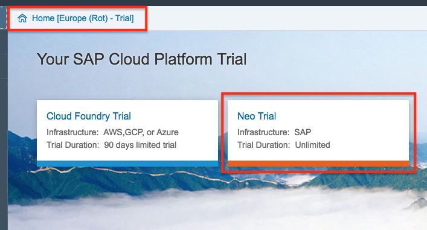

Choose **Services** (left-side navigation tree), and then find the **SAP Cloud Platform RAD, by Mendix** tile. You can filter the services by entering `Mendix` in the search field at the top right.

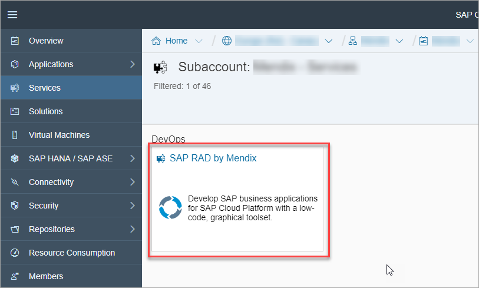

Choose the tile, and then from the **SAP Cloud Platform RAD by Mendix** service screen, choose **Open Development Portal**.

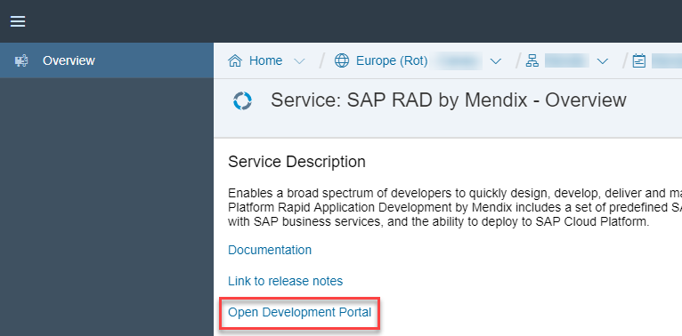

This opens the registration page.

[ACCORDION-END]

[ACCORDION-BEGIN [Step 4: ](Create a Mendix account)]
Choose to **Sign in**.

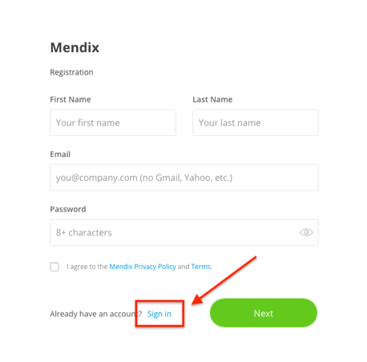

Choose to **sign in with SAP**.

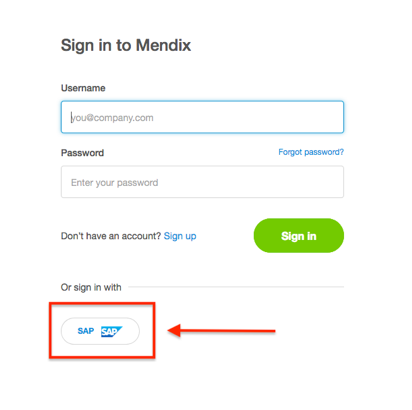

Choose your SAP Cloud Platform region from the drop-down and click **Select region**.

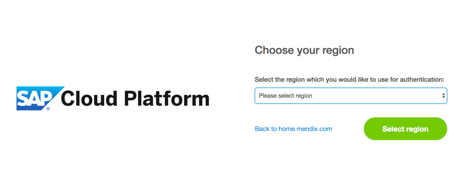

This will redirect you to SAP Cloud Platform's login page. Enter your SAP Cloud Platform credentials and sign in.

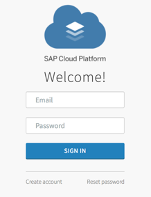

Choose **Authorize**.

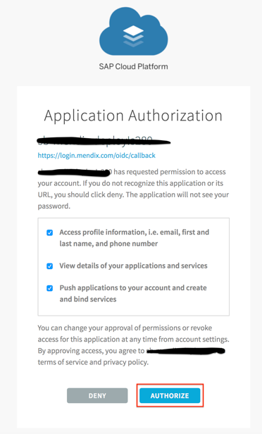

Choose **Confirm**.

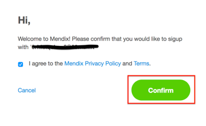

Enter your name and a password, and choose **Create**.

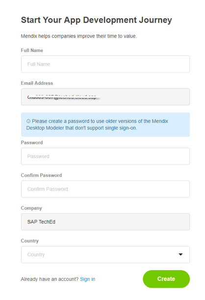

Select an option or choose to **Skip this step**.

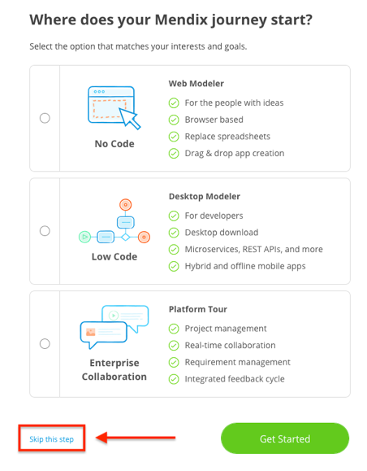

Now you're in the Mendix development portal.

[ACCORDION-END]

[ACCORDION-BEGIN [Step 5: ](Create app and environment)]
You need to set up an environment for your SAP app. An environment points to the Cloud Foundry environment that you want to deploy to.

You can do this now, or you can do this when you are ready to deploy. When you deploy, you will be prompted to create an environment. Environments are created for each project.

In the development portal home page, choose **Create App**.

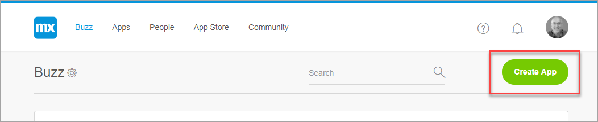

If not already selected, choose SAP Apps to see the SAP-related templates.

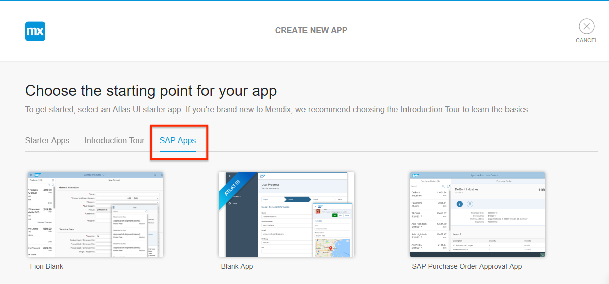

Choose the **Fiori Blank** template, and choose **View Details**.

Choose **Use this app**.

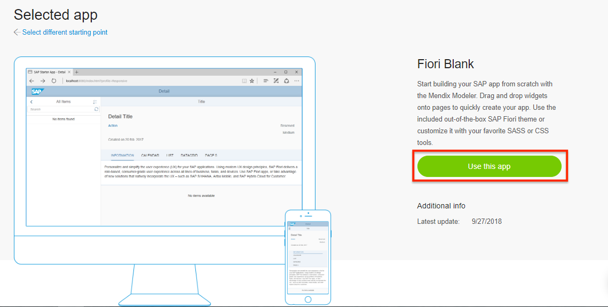

Enter a name, and choose **Create App**.

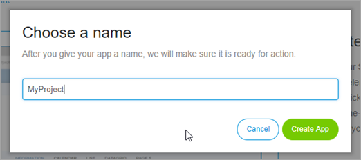

Enter your SAP Cloud Platform credentials, select a region, and choose **Sign In**.

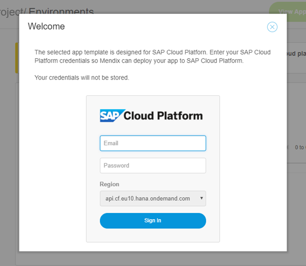

Choose the Cloud Foundry environment you want to deploy to, and choose **Create**.

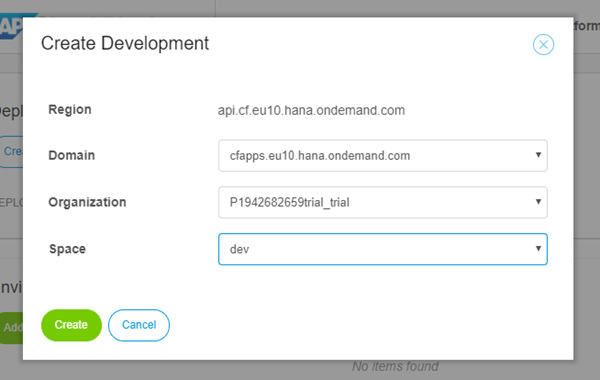

The environment is created. To see it, go to **Environments**.

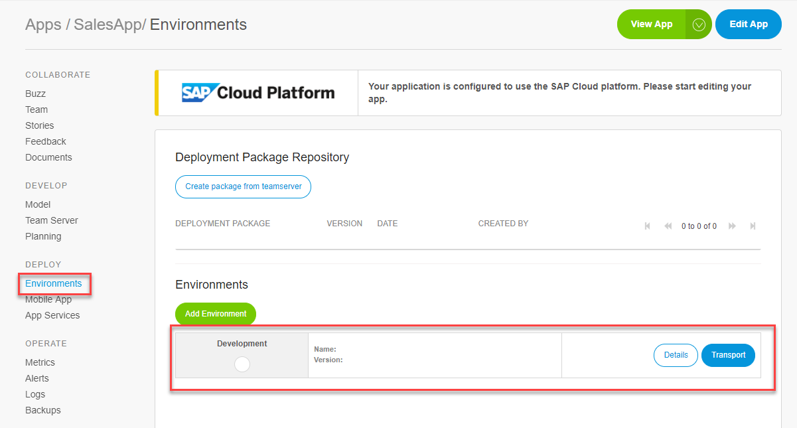

[ACCORDION-END]

[ACCORDION-BEGIN [Step 6: ](Build your app)]
To start working on your app, choose **Edit App**.

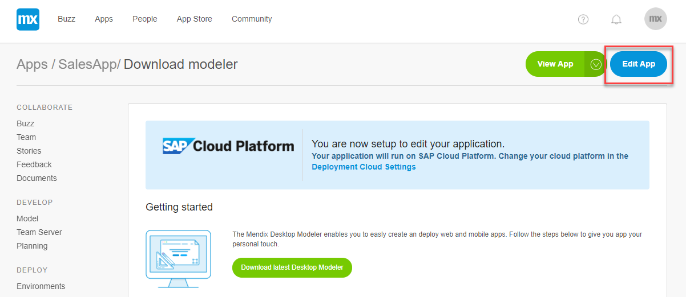

You build apps using the Mendix Desktop Modeler, which is an application installed on your desktop. If you don't have the modeler, install it by going to the [app store](https://appstore.home.mendix.com/link/modeler/).

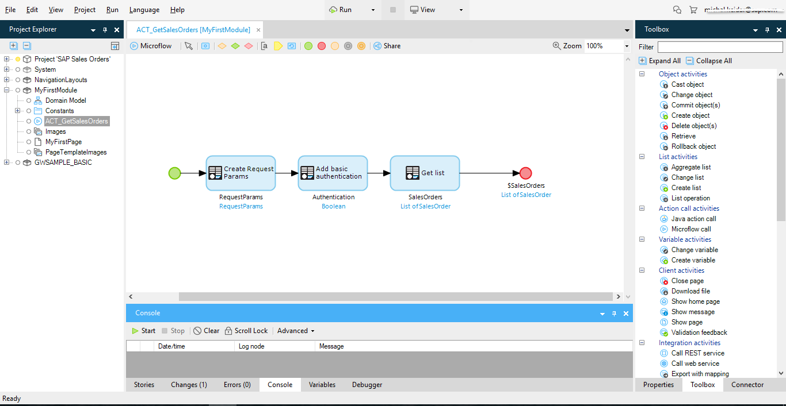

[ACCORDION-END]

