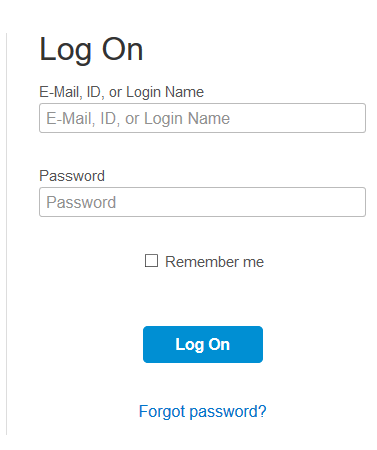
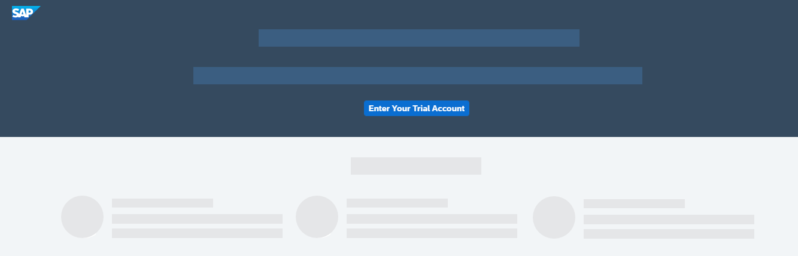
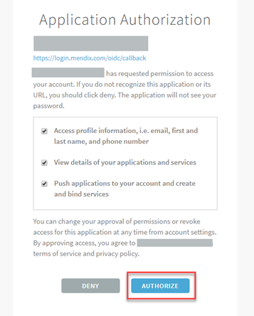
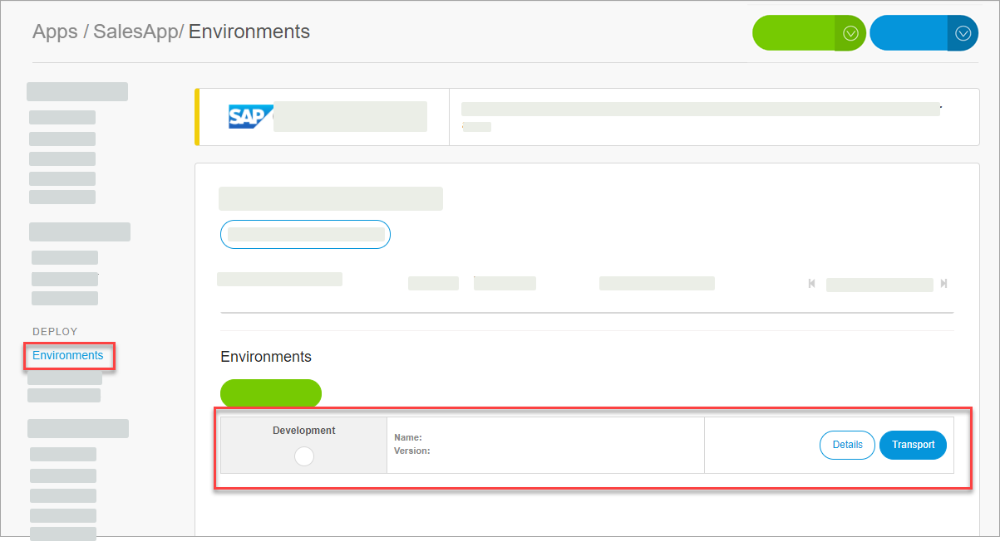

## Prerequisites  
  - You have access to an SAP BTP account. If you don't have an account, you can open a trial one. See the [tutorial](hcp-create-trial-account) or [documentation](https://help.sap.com/viewer/65de2977205c403bbc107264b8eccf4b/Cloud/en-US/d61c2819034b48e68145c45c36acba6e.html#loio42e7e54590424e65969fced1acd47694).
  - You are using a Windows desktop.

## Details  
### You will learn  
- How to set up your environment to use SAP Rapid Application Development
- How to open SAP Rapid Application Development

You can build business applications for SAP BTP, Cloud Foundry environment using SAP Rapid Application Development by Mendix, without the need to write code.

In this tutorial, you will set up your SAP BTP account so you can use SAP Rapid Application Development to build applications to be deployed on SAP BTP.

>This tutorial assumes that you are using a trial Cloud Foundry environment.

> The Mendix Studio Pro, for building your application, is available for Windows platforms only.

---

[ACCORDION-BEGIN [Step 1: ](Cloud Foundry trial)]
Go to [https://cockpit.hanatrial.ondemand.com/cockpit/#/home/trial](https://cockpit.hanatrial.ondemand.com/cockpit/#/home/trial).

Log into your SAP BTP account.

!

On the welcome screen of the SAP BTP cockpit, click **Enter Your Trial Account** to see your global account.

!
> Bookmark the link for fast and quick access to the cockpit.  

The global trial account contains **one** subaccount and space. Navigate to subaccount by clicking on the tile named **trial** (this name may vary if you created the subaccount manually).

!

To get to the space in which your applications and services live, click **dev** in the **Spaces** section.

!

[DONE]
[ACCORDION-END]

[ACCORDION-BEGIN [Step 2: ](Open the Mendix portal)]
Go to the [Discovery Center](https://discovery-center.cloud.sap/#/servicessearch/mendix) and click on the **Rapid Application Development by Mendix** tile.

Under the **Tools** section, click **Mendix Development Portal**.

!

This opens the registration page.

[DONE]
[ACCORDION-END]

[ACCORDION-BEGIN [Step 3: ](Create a Mendix account)]
Choose to **Sign in** with SAP.

!

Choose your SAP BTP region from the drop-down and click **Select region**.  

!

Choose **Sign in with the default identity provider**.

!

This will redirect you to SAP BTP's login page. Enter your SAP BTP credentials and sign in.

In the **Application Authorization** popup, choose **Authorize**.

!

Choose **Confirm**.

!

Enter your name and a password and choose **Create**.

!

Select the best option and choose **Next**.

!

Select the reason you signed up for Mendix and choose **Submit**.

!

Now you're in the Mendix development portal.

[DONE]
[ACCORDION-END]

[ACCORDION-BEGIN [Step 4: ](Create app and environment)]
You need to set up an environment for your SAP app. An environment points to the Cloud Foundry environment that you want to deploy to.

You can do this now, or you can do this when you are ready to deploy. When you deploy, you will be prompted to create an environment. Environments are created for each project.

In the development portal home page, choose **Create App**.

!

In the **App Templates** section, enter `SAP Fiori` to see the related templates.

!

Choose the **Blank App for SAP Fiori themed apps** template.

!

Choose **Select Template** to view the template details.

!

Choose **Select This Template**.

!

Enter a name, and choose **Create App**.

!

Select a region for SAP BTP and choose **Next**.

Choose the Cloud Foundry environment to which you want to deploy.

- Select **cfapps.YourRegion.hana.ondemand.com** for the domain.  For example, `cfapps.eu10.hana.ondemand.com`.

-	Select **hanatrial-schema** for the database.

- Select **Subscription** for the License Model.

Choose **Create**.

!

The environment is created. To see it, go to **Environments**.

!

[DONE]
[ACCORDION-END]

[ACCORDION-BEGIN [Step 5: ](Build your app)]
To start working on your app, choose **Edit in Studio Pro**.

!

You build apps using the Mendix Studio Pro, which is an application installed on your desktop. If you don't have the Mendix Studio Pro, install it by going to the [app store](https://appstore.home.mendix.com/link/modeler/).

!

[VALIDATE_5]

[ACCORDION-END]
