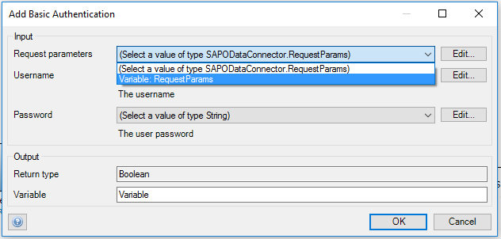
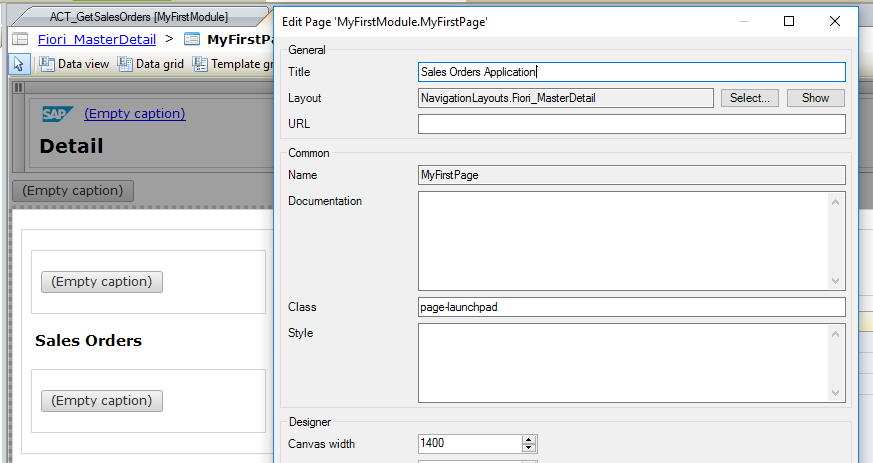

## Prerequisites  
 - **Proficiency:** Beginner
 - You are using a Windows desktop (or a Windows VM on a Mac).
 - You have access to an SAP Cloud Platform account. If not, you can open a trial account. See the [tutorial](https://www.sap.com/developer/tutorials/hcp-create-trial-account.html) or [documentation](https://help.sap.com/viewer/65de2977205c403bbc107264b8eccf4b/Cloud/en-US/65d74d39cb3a4bf8910cd36ec54d2b99.html).
 - You have completed the [Getting started with SAP Cloud Platform Rapid Application Development by Mendix](https://www.sap.com/developer/tutorials/mendix-onboarding.html) tutorial. Name your app **SAP Sales Orders**.
 - You have completed the [Create an account on the Gateway Demo system](https://www.sap.com/developer/tutorials/gateway-demo-signup.html) tutorial.


## Details
You can build business applications for the SAP Cloud Platform Cloud Foundry environment using SAP Cloud Platform Rapid Application Development by Mendix, without needing to write code.

This tutorial takes you through the basics of development in the Mendix Desktop Modeler and teaches you how to build a simple sales order application consuming the [`GWSAMPLE_BASIC service`](https://help.sap.com/viewer/68bf513362174d54b58cddec28794093/7.51.4/en-US/59283fc4528f486b83b1a58a4f1063c0.html) from the SAP Gateway Demo System (ES5).

This tutorial also showcases the [SAP OData Model Creator](https://appstore.home.mendix.com/link/app/105622/) and [SAP OData Connector](https://appstore.home.mendix.com/link/app/74525/), available in the [Mendix App Store](https://appstore.home.mendix.com/index3.html).

**Before starting this tutorial, make sure you have followed the prerequisites**.

>This tutorial is applicable whether you have a productive or trial Neo environment, but assumes that you are using a trial Cloud Foundry environment.
&nbsp;
> The Mendix Desktop Modeler, for building your application, is available for Windows platforms only.

### You will learn  
- How to create an SAP Blank application in SAP Cloud Platform Rapid Application Development.
- How to create the application data model using the SAP OData Model Creator.
- How to consume an OData service using the SAP OData Connector.
- How to deploy the application to SAP Cloud Platform.


### Time to Complete
**20 Min**

---

[ACCORDION-BEGIN [Step 1: ](Get SAP OData Connector)]

To be able to use the SAP OData Connector, after creating your project, navigate to the Mendix App Store and download the [SAP OData Connector](https://appstore.home.mendix.com/link/app/74525/Mendix/SAP-OData-Connector).

You will then find this module in your project's App Store modules.
For more information, see [How to Use App Store Content in the Modeler](https://docs.mendix.com/community/app-store/use-app-store-content-in-the-modeler).


[ACCORDION-END]

[ACCORDION-BEGIN [Step 2: ](Create GWSAMPLE_BASIC service module)]

The SAP OData Model Creator is a web site where your OData metadata XML file is transformed into a Mendix module that can be imported into your project.

Generating a service module starts by getting the OData metadata XML file. This file can be downloaded from the OData service URL directly using the `$metadata` suffix or retrieved from SAP Gateway. Since we're using the SAP Demo Gateway System (ES5) for this tutorial, the metadata file can be found at:

```
https://sapes5.sapdevcenter.com/sap/opu/odata/iwbep/GWSAMPLE_BASIC/$metadata
```

To generate the service module, follow these steps:

1. Save the metadata file to your hard drive.
2. Open the SAP [OData Model Creator](https://sapodatamodelcreator.mendixcloud.com/).
3. Upload the OData metadata XML file:

    

4. Press **`Generate`** **`.mpk`**. A progress bar will be shown during the parsing and generation of the module.
5. Once the generation is done, the **Download File** button appears. Notice that the file name of your module is extracted from the metadata file itself.

    Press **Download File** and save the `.mpk` file locally.

    

[ACCORDION-END]


[ACCORDION-BEGIN [Step 3: ](Import module in Mendix app)]

Now you have a Mendix module ready to be imported into your project.

1. Open the project that you created, right-click the project root folder, select **Import module package…** and select the `.mpk` file.

    

    You now have your service `GWSAMPLE_BASIC` module available in your project ready to use in combination with the SAP OData Connector.

    

2. Open the generated domain model and explore the entities and associations. Imagine that you had to create that manually -- a lot of work!

    

3. In addition to the domain model, the OData Model Creator also created two other items:
    * A constant with the name of the service, containing the service root URL
    * An enumeration (`EntitySetNames`) containing a list of all the entity sets in the model

    

[ACCORDION-END]

[ACCORDION-BEGIN [Step 4: ](Create constants for ES5 credentials)]

Now that we have our domain model in place, it's time to implement the connectivity to the SAP Gateway Demo System (ES5).

Our tutorial uses basic authentication to connect to the ES5 system, so let's store the username and password in constants.

1. Right-click **`MyFirstModule`** and add a new folder called **`Constants`**.
2. Right-click the **`Constants`** folder and add a new constant called **`ES5Username`**.


    

3. Enter your ES5 username as **Default value**.

    

4. Following the same steps, add a new constant and name it **`ES5Password`**.
5. Enter your ES5 password as **`Default value`**.


    

[ACCORDION-END]

[ACCORDION-BEGIN [Step 5: ](Add logic to get sales orders – authentication)]

Follow these steps to create the logic to get the sales orders.

1. Right-click **`MyFirstModule`** and add a new microflow, name it **`ACT_GetSalesOrders`**.
2. Right-click the line between the green and red dots in the microflow editor and select **Insert** | **Activity** (or drag and drop an activity from the upper toolbar).
3. Double-click the new activity and scroll down to locate the SAP OData Connector actions.
4. Select **`Create`** **`Request`** **`Params`**, and then click **Select**.
5. Name the variable **`RequestParams`**. This variable (as its name suggests) will hold the request parameters, and it's required for the **Add basic authentication** activity.

    

6. Following the same steps, add an **Add basic authentication** activity.
7. Select the **`RequestParams`** variable in the **Request parameters** dropdown.

    

8. Click **Edit...** for the **Username** and select the **`ES5Username`** constant by entering the following argument: `@MyFirstModule.ES5Username`

    

9. Follow the same steps for the **Password**.
10. Change the output **Variable** name to **Authentication**.
11. Click **OK** to close the dialog.

    

[ACCORDION-END]

[ACCORDION-BEGIN [Step 6: ](Add logic to get sales orders – request)]

1. Add another activity to the microflow and select the **Get List** action from the SAP OData Connector.
The **Get List** action retrieves a list of entities described in the domain model. In our case we will retrieve a list of sales orders.
2. Fill in the required fields of the **Get List** action. For this tutorial, use the following settings:

    | Field | Value |
    |:-------|:-------|
    | Query  | The URL to which you want to execute your request. In our case:<br><br> `https://sapes5.sapdevcenter.com/sap/opu/odata/iwbep/GWSAMPLE_BASIC/SalesOrderSet`<br><br>And it's constructed by entering the following code:<br><br> `@GWSAMPLE_BASIC.GWSAMPLE_BASIC + '/' + toString(GWSAMPLE_BASIC.EntitySetNames.SalesOrderSet)` |
    | Response type | The type you want to query from the OData service. Use `SalesOrder`. |
    | Request&nbsp;parameters | `RequestParams` variable |
    | Parent |empty|
    | Result info |empty|
    | Use&nbsp;Cloud&nbsp;Connector | `False` |
    | Output Variable | `SalesOrders` |

> In our case, the `Use cloud connector` is set to `False` because ES5 is a publicly accessible system.<br>
> If you would like to consume a service from your on-premise back-end system, you need to setup and configure the SAP Cloud Connector and then mark this field as `True`.<br>
> When running the Mendix application on SAP Cloud Platform, the SAP Cloud Connector will automatically be utilized to gain access to your on-premise system.<br>
> For more information, see the [SAP Cloud Connector](https://help.sap.com/viewer/cca91383641e40ffbe03bdc78f00f681/Cloud/en-US/e6c7616abb5710148cfcf3e75d96d596.html) documentation.

3. Verify the **Get List** dialog matches the following:

    

4. Click **OK** to close the dialog.

[ACCORDION-END]

[ACCORDION-BEGIN [Step 7: ](Add logic to get sales orders – return value)]

In the microflow, make the return value of the microflow a **`List`** of **`SalesOrders`** so you can call the microflow as a data source in a page.

  1. Double-click the **`End-Event`** (red dot).
  2. Select **`List`** for the **Type**.
  3. Select **`SalesOrder`** for the **Entity**.
  4. Click on **Generate…** and select the **`SalesOrders`** variable.

      

  5. Verify the **End Event** dialog matches the following:

      

  6. Click **OK** to close the dialog.

Your microflow should look like the following:
    

[ACCORDION-END]

[ACCORDION-BEGIN [Step 8: ](Show sales orders in page – master)]

1. Under **`MyFirstModule`**, open **`MyFirstPage`**.
2. Double-click the **List View** of the **Master** section, and change its **Data Source** to your **`ACT_GetSalesOrders`** microflow.
    

3. When prompted to automatically fill the contents of the list view, choose **No**.
4. Open the **Connector** tab.
5. Select the content of the **List View**.

    

6. Double-click (or drag and drop) the **`CustomerID`** property from the **Connector** tab.
7. In the page, select the content below the **`Customer ID`** you just added and add the **`CustomerName`** property.
8. Select the content below it and add the **`CreatedAt`** property.
9. Verify it looks like the following:
    

10. Double-click the **Master** section header **All Items** and change it to **Sales Orders**.

[ACCORDION-END]

[ACCORDION-BEGIN [Step 9: ](Show sales orders in page – details)]

1. Scroll down, select the **Tab Container**, and delete it.

    

2. Scroll down, select the footer container, and delete it.

    

3. Double-click the **Title** text and change it to **`Sales Order`**.
4. Select the container below the **Detail Title** and double-click the **`SalesOrderID`** property from the Connector tab.
    
5. Select the container around the **Action** link and delete it.
6. Select this container again and add the **`GrossAmount`** property.
7. Select the container below it and add the **`CurrencyCode`** property.

    
8. Select the container around the **Reserved** label and delete it.
9. Select it again and add the **`Note`** property.
10. Select the container around the **Medium** label and delete it.
11. Select it again and add the **`LifecycleStatusDescripion`** property.
12. Select the container around the **Created on** label and delete it.
13. Select it again and add the **`BillingStatusDescription`** property.
14. Double-click the **Detail Title** text and change it to **Details**.
15. Verify the UI looks like the following:

    
    

16. Double-click the **Detail** text and change it to **Sales Orders Application**.

    

[ACCORDION-END]

[ACCORDION-BEGIN [Step 10: ](Run app)]

Now that you've created the UI and business logic, you can run the app and have it connect with the SAP Gateway Demo System (ES5).

To run the app for the first time, follow these steps.

1. Click **Run** | **Run Locally**.

    

    If you see the pop-up window asking if you want to create a database, select **Yes**.

2. Wait until the startup of the app has finished and the app is running.
3. Click **View** to view the app in your browser.

    

You will now see your Sales Orders Application in the browser, with live data coming from ES5.

  

[ACCORDION-END]

[ACCORDION-BEGIN [Step 11: ](Run app in SAP Cloud Platform)]

The final step is to deploy the application to SAP Cloud Platform, Cloud Foundry environment, and run it from your space!
The application will bind to the Connectivity, XSUAA and PostgreSQL service instances.

1. Click **Run**.

    

    The deployment process will start and you will be notified when completed.

    

3. Once the application is deployed successfully, click on **View** to run it from SAP Cloud Platform.

[ACCORDION-END]

## Next Steps
- Read more about using Mendix at [https://docs.mendix.com/howto/](https://docs.mendix.com/howto/).
