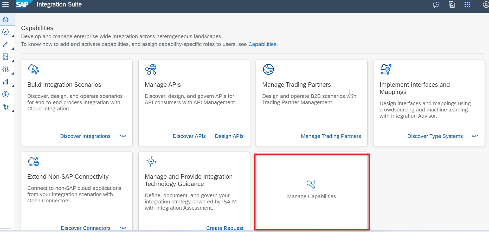
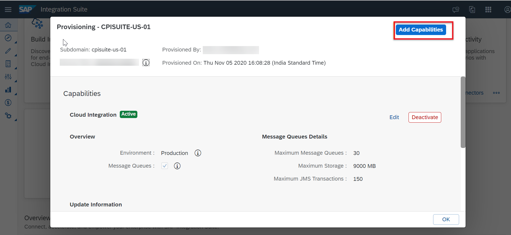
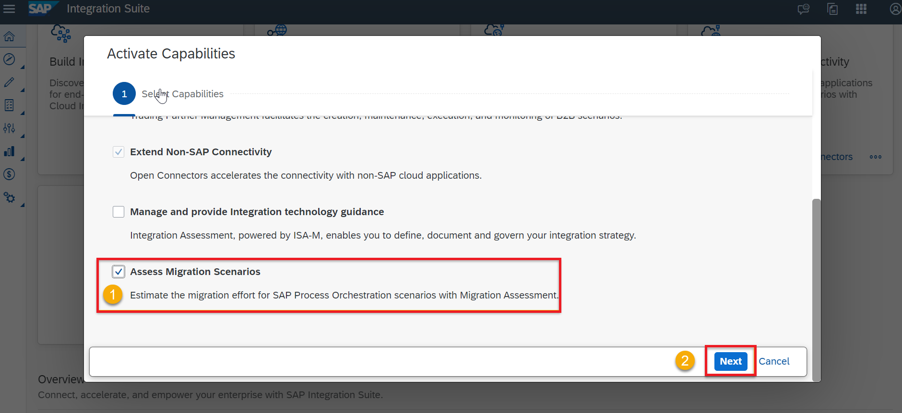
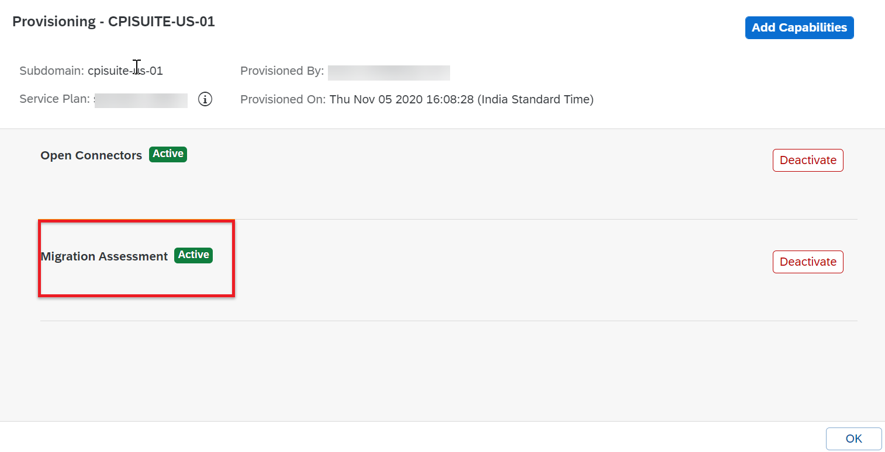
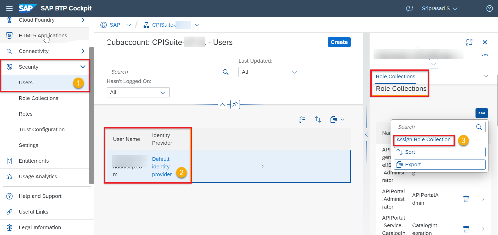
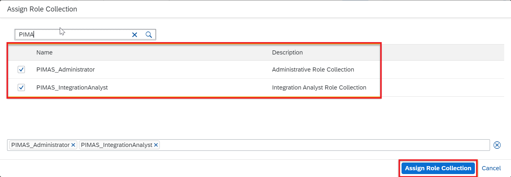

# Enable Migration Assessment Application
<!-- description --> Learn how to enable the Migration Assessment Application, a new capability of SAP Integration Suite. With the Migration Assessment Application, you can assess your existing SAP Process Orchestration landscape before starting the migration to the SAP Integration Suite.

## Prerequisites

- You’ve set up your global account and at least one subaccount on SAP BTP. See [Getting Started in the Cloud Foundry Environment](https://help.sap.com/docs/btp/sap-business-technology-platform/getting-started-in-cloud-foundry-environment).
- You’re subscribed to SAP Integration Suite in your subaccount. See [Subscribing to SAP Integration Suite](https://help.sap.com/docs/integration-suite/sap-integration-suite/8a3c8b7a6b1c4f249bb81d11644ef806.html).

## You will learn
- How to enable the Migration Assessment Application

---
### Enable Migration Assessment capability

1. Navigate to the **SAP Integration Suite** home page and choose **Manage Capabilities**.

    <!-- border -->

2. Choose **Add Capabilities**.

    <!-- border -->

3. Select **Assess Migration Scenarios**. Then choose **Next** and **Activate** to proceed with the activation of the capability.

    <!-- border -->

    <!-- border -->

    Wait until the capability is enabled. Refresh your page to see the successfully activated capability.

    <!-- border -->

---
### Assign role collection to user

In Migration Assessment, there are two role collections that cover different personas and responsibilities:

- The **PIMAS_Administrator** performs administrative tasks, like configuring system settings.
- The **PIMAS_IntegrationAnalyst** performs executive tasks, like reading and running evaluations as well as downloading results. 

1. In your subaccount, navigate to **Security** and then to **Users**.

2. Select your user and choose **Assign Role Collection**.

    <!-- border -->

3. Select the role collection relevant for your user, then choose **Assign Role Collection**.

    <!-- border -->

To get a detailed overview of the role templates and role collections users need to accomplish the various tasks related to Migration Assessment, see [Tasks and Permissions](https://help.sap.com/docs/integration-suite/sap-integration-suite/2714db1701114de4ab5ffd1bebd0c4de.html).

Once you're done, you're all set to access and configure the Migration Assessment application.

### Test yourself 

---