# Use the Migration Tooling 
<!-- description --> The migration tooling is a feature in the Cloud Integration capability of the SAP Integration Suite. It enables you to semi-automate the migrations of integration scenarios from SAP Process Orchestration to SAP Integration Suite.

## Prerequisites
- You can refer to the [documentation](https://help.sap.com/docs/integration-suite/sap-integration-suite/add-sap-process-orchestration-system) to learn how to establish a connection between your SAP Process Orchestration system and the SAP Integration Suite migration tool so to fetch the SAP Process Orchestration objects from Integration Directory and Enterprise Service Repository.

> Optionally, before you migrate an integration scenario, you can assess the migration of the integration scenarios using the Migration Assessment capability of SAP Integration Suite. For more information, see the [Migration Assessment documentation](https://help.sap.com/docs/integration-suite/sap-integration-suite/5c5e50ee2d644cc59d864409d5b7871c.html) and the blog [How to use the Migration Assessment Application to get read to migrate your SAP Process Orchestration Scenarios](https://blogs.sap.com/2023/02/28/how-to-use-the-migration-assessment-application-to-get-ready-to-migrate-your-sap-process-orchestration-scenarios/).
  

For more introductory information, benefits of the migration tool, and roadmap items, see the SAP blog [Migration tool in Cloud Integration Capability of SAP Integration Suite](https://blogs.sap.com/2023/01/27/migration-tool-in-cloud-integration-capability-of-sap-integration-suite/).
 
 
## You will learn
- How to use the migration tool
- How to connect to SAP Process Orchestration system and migrate an integration scenario
  
> After running the assessment, each integration configuration object is assigned a migration status. The possible migration statuses for integration configuration objects are **Evaluation required**, **Adjustment required**, and **Ready to migrate**. Currently, only integration configuration objects in status **Adjustment required** or **Ready to migrate** can be migrated.
> Integration scenarios in the SAP Process Orchestration system map to integration scenario patterns. Each pattern has been analyzed and matched against scenario templates delivered as part of the migration tool in Cloud Integration.
> Every integration configuration object that can be migrated has an associated template in the migration tool. Based on the information provided in the templates, the migration tool creates the equivalent integration flows in SAP Integration Suite.

Now let’s go through the process of a scenario migration using the migration tool.

In the following steps, we'll migrate a point-to-point asynchronous scenario, which has SOAP adapters and mapping steps in the form of message mapping and XSLT mapping.

You can migrate the integration scenario of your choice, but be aware of the supported [components](https://help.sap.com/docs/integration-suite/sap-integration-suite/supported-components), [templates](https://help.sap.com/docs/integration-suite/sap-integration-suite/supported-templates) and [known limitations](https://help.sap.com/docs/integration-suite/sap-integration-suite/known-limitations).

---
### Migrate SAP Process Orchestration artifacts

1. Open the SAP Integration Suite launchpad, navigate to the design workspace of integrations, and create or open any existing integration package.

<!-- border -->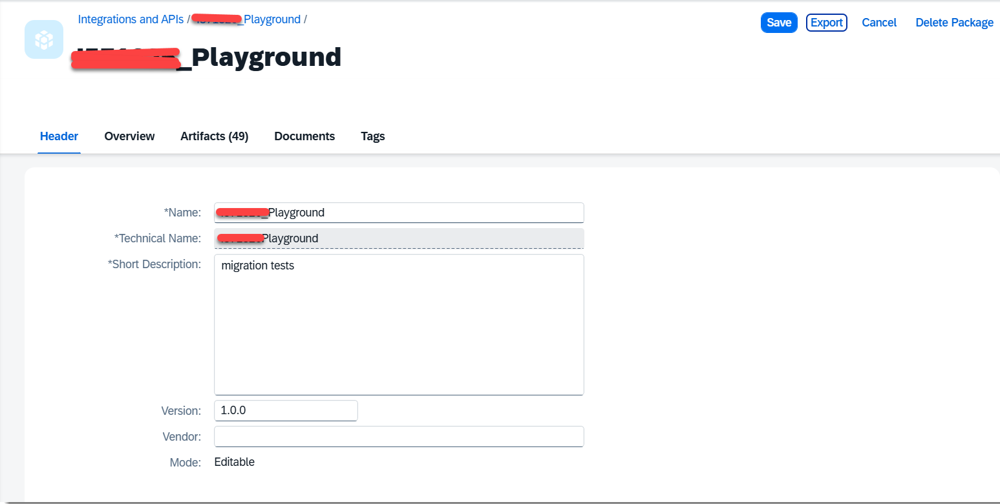

2. **Edit** the integration package. The **Migrate** appears, so you can migrate the integration scenarios from SAP Process Orchestration to SAP Integration Suite.

<!-- border -->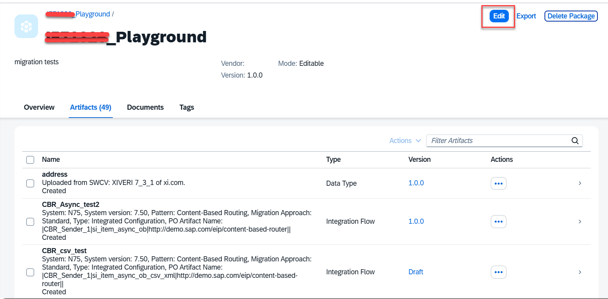

<!-- border -->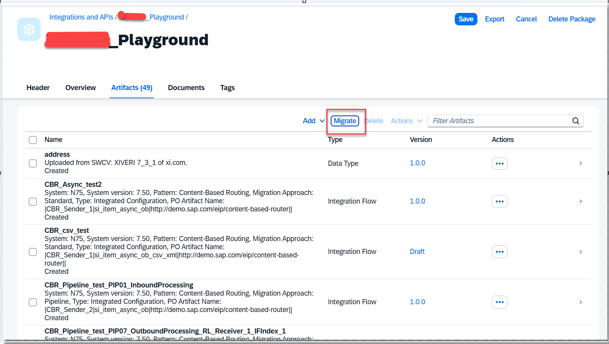

3. Choose **Migrate**. The migration tool opens as a wizard that guides you through the scenario migration.

<!-- border -->

---

### Connect to SAP Process Orchestration System

1. Select the SAP Process Orchestration system and establish the connection. The SAP Process Orchestration systems added as part of **Add an SAP Process Orchestration System** are listed.

<!-- border -->

2.  Select the system to which you want to connect. All the other details related to the system such as the Integration Directory and ESR are populated. Once the connection has been established, continue with **Next Step**.

<!-- border -->

---

### Select the integration scenario to be migrated

1. In step **Process Orchestration Artifacts**, select the integration configuration object you want to migrate. All the integration configuration objects are fetched from the Integration Directory of the SAP Process Orchestration system. The **Type** selected is **Integration Configuration Object**. Now the SAP Process Orchestration object **Receiver Determination** is also supported. 

<!-- border -->

2. Once you click on the  value help drop down in **Name** a screen with all the ICO's in the respective system pops up. This screen has various filters such as **Sender Communication Party**, **Sender Communication Component**, **Interface**, **Receiver Communication Party**, **Receiver Communication Component** where you can give provide the details and get the ICO that you want to migrate. There is a search option also available where you can provide the ICO which you wish to migrate. 

    In this example, the integration configuration objects are filtered by applying the **Sender Communication Component** parameter. Once an integration configuration object is selected for migration, choose **Next Step**.

<!-- border -->

---

### Select the Pattern applicable for the scenario

Patterns associated with the integration configuration object are available for the selection from the drop-down list. You can select a pattern for the scenario migration. If you want to learn more about the Patterns and what the resultant integration flow model will look like after the migration, use the context-sensitive help. 

<!-- border -->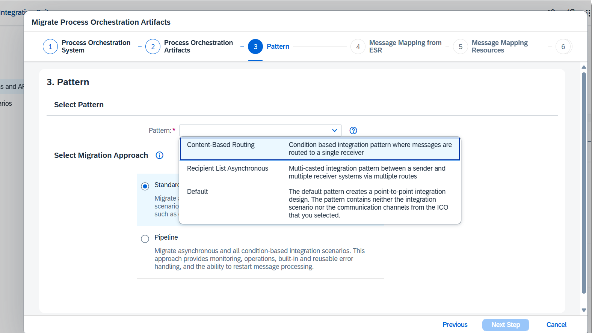

Currently supported patterns are **Point-to-Point Asynchronous**, **Point-to-Point Synchronous**, **Recipient List Asynchronous**, **Content-Based Routing**.
Every integration configuration object that is ready for migration also has a default pattern. If there are no associated patterns available and yet the integration configuration object is ready for migration, the migration tooling falls back to the **Default pattern**. Basically, default pattern creates a point-to-point integration flow; this pattern has neither the integration scenario nor the communication channels from the source integration configuration object. However, mapping objects such as message mapping, XSLT mapping etc. are copied and maintained in the point-to-point integration flow.

**Select Migration Approach**

<!-- border -->

As per your migration needs, you can use either of the below two Migration approaches:

**Standard Approach**

With **Standard Approach**, you can migrate asynchronous,synchronous, and all condition-based integration scenarios. This approach provides error handling, monitoring and restarting message processing. By default, **Standard Approach** is selected.

**Pipeline Approach**

With **Pipeline Approach**, you can migrate asynchronous and all condition-based Integration scenarios. You can select **Point-to-Point Asynchronous**, **Content-Based Routing**, and **Recipient List Asynchronous** patterns. This approach provides monitoring, operations, built-in and reusable error handling, and restarting message processing.

Enable **Idempotent Process at Receiver Side** if you want the receiver adapter to identify and ignore any duplicate processing of messages. For more information, see [Define Idempotent Process Call](https://help.sap.com/docs/integration-suite/sap-integration-suite/define-idempotent-process-call).

For more details on the Standard and Pipeline Approaches,refer [Migration Approaches](https://help.sap.com/docs/integration-suite/sap-integration-suite/pipleine-approach-vs-standard-approach).

Once the Approach is selected, click on the **Next Step** and you will be come to the **Message Mapping from ESR** step.

---

### Message Mapping from ESR

Here, the Message Mapping objects from ES Repository that are referenced in ICO via operation mappings are being imported. By default, the option **Enable Reusable Message Mapping Artifacts** is enabled to so that you import the message mappings objects from ESR as message mapping artifacts to SAP Integration Suite. This approach helps you to benefit from the advantages of reusable artifacts.

<!-- border -->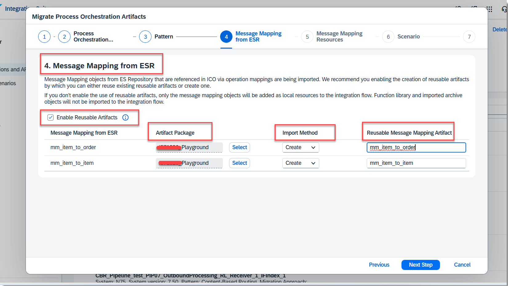

If you disable the option, upon successful migration, only the message mapping objects from ESR are imported directly to the integration flow as local resources. Other resources like function library objects and archives are not migrated. In this approach, you must edit a local resource in all places where it's used. If you opt to disable the option, skip the sub steps that follow and move to the next steps.

a. In the **Artifact Package** column, select the integration package to which you want to import the message mapping object.
By default, the integration package in which you're triggering the migration is selected.

b. Select the **Import Method** based on your requirement.
If the selected integration package doesn't contain a relevant message mapping artifact, the method is set to **Create**.

If the selected integration package already contains message mapping artifacts relevant to the one you're trying to import, the method is automatically set to **Reuse**. Based on your requirements, either select an existing message mapping artifact or change the import method to **Create**.

Once the Message mapping is selected, choose **Next Step**.

For more information on how to create Message mapping as an Artifact please refer [Create Message Mapping artifacts](https://help.sap.com/docs/integration-suite/sap-integration-suite/developing-message-mapping-as-artifact).

---
 ### Message Mapping Resources

In the **Message Mapping Resources** tab, identify and appropriately import the dependent resources of the message mapping objects like function library, message and data types, WSDL, and a few more.
This step is applicable only if you are creating at least one message mapping object in the previous step. If you are reusing all associated message mapping objects in the previous step, skip the sub steps that follow and move to the next step.

<!-- border -->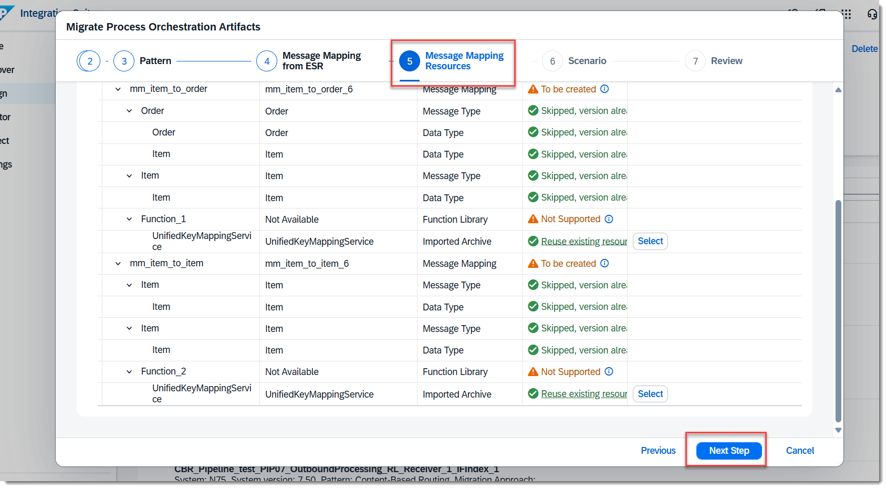

Enable the option Import Only Supported Message Mappings if you like to skip the import of message mapping objects (and the dependent resources) that aren't supported by Integration Suite.

> Please note that, by default, the option is disabled letting you import all message mapping objects associated to the leading integration object. By doing so, the unsupported message mapping objects are only partially imported. The specific dependent resources that aren't supported are skipped during the import process.

For the dependent function library objects associated to the message mapping object, select a Function Libraries artifact in SAP Integration Suite.

Choose **Next Step**

---

### Name the integration flow

In the **Integration Flow** tab, enter a meaningful integration flow name and ID and choose **Review**.

The description field is automatically filled with the SAP Process Orchestration system name, scenario type and name, and patter details for future reference.

<!-- border -->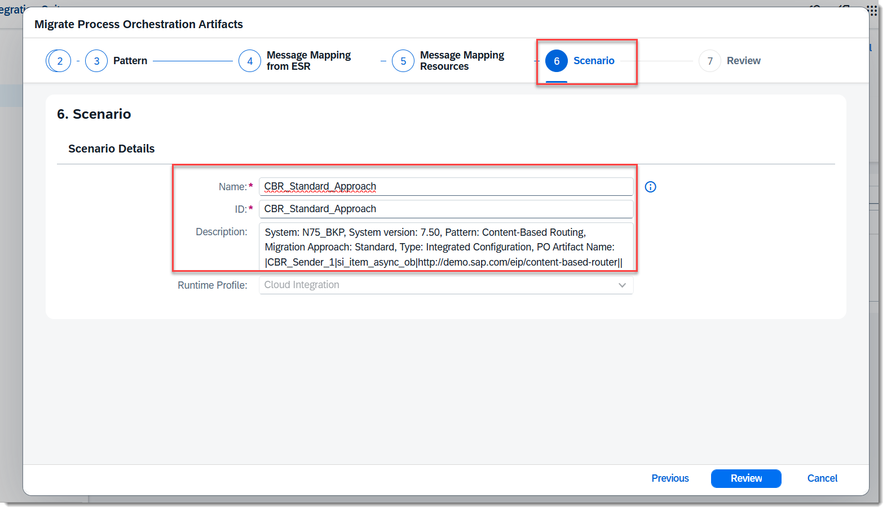

---

### Review details 

In the **Review** tab, check the details of your migration, then choose **Migrate**.

<!-- border -->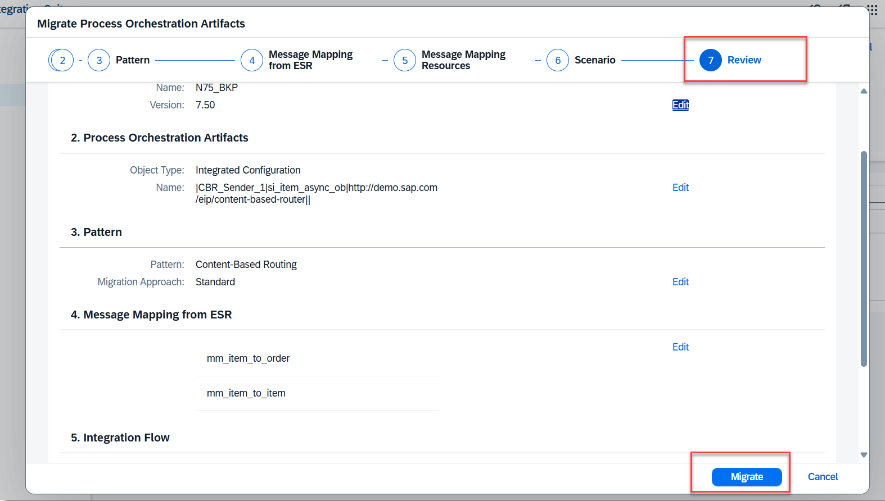

---

### View artifact

After the migration, a Success page displays useful information and guidance on the next steps. In the success page, you can also see the equivalent channel/adapter mappings between SAP Process Orchestration and SAP Integration Suite, supported components and known limitations in the migration tool. 

Open the anticipated integration flow which is created after a successful migration by clicking on **View Artifact**.
As depicted in below screenshot you can see the Artifact Details

<!-- border -->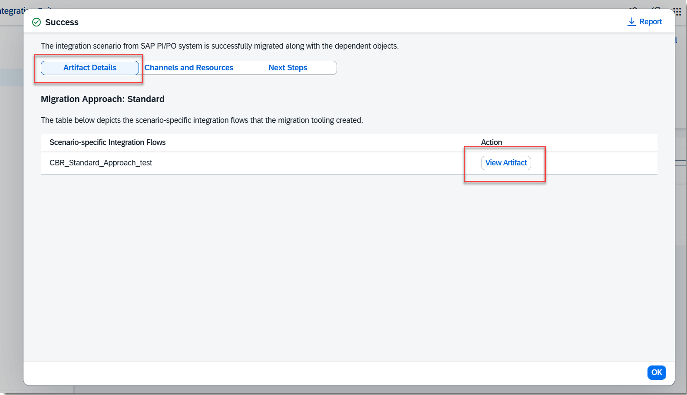

On the next tab, Channels and Resources you can see the **Communication Channel name** and equivalent **Source and Target adapters**.

<!-- border -->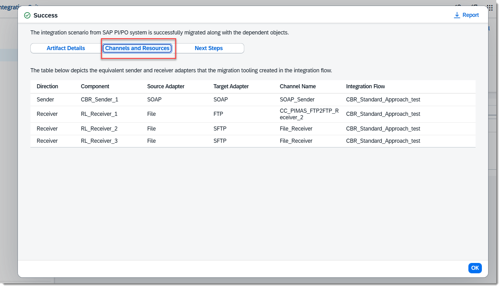

On the **Next Steps** tab, you can review the newly created integration flows for any missing steps and configurations before deployment. After all these steps , you can proceed to deploy the migrated integration flow.

<!-- border -->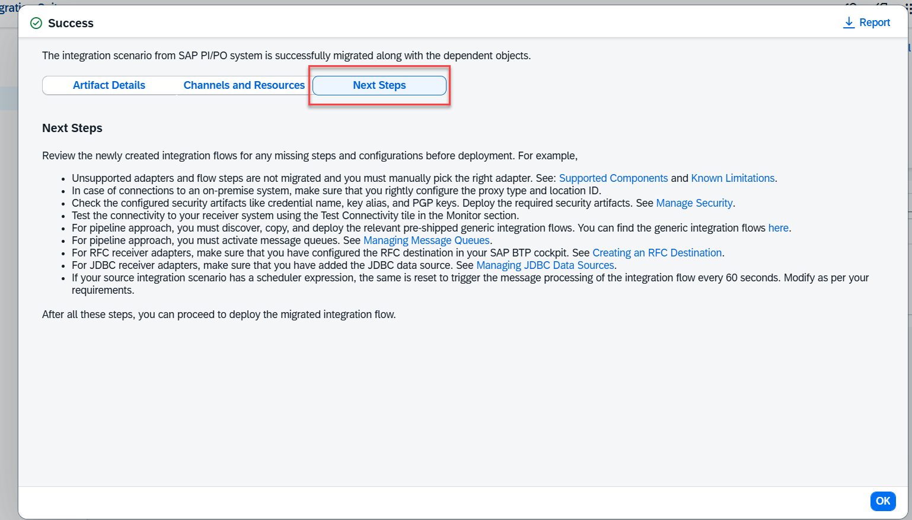

 In this example, a Content Based routing integration flow is created having SOAP Adapter, two message mappings one is Request mapping and the other is Response mapping.

<!-- border -->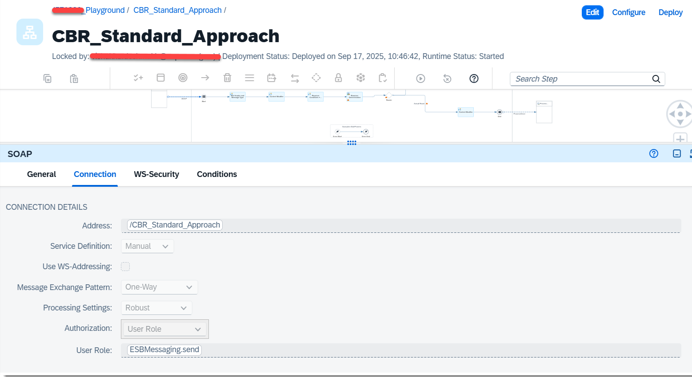

---

### Verify the configurations

All supported adapters are externalized to leverage the benefit of the externalized parameters.

1. Some configuration changes are required to ensure an integration flow is deployable. For example, in the Receiver SOAP Adapter, configure the address, proxy type as **Internet**.

<!-- border -->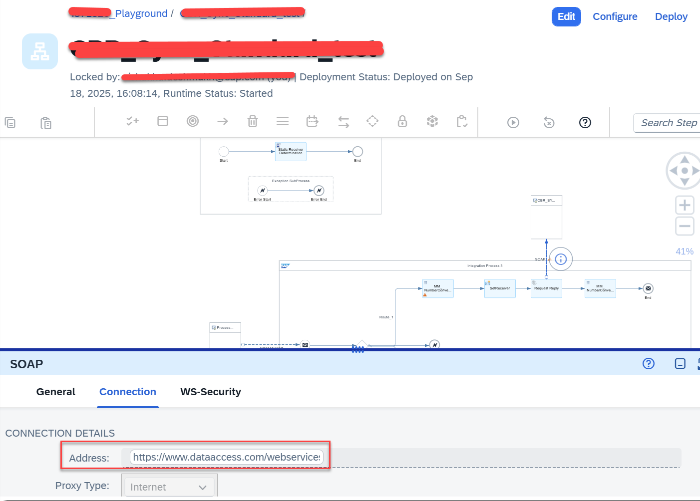

2. Select the Message mapping step and open the corresponding resource for verification. You can also verify the resources of the message mapping steps.

<!-- border -->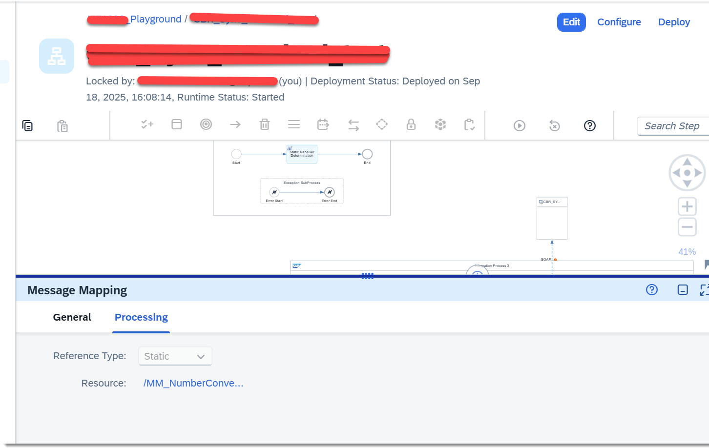

---

### Deploy the integration flow

Process the messages by deploying the integration flow and triggering the endpoints as usual. Check if the security artifacts, like credential name and key alias, that are used in your integration scenario are correctly configured in the integration flow. Deploy the necessary security artifacts before you deploy the integration flow.

<!-- border -->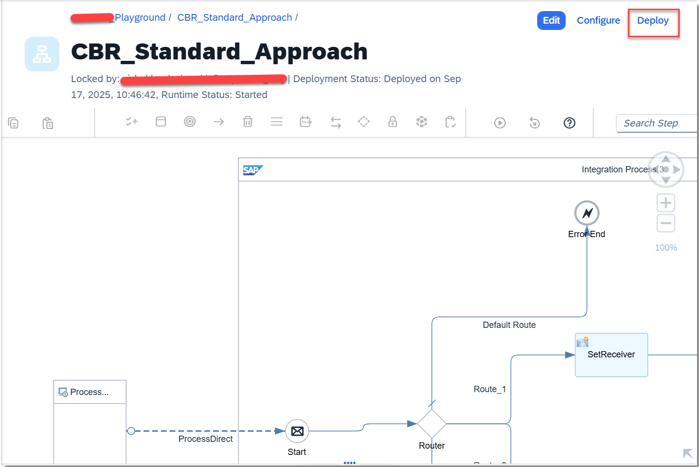

Congratulations! You've successfully migrated an integration scenario from SAP Process Orchestration to SAP Integration Suite.

### Test yourself 

---
