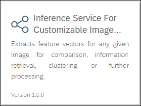
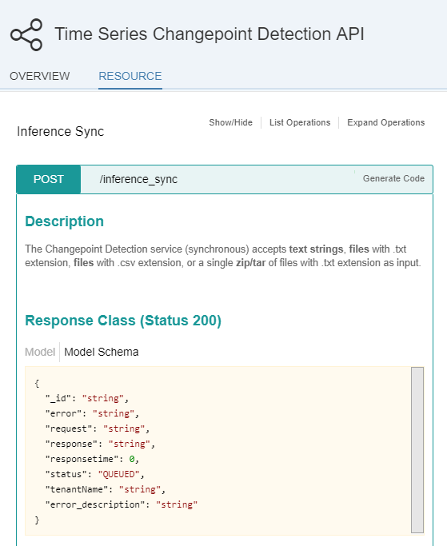
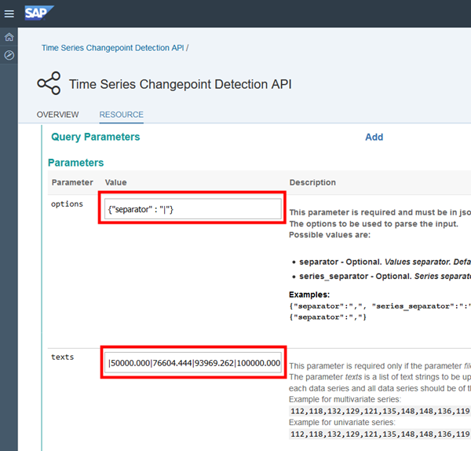
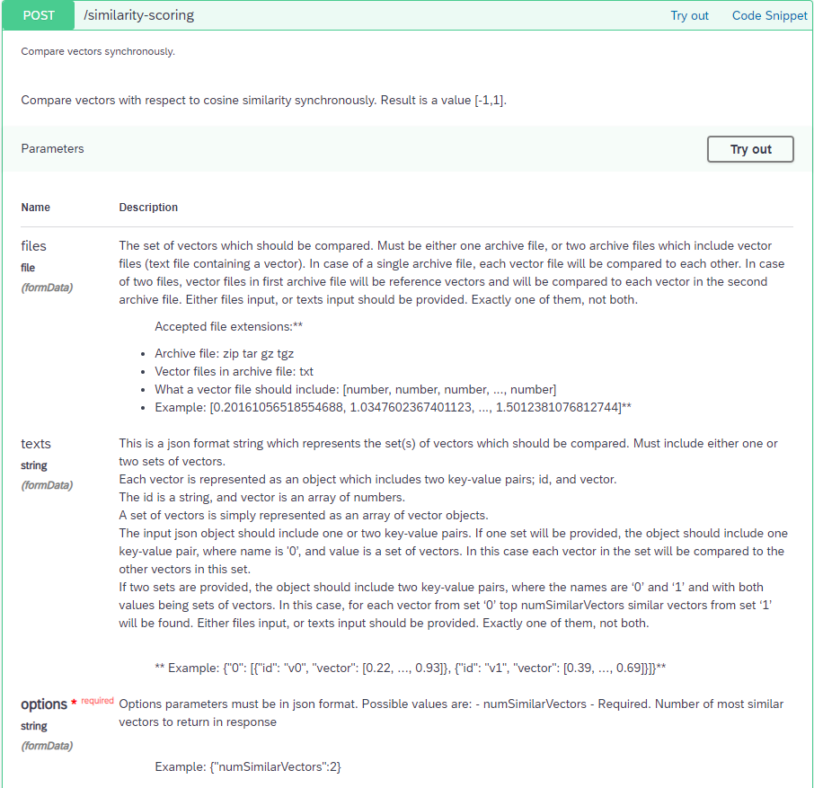
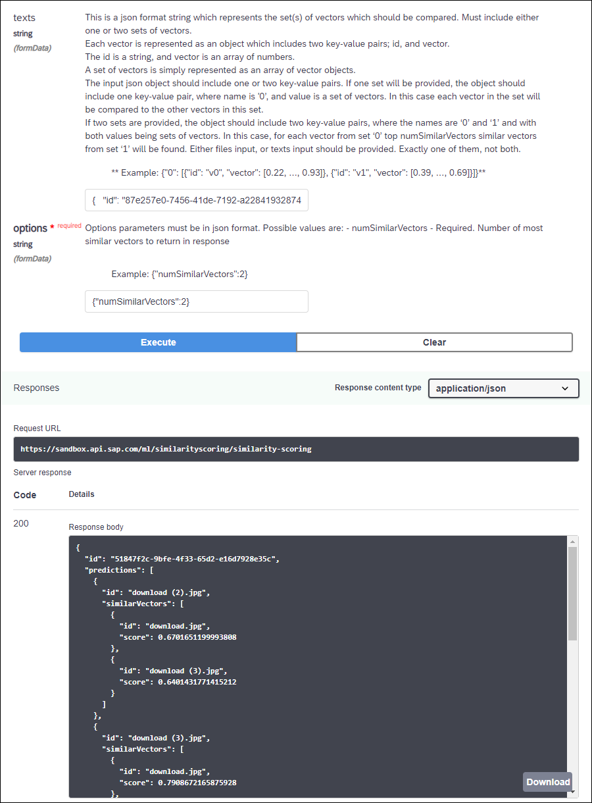

## Prerequisites
 - **Proficiency:** Beginner
 - [Sign up for an free trial account on the SAP Cloud Platform](https://www.sap.com/developer/tutorials/hcp-create-trial-account.html)

## Next Steps
 - Select your next tutorial from these SAP Leonardo Machine Learning groups: [SAP API Business Hub](https://www.sap.com/developer/groups/ml-fs-api-hub.html), [Java](https://www.sap.com/developer/groups/ml-fs-java.html) or [SAPUI5](https://www.sap.com/developer/groups/ml-fs-sapui5.html)
 - Select a tutorial group from the [Tutorial Navigator](https://www.sap.com/developer/tutorial-navigator.html) or the [Tutorial Catalog](https://www.sap.com/developer/tutorial-navigator.tutorials.html)

## Details
### You will learn
In this tutorial, you will learn where to find and test the **SAP Leonardo Machine Learning Functional Services** published on the SAP API Business Hub that consumes series data content.

The **Similarity Scoring** service will be used as an example to demonstrate how to consume series data content, and it will be applied to the outcome of the **[Image Feature Extraction](https://api.sap.com/api/img_feature_extraction_api/resource)** service  but you will be able to transpose this tutorial to other services which also consume content like :

 - **[Face Feature Extraction](https://api.sap.com/api/face_feature_extraction_api/resource)**
 - **[Document Feature Extraction](https://api.sap.com/api/face_feature_extraction_api/resource)**

The **Similarity Scoring** service allows you to compare vectors using a similarity score (cosine distance) ranging from -1 to 1.

### Time to Complete
**10 Min**

[ACCORDION-BEGIN [Step 1: ](Search the SAP API Business Hub - Image Feature Extraction)]

In order to consume the **Similarity Scoring** service, you will first need to use the **Image Feature Extraction** in order to get the feature vectors for 2 images.

So let's get the first the **Image Feature Extraction** service URI, request and response parameters.

Go to [https://api.sap.com/](https://api.sap.com).


Then you will be able to search for the **SAP Leonardo Machine Learning - Functional Services**, then click on the package found.


Select **Inference Service For Customizable Image Feature Extraction**.



You can also access the page directly from the following address:

 - <https://api.sap.com/api/img_feature_extraction_api/resource>

[DONE]
[ACCORDION-END]

[ACCORDION-BEGIN [Step 1: ](Analyze the service - Image Feature Extraction)]

As you can notice the API has only one resource (or service): `/feature-extraction`.

Now click on the `/feature-extraction` link to expand the section.

As stated in the description, the service accepts either:

 - an archive file with a zip/tar extensions containing multiple image  files
 - an image file in one of the following format: `jpg`, `jpe`, `jpeg`, `png`, `gif`, `bmp`, `tif`, `tiff`

The service returns a list of predictions that includes a feature vector (`featureVectors`) and the name of the corresponding image.

[DONE]
[ACCORDION-END]

[ACCORDION-BEGIN [Step 1: ](Execute the service - Image Feature Vector)]

First, let's build an archive with at least 3 text files (so that we can set `numTopics` equal to 3).

If you are missing some inspiration, use [Google Search](https://www.google.fr/search?q=duck&tbm=isch) to search for duck images.

Make sure you pick a ***JPEG***, ***PNG***, ***TIF*** or ***BMP*** format with a resolution below 1024 by 1024 pixels else you will receive a 400 error response.

In the top right corner of the page, click on the **Log On** button.

You will be prompted for your SAP credentials (you can use your SAP Cloud Platform credentials for example).

Scroll down to the **Parameters** section and click on the **Try out** button, then you can use the **Choose File** button next to `files` parameter to select your zip file.

Now, scroll down and click on **Execute**.



Click on the **Download** button to save  the response locally.

In the **Response Body**, you will get for each input file the associated feature vector.

```
{
  "id": "xyz",
  "predictions": [
    {
      "featureVectors": [
        0.000001, 0.000001, 0.000001, "..."
      ],
      "name": "file 1.jpg"
    },
    {
      "featureVectors": [
        0.000001, 0.000001, 0.000001, "..."
      ],
      "name": "file 2.jpg"
    },
    {
      "featureVectors": [
        0.000001, 0.000001, 0.000001, "..."
      ],
      "name": "file 3.jpg"
    }
  ],
  "processedTime": "2018-10-15T12:15:31.806820+00:00",
  "status": "DONE"
}
```

[DONE]
[ACCORDION-END]

[ACCORDION-BEGIN [Step 1: ](Search the SAP API Business Hub - Similarity Scoring)]

Now, let's get the first the **Similarity Scoring** service URI, request and response parameters.

Go to [https://api.sap.com/](https://api.sap.com).


Then you will be able to search for the **SAP Leonardo Machine Learning - Functional Services**, then click on the package found.


Select **Inference Service for Similarity Scoring**.



You can also access the page directly from the following address:

 - <https://api.sap.com/api/similarity_scoring_api/resource>

[DONE]
[ACCORDION-END]

[ACCORDION-BEGIN [Step 2: ](Analyze the service - Similarity Scoring)]

As you can notice the API has only one resource (or service): `/similarity-scoring`.

Now click on the `/similarity-scoring` link to expand the section.

As stated in the description, the service accepts either:

 - ***files***: with an archive file with a zip/tar extensions containing multiple feature vector files (a vector file would be represented like that: ***[0.20161056518554688, 1.0347602367401123, ..., 1.5012381076812744]***)
 - ***texts***: with JSON string containing the feature vector (the JSON format would be represented like that `{"0": [{"id": "v0", "vector": [0.22, ..., 0.93]}, {"id": "v1", "vector": [0.39, ..., 0.69]}]}`)

An ***options*** elements is also required and must include a ***`numSimilarVectors`*** that specifies the number of most similar vectors to be returned in the response.



[DONE]
[ACCORDION-END]

[ACCORDION-BEGIN [Step 1: ](Execute the service - Similarity Scoring)]

Before executing the service, you will first need to create the expected input.

After executing the **Image Feature Extraction**, you downloaded the response body as a JSON file.

Open the file in your preferred text editor and replace all occurrences of the following texts by the associated values:

| Original vale      | Replace by          |
|--------------------|---------------------|
| `id`               | `uid`               |
| `predictions`      | `0`                 |
| `featureVectors`   | `vector`            |
| `name`             | `id`                |

You file should look like this:

```
{
  "id": "87e257e0-7456-41de-7192-a22841932874",
  "0": [
    {
      "vector": [
        0.1, "...", 0.1
      ],
      "id": "download.jpg"
    },
    {
      "vector": [
        0.1, "...", 0.1
      ],
      "id": "download (1).jpg"
    },
    {
      "vector": [
        0.1, "...", 0.1
      ],
      "id": "download (2).jpg"
    },
    {
      "vector": [
        0.1, "...", 0.1
      ],
      "id": "download (3).jpg"
    }
  ],
  "processedTime": "2018-10-15T12:15:31.806820+00:00",
  "status": "DONE"
}
```

Once done, in the top right corner of the page, click on the **Log On** button.

You will be prompted for your SAP credentials (you can use your SAP Cloud Platform credentials for example).

Scroll down to the **Parameters** section and click on the **Try out** button.

Then you can paste the content of the updated response body from the **Image Feature Extraction** in the `texts` field parameter.

Next paste the following content in the ***options*** field:

```JSON
{"numSimilarVectors":2}
```

Now, scroll down and click on **Execute**.



In the **Response Body**, you will get for each input file the associated top 2 most similar images.

```
{
  "id": "51847f2c-9bfe-4f33-65d2-e16d7928e35c",
  "predictions": [
    {
      "id": "download (2).jpg",
      "similarVectors": [
        {
          "id": "download.jpg",
          "score": 0.6701651199993808
        },
        {
          "id": "download (3).jpg",
          "score": 0.6401431771415212
        }
      ]
    },
    {
      "id": "download (3).jpg",
      "similarVectors": [
        {
          "id": "download.jpg",
          "score": 0.7908672165875928
        },
        {
          "id": "download (2).jpg",
          "score": 0.6401431771415212
        }
      ]
    },
    {
      "id": "download.jpg",
      "similarVectors": [
        {
          "id": "download (3).jpg",
          "score": 0.7908672165875928
        },
        {
          "id": "download (2).jpg",
          "score": 0.6701651199993808
        }
      ]
    },
    {
      "id": "download (1).jpg",
      "similarVectors": [
        {
          "id": "download (2).jpg",
          "score": 0.49854763601951296
        },
        {
          "id": "download.jpg",
          "score": 0.4707144574040269
        }
      ]
    }
  ],
  "processedTime": "2018-10-15T12:52:00.847480+00:00",
  "status": "DONE"
}
```

[DONE]
[ACCORDION-END]

[ACCORDION-BEGIN [Step 5: ](Validation)]

Provide an answer to the question below then click on **Validate**.

[VALIDATE_1]
[ACCORDION-END]

### Optional

[ACCORDION-BEGIN [Step 6: ](Investigate similar services)]

You can also try the following Machine Learning Functional Services consuming text content:

 - **[Face Feature Extraction](https://api.sap.com/api/face_feature_extraction_api/resource)**
 - **[Document Feature Extraction](https://api.sap.com/api/face_feature_extraction_api/resource)**

For more information, you can also check the online [SAP Leonardo Machine Learning Foundation documentation](https://help.sap.com/viewer/product/SAP_LEONARDO_MACHINE_LEARNING_FOUNDATION/1.0/en-US)

[DONE]
[ACCORDION-END]

## Next Steps
 - Select your next tutorial from these SAP Leonardo Machine Learning groups: [SAP API Business Hub](https://www.sap.com/developer/groups/ml-fs-api-hub.html), [Java](https://www.sap.com/developer/groups/ml-fs-java.html) or [SAPUI5](https://www.sap.com/developer/groups/ml-fs-sapui5.html)
 - Select a tutorial from the [Tutorial Navigator](https://www.sap.com/developer/tutorial-navigator.html) or the [Tutorial Catalog](https://www.sap.com/developer/tutorial-navigator.tutorials.html)
