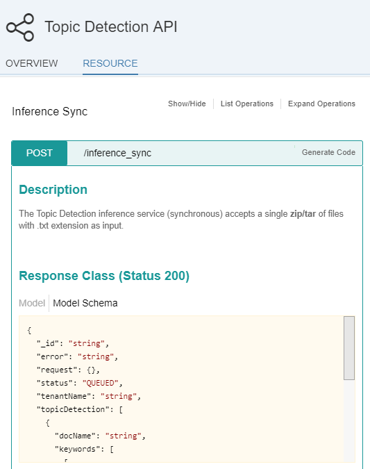

## Prerequisites
 - [Sign up for an free trial account on the SAP Cloud Platform](https://developers.sap.com/tutorials/hcp-create-trial-account.html)

## Details
### You will learn
In this tutorial, you will learn where to find and test the **SAP Leonardo Machine Learning Functional Services** published on the SAP API Business Hub that consumes text content.

The **Topic Detection API** Machine Learning Functional Services will be used as an example to demonstrate how to consume text content, but you will be able to transpose this tutorial to other services which also consume content like :

  - **[Machine Translation](https://api.sap.com/api/translation_api/resource)**
  - **[Language Detection](https://api.sap.com/api/language_detection_api/resource)**
  - **[Product Text Classification API](https://api.sap.com/api/product_text_classification_api/resource)**

The **Topic Detection** service allows you to extracts topics from documents and scores them according to the most relevant topics.

---

[ACCORDION-BEGIN [Step 1: ](Search the SAP API Business Hub)]

In order to consume the **Topic Detection API** SAP Leonardo Machine Learning Foundation service, you will first need to get the service URI, request and response parameters.

Go to [https://api.sap.com/](https://api.sap.com).


Then you will be able to search for the **SAP Leonardo Machine Learning - Functional Services**, then click on the package found.


Select **Inference Service for Topic Detection**.


You can also access the page directly from the following address:

 - <https://api.sap.com/api/topic_detection_api/resource>

[DONE]
[ACCORDION-END]

[ACCORDION-BEGIN [Step 2: ](Analyze the service)]

As you can notice the API has only one resource (or service): `/topic-detection`.

Now click on the `/topic-detection` link to expand the section.

> **Note**: the term *inference* refers to the application phase (scoring) an existing model (as opposed to the training or inception phase) and *sync* for synchronous.

As stated in the description, the service accepts either:

 - an archive file with a zip/tar extensions containing multiple text files
 - a single text file
 - a list of text files as input

The service returns a list of detected topic with the associated keywords and scores (confidence).

The supported text file formats is plain text only.

The input file, files or archive file will be sent as a `FormData` query parameter in the service request.

A series of options are also required for the following parameters:

  - `numTopics`: Total number of topics to be detected
  - `numTopicsPerDoc`: Number of most relevant topics to be listed per document
  - `numKeywordsPerTopic`: Number of keywords to be listed per topic
  - `numFeatures`: Maximum number of keywords to be extracted from documents in total

[DONE]
[ACCORDION-END]

[ACCORDION-BEGIN [Step 3: ](Test the service)]

First, let's build an archive with at least 3 text files (so that we can set `numTopics` equal to 3).

If you are missing some inspiration, use the following articles content to create your text files:

  - [Wikipedia article on Machine Learning](https://en.wikipedia.org/wiki/Machine_learning)
  - [Wikipedia article on Deep Learning](https://en.wikipedia.org/wiki/Deep_learning)
  - [Wikipedia article on Cheesecake](https://en.wikipedia.org/wiki/Cheesecake)

Create a zip out of these text files.

In the top right corner of the page, click on the **Log On** button.

You will be prompted for your SAP credentials (you can use your SAP Cloud Platform credentials for example).

Scroll down to the **Parameters** section and click on the **Try out** button, then you can use the **Choose File** button next to `files` parameter to select your zip file.

In the **options** field enter the following:

```JSON
{"numTopics":3, "numTopicsPerDoc":3, "numKeywordsPerTopic":5}
```

Now, scroll down and click on **Execute**.



In the **Response Body**, you will get for each file, the associated keywords, topics and score.

The output will be sorted by descending topic score.

For example here, for the `cheesecake.txt` document, the first list of keywords represent to top topic (with id 1) and it's score is 1.0059799604699027.

```
{
  "_id": "xxxxxxxx-xxxx-xxxx-xxxx-xxxxxxxxxxxx",
  "processed_time": "Mon, 31 Jul 2017 14:52:20 GMT",
    "request": {
      "files": [
        "Desktop.zip"
      ],
      "options": {
        "numKeywordsPerTopic": 5,
        "numTopics": 3,
        "numTopicsPerDoc": 3
      },
      "tenantName": "imgclassif-tech-user",
      "texts": []
    },
    "status": "DONE",
    "tenantName": "imgclassif-tech-user",
    "topicDetection": [
      {
        "docName": "cheesecake.txt",
        "keywords": [
          [ "cheesecake", "cheese", "cream", "bake", "make" ],
          [ "deep", "learn", "neural", "jump", "network" ],
          [ "learn", "machine", "data", "jump", "algorithm" ]
        ],
        "scores": [
          1.0059799604699027,
          0,
          0
        ],
        "topics": [
          1,
          2,
          0
        ]
      },
      {
        "docName": "deep_learning.txt",
        "keywords": [
          [ "deep", "learn", "neural", "jump", "network" ],
          [ "learn", "machine", "data", "jump", "algorithm" ],
          [ "cheesecake", "cheese", "cream", "bake", "make" ]
        ],
        "scores": [
          1.0683225059034496,
          0.0008786062197741417,
          0
        ],
        "topics": [
          2,
          0,
          1
        ]
      },
      {
        "docName": "machine_learning.txt",
        "keywords": [
		  [ "learn", "machine", "data", "jump", "algorithm" ],
		  [ "cheesecake", "cheese", "cream", "bake", "make" ],
          [ "deep", "learn", "neural", "jump", "network" ]
        ],
        "scores": [
          0.890515209507582,
          2.1184791916652968e-9,
          0
        ],
        "topics": [
          0,
          1,
          2
        ]
      }
    ]
  }
```

[DONE]
[ACCORDION-END]

[ACCORDION-BEGIN [Step 4: ](Validation)]

Provide an answer to the question below then click on **Validate**.

[VALIDATE_1]
[ACCORDION-END]

### Optional

[ACCORDION-BEGIN [Step 5: ](Investigate similar services)]

You can also try the following Machine Learning Functional Services consuming text content:

  - **[Machine Translation](https://api.sap.com/api/translation_api/resource)**
  - **[Language Detection](https://api.sap.com/api/language_detection_api/resource)**
  - **[Product Text Classification API](https://api.sap.com/api/product_text_classification_api/resource)**

For more information, you can also check the online [SAP Leonardo Machine Learning Foundation documentation](https://help.sap.com/viewer/product/SAP_LEONARDO_MACHINE_LEARNING_FOUNDATION/1.0/en-US)

[DONE]
[ACCORDION-END]
