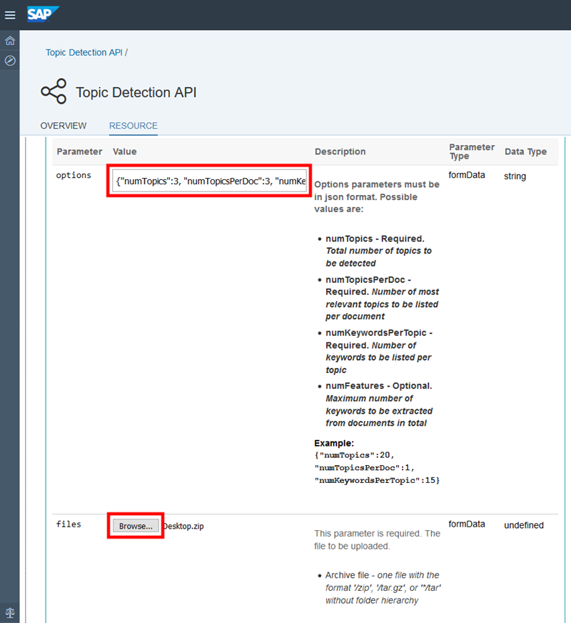

## Prerequisites  
 - **Proficiency:** Beginner
 - [Sign up for an free trial account on the SAP Cloud Platform](http://www.sap.com/developer/tutorials/hcp-create-trial-account.html)

## Next Steps
 - Select your next tutorial from these SAP Leonardo Machine Learning groups: [SAP API Business Hub](https://www.sap.com/developer/groups/ml-fs-api-hub.html), [Java](https://www.sap.com/developer/groups/ml-fs-java.html) or [SAPUI5](https://www.sap.com/developer/groups/ml-fs-sapui5.html)
 - [Consuming the "Topic Detection" SAP Leonardo Machine Learning Functional Service in a SAPUI5 application](http://www.sap.com/developer/tutorials/ml-fs-text-sapui5.html)
 - Select a tutorial group from the [Tutorial Navigator](http://www.sap.com/developer/tutorial-navigator.html) or the [Tutorial Catalog](https://www.sap.com/developer/tutorial-navigator.tutorials.html)

## Details
### You will learn  
In this tutorial, you will learn where to find and test the **SAP Leonardo Machine Learning Functional Services** published on the SAP API Business Hub that consumes text content.

The **Topic Detection API** Machine Learning Functional Services will be used as an example to demonstrate how to consume text content, but you will be able to transpose this tutorial to other services which also consume content like :

 - the **Document Feature Extraction API**
 - the **Product Text Classification API**

### Time to Complete
**10 Min**

---

[ACCORDION-BEGIN [Step 1: ](Search the SAP API Business Hub)]

In order to consume the **Topic Detection** SAP Leonardo Machine Learning Functional Services, you will first need to get the service URI, request and response parameters.

Go to [https://api.sap.com/](https://api.sap.com) and click on the **Browse** tile.


Then you will be able to search for the **SAP Leonardo Machine Learning - Functional Services**, then click on the package found.


[ACCORDION-END]

[ACCORDION-BEGIN [Step 2: ](Analyze the service)]

Click on **Artifacts**, then click on the **Topic Detection API API**.


As you can notice the **Topic Detection API** has only one resource (or service): `/inference_sync`.

Now click on the `/inference_sync` link to expand the section.

> **Note**: the term *inference* refers to the application phase (scoring) an existing model (as opposed to the training or inception phase) and *sync* for synchronous.


As stated in the description, the service accepts either an archive file with a zip/tar extensions containing multiple text files, a single text file or a list of text files as input and returns a detected topic list with the associated keywords and scores (confidence).

The supported text file formats is plain text only.

The input file, files or archive file will be sent as a `FormData` query parameter in the service request.

A series of options are also required for the following parameters:

  - `numTopics`: Total number of topics to be detected
  - `numTopicsPerDoc`: Number of most relevant topics to be listed per document
  - `numKeywordsPerTopic`: Number of keywords to be listed per topic
  - `numFeatures`: Maximum number of keywords to be extracted from documents in total

And the response model schema is the following:

```JSON
{
  "_id": "string",
  "error": "string",
  "request": {},
  "status": "QUEUED",
  "tenantName": "string",
  "topicDetection": [
    {
      "docName": "string",
      "keywords": [
        [
          "string"
        ]
      ],
      "scores": [
        0
      ],
      "topics": [
        0
      ]
    }
  ],
  "error_description": "string"
}
```

[ACCORDION-END]

[ACCORDION-BEGIN [Step 3: ](Test the service)]

Now, scroll down a bit further and click on . You will be prompted for your SAP Cloud Platform credentials.

Scroll up a little for the **Query Parameters** section.

In the **Options** field enter the following:

```JSON
{"numTopics":3, "numTopicsPerDoc":3, "numKeywordsPerTopic":5}
```

Now let's build an archive with at least more than 2 text files.

If you are missing some inspiration, use the following articles content to create your text files:

  - [Wikipedia article on Machine Learning](https://en.wikipedia.org/wiki/Machine_learning)
  - [Wikipedia article on Deep Learning](https://en.wikipedia.org/wiki/Deep_learning)
  - [Wikipedia article on Cheesecake](https://en.wikipedia.org/wiki/Cheesecake)

Create a zip out of these text files.

Click on the **Browse** button next to `files` parameter and pick your zip file.



Now scroll down a bit further and click on .

Please take a note of the **Request URL** which we will use later:

```
https://sandbox.api.sap.com/ml/topicdetection/inference_sync
```

In the **Response Body**, you will get for each file, the associated keywords, topics and score.

The output will be sorted by descending topic score.

For example here, for the `cheesecake.txt` document, the first list of keywords represent to top topic (with id 1) and it's score is 1.0059799604699027.

```JSON
{
  "_id": "xxxxxxxx-xxxx-xxxx-xxxx-xxxxxxxxxxxx",
  "processed_time": "Mon, 31 Jul 2017 14:52:20 GMT",
    "request": {
      "files": [
        "Desktop.zip"
      ],
      "options": {
        "numKeywordsPerTopic": 5,
        "numTopics": 3,
        "numTopicsPerDoc": 3
      },
      "tenantName": "imgclassif-tech-user",
      "texts": []
    },
    "status": "DONE",
    "tenantName": "imgclassif-tech-user",
    "topicDetection": [
      {
        "docName": "cheesecake.txt",
        "keywords": [
          [
            "cheesecake",
            "cheese",
            "cream",
            "bake",
            "make"
          ],
          [
            "deep",
            "learn",
            "neural",
            "jump",
            "network"
          ],
          [
            "learn",
            "machine",
            "data",
            "jump",
            "algorithm"
          ]
        ],
        "scores": [
          1.0059799604699027,
          0,
          0
        ],
        "topics": [
          1,
          2,
          0
        ]
      },
      {
        "docName": "deep_learning.txt",
        "keywords": [
          [
            "deep",
            "learn",
            "neural",
            "jump",
            "network"
          ],
          [
            "learn",
            "machine",
            "data",
            "jump",
            "algorithm"
          ],
          [
            "cheesecake",
            "cheese",
            "cream",
            "bake",
            "make"
          ]
        ],
        "scores": [
          1.0683225059034496,
          0.0008786062197741417,
          0
        ],
        "topics": [
          2,
          0,
          1
        ]
      },
      {
        "docName": "machine_learning.txt",
        "keywords": [
          [
            "learn",
            "machine",
            "data",
            "jump",
            "algorithm"
          ],
          [
            "cheesecake",
            "cheese",
            "cream",
            "bake",
            "make"
          ],
          [
            "deep",
            "learn",
            "neural",
            "jump",
            "network"
          ]
        ],
        "scores": [
          0.890515209507582,
          2.1184791916652968e-9,
          0
        ],
        "topics": [
          0,
          1,
          2
        ]
      }
    ]
  }
```

[ACCORDION-END]

---

### Optional

[ACCORDION-BEGIN [Step 4: ](Investigate similar services)]

You can also try the following Machine Learning Functional Services consuming text content:

  - the **Document Feature Extraction API**
  - the **Product Text Classification API**

For more information, you can also check the online [SAP Leonardo Machine Learning Foundation documentation](https://help.sap.com/viewer/product/SAP_LEONARDO_MACHINE_LEARNING_FOUNDATION/1.0/en-US)

[ACCORDION-END]

## Next Steps
 - Select your next tutorial from these SAP Leonardo Machine Learning groups: [SAP API Business Hub](https://www.sap.com/developer/groups/ml-fs-api-hub.html), [Java](https://www.sap.com/developer/groups/ml-fs-java.html) or [SAPUI5](https://www.sap.com/developer/groups/ml-fs-sapui5.html)
  - Select a tutorial from the [Tutorial Navigator](http://www.sap.com/developer/tutorial-navigator.html) or the [Tutorial Catalog](http://www.sap.com/developer/tutorials.html)
