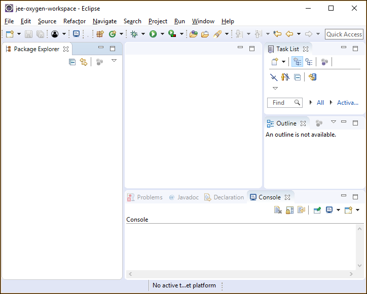

## Prerequisites  
 - **Proficiency:** Beginner
 - [Sign up for an free trial account on the SAP Cloud Platform](https://www.sap.com/developer/tutorials/hcp-create-trial-account.html)

## Next Steps
 - Select your next tutorial from these SAP Leonardo Machine Learning groups: [SAP API Business Hub](https://www.sap.com/developer/groups/ml-fs-api-hub.html), [Java](https://www.sap.com/developer/groups/ml-fs-java.html) or [SAPUI5](https://www.sap.com/developer/groups/ml-fs-sapui5.html)
 - Select a tutorial group from the [Tutorial Navigator](https://www.sap.com/developer/tutorial-navigator.html) or the [Tutorial Catalog](https://www.sap.com/developer/tutorial-navigator.tutorials.html)

## Details
### You will learn  
In this tutorial, you will learn how to quickly integrate the **Time Series Change Point Detection** SAP Leonardo Machine Learning Functional Services published from the SAP API Business Hub sandbox in a Java program.

The **Time Series Change Point Detection** service allows you to calculates and returns the probability of the change point for each data point in the provided univariate or multivariate time series.

You will then be able to substitute the **Time Series Change Point Detection** services with any other SAP Leonardo Machine Learning Functional Services that consumes images content.

For each API exposed in the SAP API Business Hub, you will be able to generate a code snippet which we will use in this tutorial.

This code snippet will be imported in a Java project built with the Eclipse IDE &trade;.

You can of course substitute the Eclipse IDE &trade; with alternate tools and adapt the current tutorial steps.

In this tutorial, you will learn the basics of making API calls against the Machine Learning Functional Services published in SAP API Business Hub.

### Time to Complete
**15 Min**

---

[ACCORDION-BEGIN [Step 1: ](Get Your Sandbox URL)]

In order to consume the **Time Series Change Point Detection** Machine Learning Functional Services, you will first need to get the service URI, your API Key and the request and response parameters.

Go to [https://api.sap.com/](https://api.sap.com) and click on the **Browse** tile.


Then you will be able to search for the **SAP Leonardo Machine Learning - Functional Services**, then click on the package found.


Click on **Artifacts**, then click on the **Time Series Change Point Detection API**.


As you can notice the **Time Series Change Point Detection API** has only one resource (or service): `/inference_sync`.

Now click on the **Generate Code**.

> **Note**: the term *inference* refers to the application phase (scoring) an existing model (as opposed to the training or inception phase) and *sync* for synchronous.


Now select the **Java** tab.


Here is a copy of the generated code (which you can use later from here or from the **Copy to clipboard** button at the bottom):

```Java
DataOutputStream dataOut = null;
BufferedReader in =null;

try {

  String url = "https://sandbox.api.sap.com/ml/changepointdetection/inference_sync";

  URL urlObj = new URL(url);
  HttpURLConnection connection = (HttpURLConnection) urlObj.openConnection();
  //setting request method
  connection.setRequestMethod("POST");

  //adding headers
  connection.setRequestProperty("content-type","multipart/form-data; boundary=---011000010111000001101001");
  connection.setRequestProperty("Accept","application/json");
  connection.setRequestProperty("APIKey","<API_KEY>");

  connection.setDoInput(true);

  //sending POST request
  connection.setDoOutput(true);
  dataOut = new DataOutputStream(connection.getOutputStream());
  dataOut.writeBytes("-----011000010111000001101001\r\nContent-Disposition: form-data; name=\"options\"\r\n\r\nstring\r\n-----011000010111000001101001--");
  dataOut.flush();

  int responseCode = connection.getResponseCode();
  in = new BufferedReader(new InputStreamReader(connection.getInputStream()));
  String inputLine;
  StringBuffer response = new StringBuffer();
  while ((inputLine = in.readLine()) != null) {
    response.append(inputLine);
  }

  //printing response
  System.out.println(response.toString());

} catch (Exception e) {
  //do something with exception
  e.printStackTrace();
} finally {
  try {
    if(dataOut != null) {
      dataOut.close();
    }
    if(in != null) {
      in.close();
    }

  } catch (IOException e) {
    //do something with exception
    e.printStackTrace();
  }
}
```

As you can notice, the Java import statements are missing along with request expected form data.

[ACCORDION-END]

[ACCORDION-BEGIN [Step 2: ](Get Your API key )]

When using any of the APIs outside of the SAP API Business Hub, an application key will be needed in every request header of your APIs calls.

To get to your API key, click on the  icon in the top right corner of the page. Click on the key icon.

The following pop-up should appear. Click on the **Copy API Key** button and save it in a text editor.


[ACCORDION-END]

[ACCORDION-BEGIN [Step 3: ](Start the Eclipse IDE)]

Now, let's start the Eclipse IDE and select your workspace (either the default, a new or an existing one).

If you don't have the Eclipse IDE installed, you can download the latest version from the following link: [Eclipse Downloads](https://www.eclipse.org/downloads/eclipse-packages/)

You can pick either the **Eclipse IDE for Java EE Developers** or the **Eclipse IDE for Java Developers**.

By default the Java perspective should be Launched. If not, use the menu bar and select **Window** > **Perspective** > **Open Perspective** > **Java**.
If the Java perspective is not listed, then use the **Other...** o open it.

You can also close the **Welcome Page**.



[ACCORDION-END]

[ACCORDION-BEGIN [Step 4: ](Create a New Project in the Eclipse IDE)]

Using the menu bar, go to **File** > **New** > **Java Project**.

You can name your project the way you want, here we will call it **`ml-changepointdetection`**.

Click on **Finish**.

> **Note**: make sure you pick `JavaSE-1.8` as your project **Execution Runtime JRE**. This should help avoid coding compliance and  runtime issues with the provided code.


[ACCORDION-END]

[ACCORDION-BEGIN [Step 5: ](Create a New Java Class)]

Using the menu bar, go to **File** > **New** > **Class**.

Make sure that your source folder is `ml-imageclassification/src`.

You can name your Java class the way you want, here we will call it **`DemoChangePointDetection`** and put it in a **demo** package.

Check the **`public static void main(String[] arg)`** box in order to get the main function created.

Click on **Finish**.


The default code in your newly created class should be something this:

```Java
package demo;
public class DemoChangePointDetection {
	public static void main(String[] args) {
		// TODO Auto-generated method stub
	}
}
```

You can now paste the generated code that was collected during step 1 and copy it in the body of the main function.

Make sure you replace the **`<API_KEY>`** token in the code by your API key (collected during step 2).

You can now **Organize imports** by using either the **CTRL+SHIFT+O** keyboard shortcut, the **Source** > **Organize imports** from the menu bar or by using a right-click in your code.

The following import will be added to your class:

```Java
import java.io.BufferedReader;
import java.io.DataOutputStream;
import java.io.IOException;
import java.io.InputStreamReader;
import java.net.HttpURLConnection;
import java.net.URL;
```

Save your code.

[ACCORDION-END]

[ACCORDION-BEGIN [Step 6: ](Process the input parameters as Form Data)]

Now can modify the code snippet to process the input series and send it as form data.

Replace the code below in the main function (around line 34):

```Java
  //sending POST request
  connection.setDoOutput(true);
  dataOut = new DataOutputStream(connection.getOutputStream());
  dataOut.writeBytes("-----011000010111000001101001\r\nContent-Disposition: form-data; name=\"options\"\r\n\r\nstring\r\n-----011000010111000001101001--");
  dataOut.flush();

  int responseCode = connection.getResponseCode();
  in = new BufferedReader(new InputStreamReader(connection.getInputStream()));
  String inputLine;
  StringBuffer response = new StringBuffer();
  while ((inputLine = in.readLine()) != null) {
   response.append(inputLine);
  }

  //printing response
  System.out.println(response.toString());
```

by

```Java
  // sending POST request
  connection.setDoOutput(true);

  // read the input file name from user input
  Scanner scanner = new Scanner(System.in);
  // Reading from System.in

  String default_data = "93969.262,76604.444,50000.000,17364.818,-17364.818,-50000.000,-76604.444,-93969.262,-100000.000,-93969.262,-76604.444,-50000.000,-17364.818,17364.818,50000.000,76604.444,93969.262,100000.000";
  System.out.println("What is your series data : (example :" + default_data + ")");
  String data = scanner.nextLine();
  if (data == null || data.length() == 0) {
    data = default_data;
  }

  String default_separator = ",";
  System.out.println("What is your value separator (default: \"" + default_separator + "\") : ");
  String separator = scanner.nextLine();
  if (separator == null || separator.length() > 1 || separator.length() == 0) {
    separator = default_separator;
  }

  String default_series_separator = ":";
  System.out.println("What is your series separator (default: \"" + default_series_separator + "\") : ");
  String series_separator = scanner.nextLine();
  if (series_separator == null || series_separator.length() > 1 || series_separator.length() == 0) {
    series_separator = default_series_separator;
  }
  scanner.close();

  // prepare the constant for the form data
  String LINE_FEED = "\r\n";
  String SEPARATOR = "--";
  String BOUNDARY = "------Boundary" + new BigInteger(128, new SecureRandom()).toString(32);

  // set the form content as multipart
  connection.setRequestProperty("Content-Type", "multipart/form-data; boundary=" + BOUNDARY);

  // write the form data content
  dataOut = new DataOutputStream(connection.getOutputStream());
  dataOut.writeBytes(SEPARATOR + BOUNDARY + LINE_FEED);
  dataOut.writeBytes("Content-Disposition: form-data; name=\"options\"" + LINE_FEED);
  dataOut.writeBytes(LINE_FEED);
  dataOut.writeBytes(
      "{ \"separator\" : \"" + separator + "\", \"series_separator\" : \"" + series_separator + "\" }");
  dataOut.writeBytes(LINE_FEED);
  dataOut.writeBytes(SEPARATOR + BOUNDARY + LINE_FEED);
  dataOut.writeBytes("Content-Disposition: form-data; name=\"texts\"" + LINE_FEED);
  dataOut.writeBytes(LINE_FEED);
  dataOut.writeBytes(data);

  // finish the form content
  dataOut.writeBytes(LINE_FEED);
  dataOut.writeBytes(SEPARATOR + BOUNDARY + SEPARATOR + LINE_FEED);
  dataOut.flush();
  dataOut.close();

  int responseCode = connection.getResponseCode();
  if (responseCode != 200) {
    in = new BufferedReader(new InputStreamReader(connection.getErrorStream()));
  } else {
    in = new BufferedReader(new InputStreamReader(connection.getInputStream()));
  }
  String inputLine;
  StringBuffer response = new StringBuffer();
  while ((inputLine = in.readLine()) != null) {
    response.append(inputLine);
  }

  // printing response
  System.out.println(response.toString());
```

You can now **Organize imports** by using either the **CTRL+SHIFT+O** keyboard shortcut, the **Source** > **Organize imports** from the menu bar or by using a right-click in your code.

The following import will be added to your class:

```Java
import java.math.BigInteger;
import java.security.SecureRandom;
import java.util.Scanner;
```

Save your code.

You can now run the code by either pressing **ALT**+**SHIFT**+**X**,**J** or by clicking on the **Run**  button.

Enter the relevant parameters as detailed in the console.

You can use your favorite spreadsheet tool to generate your series of data or use the default input provided.

[ACCORDION-END]

[ACCORDION-BEGIN [Step 7: ](Solution)]

In case you had some issues in the previous steps, here is the full class code with a better displayed response.

Just remember to replace the **`<API_KEY>`** token in the code by your API key (collected during step 2).

```Java
package demo;

import java.io.BufferedReader;
import java.io.DataOutputStream;
import java.io.IOException;
import java.io.InputStreamReader;
import java.math.BigInteger;
import java.net.HttpURLConnection;
import java.net.URL;
import java.security.SecureRandom;
import java.util.Scanner;

public class DemoChangePointDetection {

	public static void main(String[] args) {
		DataOutputStream dataOut = null;
		BufferedReader in = null;

		try {

			String url = "https://sandbox.api.sap.com/ml/changepointdetection/inference_sync";

			URL urlObj = new URL(url);
			HttpURLConnection connection = (HttpURLConnection) urlObj.openConnection();
			// setting request method
			connection.setRequestMethod("POST");

			// adding headers
			connection.setRequestProperty("content-type", "multipart/form-data; boundary=---011000010111000001101001");
			connection.setRequestProperty("Accept", "application/json");
			connection.setRequestProperty("APIKey", "<API_KEY>");

			connection.setDoInput(true);

			// sending POST request
			connection.setDoOutput(true);

			// read the input file name from user input
			Scanner scanner = new Scanner(System.in);
			// Reading from System.in

			String default_data = "93969.262,76604.444,50000.000,17364.818,-17364.818,-50000.000,-76604.444,-93969.262,-100000.000,-93969.262,-76604.444,-50000.000,-17364.818,17364.818,50000.000,76604.444,93969.262,100000.000";
			System.out.println("What is your series data : (example :" + default_data + ")");
			String data = scanner.nextLine();
			if (data == null || data.length() == 0) {
				data = default_data;
			}

			String default_separator = ",";
			System.out.println("What is your value separator (default: \"" + default_separator + "\") : ");
			String separator = scanner.nextLine();
			if (separator == null || separator.length() > 1 || separator.length() == 0) {
				separator = default_separator;
			}

			String default_series_separator = ":";
			System.out.println("What is your series separator (default: \"" + default_series_separator + "\") : ");
			String series_separator = scanner.nextLine();
			if (series_separator == null || series_separator.length() > 1 || series_separator.length() == 0) {
				series_separator = default_series_separator;
			}
			scanner.close();

			// prepare the constant for the form data
			String LINE_FEED = "\r\n";
			String SEPARATOR = "--";
			String BOUNDARY = "------Boundary" + new BigInteger(128, new SecureRandom()).toString(32);

			// set the form content as multipart
			connection.setRequestProperty("Content-Type", "multipart/form-data; boundary=" + BOUNDARY);

			// write the form data content
			dataOut = new DataOutputStream(connection.getOutputStream());
			dataOut.writeBytes(SEPARATOR + BOUNDARY + LINE_FEED);
			dataOut.writeBytes("Content-Disposition: form-data; name=\"options\"" + LINE_FEED);
			dataOut.writeBytes(LINE_FEED);
			dataOut.writeBytes(
					"{ \"separator\" : \"" + separator + "\", \"series_separator\" : \"" + series_separator + "\" }");
			dataOut.writeBytes(LINE_FEED);
			dataOut.writeBytes(SEPARATOR + BOUNDARY + LINE_FEED);
			dataOut.writeBytes("Content-Disposition: form-data; name=\"texts\"" + LINE_FEED);
			dataOut.writeBytes(LINE_FEED);
			dataOut.writeBytes(data);

			// finish the form content
			dataOut.writeBytes(LINE_FEED);
			dataOut.writeBytes(SEPARATOR + BOUNDARY + SEPARATOR + LINE_FEED);
			dataOut.flush();
			dataOut.close();

			int responseCode = connection.getResponseCode();
			if (responseCode != 200) {
				in = new BufferedReader(new InputStreamReader(connection.getErrorStream()));
			} else {
				in = new BufferedReader(new InputStreamReader(connection.getInputStream()));
			}
			String inputLine;
			StringBuffer response = new StringBuffer();
			while ((inputLine = in.readLine()) != null) {
				response.append(inputLine);
			}

			// printing response
      String TAB = "\t";
      String QUOTE = "\"";
      String CR = "\r\n";
			System.out.println(response.toString()//
          .replace("  " + QUOTE + "", "" + TAB + "" + QUOTE + "")//
					.replace("  ", "" + TAB + "")//
					.replace("" + TAB + " ", "" + TAB + "")//
					.replace(", ", ",")//
					.replace(": {", ":{" + CR + "")//
					.replace(": [", ":[" + CR + "")//
					.replace(":" + CR + "" + TAB + "{", ": {")//
					.replace(":" + CR + "" + TAB + "[", ": [")///
					.replace("{" + TAB + "", "{" + CR + "" + TAB + "")//
					.replace("[" + TAB + "", "[" + CR + "" + TAB + "")//
					.replace("" + QUOTE + ",", "" + QUOTE + "," + CR + "")//
					.replace("," + TAB + "", "," + CR + "" + TAB + "")//
					.replace("" + QUOTE + "" + TAB + "", "" + QUOTE + "" + CR + "" + TAB + "")//
					.replace("" + TAB + " " + TAB + "", "" + TAB + "" + TAB + "")//
					.replace("" + TAB + " {", "" + TAB + "{")//
					.replace("" + TAB + " [", "" + TAB + "[")//
					.replace("]", "]" + CR + "")//
					.replace("}", "}" + CR + "")//
					.replace("]" + CR + "," + CR + "", "]," + CR + "")//
					.replace("}" + CR + "," + CR + "", "}," + CR + "")//
					.replace("[" + CR + "]", "[]")//
					.replace("{" + CR + "}", "{}")//
					.replaceAll("([0-9])(\t)", "$1" + CR + "$2"));
		} catch (Exception e) {
			// do something with exception
			e.printStackTrace();
		} finally {
			try {
				if (dataOut != null) {
					dataOut.close();
				}
				if (in != null) {
					in.close();
				}

			} catch (IOException e) {
				// do something with exception
				e.printStackTrace();
			}
		}
	}
}
```

[ACCORDION-END]

## Next Steps
 - Select your next tutorial from these SAP Leonardo Machine Learning groups: [SAP API Business Hub](https://www.sap.com/developer/groups/ml-fs-api-hub.html), [Java](https://www.sap.com/developer/groups/ml-fs-java.html) or [SAPUI5](https://www.sap.com/developer/groups/ml-fs-sapui5.html)
- Select a tutorial from the [Tutorial Navigator](https://www.sap.com/developer/tutorial-navigator.html) or the [Tutorial Catalog](https://www.sap.com/developer/tutorials.html)
