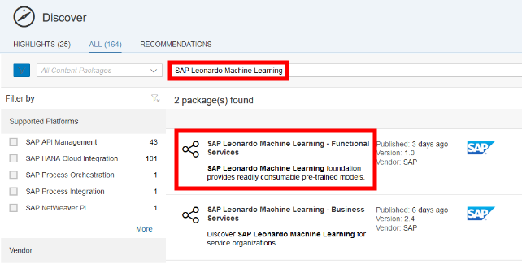
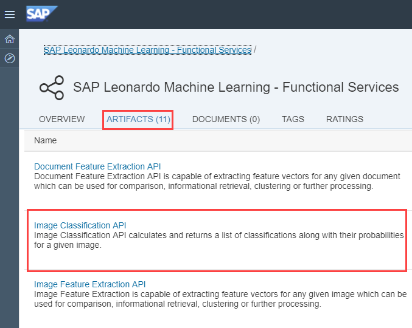
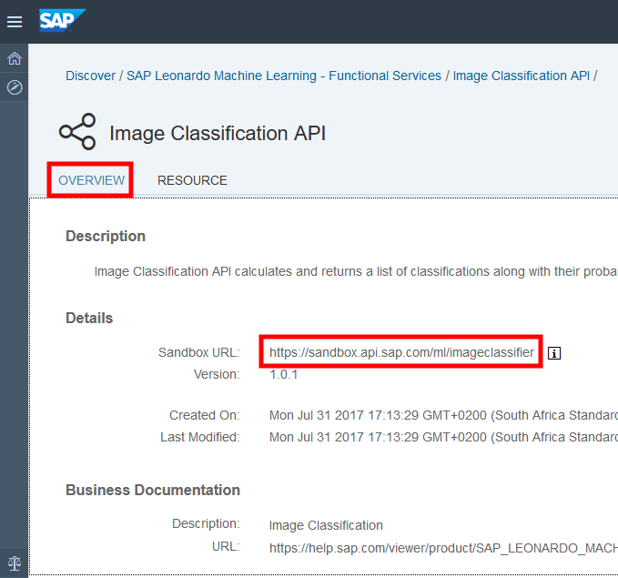
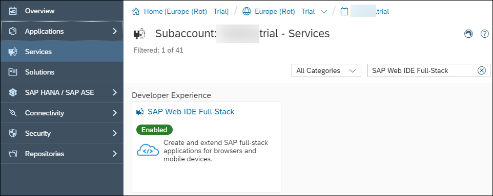
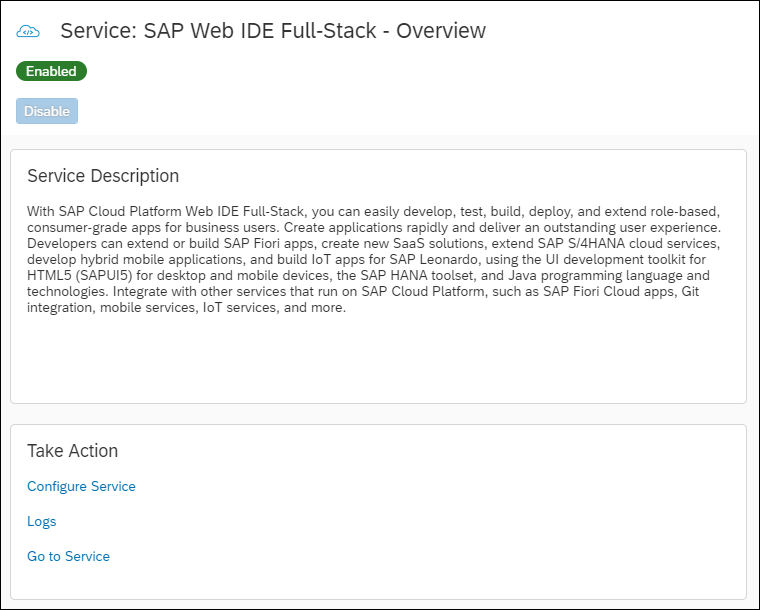
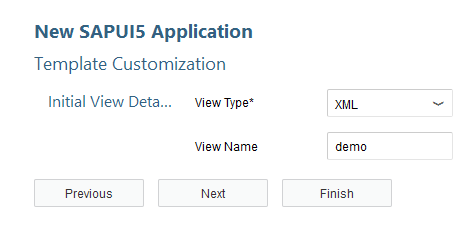
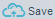

## Prerequisites  
 - **Proficiency:** Beginner
 - [Sign up for an free trial account on the SAP Cloud Platform](http://www.sap.com/developer/tutorials/hcp-create-trial-account.html)

## Next Steps
 - Select your next tutorial from these SAP Leonardo Machine Learning groups: [SAP API Business Hub](https://www.sap.com/developer/groups/ml-fs-api-hub.html), [Java](https://www.sap.com/developer/groups/ml-fs-java.html) or [SAPUI5](https://www.sap.com/developer/groups/ml-fs-sapui5.html)
 - Select a tutorial group from the [Tutorial Navigator](http://www.sap.com/developer/tutorial-navigator.html) or the [Tutorial Catalog](https://www.sap.com/developer/tutorial-navigator.tutorials.html)

## Details
### You will learn  
In this tutorial, you will learn how to quickly integrate the **Image Classification** SAP Leonardo Machine Learning Functional Services published from the SAP API Business Hub sandbox in a SAPUI5 application.

You will then be able to substitute the **Image Classification** services with any other SAP Leonardo Machine Learning Functional Services that consumes images content.

### Time to Complete
**20 Min**

---

[ACCORDION-BEGIN [Step 1: ](Get Your Sandbox URL)]

In order to consume the **Image Classification** Machine Learning Functional Services, you will first need to get the service URI, your API Key and the request and response parameters.

Go to [https://api.sap.com/](https://api.sap.com) and click on the **Browse** tile.


Then you will be able to search for the **SAP Leonardo Machine Learning - Functional Services**, then click on the package found.



Click on **Artifacts**, then click on the **Image Classification API**.



As you can notice the **Image Classification API** has only one resource (or service): `/inference_sync`.

Now click on the **Overview** tab.

> **Note**: the term *inference* refers to the application phase (scoring) an existing model (as opposed to the training or inception phase) and *sync* for synchronous.



As displayed on the screen, the sandbox URL for the **Image Classification API** where we need to append the API resource:

```JSON
https://sandbox.api.sap.com/ml/imageclassifier/inference_sync
```

[ACCORDION-END]

[ACCORDION-BEGIN [Step 2: ](Get Your API key )]

When using any of the APIs outside of the SAP API Business Hub, an application key will be needed in every request header of your APIs calls.

To get to your API key, click on the  icon in the top right corner of the page. Click on the key icon.

The following pop-up should appear. Click on the **Copy API Key** button and save it in a text editor.


Now, let's build a SAPUI5 application! But before doing so let's first add the destination to connect to the SAP API Business Hub.

[ACCORDION-END]

[ACCORDION-BEGIN [Step 3: ](Access the SAP Cloud Platform Cockpit)]

Go to your [***SAP Cloud Platform Cockpit***](http://account.hanatrial.ondemand.com/cockpit) account and access "Your Personal Developer Account".


[ACCORDION-END]

[ACCORDION-BEGIN [Step 4: ](Configure your destination)]

You will need to create a destination in your SAP Cloud Platform account that allow will your applications to connect to external APIs such as the SAP API Business Hub.

On the left side bar, you can navigate in **Connectivity** > **Destinations**.


On the ***Destinations*** overview page, click on **New Destination**


Enter the following information:

Field Name           | Value
-------------------- | --------------
Name                 | `sapui5ml-api`
Type                 | `HTTP`
Description          | `SAP Leonardo Machine Learning APIs`
URL                  | `https://sandbox.api.sap.com/ml`
Proxy Type           | `Internet`
Authentication       | `NoAuthentication`

Then you will need to add the following properties to the destination:

Property Name          | Value
---------------------- | --------------
`WebIDEEnabled`        | `true`

Click on **Save**


You can use the **Check Connectivity** button  next to the new **Destination** to validate that the URL can be accessed.

[ACCORDION-END]

[ACCORDION-BEGIN [Step 5: ](Open the Web IDE)]

On the left side bar, you can navigate in **Services**, then using the search box enter `Web IDE`.



Click on the tile, then click on **Open SAP Web IDE**.



You will get access to the **SAP Web IDE** main page:


[ACCORDION-END]

[ACCORDION-BEGIN [Step 6: ](Create your application using the SAPUI5 template)]

Click on **New Project from Template** in the ***Create Project*** section or use the **File** > **New** > **Project from Template**.


Select the **SAPUI5 Application** tile, then click on **Next**


Enter the following information, then click on **Next**

Field Name           | Value
-------------------- | --------------
Project Name         | `sapui5ml-imageclassifier`
Namespace            | `demo`


Enter the following information, then click on **Finish**

Field Name           | Value
-------------------- | --------------
View Type            | `XML`
View Name            | `demo`



[ACCORDION-END]

[ACCORDION-BEGIN [Step 7: ](Extend the application resource roots)]

In order to ease the use of the provided code, we will add a new SAPUI5 resource roots. The main reason for this is that the rule used to generate the initial resource root by the project template has change many time over the time.

Edit the `index.html` file located under **`Workspace`** > **`sapui5ml`** > **`webapp`** and add the below element to the existing `data-sap-ui-resourceroots` property around line 15 (don't forget the comma in between the existing element and the new one).

```JavaScript
"sapui5ml": ""
```

It should eventually look something like this:

```JavaScript
data-sap-ui-resourceroots='{"demosapui5ml-imageclassifier": "", "sapui5ml": ""}'
```

Click on the  button (or press CTRL+S).

[ACCORDION-END]

[ACCORDION-BEGIN [Step 8: ](Configure your SAPUI5 application)]

In order to use the previously configured destination, we need to add its declaration into the `neo-app.json` file along with the header white list configuration that will prevent HTTP header parameters to be filtered out.

Edit the `neo-app.json` file located under **`Workspace`** > **`sapui5ml-imageclassifier`** and replace the current content with the below code.

Then click on the  button (or press CTRL+S).

```JSON
{
	"welcomeFile": "/webapp/index.html",
	"routes": [{
		"path": "/resources",
		"target": {
			"type": "service",
			"name": "sapui5",
			"entryPath": "/resources"
		},
		"description": "SAPUI5 Resources"
	}, {
		"path": "/test-resources",
		"target": {
			"type": "service",
			"name": "sapui5",
			"entryPath": "/test-resources"
		},
		"description": "SAPUI5 Test Resources"
	}, {
		"path": "/ml",
		"target": {
			"type": "destination",
			"name": "sapui5ml-api"
		},
		"description": "ML API destination"
	}],
	"sendWelcomeFileRedirect": true,
	"headerWhiteList": [
		"APIKey"
	]
}
```

[ACCORDION-END]

[ACCORDION-BEGIN [Step 9: ](Store your API setting in a JSON model)]

There are multiple options to achieve this goal. Here we will use a pre-loaded JSON model configured in the `manifest.json` file.

Create a new file named `demo.json` under **`Workspace`** > **`sapui5ml-imageclassifier`** > **`webapp`** > **`model`**, copy the below code and make sure you replace `<<<<< COPY YOUR API KEY >>>>>` by your the API key we retrieved in step 2.

Then click on the  button (or press CTRL+S).

```JSON
{
	"url" : "/ml/imageclassifier/inference_sync",
	"APIKey":"<<<<< COPY YOUR API KEY >>>>>"
}
```

Edit the `manifest.json` file located under **`Workspace`** > **`sapui5ml-imageclassifier`** > **`webapp`** and locate the `models` section (around line 55), and update the section like this:

Then click on the  button (or press CTRL+S).

```JSON
"models": {
  "i18n": {
    "type": "sap.ui.model.resource.ResourceModel",
    "settings": {
      "bundleName": "demosapui5ml-imageclassifier.i18n.i18n"
    }
  },
  "demo": {
    "type": "sap.ui.model.json.JSONModel",
    "preload": true,
    "uri": "model/demo.json"
  }
}
```

[ACCORDION-END]

[ACCORDION-BEGIN [Step 10: ](Extend the main SAPUI5 view)]

The view will contain a table to display the results along with a canvas to display the selected image (if a single one is selected) and 2 buttons, one to import a snapshot and the other one to take snapshot using the webcam (if any, this button won't be visible on mobile device because it is not supported).

Edit the `demo.view.xml` file located under **`Workspace`** > **`sapui5ml-imageclassifier`** > **`webapp`** > **`view`** and replace the existing code with the below code.

Then click on the  button (or press CTRL+S).

```XML
<mvc:View xmlns:html="http://www.w3.org/1999/xhtml" xmlns:mvc="sap.ui.core.mvc" xmlns:form="sap.ui.layout.form" xmlns:table="sap.ui.table"
	xmlns:u="sap.ui.unified" xmlns="sap.m" controllerName="sapui5ml.controller.demo" displayBlock="true">
	<App>
		<pages>
			<Page title="Image Classification">
				<content>
					<VBox width="100%" direction="Column" alignItems="Center">
						<Carousel pages="{demo>/predictions}" width="100%" visible="{= typeof ${demo>/resultVisible} !== 'undefined'}">
							<pages>
								<VBox width="100%" direction="Column" alignItems="Center">
									<Label text="File name: {demo>name}" class="sapUiLargeMargin"></Label>
									<table:Table rows="{demo>results}" enableBusyIndicator="true" selectionMode="Single" visibleRowCount="5">
										<table:columns>
											<table:Column sortProperty="label" filterProperty="label">
												<Label text="Label"/>
												<table:template>
													<Link text="{demo>label}" href="https://www.google.fr/search?q={label}&amp;newwindow=1&amp;tbm=isch" target="search"/>
												</table:template>
											</table:Column>
											<table:Column sortProperty="score" filterProperty="score">
												<Label text="Score"/>
												<table:template>
													<Text text="{demo>score}"/>
												</table:template>
											</table:Column>
										</table:columns>
									</table:Table>
								</VBox>
							</pages>
						</Carousel>
						<Image id="idImage" tooltip="canvas" visible="false" class="sapUiLargeMargin"/>
					</VBox>
				</content>
				<footer>
					<Toolbar width="100%">
						<content>
							<u:FileUploader id="idFileUpload" buttonOnly="true" buttonText="Upload Picture" name="files" uploadUrl="{demo>/url}"
								sameFilenameAllowed="true" useMultipart="true" sendXHR="true" uploadOnChange="true" change="fileUploadChange"
								uploadComplete="fileUploadComplete">
								<u:headerParameters>
									<u:FileUploaderParameter name="APIKey" value="{demo>/APIKey}"/>
									<u:FileUploaderParameter name="Accept" value="application/json"/>
								</u:headerParameters>
							</u:FileUploader>
						</content>
					</Toolbar>
				</footer>
			</Page>
		</pages>
	</App>
</mvc:View>
```

[ACCORDION-END]

[ACCORDION-BEGIN [Step 11: ](Extend the main SAPUI5 controller)]

Edit the `demo.controller.js` file located under **`Workspace`** > **`sapui5ml-imageclassifier`** > **`webapp`** > **`controller`** and replace the existing code with the below code.

Then click on the  button (or press CTRL+S).

```JavaScript
sap.ui.define([
	"sap/ui/core/mvc/Controller",
	"sap/m/MessageToast",
	"sap/m/Image"
], function(Controller, MessageToast, Image) {
	"use strict";
	return Controller.extend("sapui5ml.controller.demo", {

		fileUploadChange: function(oControlEvent) {
			// start the busy indicator
			var oBusyIndicator = new sap.m.BusyDialog();
			oBusyIndicator.open();

			// keep a reference of the uploaded file if this is an image only
			var file = oControlEvent.getParameters().files[0];
			if (file.type.match('image.*')) {
				this.oFileSrc = URL.createObjectURL(file);
			} else {
				this.oFileSrc = null;
			}

			// keep a reference in the view to close it later
			this.oBusyIndicator = oBusyIndicator;
		},
		fileUploadComplete: function(oControlEvent) {
			// get the current view
			var oView = this.getView();

			if (oControlEvent.getParameters().status === 200) {
				// set the response as JSON in the demo model
				oView.getModel("demo").setProperty("/predictions", JSON.parse(oControlEvent.getParameters().responseRaw).predictions);

				// display the result table
				oView.getModel("demo").setProperty("/resultVisible", true);

				// display the uploaded image
				var image = oView.byId("idImage");
				if (this.oFileSrc !== null) {
					image.setSrc(this.oFileSrc);
					image.setVisible(true);
				} else {
					image.setVisible(false);
				}
			} else {
				MessageToast.show("Error " + oControlEvent.getParameters().status + " : " + oControlEvent.getParameters().responseRaw);
			}
			this.oBusyIndicator.close();
		}
	});
});
```

[ACCORDION-END]

[ACCORDION-BEGIN [Step 12: ](Test the application)]

Click on the **Run** icon  or press `ALT+F5`.

In the bar at the bottom, click on **Upload Picture** to pick your local picture.

The service will be called, and the result displayed in a table.

You can also try with a zip that contains multiple images.


[ACCORDION-END]

[ACCORDION-BEGIN [Solution: ](Project files)]

In case you are having problems when running the application, the complete project code can be found on the SAP Tutorial public [GitHub repository](https://github.com/SAPDocuments/Tutorials/tree/master/tutorials/ml-fs-sapui5-img-classification/sapui5ml-imageclassifier).

However, this is not a repository you can clone and run the code.

You have to import the `sapui5ml-imageclassifier` directory content into your existing project directory.

Make sure you check the [LICENSE](https://github.com/SAPDocuments/Tutorials/blob/master/LICENSE.txt) before starting using its content.

[ACCORDION-END]

## Next Steps
 - Select your next tutorial from these SAP Leonardo Machine Learning groups: [SAP API Business Hub](https://www.sap.com/developer/groups/ml-fs-api-hub.html), [Java](https://www.sap.com/developer/groups/ml-fs-java.html) or [SAPUI5](https://www.sap.com/developer/groups/ml-fs-sapui5.html)
- Select a tutorial from the [Tutorial Navigator](http://www.sap.com/developer/tutorial-navigator.html) or the [Tutorial Catalog](http://www.sap.com/developer/tutorials.html)
