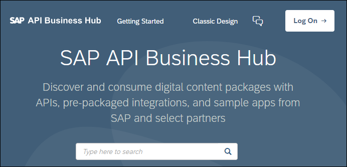
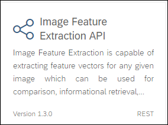
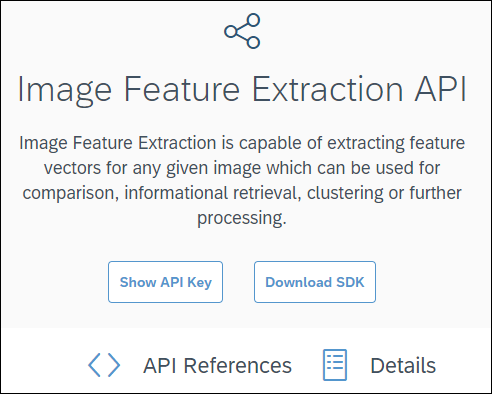
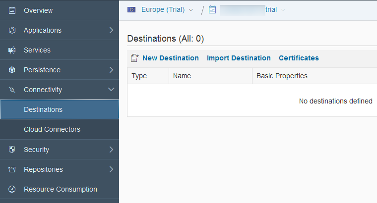
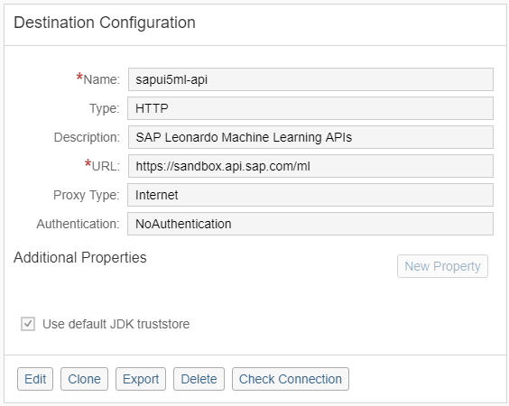
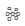
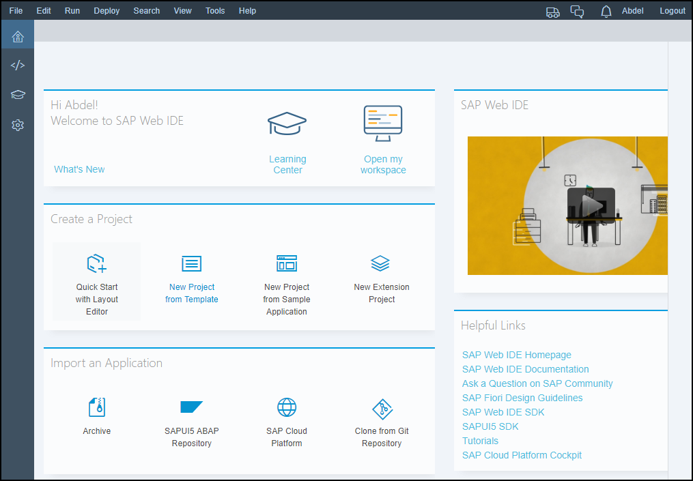
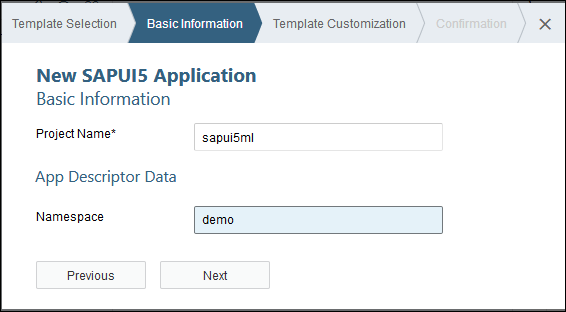
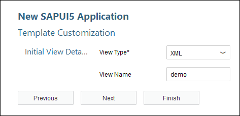
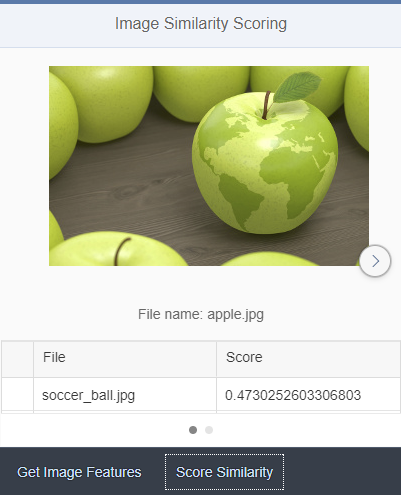

## Prerequisites  
 - [Sign up for an free trial account on the SAP Cloud Platform](https://developers.sap.com/tutorials/hcp-create-trial-account.html)

## Details
### You will learn  
  - How to quickly integrate the **Image Feature Extraction** & **Similarity Scoring** SAP Leonardo Machine Learning Functional Services published from the SAP API Business Hub sandbox in a SAPUI5 application

The **Image Feature Extraction** service allows you to extract a vector of features for any given image which can be used with **Similarity Scoring** service to compare vectors of features and compute a similarity score (cosine distance) ranging from -1 to 1.

---

[ACCORDION-BEGIN [Step 1: ](Get The API Sandbox URL And API Key)]

In order to consume the **Image Feature Extraction** & **Similarity Scoring** SAP Leonardo Machine Learning Foundation service, you will first need to get the service URI and your API key, request and response parameters.

Go to [https://api.sap.com/](https://api.sap.com).



Then you will be able to search for the **SAP Leonardo Machine Learning - Functional Services**, then click on the package found.


Select **Inference Service For Customizable Image Feature Extraction**.



You can also access the page directly from the following address:

 - <https://api.sap.com/api/img_feature_extraction_api/resource>



To get to your API Sandbox URL, click on the **Details** tab.

The **Inference Service For Customizable Image Feature Extraction** Sandbox URL should be:

```JSON
https://sandbox.api.sap.com/ml/imagefeatureextraction
```

Do the same for the **Inference Service for Similarity Scoring**.

You can also access the page directly from the following address:

 - <https://api.sap.com/api/similarity_scoring_api/resource>

The **Inference Service for Similarity Scoring** Sandbox URL should be:

```JSON
https://sandbox.api.sap.com/ml/similarityscoring
```

To get to your API key, click on the **Show API Key** button.

You will be prompted to login if you are not yet.

Then, the following pop-up should appear. Click on the **Copy Key and Close** button and save it in a text editor.


[DONE]
[ACCORDION-END]

[ACCORDION-BEGIN [Step 1: ](Analyze the services)]

As you will notice both API have only one resource (or service), `/similarity-scoring` for **Inference Service for Similarity Scoring** and `/feature-extraction` for **Inference Service For Customizable Image Feature Extraction** .

You can click on the resource to expand the section.

> **Note**: the term *inference* refers to the application phase (scoring) an existing model (as opposed to the training or inception phase) and *sync* for synchronous.

As stated in the description, the **Inference Service For Customizable Image Feature Extraction** service accepts either:

 - an archive file with a zip/tar extensions containing multiple image files
 - a single image
 - a list of image as input

The service returns a feature vector extracted from the image.

The supported image formats are ***JPEG***, ***PNG***, ***TIF*** or ***BMP*** (the actual content format is validated, so renaming files may simply not work).

As stated in the description, the **Inference Service for Similarity Scoring** service accepts either:

 - an archive file which should consist of files, each of them containing a feature vector.

A series of options are also required for the following parameters:

 - `numSimilarVectors`: Number of most similar vectors to return in response
 - `algorithm`: The algorithm to use for calculation, one of `naive`, `matrix_mult`, `clustering` (optional)

The service returns the associated similarity scores.

The input file, files or archive file will be sent as a `FormData` query parameter in the service request.

[DONE]
[ACCORDION-END]

[ACCORDION-BEGIN [Step 1: ](Access the SAP Cloud Platform Cockpit)]

Log into the <a href="https://account.hanatrial.ondemand.com/cockpit#/region/neo-eu1-trial/overview" target="new"><b>SAP Cloud Platform Cockpit Neo Trial</b></a> with your free trial account on **Europe (Rot) - Trial** and access ***Your Personal Developer Account***.

Click on your ***SAP Cloud Platform Account*** identifier (which ends with *trial* by default) as highlighted on the below screenshot.


You are now in your ***SAP Cloud Platform developer*** account!


> If you are unclear with what is your SAP Cloud Platform account name, you can refer to the following blog entry: [SAP Cloud Platform login, user name, account id, name or display name: you are lost? Not anymore!](https://blogs.sap.com/2017/01/31/sap-hana-cloud-platform-trial-login-name-user-name-account-name-account-identifier-you-are-lost-not-anymore/)

[DONE]
[ACCORDION-END]

[ACCORDION-BEGIN [Step 1: ](Configure your destination)]

You will need to create a destination in your SAP Cloud Platform account that allow will your applications to connect to external APIs such as the SAP API Business Hub.

On the left side bar, you can navigate in **Connectivity** > **Destinations**.

On the ***Destinations*** overview page, click on **New Destination**



Enter the following information:

Field Name           | Value
-------------------- | --------------
Name                 | `sapui5ml-api`
Type                 | `HTTP`
Description          | `SAP Leonardo Machine Learning APIs`
URL                  | `https://sandbox.api.sap.com/ml`
Proxy Type           | `Internet`
Authentication       | `NoAuthentication`

Then you will need to add the following properties to the destination:

Property Name          | Value
---------------------- | --------------
`WebIDEEnabled`        | `true`

Click on **Save**



You can use the **Check Connectivity** button  next to the new **Destination** to validate that the URL can be accessed.

You should receive a ***connection established*** message with potentially a ***404: Not Found*** response which is normal.

[DONE]
[ACCORDION-END]

[ACCORDION-BEGIN [Step 1: ](Open the Web IDE)]

On the left side bar, you can navigate in **Services**, then using the search box enter `Web IDE`.


Click on the tile, then click on **Go to Service**.


You will get access to the **SAP Web IDE** main page:



[DONE]
[ACCORDION-END]

[ACCORDION-BEGIN [Step 1: ](Create a project using the SAPUI5 template)]

Click on **New Project from Template** in the ***Create Project*** section or use the **File** > **New** > **Project from Template**.


Select the **SAPUI5 Application** tile, then click on **Next**


Enter the following information, then click on **Next**

Field Name           | Value
-------------------- | --------------
Project Name         | `sapui5ml-img-similarityscoring`
Namespace            | `demo`



Enter the following information, then click on **Finish**

Field Name           | Value
-------------------- | --------------
View Type            | `XML`
View Name            | `demo`



[DONE]
[ACCORDION-END]

[ACCORDION-BEGIN [Step 1: ](Extend the application resource roots)]

In order to ease the use of the provided code, we will add a new SAPUI5 resource roots. The main reason for this is that the rule used to generate the initial resource root by the project template has change many time over the time.

Edit the **`index.html`** file located under **`Workspace`** > **`sapui5ml`** > **`webapp`** and add the below element to the existing `data-sap-ui-resourceroots` property around line 15 (don't forget the comma in between the existing element and the new one).

```JavaScript
"sapui5ml": ""
```

It should eventually look something like this:

```
data-sap-ui-resourceroots='{"demo.sapui5ml-img-similarityscoring": "./", "sapui5ml": ""}'
```

Click on the  button (or press CTRL+S).

[DONE]
[ACCORDION-END]

[ACCORDION-BEGIN [Step 1: ](Configure your SAPUI5 application)]

In order to use the previously configured destination, we need to add its declaration into the `neo-app.json` file along with the header white list configuration that will prevent HTTP header parameters to be filtered out.

Edit the **`neo-app.json`** file located under **`Workspace`** > **`sapui5ml-img-similarityscoring`** and replace the current content with the below code.

Then click on the  button (or press CTRL+S).

```JSON
{
  "welcomeFile": "/webapp/index.html",
  "routes": [{
    "path": "/resources",
    "target": {
      "type": "service",
      "name": "sapui5",
      "entryPath": "/resources"
    },
    "description": "SAPUI5 Resources"
  }, {
    "path": "/test-resources",
    "target": {
      "type": "service",
      "name": "sapui5",
      "entryPath": "/test-resources"
    },
    "description": "SAPUI5 Test Resources"
  }, {
    "path": "/ml-dest",
    "target": {
      "type": "destination",
      "name": "sapui5ml-api"
    },
    "description": "ML API destination"
  }],
  "sendWelcomeFileRedirect": true,
  "headerWhiteList": [
    "APIKey"
  ]
}
```

> ### **Note:** `headerWhiteList`
>
>By default, headers element like the `APIKey` will be blocked when used in a SAPUI5 control like the `FileUploader`. This is the reason why we add it to the white list.
>

&nbsp;

[DONE]
[ACCORDION-END]

[ACCORDION-BEGIN [Step 1: ](Store your API setting in a JSON model)]

There are multiple options to achieve this goal. Here we will use a pre-loaded JSON model configured in the `manifest.json` file.

Create a new file named **`demo.json`** under **`Workspace`** > **`sapui5ml-img-similarityscoring`** > **`webapp`** > **`model`**, copy the below code and make sure you replace `<<<<< COPY YOUR API KEY >>>>>` by your the API key we retrieved in step 2.

Then click on the  button (or press CTRL+S).

```JSON
{
  "url_featureextraction": "/ml-dest/imagefeatureextraction/feature-extraction",
  "url_similarityscoring": "/ml-dest/similarityscoring/similarity-scoring",
  "method": "POST",
  "accept": "application/json",
  "fileType": "zip,tar",
  "mimeType": "application/x-zip-compressed,application/zip,application/octet-stream",
  "APIKey":"<<<<< COPY YOUR API KEY >>>>>"
}
```

Edit the **`manifest.json`** file located under **`Workspace`** > **`sapui5ml-img-similarityscoring`** > **`webapp`** and locate the `models` section (around line 55), and update the section like this:

Then click on the  button (or press CTRL+S).

```JSON
"models": {
  "i18n": {
    "type": "sap.ui.model.resource.ResourceModel",
    "settings": {
      "bundleName": "demosapui5ml-img-similarityscoring.i18n.i18n"
    }
  },
  "demo": {
    "type": "sap.ui.model.json.JSONModel",
    "preload": true,
    "uri": "model/demo.json"
  }
}
```

[DONE]
[ACCORDION-END]

[ACCORDION-BEGIN [Step 1: ](Extend your SAPUI5 view)]

The view will contain a carousel that will display the uploaded images along with a table to display the results along with a "File Upload" button to handle feature extraction call and a button for the similarity scoring.

Edit the **`demo.view.xml`** file located under **`Workspace`** > **`sapui5ml-img-similarityscoring`** > **`webapp`** > **`view`** and replace the existing code with the below code.

Then click on the  button (or press CTRL+S).

```XML
<mvc:View xmlns:mvc="sap.ui.core.mvc" xmlns:table="sap.ui.table" xmlns:unified="sap.ui.unified" xmlns="sap.m" xmlns:micro="sap.suite.ui.microchart" xmlns:custom="http://schemas.sap.com/sapui5/extension/sap.ui.core.CustomData/1" controllerName="sapui5ml.controller.demo" displayBlock="true">
  <App>
    <pages>
      <Page title="Image Similarity Scoring">
        <content>
          <Carousel pages="{demo>/predictions}" width="100%" visible="{= ${demo>/visible-featureextraction} === true}">
            <pages>
              <ScrollContainer height="100%" width="100%" horizontal="true" vertical="true" focusable="true">
                <VBox alignContent="Center" alignItems="Center">
                  <Image tooltip="canvas" class="sapUiLargeMargin" src="{demo>contentUrl}"/>
                  <Label text="File name: {demo>name}" class="sapUiLargeMargin"></Label>
                  <table:Table rows="{demo>results}" enableBusyIndicator="true" selectionMode="Single" visibleRowCount="5"
                    visible="{= ${demo>/visible-similarityscoring} === true}">
                    <table:columns>
                      <table:Column sortProperty="label" filterProperty="label">
                        <Label text="Label"/>
                        <table:template>
                          <Text text="{demo>id}"/>
                        </table:template>
                      </table:Column>
                      <table:Column sortProperty="score" filterProperty="score">
                        <Label text="Score"/>
                        <table:template>
                          <micro:RadialMicroChart size="XS" fraction="{demo>score}" total="1" class="sapUiSmallMargin"/>
                        </table:template>
                      </table:Column>
                    </table:columns>
                  </table:Table>
                  <Button text="Score Similarity" press="onPressScoreSimilarity" custom:mode="ajax" visible="{= ${demo>/visible-featureextraction} === true}"/>
                </VBox>
                <content/>
              </ScrollContainer>
            </pages>
          </Carousel>
        </content>
        <footer>
          <Toolbar width="100%">
            <content>
              <unified:FileUploader buttonOnly="true" buttonText="Upload Picture" sameFilenameAllowed="true" multiple="false" fileType="{demo>/fileType}" mimeType="{demo>/mimeType}" typeMissmatch="fileTypeMissmatch" change="onPressExtractFeatures" custom:mode="ajax">
                <unified:headerParameters>
                  <unified:FileUploaderParameter name="APIKey" value="{demo>/APIKey}"/>
                  <unified:FileUploaderParameter name="Accept" value="{demo>/accept}"/>
                </unified:headerParameters>
              </unified:FileUploader>
              <Button text="Score Similarity" press="onPressScoreSimilarity" custom:mode="ajax" visible="{= ${demo>/visible-featureextraction} === true}"/>
            </content>
          </Toolbar>
        </footer>
      </Page>
    </pages>
  </App>
</mvc:View>
```

[DONE]
[ACCORDION-END]

[ACCORDION-BEGIN [Step 1: ](Extend your SAPUI5 application With JSZip & FileSaver)]

`JSZip` is a JavaScript library for creating, reading and editing .zip files, with a lovely and simple API.

`JSZip` is dual licensed. You may use it under the MIT license or the `GPLv3` license. Make sure o have a look at the [LICENSE](https://github.com/Stuk/jszip/blob/master/LICENSE.markdown) condition before continuing with the tutorial.

`FileSaver.js` is the solution for saving files on the client-side, and is perfect for web apps that need to generate files, or for saving sensitive information that shouldn't be sent to an external server.

`FileSaver` is licensed under the MIT license.

I highly recommend you to check the LICENSE for more details.

GitHub repository : `https://github.com/eligrey/FileSaver.js`

For detailed instructions about how to configure you SAPUI5 application with `JSZip`, you can refer to the following blog: [Give the power of Zip to you SAPUI5 applications](https://blogs.sap.com/2017/12/15/give-the-power-of-zip-to-your-sapui5-applications/)

For more details `JSZip`, you can refer to : <https://stuk.github.io/jszip/>

> ### **Note: `JSZip` library**
> Make sure to include the following piece of code at the very beginning of the controller code, else you will see validation errors in your code:
>
> ```JavaScript
> /* global JSZip:true */
> /* global saveAs:true */
> ```

[DONE]
[ACCORDION-END]

[ACCORDION-BEGIN [Step 1: ](Extend your SAPUI5 controller (1/4))]

In this step, you will add a series of generic helper functions. These functions handle:

 - file type mismatch: when the wrong file type is selected during the upload
 - clear previous results
 - display final message
 - generate local URL for image files (including images inside ZIP)

Edit the **`demo.controller.js`** file located under **`Workspace`** > **`sapui5ml-img-similarityscoring`** > **`webapp`** > **`controller`** and replace the existing code with the below code.

```JavaScript
/* global JSZip:true */
/* global saveAs:true */
sap.ui.define([
  "sap/ui/core/mvc/Controller",
  "sap/m/MessageBox"
], function (Controller, MessageBox) {
  "use strict";

  return Controller.extend("sapui5ml.controller.demo", {
    fileTypeMissmatch: function (oControlEvent) {
      MessageBox.show("Wrong file type!");
    },
    clearPredictions: function () {
      this.getView().getModel("demo").setProperty("/predictions", null);
      this.getView().getModel("demo").setProperty("/visible-similarityscoring", false);
      this.getView().getModel("demo").setProperty("/visible-featureextraction", false);
    },
    displayErrorsOrFinish: function (oController, service) {
      if (oController.oFilesProcessed === oController.oFiles.length) {
        oController.oBusyIndicator.close();
        if (oController.oErrors.length === 0) {
          MessageBox.show("Process completed!\n Target URL: " + oController.getView().getModel("demo").getProperty("/url_" + service));
        } else {
          var message = "";
          for (var i = 0; i < oController.oErrors.length; i++) {
            message += "\n\t  Error: " + oController.oErrors[i].status + " - " + oController.oErrors[i].message;
          }
          MessageBox.show("Errors: \n" + message);
        }
      }
    },
    getFileContentUrl: function (files, prediction, callback) {
      for (var i = 0; i < files.length; i++) {
        if (files[i].type.match("image.*")) {
          if (files[i].name === prediction.name) {
            callback(prediction, files[i].contentUrl);
          }
        } else {
          JSZip.loadAsync(files[i]).then(function (zip) {
            Object.keys(zip.files).forEach(function (zipEntry) {
              if (zipEntry === prediction.name) {
                zip.files[zipEntry].async("blob").then(function (zipEntryFile) {
                  callback(prediction, URL.createObjectURL(zipEntryFile));
                });
              }
            });
          });
        }
      }
    }
  });
});
```

[DONE]
[ACCORDION-END]

[ACCORDION-BEGIN [Step 1: ](Extend your SAPUI5 controller (2/4))]

In this step, you will add a generic function to call the API. You can notice that this function allows you to use either Ajax or XHR depending on the mode parameter.

Edit the **`demo.controller.js`** file located under **`Workspace`** > **`sapui5ml-img-similarityscoring`** > **`webapp`** > **`controller`** and add the following function to the controller.

Then click on the  button (or press CTRL+S).

```JavaScript
    callService: function (oController, service, mode, file, callback, options) {
      // create the form data to be sent in the request
      var formData = new window.FormData();
      formData.append("files", file, file.name);
      if (options) {
        formData.append("options", JSON.stringify(options));
      }

      var url = oController.getView().getModel("demo").getProperty("/url_" + service);
      var type = oController.getView().getModel("demo").getProperty("/method");
      var apiKey = oController.getView().getModel("demo").getProperty("/APIKey");
      var accept = oController.getView().getModel("demo").getProperty("/accept");

      var callbackAjaxSuccess = function (data, status, jqXHR) {
        callback(oController, data);
      };
      var callbackAjaxError = function (jqXHR, status, message) {
        oController.clearPredictions();
        var error_message = {
          "error": jqXHR.responseJSON.error
        };
        callback(oController, error_message);
      };
      var callbackXHRReadyStateChange = function () {
        if (this.readyState === this.DONE) {
          if (this.status === 200) {
            callback(oController, JSON.parse(this.response));
          } else {
            oController.clearPredictions();
            var error_message = {
              "error": this.responseJSON.error
            };
            callback(oController, error_message);
          }
        }
      };
      if (mode === "ajax") {
        $.ajax({
          type: type,
          url: url,
          headers: {
            "Accept": accept,
            "APIKey": apiKey
          },
          success: callbackAjaxSuccess,
          error: callbackAjaxError,
          contentType: false,
          async: true,
          data: formData,
          cache: false,
          processData: false
        });
      } else if (mode === "xhr") {
        var xhr = new XMLHttpRequest();
        xhr.withCredentials = false;
        xhr.addEventListener("readystatechange", callbackXHRReadyStateChange);
        xhr.open(type, url, true); // setting request method & API endpoint, the last parameter is to set the calls as asynchyronous
        xhr.setRequestHeader("Accept", accept); // adding request headers
        xhr.setRequestHeader("APIKey", apiKey); // API Key for API Sandbox
        xhr.send(formData); // sending request
      } else {
        oController.oBusyIndicator.close();
      }
    }
```

[DONE]
[ACCORDION-END]

[ACCORDION-BEGIN [Step 1: ](Extend your SAPUI5 controller (3/4))]

In this step, you will add the code to process the **Image Feature Extraction** API call.

Edit the **`demo.controller.js`** file located under **`Workspace`** > **`sapui5ml-img-similarityscoring`** > **`webapp`** > **`controller`** and add the following function to the controller.

Then click on the  button (or press CTRL+S).

```JavaScript

    addExtractedFeatures: function (predictions) {
      // service name
      var service = "featureextraction";
      var current = this.getView().getModel("demo").getProperty("/predictions");
      if (!current) {
        current = [];
        this.getView().getModel("demo").setProperty("/predictions", current);
      }
      current.push(predictions);
      // set the results visible
      this.getView().getModel("demo").setProperty("/visible-" + service, true);
    },
    processResultsExtractFeatures: function (oController, response) {
      // service name
      var service = "featureextraction";

      oController.oFilesProcessed++;
      if (response.status === "DONE") {
        for (var i = 0; i < response.predictions.length; i++) {
          var callback = function (prediction, contentUrl) {
            prediction.contentUrl = contentUrl;
            oController.addExtractedFeatures(prediction);
          };
          oController.getFileContentUrl(oController.oFiles, response.predictions[i], callback);
        }
      } else {
        oController.oErrors.push({
          "status": response.error.code,
          "message": response.error.message
        });
      }
      oController.displayErrorsOrFinish(oController, service);
    },
    onPressExtractFeatures: function (oControlEvent) {
      // service name
      var service = "featureextraction";
      // get the call mode : ajax or xhr
      var mode = oControlEvent.getSource().data("mode");

      // start the busy indicator
      var oBusyIndicator = new sap.m.BusyDialog();
      oBusyIndicator.open();

      // clear previous results from the model
      this.clearPredictions();

      // keep a reference of the uploaded file name and create the local url
      var oFiles = oControlEvent.getParameters().files;
      for (var i = 0; i < oFiles.length; i++) {
        oFiles[i].contentUrl = URL.createObjectURL(oFiles[i]);
      }

      // keep a reference in the view to close it later
      this.oBusyIndicator = oBusyIndicator;
      this.oFiles = Object.assign({}, oFiles);
      this.oFiles.length = oFiles.length;
      this.oFilesProcessed = 0;
      this.oErrors = [];

      for (var j = 0; j < oFiles.length; j++) {
        this.oFiles[j].contentUrl = URL.createObjectURL(this.oFiles[j]);
        this.callService(this, service, mode, this.oFiles[j], this.processResultsExtractFeatures);
      }
    }
```

[DONE]
[ACCORDION-END]

[ACCORDION-BEGIN [Step 1: ](Extend your SAPUI5 controller (4/4))]

In this step, you will add the code to process the **Similarity Scoring** API call.

Edit the **`demo.controller.js`** file located under **`Workspace`** > **`sapui5ml-img-similarityscoring`** > **`webapp`** > **`controller`** and add the following function to the controller.

Then click on the  button (or press CTRL+S).

```JavaScript
    addSimilarityScores: function (predictions) {
      // service name
      var service = "similarityscoring";
      var current = this.getView().getModel("demo").getProperty("/predictions");
      for (var i = 0; i < current.length; i++) {
        if (predictions.id === current[i].name + ".json") {
          current[i].results = predictions.similarVectors;
          break;
        }
      }
      // set the results visible
      this.getView().getModel("demo").setProperty("/visible-" + service, true);
    },
    processResultsSimilarity: function (oController, response) {
      // service name
      var service = "similarityscoring";

      oController.oFilesProcessed++;
      if (response.status === "DONE") {
        for (var i = 0; i < response.predictions.length; i++) {
          oController.addSimilarityScores(response.predictions[i]);
        }
      } else {
        oController.oErrors.push({
          "status": response.error.code,
          "message": response.error.message
        });
      }
      oController.displayErrorsOrFinish(oController, service);
    },
    onPressScoreSimilarity: function (oControlEvent) {
      // Keep a reference to the controller
      var oController = this;

      // service name
      var service = "similarityscoring";

      // get the call mode : ajax or xhr
      var mode = oControlEvent.getSource().data("mode");

      // start the busy indicator
      var oBusyIndicator = new sap.m.BusyDialog();
      oBusyIndicator.open();

      // keep a reference in the view to close it later
      this.oBusyIndicator = oBusyIndicator;
      this.oFiles = {
        "length": 1
      };
      this.oFilesProcessed = 0;
      this.oErrors = [];

      // create the zip file from the array of features vector
      var zip = new JSZip();
      var features = this.getView().getModel("demo").getProperty("/predictions");
      for (var i = 0; i < features.length; i++) {
        features[i].results = [];
        zip.file(features[i].name + ".json", JSON.stringify(features[i].featureVectors));
      }

      // call the service with the generated zip file containing the feature vectors
      zip.generateAsync({
          type: "blob"
        })
        .then(function (content) {
          saveAs(content, "input.zip");
          content.name = "input.zip";
          var options = {
            "numSimilarVectors": (features.length - 1)
          };
          oController.callService(oController, service, mode, content, oController.processResultsSimilarity, options);
        });
    }
```

[DONE]
[ACCORDION-END]

[ACCORDION-BEGIN [Step 1: ](Test the application)]

Click on the **Run** icon  or press `ALT+F5`.

In the bar at the bottom, click on **Upload Pictures** to pick a local ZIP archive with pictures (at least 2).

The service will be called, and the images will be displayed in a carousel.

You can also combine image files with a zip that contains multiple images.

Click on **Score Similarity** to get the similarity score between the images.



[DONE]
[ACCORDION-END]

[ACCORDION-BEGIN [Step 1: ](Validation)]

Run the application with the following images stored into a Zip archive:

- `Bucephala`: <https://upload.wikimedia.org/wikipedia/commons/thumb/b/bf/Bucephala-albeola-010.jpg/1200px-Bucephala-albeola-010.jpg>
- `Mallard` : <https://upload.wikimedia.org/wikipedia/commons/thumb/a/a1/Mallard2.jpg/1200px-Mallard2.jpg>

Provide an answer to the question below then click on **Validate**.

[VALIDATE_1]
[ACCORDION-END]

[ACCORDION-BEGIN [Solution: ](Project files)]

In case you are having problems when running the application, the complete project code can be found on the SAP Tutorial public [GitHub repository](https://github.com/SAPDocuments/Tutorials/tree/master/tutorials/ml-fs-sapui5-img-similarityscoring/source).

However, this is not a repository you can clone and run the code.

You have to import the `sapui5ml-img-similarityscoring` directory content into your existing project directory.

Make sure you check the [LICENSE](https://github.com/SAPDocuments/Tutorials/blob/master/LICENSE.txt) before starting using its content.

[DONE]
[ACCORDION-END]


### Additional Information
 - Select your next tutorial from these SAP Leonardo Machine Learning groups: [SAP API Business Hub](https://developers.sap.com/group.ml-fs-api-hub.html), [Java](https://developers.sap.com/group.ml-fs-java.html) or [SAPUI5](https://developers.sap.com/group.ml-fs-sapui5.html)
