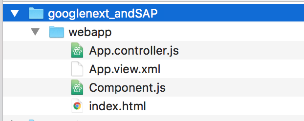
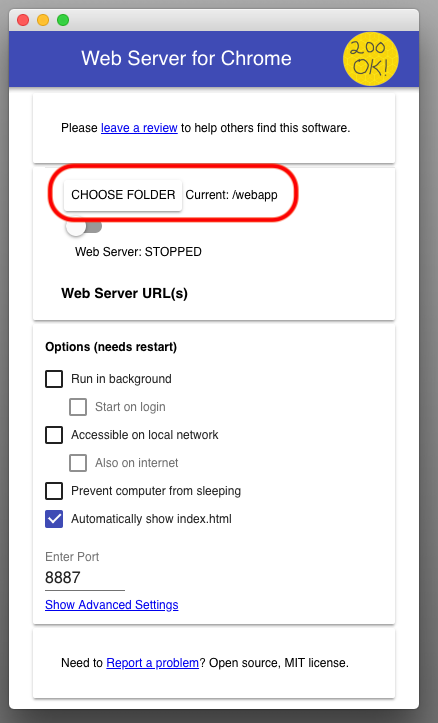
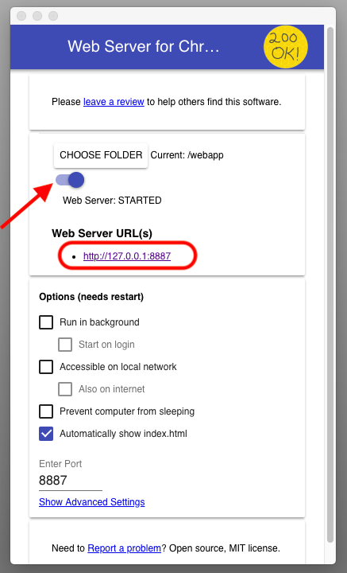
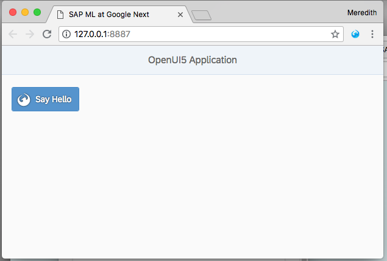
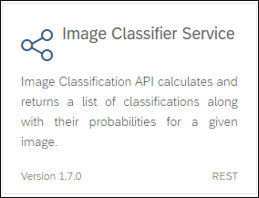
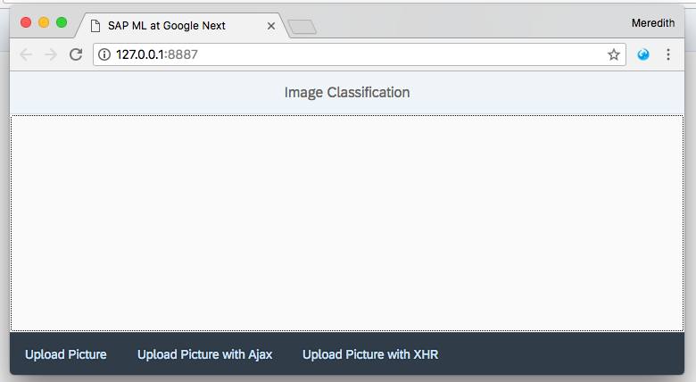
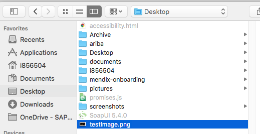

## Prerequisites  
 - **Proficiency:** Beginner


## Details
### You will learn  
In this tutorial, you will learn how to quickly integrate the **Image Classification API** from the SAP Leonardo Machine Learning Functional Services published from the SAP API Business Hub sandbox in a SAPUI5 application.

The **Image Classification** service allows you to calculates and returns a list of classifications/labels along with their probabilities for a given image. The services utilizes Tensor Flow to help with the training of the model for the service.


### Time to Complete
**20 Min**

[ACCORDION-BEGIN [Step 1: ](Copy the project)]
To help you get started, there is a skeleton project you will need to create a local copy of.

Unzip the *`googlenext`*  project and save it locally as **`googlenext_XX`** where XX is a a unique identifier like your initials, some numbers, or anything you can link of.




[DONE]
[ACCORDION-END]


[ACCORDION-BEGIN [Step 2: ](Run the project)]

To run projects with [OpenUI5](https://openui5.org/index.html), you need a web server. We have a web server tool installed locally to assist you. Open the **Web Server for Chrome** application.

For the Choose Folder option, navigate to your **`googlenext_XX`** folder, and then the **`webapp`** folder.



To start the web server, toggle the Web Server: STOPPED switch so it changes to STARTED. This will give you a URL. Click the URL to navigate to your webpage.



On the web page, you will see a skeleton UI5 application with a single button. This is the beginnings of our application.




[DONE]
[ACCORDION-END]

[ACCORDION-BEGIN [Step 3: ](Get The API Sandbox URL And API Key)]

In order to consume the **Image Classifier Service** SAP Leonardo Machine Learning Foundation service, you will first need to get the service URI and your API key, request and response parameters.

Go to [https://api.sap.com/](https://api.sap.com).


Then you will be able to search for the **SAP Leonardo Machine Learning - Functional Services**, then click on the package found.


Select **Image Classifier Service**.



You can also access the page directly from the following address:

 - <https://api.sap.com/api/image_classification_api/resource>


To get to your API Sandbox URL, click on the **Details** tab.

The API Sandbox URL should be:

```JSON
https://sandbox.api.sap.com/ml/imageclassifier
```

To get to your API key, click on the **Show API Key** button.

You will be prompted to login if you are not yet.

Then, the following pop-up should appear. Click on the **Copy Key and Close** button and save it in a text editor.


[DONE]
[ACCORDION-END]

[ACCORDION-BEGIN [Step 4: ](Analyze the service)]

As you can notice the API has only one resource (or service): `/inference_sync`.

Now click on the `/inference_sync` link to expand the section.

> **Note**: the term *inference* refers to the application phase (scoring) an existing model (as opposed to the training or inception phase) and *sync* for synchronous.

As stated in the description, the service accepts either:

 - an archive file with a zip/tar extensions containing multiple image files
 - a single image
 - a list of image as input

The service returns a classification list with its scores (confidence).

The supported image formats are ***JPEG***, ***PNG***, ***TIF*** or ***BMP*** (the actual content format is validated, so renaming files may simply not work).

The input file, files or archive file will be sent as a `FormData` query parameter in the service request.

[DONE]
[ACCORDION-END]


[ACCORDION-BEGIN [Step 5: ](Open the code editor)]

Sublime Text is provided for you on the computer to edit the code. Open the **`index.html`** from the `googlenext_XX` project in Sublime Text.

[DONE]
[ACCORDION-END]

[ACCORDION-BEGIN [Step 6: ](Configure your SAPUI5 application)]

You will need to white list some header configurations that will prevent HTTP header parameters to be filtered out in the `neo-app.json` file.

**Create a file called `neo-app.json`** in the `googlenext_XX` folder. Copy and paste the below code into the file.

```JSON
{
  "welcomeFile": "/webapp/index.html",
  "sendWelcomeFileRedirect": true,
  "headerWhiteList": [
    "APIKey"
  ]
}
```

**Save** your changes.

> ### **Note:** `headerWhiteList`
>
>By default, headers element like the `APIKey` will be blocked when used in a SAPUI5 control like the `FileUploader`. This is the reason why we add it to the white list.
>

[DONE]
[ACCORDION-END]

[ACCORDION-BEGIN [Step 7: ](Store your API setting in a JSON model)]

There are multiple options to achieve this goal. Here you will use a pre-loaded JSON model configured in the `Component.js` file.

Open the `Component.js` file found under `googlenext_XX` > `webapp` folder. Copy the below code and paste it into the **init** function. Make sure you replace `<<<<< COPY YOUR API KEY >>>>>` with your the API key you retrieved in step 4.

```JavaScript
var oData = {
  "url" : "https://sandbox.api.sap.com/ml/imageclassifier/inference_sync",
  "APIKey":"<<<<< COPY YOUR API KEY >>>>>"
};
```

Once you create a JSON object, you will need to make it accessible to your application. To do this with OpenUI5, you need to create a `JSONModel` that you set as a global model for the application.

```JavaScript
var oModel = new JSONModel(oData);
this.setModel(oModel, "demo");
```

Make sure to save your changes to this file before continuing.

[DONE]
[ACCORDION-END]

[ACCORDION-BEGIN [Step 8: ](Extend the main SAPUI5 view)]

The view will contain a canvas to display the selected image along with table to display the results.

Edit the `App.view.xml` file located under **`googlenext_XX`** > **`webapp`** and replace the existing code with the below code.


```XML
<mvc:View xmlns:mvc="sap.ui.core.mvc" xmlns:table="sap.ui.table" xmlns:unified="sap.ui.unified" xmlns="sap.m"
  xmlns:custom="http://schemas.sap.com/sapui5/extension/sap.ui.core.CustomData/1" controllerName="demosapui5ml-imageclassifier.App"
  displayBlock="true">
  <App>
    <pages>
      <Page title="Image Classification">
        <content>
          <Carousel pages="{demo>/result-imageclassifier}" width="100%" visible="{= ${demo>/resultVisible-imageclassifier} === true}">
            <pages>
              <VBox width="100%" direction="Column" alignItems="Center">
                <Image tooltip="canvas" class="sapUiLargeMargin" src="{demo>fileURL}"/>
                <Label text="File name: {demo>name}" class="sapUiLargeMargin"></Label>
                <table:Table rows="{demo>results}" enableBusyIndicator="true" selectionMode="Single" visibleRowCount="5">
                  <table:columns>
                    <table:Column sortProperty="label" filterProperty="label">
                      <Label text="Label"/>
                      <table:template>
                        <Link text="{demo>label}" href="https://www.google.com/search?q={demo>label}&amp;newwindow=1&amp;tbm=isch" target="search"/>
                      </table:template>
                    </table:Column>
                    <table:Column sortProperty="score" filterProperty="score">
                      <Label text="Score"/>
                      <table:template>
                        <Text text="{demo>score}"/>
                      </table:template>
                    </table:Column>
                  </table:columns>
                </table:Table>
              </VBox>
            </pages>
          </Carousel>
        </content>
        <footer>
          <Toolbar width="100%">
            <content>
              <unified:FileUploader buttonOnly="true" buttonText="Upload Picture" sameFilenameAllowed="true" multiple="false" fileType="zip,png,jpeg,jpg,bmp,tiff,tif" mimeType="application/x-zip-compressed,application/zip,application/octet-stream,image/png,image/jpg,image/jpeg,image/bmp,image/tiff" typeMissmatch="fileTypeMissmatch" change="fileUploadChange" uploadStart="fileUploadStart" uploadComplete="fileUploadComplete" name="files" uploadUrl="{demo>/url}" useMultipart="true" sendXHR="true" uploadOnChange="true">
                <unified:headerParameters>
                  <unified:FileUploaderParameter name="APIKey" value="{demo>/APIKey}"/>
                  <unified:FileUploaderParameter name="Accept" value="application/json"/>
                </unified:headerParameters>
              </unified:FileUploader>
              <unified:FileUploader buttonOnly="true" buttonText="Upload Picture with Ajax" sameFilenameAllowed="true" multiple="true" fileType="zip,png,jpeg,jpg,bmp,tiff,tif" mimeType="application/x-zip-compressed,application/zip,application/octet-stream,image/png,image/jpg,image/jpeg,image/bmp,image/tiff" typeMissmatch="fileTypeMissmatch" change="onPressImageClassifier" custom:mode="ajax"></unified:FileUploader>
              <unified:FileUploader buttonOnly="true" buttonText="Upload Picture with XHR"  sameFilenameAllowed="true" multiple="true" fileType="zip,png,jpeg,jpg,bmp,tiff,tif" mimeType="application/x-zip-compressed,application/zip,application/octet-stream,image/png,image/jpg,image/jpeg,image/bmp,image/tiff" typeMissmatch="fileTypeMissmatch" change="onPressImageClassifier" custom:mode="xhr"></unified:FileUploader>
            </content>
          </Toolbar>
        </footer>
      </Page>
    </pages>
  </App>
</mvc:View>
```

Make sure to save your changes!

[DONE]
[ACCORDION-END]

[ACCORDION-BEGIN [Step 9: ](Extend the main SAPUI5 controller)]

Edit the `App.controller.js` file located under  **`googlenext_XX`** > **`webapp`** and replace the existing code with the below code.

```JavaScript
sap.ui.define([
  "sap/ui/core/mvc/Controller",
  "sap/m/MessageBox"
], function(Controller, MessageBox) {
  "use strict";

  var defaultFileSrcUrl = "/resources/sap/ui/documentation/sdk/images/logo_ui5.png";

  return Controller.extend("demosapui5ml-imageclassifier.App", {
    fileTypeMissmatch: function(oControlEvent) {
      MessageBox.show("Wrong file type!");
    },
    fileUploadChange: function(oControlEvent) {
      // start the busy indicator
      var oBusyIndicator = new sap.m.BusyDialog();
      oBusyIndicator.open();

      // init the src file, name & url
      this.srcFileURL = null;
      this.srcFileName = null;
      this.srcFile = null;

      // keep a reference of the uploaded file name and create a url out of that when this is an image
      this.srcFile = oControlEvent.getParameters().files[0];
      this.srcFileName = this.srcFile.name;
      if (this.srcFile.type.match("image.*")) {
        this.srcFileURL = URL.createObjectURL(this.srcFile);
      }
      // keep a reference in the view to close it later
      this.oBusyIndicator = oBusyIndicator;
    },
    fileUploadComplete: function(oControlEvent) {
      // get the current view
      var oView = this.getView();

      var service = "imageclassifier";

      // clear previous results from the model
      oView.getModel("demo").setProperty("/result-" + service, null);
      oView.getModel("demo").setProperty("/resultVisible-" + service, false);

      var srcFileIsImage = this.srcFile.type.match('image.*');

      var processResult = function(oController, data, fileName, url) {
        // set the image urls to default if part of a zip
        if (!srcFileIsImage) {
          for (var i = 0; i < data.predictions.length; i++) {
            data.predictions[i].name = fileName + "  /  " + data.predictions[i].name;
            data.predictions[i].fileURL = defaultFileSrcUrl;
          }
        } else {
          data.predictions[0].fileURL = URL.createObjectURL(oController.srcFile);
        }

        // merge with existing results
        var result = oController.getView().getModel("demo").getProperty("/result-" + service);
        if (result) {
          result.push.apply(result, data.predictions);
        } else {
          result = data.predictions;
        }
        oController.getView().getModel("demo").setProperty("/result-" + service, result);

        // display the result table
        oController.getView().getModel("demo").setProperty("/resultVisible-" + service, true);
      };

      if (oControlEvent.getParameters().status === 200) {
        // get the response as JSON and process the results
        processResult(this, JSON.parse(oControlEvent.getParameters().responseRaw), this.srcFile.nam, this.srcFileURL);
      } else {
        oView.getModel("demo").setProperty("/resultVisible", false);
        MessageBox.show("Error " + oControlEvent.getParameters().status + " : " + JSON.parse(oControlEvent.getParameters().responseRaw).error_description);
      }
      this.oBusyIndicator.close();
      MessageBox.show("Process completed!\n Target URL: " + oView.getModel("demo").getProperty("/url"));
    },

    onPressImageClassifier: function(oControlEvent) {
      // get the current controller & view
      var oView = this.getView();

      // start the busy indicator
      this.oBusyIndicator = new sap.m.BusyDialog();
      this.oBusyIndicator.open();

      this.requestCount = 0;

      var service = "imageclassifier";
      var url = oView.getModel("demo").getProperty("/url");
      var type = "POST";
      var apiKey = oView.getModel("demo").getProperty("/APIKey");

      // clear previous results from the model
      oView.getModel("demo").setProperty("/result-" + service, null);
      oView.getModel("demo").setProperty("/resultVisible-" + service, false);

      var srcFile = null;
      var srcFileURL = null;
      var srcFileIsImage = false;

      var processResult = function(oController, data, fileName) {
        if (!srcFileIsImage) {
          for (var i = 0; i < data.predictions.length; i++) {
            data.predictions[i].name = fileName + "  /  " + data.predictions[i].name;
            data.predictions[i].fileURL = defaultFileSrcUrl;
          }
        } else {
          data.predictions[0].fileURL = srcFileURL;
        }

        var result = oController.getView().getModel("demo").getProperty("/result-" + service);
        if (result) {
          result.push.apply(result, data.predictions);
        } else {
          result = data.predictions;
        }
        oController.getView().getModel("demo").setProperty("/result-" + service, result);

        // display the result table
        oController.getView().getModel("demo").setProperty("/resultVisible-" + service, true);
      };

      // keep a reference of the uploaded files
      var mode = oControlEvent.getSource().data("mode");
      for (var fileIndex = 0; fileIndex < oControlEvent.getParameters().files.length; fileIndex++) {
        srcFile = oControlEvent.getParameters().files[fileIndex];
        if (srcFile.type.match("image.*")) {
          srcFileIsImage = true;
          srcFileURL = URL.createObjectURL(srcFile);
        } else {
          srcFileIsImage = false;
        }
        // create the form data to be sent in the request
        var formData = new window.FormData();
        formData.append("files", srcFile, srcFile.name);

        // increase request countor to close busy indicator
        this.requestCount++;

        // call the service
        this.callService(this, service, url, type, mode, apiKey, formData, processResult);
      }
    },
    callService: function(oController, service, url, type, mode, apiKey, formData, fnPrecessResult) {
      var ajaxSuccess = function(data, status, jqXHR) {
        // get the response as JSON and process the results
        fnPrecessResult(oController, data, formData.values().next().value.name);

        // close the busy indicator if all request have completed
        oController.requestCount--;
        if (oController.requestCount === 0) {
          // close the busy indicator
          oController.oBusyIndicator.close();
          MessageBox.show("Process completed!\n Target URL: " + url);
        }
      };
      var ajaxError = function(jqXHR, status, message) {
        oController.getView().getModel("demo").setProperty("/resultVisible-" + service, null);
        MessageBox.show("Error for file : " + formData.values().next().value.name + " \n status: " + status + "\n message: " + JSON.parse(jqXHR.responseText).error_description);
        oController.oBusyIndicator.close();
      };
      var xhrReadyStateChange = function() {
        if (this.readyState === this.DONE) {
          if (this.status === 200) {
            // set the response as JSON in the demo model
            var data = JSON.parse(this.response);
            var fileName = formData.values().next().value.name;
            var file = formData.get("files");
            fnPrecessResult(oController, data, file, fileName);
            // fnPrecessResult(oController, data, formData.values().next().value.name);
          } else {
            oController.getView().getModel("demo").setProperty("/resultVisible-" + service, null);
            MessageBox.show("Error for file : " + formData.values().next().value.name + " \n status: " + this.status + "\n message: " + JSON.parse(this.responseText).error_description);

          }
          // close the busy indicator if all request have completed
          oController.requestCount--;
          if (oController.requestCount <= 0) {
            // close the busy indicator
            oController.oBusyIndicator.close();
            MessageBox.show("Process completed!\n Target URL: " + url);
          }
        }
      };      
      if (mode === "ajax") {
        $.ajax({
          type: type,
          url: url,
          headers: {
            "Accept": "application/json",
            "APIKey": apiKey
          },
          success: ajaxSuccess,
          error: ajaxError,
          contentType: false,
          async: false,
          data: formData,
          cache: false,
          processData: false
        });
      } else if (mode === "xhr") {
        var xhr = new XMLHttpRequest();
        xhr.withCredentials = false;
        xhr.addEventListener("readystatechange", xhrReadyStateChange);
        xhr.open(type, url, false); // setting request method & API endpoint, the last parameter is to set the calls as synchyronous
        xhr.setRequestHeader("Accept", "application/json"); // adding request headers
        xhr.setRequestHeader("APIKey", apiKey); // API Key for API Sandbox
        xhr.send(formData); // sending request
      } else {
        oController.oBusyIndicator.close();
      }
    }
  });
});
```

Make sure to save your changes!

[DONE]
[ACCORDION-END]

[ACCORDION-BEGIN [Step 10: ](Test the application)]

To run the application, STOP the web server and START it again. The files are caches when you start the server, so changes will not be reflected unless you restart the server.

Navigate to the URL provided by the web server again. Now you will see a web page with 3 buttons in the footer toolbar.



Click the Upload Picture button and select the `testImage.png` file found on the desktop.



What are the results you get?


[VALIDATE_1]
[ACCORDION-END]

[ACCORDION-BEGIN [Step 11: ](Claim your reward)]

**Congratulations!** You found the prize.

Now that you have finished learning about Machine Learning with SAP and OpenUI5, feel free to keep working on other hands-on activities or claim your sunglasses!


[DONE]
[ACCORDION-END]
