## Prerequisites  
 - **Proficiency:** Beginner | Intermediate | Advanced
 - **Tutorials:** [Make sure you have a Cloud Platform Services account](https://www.sap.com/developer/tutorials/hcp-abh-getting-started.html)


## Next Steps
 - [Enter the title of the next tutorial, or use the second bullet below if this is the last tutorial in a series](http://www.sap.com/developer/tutorials/teched-2016-8.html)
 - Select a tutorial group from the [Tutorial Navigator](http://www.sap.com/developer/tutorial-navigator.html) or the [Tutorial Catalog](https://www.sap.com/developer/tutorial-navigator.tutorials.html)

## Details

This tutorial shows you how to browse the SAP API Business Hub for Machine Learning APIs. The Product Image Classification API is shown as an example. You can substitute another API if you like. If you choose to do that, the code will need to be modified to reflect the new API.

A standalone Java client is built that allows the user to send a picture or a zip file of pictures to the API endpoint. The response is printed to the screen.

The HTTP calls are made using the Apache `HttpClient` libraries. You could substitute another HTTP client library.

### You will learn  
In this tutorial, you will learn the basics of making API calls against the Machine Learning Functional Services published in SAP API Business Hub.

### Time to Complete
**15 Min**

---

[ACCORDION-BEGIN [Step 1: ](Browse / Search the APIs)]

Go to [https://api.sap.com/](https://api.sap.com) and select the **Browse** tile so that you can search the APIs.

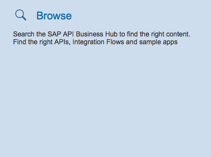

[DONE]
[ACCORDION-END]


[ACCORDION-BEGIN [Step 2: ](Search for the Product Image Classification API)]

For the purposes of this tutorial, we will be using the _Product Image Classification_ Machine Learning API call. This API takes a single image, or a zip file of images, and returns categories for it/them.

Enter "product image" in the search field to filter the API list and then click on _SAP Leonardo Machine Learning - Functional Services_.

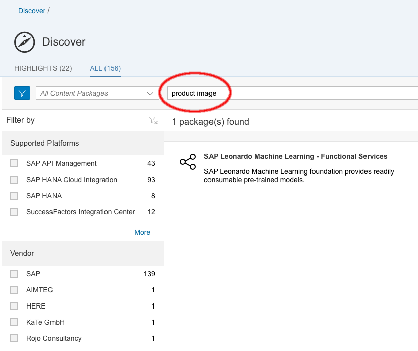

[DONE]
[ACCORDION-END]

[ACCORDION-BEGIN [Step 3: ](Select the Product Image Classification API Service)]

Click on the _ARTIFACTS_ link to show the individual APIs that are available. Then click on the _Product Image Classification API_.

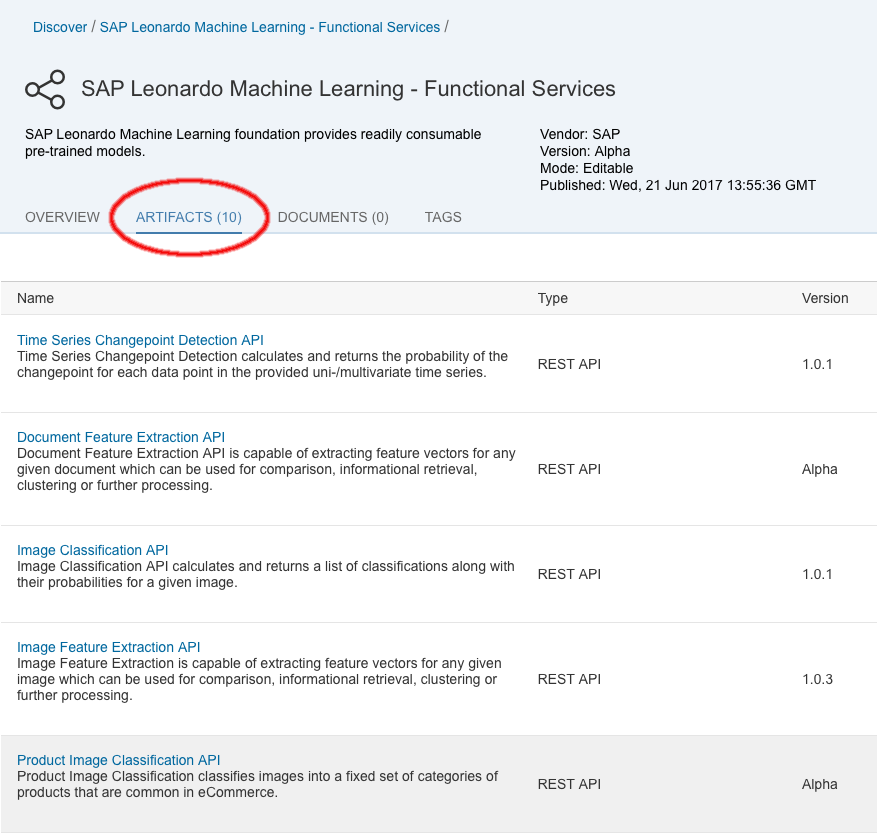

[DONE]
[ACCORDION-END]

[ACCORDION-BEGIN [Step 4: ](Use Generate Code)]

Click on the _Generate Code_ link to the right of the synchronous version of the API call ("Inference Sync").

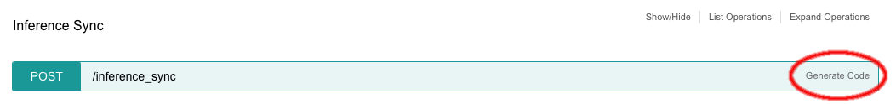

 We will only be copying the API URL from the code, not the code block itself, and this can be done from any of the languages.

 Select _Java_ as the programming language that you'd like to use and copy the URL from the code.

 Save this URL for later use.

 `https://sandbox.api.sap.com/ml/prodimgclassifier/inference_sync`

 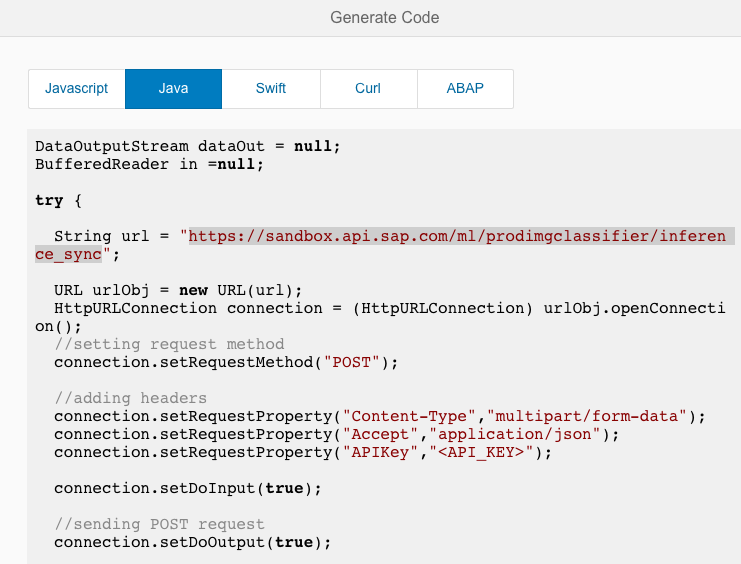

 The code block in the _Generate Code_ window is not complete, since it does not include parameters in the call to the server. If you were to run the code as-is, it would fail with a corresponding error message. The basic idea shown in the code is right, but we are going to make use of libraries to make the calls to keep our code clean and reliable.

[DONE]
[ACCORDION-END]


[ACCORDION-BEGIN [Step 5: ](Getting your API Key)]

Close the _Generate Code_ window and click on the key icon at the top right of the _Product Image Classification API_ window. The key is next to the _Download_ button.


Copy the API key using the _Copy API Key_ button at the bottom of the modal window that is opened.

Save this key somewhere, we'll be using it in the API calls later.

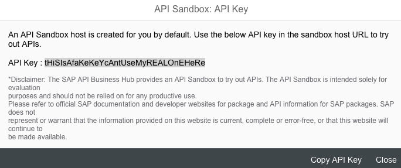

[DONE]
[ACCORDION-END]

[ACCORDION-BEGIN [Step 6: ](Create a New Project in Eclipse)]

Launch Eclipse and open the Java perspective. Right-click in the _Package Explorer_ view (it's left hand side of the screen by default) and select **New > Java Project**.

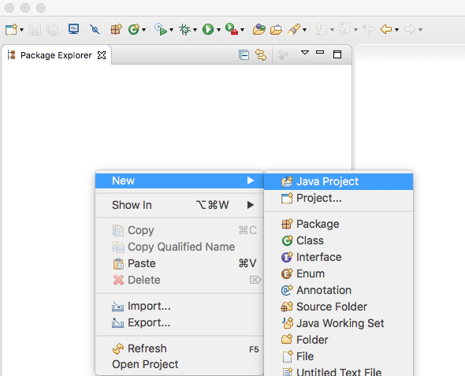

Name your project _StandaloneMLClient_ and select a Java 8 runtime. Note: if you don't have Java 8, Java 7 should be fine as well. This tutorial was tested on Java 8.

Select **Finish**.

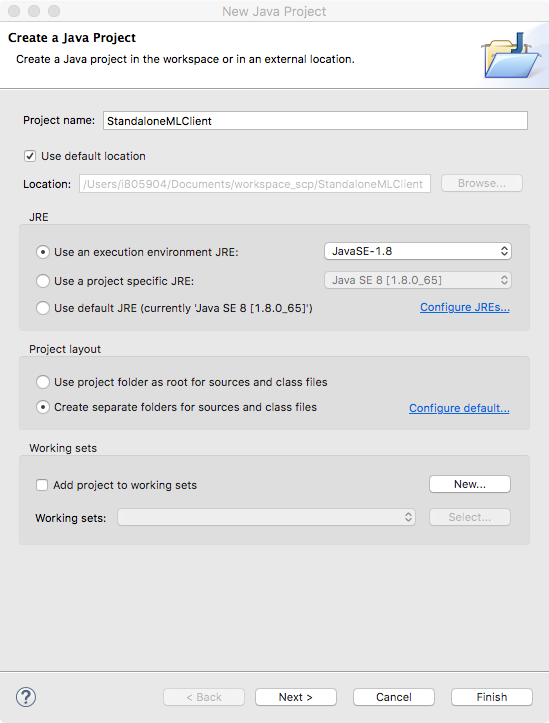

[DONE]
[ACCORDION-END]

[ACCORDION-BEGIN [Step 7: ](Download Apache HttpClient)]

We'll use the Apache `HttpClient` library to make the POST calls against the API endpoint that we copied earlier. Using a library ensures that our calls conform to the HTTP POST standard, including the multipart/form-data request body.

>Note that you can use whatever library you'd like in this standalone Java client. This example uses the Apache `HttpClient` library because it's widely available and used.

To download the libary, go to the [Apache Downloads](http://hc.apache.org/downloads.cgi) page and select the binary distribution under `HttpClient` 4.5.x, near the top of the screen.

Here is a [direct link to download the HttpClient libraries](http://www-us.apache.org/dist//httpcomponents/httpclient/binary/httpcomponents-client-4.5.3-bin.tar.gz) that you can also use.

>The Apache downloads are distributed through a system of mirror sites. You may be taken to a different mirror depending on how you access the download.

Unzip the downloaded archive. Inside, you will find a **lib** directory with 10 jars inside.

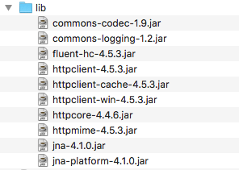

Right-click on the project in Eclipse (in the _Package Explorer_ view) and select **New > Folder** to create a folder for the Jar files.

Name the new directory **lib**.

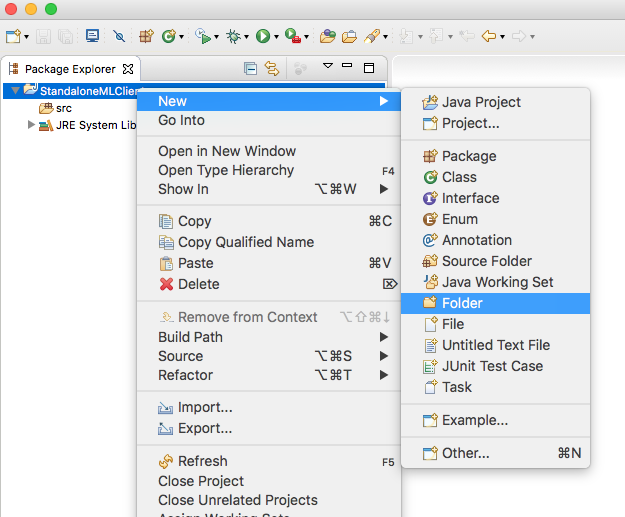

[DONE]
[ACCORDION-END]

[ACCORDION-BEGIN [Step 8: ](Copy Library Jars to Java Project)]

Select four jar files from the downloaded archive: **httpclient-4.5.x.jar**, **httpcore-4.4.x.jar**, **httpmime-4.5.x.jar**, and **commons-logging-1.2.jar**.

Drag these four files to the lib folder in Eclipse and then select **Copy files** from the resulting popup window.

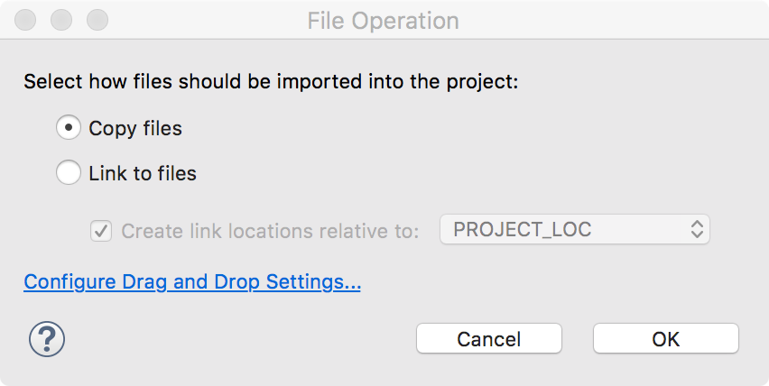

[DONE]
[ACCORDION-END]

[ACCORDION-BEGIN [Step 9: ](Add Jars to Bulid Path)]

Select all three jars within the Eclipse _Java View_ and right-click. Then, select **Build Path > Add to Build Path**.

The three jar files are now in the build path of your project and their APIs can be referenced within the project's code.

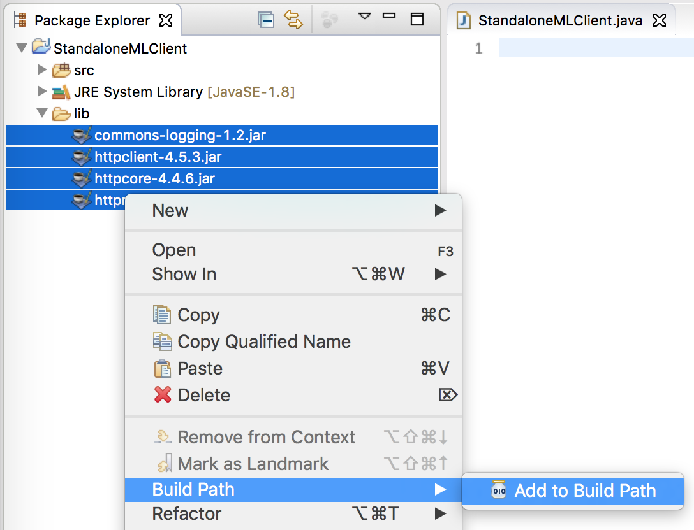

[DONE]
[ACCORDION-END]

[ACCORDION-BEGIN [Step 10: ](Create a New Java Class)]

Right-click on the *src* folder in the Project and select **New > Class** to create a Java class.

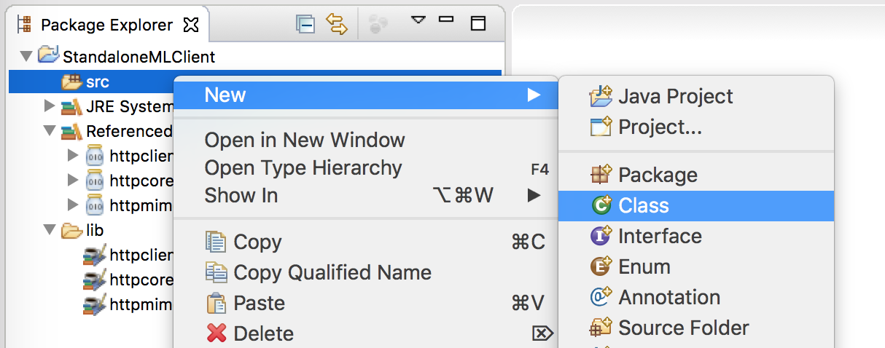

Give the new class a package name, and call the class _StandaloneMLClient_.

Check that you would like to create the `main(String[] args)` method. Select **Finish**.

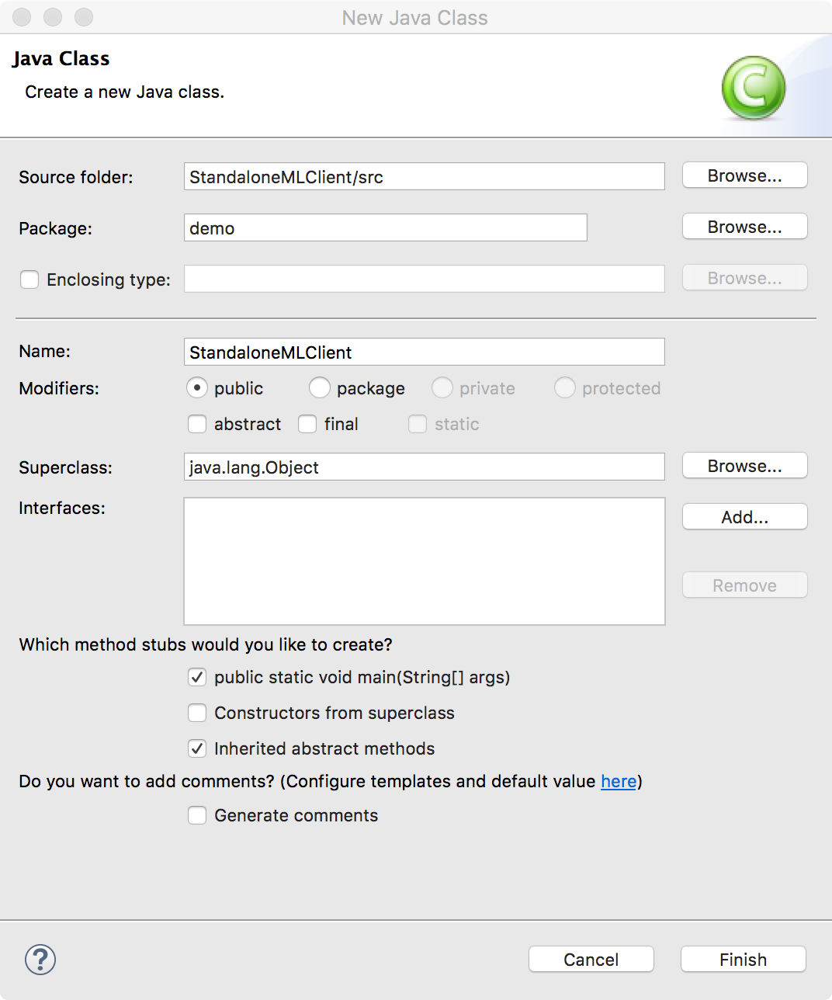

[DONE]
[ACCORDION-END]

[ACCORDION-BEGIN [Step 11: ](Code)]

Copy the code below into the Java class file that you just created. **Be sure to copy the URL from Step 6 above into the appropriate place in the code.**

```import java.io.File;
import java.io.IOException;

import org.apache.http.HttpResponse;
import org.apache.http.client.ClientProtocolException;
import org.apache.http.client.HttpClient;
import org.apache.http.client.methods.HttpPost;
import org.apache.http.entity.mime.MultipartEntityBuilder;
import org.apache.http.impl.client.HttpClientBuilder;

public class StandaloneMLClient
{
	// args: apiKey pictureFileName
	public static void main(String[] args)
	{
		if( args.length < 2 )
		{
			System.out.println("Usage: StandaloneMLClient <apiKey> <imagefile>");
			return;
		}

		String apiKey = args[0];
		String picFileName = args[1];		
		File picFile = new File(picFileName);

		// Build the multipart/form-data request body
		MultipartEntityBuilder builder = MultipartEntityBuilder.create();
    	builder.addBinaryBody("files", picFile);

    	// Request needs to be a POST request, the api key is in the HTTP headers
		HttpPost post = new HttpPost("<URL GOES HERE>");
    	post.setHeader("APIKey", apiKey);
    	post.setEntity(builder.build());

    	try {
    		// Execution of request against remote server
    		HttpClient client = HttpClientBuilder.create().build();
			HttpResponse response = client.execute(post);
			response.getEntity().writeTo(System.out);
		} catch (ClientProtocolException e) {
			// TODO Auto-generated catch block
			e.printStackTrace();
		} catch (IOException e) {
			// TODO Auto-generated catch block
			e.printStackTrace();
		}


	}

}
```

### What does this code do?

The code generates and issues a HTTP POST request against the URL endpoint that we copied earlier. It does this by using the Apache `HttpClient` methods for constructing a multipart/form-data request. The API key is placed in an HTTP header in the request.

The user can then run the tool on the command line with two arguments: the apiKey as well as the image file (or zip file) to be analyzed.

>Using a library like `HttpClient` makes the code much more flexible and less error-prone than building the HTTP request and form-data body manually.

[DONE]
[ACCORDION-END]

[ACCORDION-BEGIN [Step 12: ](Set up a Run Configuration)]

Right-click on your project and select **Run As > Run Configurations...***.

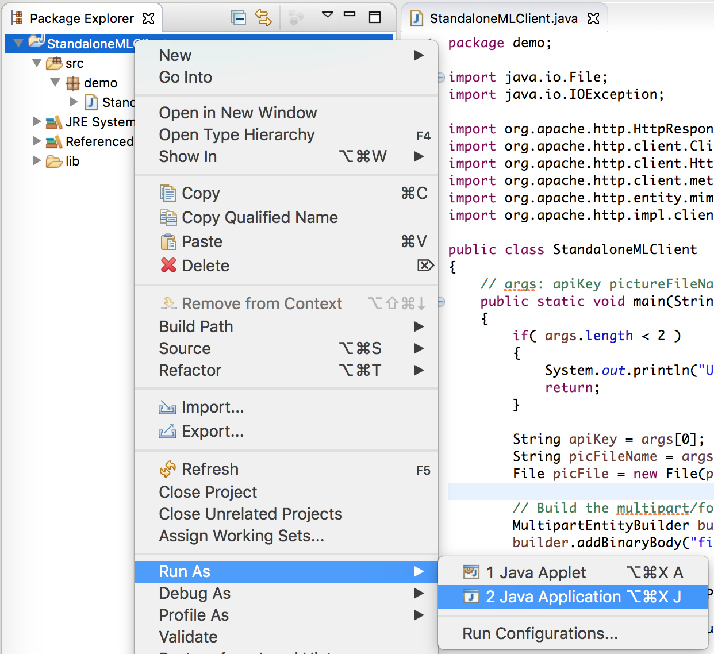

Select the *Arguments* tab.

In the *Program arguments* field, enter your API key from Step 8 as well as the absolute path of a picture on your hard drive that you would like to categorize. Ideally, this would be a picture of a product like a mobile phone.

Select **Run** to execute the program.

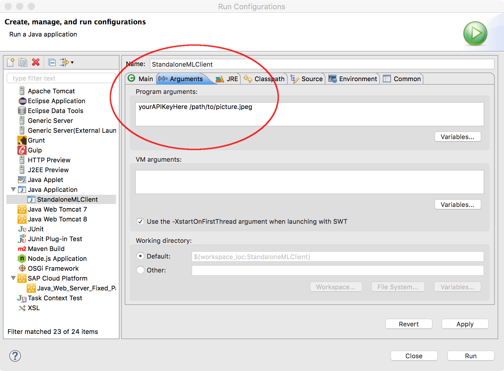

[DONE]
[ACCORDION-END]

---

## Next Steps
- Select a tutorial from the [Tutorial Navigator](http://www.sap.com/developer/tutorial-navigator.html) or the [Tutorial Catalog](http://www.sap.com/developer/tutorials.html)
