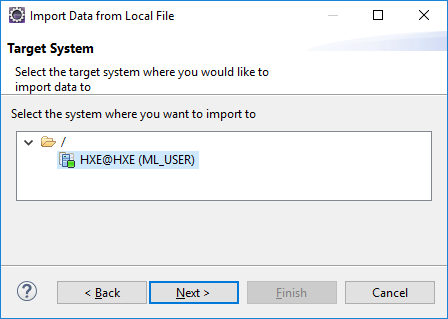
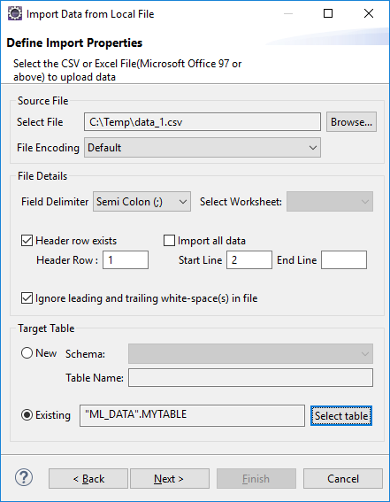
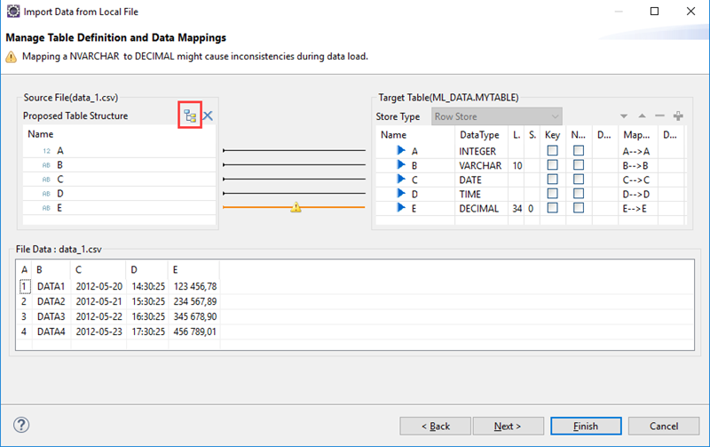
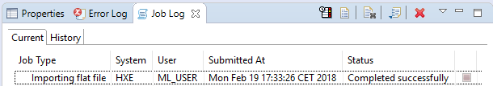

## Prerequisites  
- Proficiency: beginner
- [Eclipse IDE](https://www.eclipse.org/downloads/) installed, running and properly connected to the internet.
- [SAP HANA Tools for Eclipse](https://www.sap.com/developer/tutorials/mlb-hxe-tools-sql-eclipse.html) installed and connected to your SAP HANA, express edition.
- [Prepare your SAP HANA, express edition instance for Machine Learning](https://www.sap.com/developer/tutorials/mlb-hxe-setup-basic.html)

### You will learn

In this tutorial, you will learn how to use the SAP HANA Tools for Eclipse Import feature from your local machine to your SAP HANA, express edition.

The Import feature supports different file format (TXT, CSV and Excel work sheet and work book), field delimiters, use of header rows, full or partial imports, use existing or new tables.

However, certain data format like with dates are not fully supported (EU format only).

As an alternate solution, you can also use the ***IMPORT FROM*** SQL command which provides a full extent of format support.
This requires the data set file to be physically located on your SAP HANA, express edition host.

Using the ***IMPORT FROM*** SQL command is recommended for larger files.

For more information, you can check the following tutorial: [Import CSV into SAP HANA, express edition using IMPORT FROM SQL command](https://www.sap.com/developer/tutorials/mlb-hxe-import-data-sql-import.html)

## Details

### Time to Complete
**10 Min**.

[ACCORDION-BEGIN [Prerequisite: ](SAP HANA Tools for Eclipse)]

In order to proceed with the next steps, you must have:

 - the [Eclipse IDE](https://www.eclipse.org/downloads/) installed, running and properly connected to the internet.
 - [SAP HANA Tools for Eclipse](https://www.sap.com/developer/tutorials/mlb-hxe-tools-sql-eclipse.html) installed and connected to your SAP HANA, express edition.
 - [Prepared your SAP HANA, express edition instance for Machine Learning](https://www.sap.com/developer/tutorials/mlb-hxe-setup-basic.html)

[DONE]
[ACCORDION-END]

[ACCORDION-BEGIN [Step 1: ](Save the sample data)]

Save the following data set in *`C:\Temp\data_1.csv`* (or *`/tmp/data_1.csv`* for Linux environments) on the computer where Eclipse is installed:

```csv
A,B,C,D,E
1,"DATA1","2012-05-20","14:30:25","123 456,789"
2,"DATA2","2012-05-21","15:30:25","234 567,890"
3,"DATA3","2012-05-22","16:30:25","345 678,901"
4,"DATA4","2012-05-23","17:30:25","456 789,012"
```

Save the following data set in *`C:\Temp\data_2.csv`* (or *`/tmp/data_2.csv`* for Linux environments) on the computer where Eclipse is installed:

```csv
5,"DATA5","2015/01/20","02:30:25","123,456.789"
6,"DATA6","2015/01/21","03:30:25","234,567.890"
7,"DATA7","2015/01/22","06:30:25","345,678.901"
8,"DATA8","2015/01/23","07:30:25","456,789.012"
```

As you can notice the date and number format are different.

 - The date format only allows the separator to be changed
 - The number format allows the decimal and thousands separator to follow either the US or European format.

[DONE]
[ACCORDION-END]

[ACCORDION-BEGIN [Step 2: ](Create a sample table)]

Connect to the **HXE** tenant using the **`ML_USER`** user credentials and execute the following SQL statement:

```SQL
CREATE TABLE ML_DATA.MYTABLE_ECLIPSE (
    A INT,
    B VARCHAR(10),
    C DATE,
    D TIME,
    E DECIMAL
);
```

[DONE]
[ACCORDION-END]

[ACCORDION-BEGIN [Step 3: ](Import the Data)]

#### **Import the data 1 CSV**

Using the  **File > Import...** menu, select **SAP HANA Content > Data From Local File**.

You can also use the search field to locate the entry.

Click on **Next**.


Select the Target System connection **HXE @ HXE (`ML_USER`)**.



Click on **Next**.

The following panel allows you to set a series of import options:

 - **Source File** : pick your local file and set the encoding
 - **File Details**: set the field delimiter, header rows and data range to import
 - **Target Table** : create a new table or use an existing table

Define the import properties:

- **Source File:**

    - Use the **Browse** button to select the **`data_1.csv`** created in step 1.
    - Set the **File Encoding** to **Default**.

- **File Details:**

    - Set the **Field Delimiter** value to **Comma (,)**.
    - Check the **Header row exists** box and set the **Header row** value to 1 as only one header row exists in `data_1.csv`.
    - Check the **Import all data** box.

- **Target Table**

    - Select the **Existing** radio, and pick **`ML_DATA.MYTABLE_ECLIPSE`**

> ### **Note :** **New Target Table**
>
>When choosing the **New** option to the **Target Table**, the next step will allow you to adjust the data type for the table to be created.
>The default values are determined by looking at the first few hundreds of rows.

Click on **Next**



Using the **Mapping menu** icon , select the **Map by Name** options which will do a mapping between the source and target fields.

> ### **Note :** **One by One vs Map by Name**
>
> The **One by One** option will map entries in the source and target using their column position in the dataset where the **Map by Name** will try to map entries by name (the mapping is case sensitive).



Click on **Finish**.

Once the import job is started, you can check the **Job Log** view for the job status



#### **Import the data 2 CSV**

Now, repeat the steps for the **`data_2.csv`** file with the following import properties:

- **Source File:**

    - Use the **Browse** button to select the **`data_2.csv`** created in step 1.
    - Set the **File Encoding** to **Default**.

- **File Details**

    - Set the **Field Delimiter** value to **Comma (,)**.
    - Uncheck the **Header row exists** box as there is no header row in `data_2.csv`.
    - Check the **Import all data** box.

- **Target Table**

    - Select the **Existing** radio, and pick **`ML_DATA.MYTABLE_ECLIPSE`**.

Using the **Mapping menu** icon , select the **One by One** option.

Click on **Finish**.

[DONE]
[ACCORDION-END]

[ACCORDION-BEGIN [Step 4: ](Verify the imported data)]

To verify that the data were properly imported, you can run the following query:

```SQL
SELECT * FROM ML_DATA.MYTABLE_ECLIPSE;
```

Provide an answer to the question below then click on **Validate**.

[VALIDATE_2]
[ACCORDION-END]
